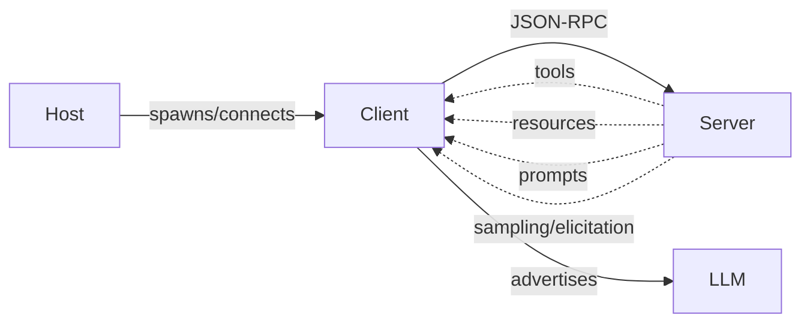
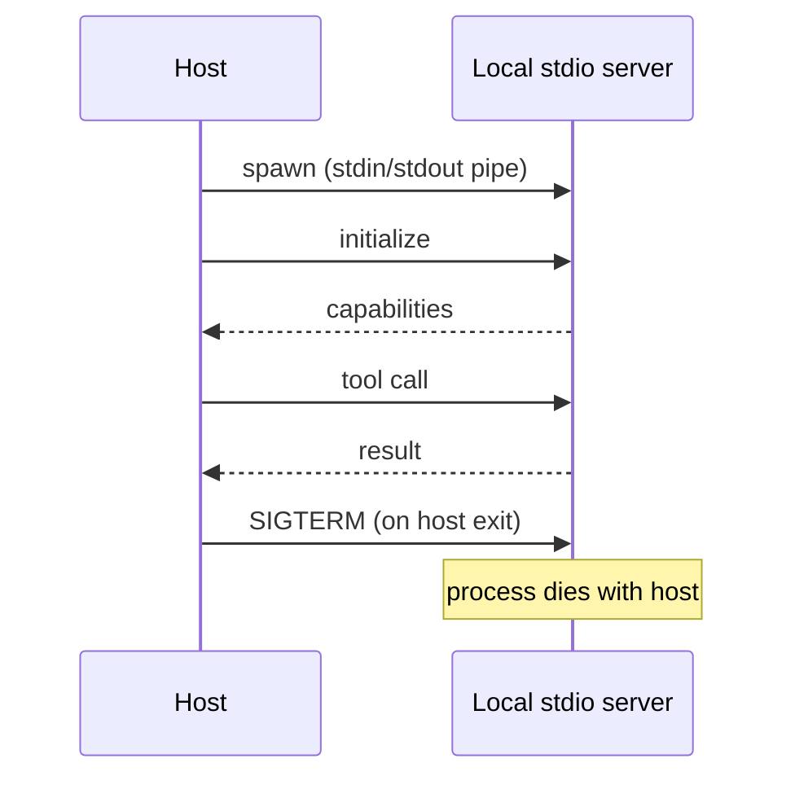

# AEE-407 + AEE-408 MCP Articles Implementation Plan

> **For agentic workers:** REQUIRED SUB-SKILL: Use superpowers:subagent-driven-development (recommended) or superpowers:executing-plans to implement this plan task-by-task. Steps use checkbox (`- [ ]`) syntax for tracking.

**Goal:** Ship two bilingual AEE articles — AEE-407 *Model Context Protocol* (primer) and AEE-408 *Local vs Remote MCP Deployment* (operational reference) — plus Scope 2 corpus cleanup so the existing forward-references to MCP from AEE-3 and AEE-608/609/610/611 finally resolve.

**Architecture:** Source-driven writing. The local-vs-remote knowledge-base file is the primary input for AEE-408 and one of several inputs for AEE-407. Each article task drafts EN, polishes EN, drafts zh-TW (via `chinese-article-writing` voice), polishes zh-TW, then commits both languages in one atomic commit. Corpus-cleanup tasks each ship one bilingual commit. Final task runs `pnpm docs:build` and deletes research notes.

**Tech Stack:** VitePress 1.3.x, pnpm 8.15.5, plain Markdown under `docs/en/` and `docs/zh-tw/`, Mermaid diagrams. No executable code produced. Verification is `pnpm docs:build`.

---

## Spec Correction

The spec (`docs/superpowers/specs/2026-05-05-aee-407-408-mcp-design.md`) lists `docs/en/list.md` and `docs/zh-tw/list.md` under Corpus Edits. This is incorrect. Both `list.md` files are auto-generated by `docs/.vitepress/config/en.js` and `docs/.vitepress/config/zh-tw.js` during `pnpm docs:build` — see `fs.writeFileSync(resolve(docsPath, 'list.md'), listMdContent)` in each config file. **This plan does not hand-edit `list.md`.** The build will regenerate it once 407 and 408 land on disk. Acceptance criterion #5 in the spec is overridden accordingly.

---

## File Structure

| File | Responsibility | Created/Modified by |
|---|---|---|
| `docs/superpowers/research-notes/aee-407-408-sources.md` | Verification log: every cited URL, claim it supports, fetch status, version stamps. Deleted at end of Task 7. | Task 1 |
| `docs/en/Tool Use and Execution/407.md` | EN primer article. ~1500-1800 words. | Task 2 |
| `docs/zh-tw/Tool Use and Execution/407.md` | zh-TW mirror of 407. | Task 2 |
| `docs/en/Tool Use and Execution/408.md` | EN deployment article. ~2200-2600 words. | Task 3 |
| `docs/zh-tw/Tool Use and Execution/408.md` | zh-TW mirror of 408. | Task 3 |
| `docs/en/AEE Overall/3.md` | Replace contested CLI-vs-MCP sentence with qualifying clause + link to AEE-407. | Task 4 |
| `docs/zh-tw/AEE Overall/3.md` | Same replacement, zh-TW. | Task 4 |
| `docs/en/Multi-Agent and Orchestration/608.md` | One inline link to AEE-407 on first MCP mention (line 18). | Task 5 |
| `docs/en/Multi-Agent and Orchestration/609.md` | Same, line 60. | Task 5 |
| `docs/en/Multi-Agent and Orchestration/610.md` | Same, line 12. | Task 5 |
| `docs/en/Multi-Agent and Orchestration/611.md` | Same, line 26. | Task 5 |
| `docs/zh-tw/Multi-Agent and Orchestration/{608,609,610,611}.md` | Mirror of EN back-links. | Task 5 |
| `docs/en/Tool Use and Execution/400.md` | Category overview — add 407/408 under article enumeration. | Task 6 |
| `docs/zh-tw/Tool Use and Execution/400.md` | zh-TW mirror. | Task 6 |
| `docs/en/list.md`, `docs/zh-tw/list.md` | Auto-generated by VitePress build. NOT hand-edited. Will pick up 407/408 entries automatically once Task 7 builds. | (build, not by hand) |

---

## Research Ground Rules (apply to every task)

- Every reference URL in any final article MUST be reachable at writing time. If not reachable, replace with another authoritative source, drop the claim, or rewrite as disclosed inference. Never cite a URL you did not fetch.
- Vendor-neutral tone per project `CLAUDE.md`. Claude Code-specific recipes in AEE-408 are clearly labeled as examples ("Example — Claude Code").
- Post-RFC-2119-cleanup convention: NO `**RFC 2119:**` bold label. MUST/SHOULD/MAY bullets flow directly from the surrounding paragraph.
- No emoji anywhere.
- Forbidden writing-style patterns from project CLAUDE.md (apply to both languages):
  - Contrastive negation ("not X, but Y" / "不是 X，而是 Y")
  - "is A, not B" with unrelated A and B
  - Self-aggrandizing precision claims ("clearly X" / "說得很清楚")
  - Em-dash chains stringing filler
  - Undefined adjectives without anchor ("very heavy" / "很重")
  - Undefined-scope verbs ("can run" / "可以跑")
  - Stacked排比 capability lists ("can X, can Y, can Z")
- Wire-protocol literals stay in English in both EN and zh-TW: `Mcp-Session-Id`, `MCP-Protocol-Version`, `Last-Event-ID`, `Origin`, `127.0.0.1`, `0.0.0.0`, `application/json`, `text/event-stream`, `child_process.spawn`, `SIGTERM`, `EOF`.
- Mermaid diagram labels in English in both EN and zh-TW (matches existing AEE convention; verify against an existing bilingual article like AEE-610 if uncertain).
- Frontmatter is YAML, not inline metadata, per project CLAUDE.md.

---

## Task 1: Source verification + research notes

**Files:**
- Create: `docs/superpowers/research-notes/aee-407-408-sources.md`

**Goal:** Verify every URL we plan to cite is live. Stamp pricing and spec-version-bound facts with the date checked. Record any drift from the source-input file (`/Users/alive/Projects/dev/knowledge-base/mcp-local-vs-remote.md`, last cross-checked 2026-05-05). The research-notes file is the single source of truth for what the articles can cite. Deleted at the end of Task 7.

- [ ] **Step 1: Create research-notes directory and seed file**

```bash
mkdir -p docs/superpowers/research-notes
```

Create `docs/superpowers/research-notes/aee-407-408-sources.md` with this scaffold:

```markdown
# AEE-407 / AEE-408 Source Verification

Verification date: <fill in YYYY-MM-DD>
Source-input: /Users/alive/Projects/dev/knowledge-base/mcp-local-vs-remote.md

## Required for both articles

| URL | Used for | Status | Notes |
|---|---|---|---|
| https://modelcontextprotocol.io/specification/2025-06-18 | MCP spec, current revision at writing time | | |
| https://modelcontextprotocol.io/specification/2025-06-18/basic/transports | Transports spec page | | |
| https://modelcontextprotocol.io/introduction | Primer-level overview for AEE-407 | | |
| https://code.claude.com/docs/en/mcp | Claude Code MCP docs | | |

## AEE-408 specific

| URL | Used for | Status | Notes |
|---|---|---|---|
| https://developers.cloudflare.com/workers/platform/limits/ | Workers CPU/wall-clock limits | | |
| https://developers.cloudflare.com/workers/platform/pricing/ | Workers Paid plan price + included tiers | | |
| https://developers.cloudflare.com/durable-objects/platform/pricing/ | Durable Objects pricing + WebSocket Hibernation | | |
| (AWS Lambda pricing/quotas page, find at writing time) | Lambda cold-start range, 15-min wall-clock | | |

## Pricing snapshot (verified <date>)

- Cloudflare Workers Paid: <price>/mo, included tier <X> requests, <Y> CPU-ms; overage <Z>
- Durable Objects: <included tiers>, WebSocket Hibernation behavior
- Lambda: cold-start range, wall-clock cap

(If any figure differs materially from the source-input file's December-2025 snapshot, note the delta. If unable to verify, OMIT the figure from the article rather than cite stale.)

## CLI-vs-MCP practitioner sources for AEE-407 Best Practices

| URL | Author / outlet | What it supports | Status |
|---|---|---|---|
| (Eledath piece — find URL; AEE-3 cites without URL) | Eledath | "every token needs to fight for its place in the prompt" framing | |
| (one corroborating source) | | Structured-result and reuse arguments for MCP | |

If a second high-quality corroborating source cannot be found, AEE-407 frames the tradeoff descriptively without single-source attribution.

## Spec version check

- Current MCP spec revision at writing time: <2025-06-18 or newer>
- If newer than 2025-06-18, list version-bound details to update: `MCP-Protocol-Version` default, transport names, header casing changes, etc.
```

- [ ] **Step 2: Fetch each URL and fill in Status**

For each row in the tables above, use WebFetch (or equivalent) to GET the URL. Fill `Status` with one of: `OK <date>`, `404`, `redirected to <new URL>`, `unreachable`. For `OK`, capture the smallest-possible quote that supports the claim, into `Notes`.

- [ ] **Step 3: Re-verify pricing snapshots**

Cloudflare Workers pricing page → fill in:
- Paid plan flat fee
- Included monthly requests
- Included CPU-ms
- Overage rates (per million requests, per million CPU-ms)

Cloudflare Durable Objects pricing page → fill in:
- Included requests on Workers Paid
- Included GB-seconds
- WebSocket Hibernation billing language

If any figure has moved materially from the source-input's December-2025 snapshot, flag the delta. If the pricing structure has changed (e.g., new tier, dropped tier), update the article plan accordingly.

AWS Lambda — find current cold-start ranges (the source cites 200-800ms for Node.js typical, p95 1.2-2.8s, Firecracker-NG p99 ~42ms). Verify against current AWS docs or a recent benchmarking source. If unable to verify with confidence, the article can soften to "typically hundreds of ms; verify against current benchmarks for your runtime."

- [ ] **Step 4: Locate two practitioner sources for CLI-vs-MCP**

Source 1: the Eledath piece referenced in AEE-3 (find an actual URL — `grep -r "Eledath" docs/` may turn up a citation in another article; otherwise web-search).

Source 2: one corroborating piece making either the structured-result argument or the reuse argument for MCP. Acceptable: a personal blog post by a recognized practitioner, an MCP working-group post, an Anthropic engineering post, an A16Z/Latent Space-tier piece. Not acceptable: vendor marketing, generated content, or anything that doesn't pass the smell test.

If only Source 1 is found, the Best Practices section in AEE-407 frames the tradeoff descriptively without single-source attribution; record this fallback in the research notes.

- [ ] **Step 5: Stamp the research-notes file with the verification date and commit**

```bash
git add docs/superpowers/research-notes/aee-407-408-sources.md
git commit -m "$(cat <<'EOF'
docs(aee-407-408): add source-verification log

Re-verifies citation URLs, current MCP spec version, and pricing
snapshots before writing AEE-407 and AEE-408. Notes any drift from
the source-input file's December-2025 figures.
EOF
)"
```

---

## Task 2: AEE-407 — Model Context Protocol (primer), EN + zh-TW

**Files:**
- Create: `docs/en/Tool Use and Execution/407.md`
- Create: `docs/zh-tw/Tool Use and Execution/407.md`

**Goal:** Ship the primer article in both languages with one atomic commit. Length target: 1500-1800 words EN; zh-TW lockstep (similar coverage, naturally longer in character count). Stance 2 from brainstorming on CLI-vs-MCP tradeoff in Best Practices.

- [ ] **Step 1: Read the spec section for AEE-407**

Read `docs/superpowers/specs/2026-05-05-aee-407-408-mcp-design.md` § "AEE-407 — Model Context Protocol (primer)". Confirm word counts per section, the primitives list, and the Best Practices stance before drafting.

- [ ] **Step 2: Create the EN file with frontmatter**

Create `docs/en/Tool Use and Execution/407.md` with this exact frontmatter:

```yaml
---
id: 407
title: Model Context Protocol
state: draft
---
```

Then `# [AEE-407] Model Context Protocol` as the H1.

- [ ] **Step 3: Draft Context (~250 words)**

Cover: what MCP is (open protocol that standardizes how a host connects an LLM to tools, resources, and prompts via JSON-RPC over a duplex channel); the host examples (Claude Code, Claude Desktop, Cursor, an SDK harness — labeled as examples); position as the agent-to-tool plane orthogonal to A2A (AEE-608) and AG-UI (AEE-610); current spec revision at writing time (use the version verified in Task 1).

Cite the MCP spec URL on first mention.

- [ ] **Step 4: Draft Design Think (~300 words)**

Cover: the host/client/server triangle and why the protocol separates them; capability discovery as the central mechanic; why JSON-RPC and why duplex (sampling and elicitation require the duplex channel); relationship to AEE-401 function calling — function calling is what the LLM emits, MCP is how a host sources tool definitions and routes calls. The two compose; do not frame them as alternatives.

Link AEE-401 inline.

- [ ] **Step 5: Draft Deep Dive — Primitives (~400 words)**

Cover the four primitives in this order:

- **Tools** — model-invokable functions with JSON-Schema parameters. Bulk of practical MCP use.
- **Resources** — host-attachable read-only data the model can reference (file contents, query results, doc snippets).
- **Prompts** — server-supplied prompt templates the user or host can select.
- **Sampling and elicitation** — server-initiated upward calls. Sampling lets a server ask the host to run an LLM completion on its behalf. Elicitation lets a server ask the user a question mid-tool-call. Both require the duplex channel and stateful sessions.

One paragraph per primitive. Do NOT exceed one paragraph for sampling+elicitation combined; readers needing full mechanics go to the spec.

- [ ] **Step 6: Draft Deep Dive — Deployment, briefly (~200 words)**

State that two transports exist: stdio (host spawns server as subprocess) and Streamable HTTP (server runs independently, host connects by URL). Show ONE minimal `.mcp.json` for each:

```json
{
  "mcpServers": {
    "my-server": {
      "command": "node",
      "args": ["server.js"]
    }
  }
}
```

```json
{
  "mcpServers": {
    "my-server": {
      "type": "http",
      "url": "https://my-mcp.example.com/mcp"
    }
  }
}
```

State "Default to stdio." End the section with a link to AEE-408 for the full tradeoff: auth, latency, cost, stateful sessions, failure modes, hybrid pattern. Do NOT cover any of those topics here — they belong in 408.

- [ ] **Step 7: Draft Best Practices (~250 words)**

Stance 2 from the spec. MCP earns its keep when:
- (a) the tool surface is reused across many sessions
- (b) results are structured for downstream tool calls to consume
- (c) sampling or elicitation is needed
- (d) the same surface is shared across multiple agents

A Bash tool with a CLI is enough for one-off, low-reuse, low-structure capabilities where token economics dominate.

Cite the practitioner concern from AEE-3 honestly. The "every token fights for its place in the prompt" framing is real; large MCP tool surfaces consume context each turn. Show this as a constraint to weigh, not a strawman to dismiss. If a second corroborating source was found in Task 1, cite it; otherwise frame descriptively.

- [ ] **Step 8: Add Visual section**

Two Mermaid diagrams. First — host/client/server triangle with the four primitives flowing across:



Second — MCP positioned next to A2A and AG-UI as orthogonal protocol planes (matches the framing in AEE-610). If the second diagram feels redundant during writing, cut it. Aim for one strong diagram over two weak ones.

- [ ] **Step 9: Add Examples section**

Two minimal end-to-end walkthroughs:

1. Stdio server with one tool — show the `.mcp.json` from Step 6 plus a 4-6 line transcript fragment of the host invoking the tool. Stub-level only.
2. Same server reachable over HTTP — show only the config diff (the JSON from Step 6's HTTP example).

Both end with one sentence pointing at AEE-408 for the operational details.

- [ ] **Step 10: Add Related AEEs, References, Changelog**

Related AEEs (use links following the existing pattern `[AEE-NNN](../Category Name/NNN)`):

- AEE-401 — Function Calling
- AEE-402 — Tool Schema Design
- AEE-405 — Tool Selection
- AEE-408 — Local vs Remote MCP Deployment
- AEE-608 — A2A: The Agent2Agent Protocol
- AEE-609 — ACP: The Agent Communication Protocol
- AEE-610 — AG-UI: The Agent-User Interaction Protocol
- AEE-611 — A2UI: Declarative Generative UI Protocol for Agents
- AEE-3 — Agentic Engineering Levels (Level 5 framing)

References — only URLs verified in Task 1. Format matches existing AEE articles (see AEE-610.md for reference).

Changelog:

```markdown
## Changelog

- 2026-05-05 -- Initial draft
```

- [ ] **Step 11: Verify EN draft passes ground rules**

Run a self-check against the Research Ground Rules at the top of this plan. Specifically verify:
- No emoji
- No `**RFC 2119:**` label; MUST/SHOULD bullets flow from prose
- No contrastive negation, em-dash filler chains, undefined adjectives, undefined-scope verbs, stacked排比 lists
- Word count between 1500 and 1800 (use `wc -w` on the file)
- Frontmatter is YAML, parses correctly
- All inline links use the existing AEE link pattern

```bash
wc -w "docs/en/Tool Use and Execution/407.md"
```

Expected: word count in 1500-1800 range. If under 1500, the article is too thin — revisit Deep Dive sections. If over 1800, tighten Context or Best Practices.

- [ ] **Step 12: Polish EN draft**

Invoke the `polish-documents` skill on `docs/en/Tool Use and Execution/407.md`. Re-run the word-count check; tightening should keep it in range.

- [ ] **Step 13: Draft zh-TW mirror via chinese-article-writing**

Invoke the `chinese-article-writing` skill, providing it the polished EN article as the source. Output to `docs/zh-tw/Tool Use and Execution/407.md`.

zh-TW frontmatter:
```yaml
---
id: 407
title: 模型情境協定
state: draft
---
```

H1: `# [AEE-407] 模型情境協定（Model Context Protocol）`

Wire-protocol literals stay in English. Conceptual terms get Chinese translations. Diagram labels stay in English. The chinese-article-writing skill enforces 歐化中文 avoidance and the prohibited-pattern list.

- [ ] **Step 14: Polish zh-TW draft**

Invoke `polish-documents` on the zh-TW file. Verify the prohibited writing-style patterns from project CLAUDE.md are absent.

- [ ] **Step 15: Visual smoke-test in dev mode**

```bash
pnpm docs:dev
```

Open both `/Tool%20Use%20and%20Execution/407` and the zh-TW equivalent in a browser. Verify both render, the Mermaid diagram renders, and the inline links resolve (clicking them lands on the right article). Stop the dev server.

- [ ] **Step 16: Commit AEE-407 (EN + zh-TW)**

```bash
git add "docs/en/Tool Use and Execution/407.md" "docs/zh-tw/Tool Use and Execution/407.md"
git commit -m "$(cat <<'EOF'
docs(aee-407): add Model Context Protocol primer (EN + zh-TW)

Bilingual primer covering the host/client/server triangle, four
primitives (tools, resources, prompts, sampling/elicitation),
relationship to AEE-401 function calling, brief deployment intro
pointing at AEE-408, and a Best Practices section on the
CLI-vs-MCP tradeoff (Stance 2: pick by reuse, structure, and
token economics).
EOF
)"
```

---

## Task 3: AEE-408 — Local vs Remote MCP Deployment, EN + zh-TW

**Files:**
- Create: `docs/en/Tool Use and Execution/408.md`
- Create: `docs/zh-tw/Tool Use and Execution/408.md`

**Goal:** Ship the deployment article in both languages with one atomic commit. Length target: 2200-2600 words EN. Source-driven: lean on the local-vs-remote knowledge-base file as primary input, with citations re-verified per Task 1.

- [ ] **Step 1: Read spec section + source-input file**

Read `docs/superpowers/specs/2026-05-05-aee-407-408-mcp-design.md` § "AEE-408 — Local vs Remote MCP Deployment". Re-read the source-input file `/Users/alive/Projects/dev/knowledge-base/mcp-local-vs-remote.md` for current details. Note the Task 1 verification log for any pricing or version drift.

- [ ] **Step 2: Create EN file with frontmatter**

Create `docs/en/Tool Use and Execution/408.md`:

```yaml
---
id: 408
title: Local vs Remote MCP Deployment
state: draft
---
```

H1: `# [AEE-408] Local vs Remote MCP Deployment`

- [ ] **Step 3: Draft Context (~200 words)**

Open with one sentence pointing back to AEE-407 for protocol context. State the question this article answers: once you've chosen MCP, where does the server actually run, and how do you decide? Frame the choice as transport (stdio vs Streamable HTTP) and note the real decision is operational (lifecycle, reach, auth, cost). Both transports surface the same primitives.

- [ ] **Step 4: Draft Design Think (~300 words)**

Lifecycle distinction as the load-bearing idea: stdio binds the server's life to the host process; HTTP makes them independent. Auth, latency, multi-host sharing, and state persistence fall out of that one difference.

Decision shortcut (adapted from source):

1. Does the server need local resources you can't replicate remotely? → local.
2. Does state need to persist across host sessions, or be reachable from multiple devices? → remote.
3. Otherwise → local until #1 or #2 changes.

Going remote is a one-way operational ratchet. Going local is reversible by changing `.mcp.json`.

- [ ] **Step 5: Draft Deep Dive — stdio (~350 words)**

What happens when host starts: config shape, `child_process.spawn`, stdin/stdout as the JSON-RPC channel, stderr reserved for logging, the `initialize` handshake. Lifecycle: SIGTERM on host exit. Stdio-specific failure modes:

- *Stdout corruption* — anything not a JSON-RPC frame on stdout breaks the host's parser. Always log to stderr.
- *No auto-reconnect* — Claude Code does not auto-reconnect stdio servers; manual `/mcp` re-attach. (Labeled as a Claude Code-specific behavior.)
- *cwd and PATH* — relative paths in `args` resolve from host's cwd; `command: "node"` requires `node` on the host's PATH.

Two config recipes from the source (basic stdio, stdio with env vars).

- [ ] **Step 6: Draft Deep Dive — Streamable HTTP (~450 words)**

What happens when host starts: no spawn, server must already be running, `initialize` over HTTP POST, optional SSE upgrade for streaming server-to-client messages. Optional separate GET-based SSE channel for unrelated server-initiated messages; server may decline with HTTP 405. Lifecycle independence: server outlives host.

Stateless vs stateful sessions:

- **Stateless** — each HTTP request creates a fresh server instance, handles, tears down. Right when tools don't accumulate per-session state, when state lives in an external store, when server-initiated notifications aren't needed.
- **Stateful** — server returns `Mcp-Session-Id` on `InitializeResult` (exact spec casing). Clients echo on subsequent requests. Server may terminate with HTTP 404 forcing re-init; clients can DELETE to end. Required for streaming tool results, sampling, elicitation, server-side per-session caches, `Last-Event-ID` resume after a network drop.

`MCP-Protocol-Version` header required on every post-init request; servers without it SHOULD assume `2025-03-26` for backwards compatibility.

Backwards-compatibility: `type: "sse"` for legacy 2024-11-05 servers; `type: "http"` for current servers. New servers should use `"http"`.

- [ ] **Step 7: Draft Deep Dive — Auth tiers (~350 words)**

Why local has implicit auth and remote does not. Five tiers, ordered by friction and threat-model fit:

1. **Bearer token in `headers`** — simple, static, SDK-supported. Total compromise on either side until rotation.
2. **Capability tokens** — short-lived, scoped, issued at session start. More plumbing, better blast radius.
3. **Platform OAuth** — Cloudflare Access, Tailscale, Auth0. Right for team use; overkill for solo.
4. **mTLS** — strong guarantees, painful UX. Reserve for compliance contexts.
5. **IP allowlist** — viable only if you connect from a known static IP.

DNS-rebinding warning: per the MCP spec, HTTP MCP servers MUST validate the `Origin` header on incoming requests, and local-only HTTP servers SHOULD bind to `127.0.0.1`, not `0.0.0.0`. Without these, an attacker can drive a local MCP server from a remote website via DNS rebinding. Cross-link to AEE-406 (Sandboxing).

- [ ] **Step 8: Draft Deep Dive — Latency, cost, reliability (~300 words)**

Latency: stdio at microseconds; HTTP at network RTT (Cloudflare US-to-US edge tens of ms; tunneled workstation 50-150ms with reconnects; cross-region VPS 100-300ms).

Cost — use ONLY the figures verified in Task 1. Stamp them with the verification date AND carry the standing caveat: "pricing drifts; verify current figures before basing decisions." If a figure could not be verified, OMIT it rather than carry forward stale data.

Reliability: stdio servers do NOT auto-reconnect in Claude Code (labeled as Claude Code-specific); HTTP/SSE retries with exponential backoff up to five attempts (one second, doubling). Long-held SSE on Lambda hits the 15-minute wall-clock cap; on Cloudflare Workers held-open SSE doesn't bill duration under Durable Objects WebSocket Hibernation, and Workers don't cap wall-clock for HTTP-triggered requests.

Chattiness rule: 30ms × 50 calls = 1.5s of pure transport overhead per session. Matters for chatty servers; lost in noise for low-volume tools.

- [ ] **Step 9: Draft Best Practices (~200 words)**

Hybrid pattern from source: one server process supporting both transports, where local-vs-remote becomes a deployment switch, not an architectural rewrite. The MCP SDK ships transports for both stdio and Streamable HTTP; mounting both is additive.

Default to stateless HTTP when going remote; graduate to stateful when a feature requires it. Default to stdio overall; graduate when there's a real reason.

- [ ] **Step 10: Add Visual section**

Two Mermaid diagrams. First — side-by-side timelines of host start → tool call → host exit, for stdio vs HTTP, showing where the server lives and dies:



(Second diagram: HTTP analogue showing the server existing before host start and outliving host exit. Cut if redundant.)

Second — hybrid same-server architecture (one process, two transports, same handlers).

- [ ] **Step 11: Add Examples section — all seven config recipes**

Reproduce all seven from the source, in this order:

1. Basic stdio
2. Stdio with env vars
3. HTTP no-auth (only safe behind tunnel/VPN — label this clearly in prose)
4. HTTP with bearer token
5. Legacy SSE (`type: "sse"`)
6. Claude Code `headersHelper` — label section "Example — Claude Code-specific: dynamic auth headers via script"
7. Claude Code `oauth` block — label section "Example — Claude Code-specific: OAuth (server enforces RFC 9728 / RFC 8414)"

Recipes 6 and 7 must carry the "Claude Code-specific" label per project content-neutrality rule.

- [ ] **Step 12: Add Related AEEs, References, Changelog**

Related AEEs:

- AEE-407 — Model Context Protocol (required prerequisite)
- AEE-405 — Tool Selection
- AEE-406 — Sandboxing and Execution Safety (auth and DNS-rebinding warnings tie in)

References — only URLs verified in Task 1. Include the standing caveat note: "Pricing and version-bound details drift over time; verify current figures before relying on specific numbers."

Changelog:

```markdown
## Changelog

- 2026-05-05 -- Initial draft
```

- [ ] **Step 13: Verify EN draft passes ground rules**

```bash
wc -w "docs/en/Tool Use and Execution/408.md"
```

Expected: word count in 2200-2600 range. If under, revisit Auth tiers or Latency/cost. If over, tighten Examples (the seven recipes can be presented compactly).

Run the same self-check against Research Ground Rules as in Task 2 Step 11.

- [ ] **Step 14: Polish EN draft**

Invoke `polish-documents` on `docs/en/Tool Use and Execution/408.md`. Re-run word count.

- [ ] **Step 15: Draft zh-TW mirror**

Invoke `chinese-article-writing` with the polished EN as input. Output to `docs/zh-tw/Tool Use and Execution/408.md`.

zh-TW frontmatter:
```yaml
---
id: 408
title: 本地與遠端 MCP 部署
state: draft
---
```

H1: `# [AEE-408] 本地與遠端 MCP 部署（Local vs Remote MCP Deployment）`

Wire-protocol literals stay in English. Diagram labels stay in English.

- [ ] **Step 16: Polish zh-TW draft**

Invoke `polish-documents` on the zh-TW file.

- [ ] **Step 17: Visual smoke-test**

```bash
pnpm docs:dev
```

Open `/Tool%20Use%20and%20Execution/408` in EN and zh-TW. Verify rendering, Mermaid diagrams, and the back-link to AEE-407 (and forward-link from AEE-407 §Deployment, briefly to AEE-408). Stop the dev server.

- [ ] **Step 18: Commit AEE-408 (EN + zh-TW)**

```bash
git add "docs/en/Tool Use and Execution/408.md" "docs/zh-tw/Tool Use and Execution/408.md"
git commit -m "$(cat <<'EOF'
docs(aee-408): add Local vs Remote MCP Deployment (EN + zh-TW)

Bilingual operational reference covering stdio vs Streamable HTTP
transports, five auth tiers with DNS-rebinding warning, latency
and cost (pricing stamped at verification date with standing
drift caveat), stateful vs stateless sessions, failure modes,
hybrid same-server pattern, and seven config recipes (Claude Code
recipes labeled as host-specific examples).
EOF
)"
```

---

## Task 4: AEE-3 qualifying clause (EN + zh-TW)

**Files:**
- Modify: `docs/en/AEE Overall/3.md` (line 52)
- Modify: `docs/zh-tw/AEE Overall/3.md` (line 52)

**Goal:** Replace the contested unilateral "CLI replaces MCPs" claim with a qualifying clause that preserves the token-economics insight, names all three considerations, and links AEE-407.

- [ ] **Step 1: EN replacement**

Open `docs/en/AEE Overall/3.md`. Replace line 52, which currently reads:

> The foundational insight here, as Eledath puts it: "every token needs to fight for its place in the prompt." MCPs and image inputs consume tokens rapidly; dozens of tools overwhelm models through schema overhead. CLI tools increasingly replace MCPs in practice because agents run targeted commands and only relevant output enters context, versus MCPs injecting full schemas every turn.

With:

> The foundational insight here, as Eledath puts it: "every token needs to fight for its place in the prompt." MCPs and image inputs consume tokens rapidly; dozens of tools overwhelm models through schema overhead. CLI tools and MCP servers solve different problems: the choice turns on reuse, structured-result needs, and token economics. See [AEE-407](../Tool Use and Execution/407) for the tradeoff.

(Note: the replacement preserves the first two sentences verbatim — they carry the token-economics framing, which is correct. Only the third sentence is rewritten.)

- [ ] **Step 2: zh-TW replacement**

Open `docs/zh-tw/AEE Overall/3.md`. Replace line 52:

> Eledath 提出的核心洞見是：「每個 token 都必須在提示詞中爭取自己的位置。」MCP 與圖片輸入會快速消耗 token；數十個工具透過 schema 額外負擔讓模型不堪負荷。在實務上，CLI 工具逐漸取代 MCP，因為代理執行針對性指令，只有相關輸出進入情境，而非 MCP 每次都注入完整的 schema。

With:

> Eledath 提出的核心洞見是：「每個 token 都必須在提示詞中爭取自己的位置。」MCP 與圖片輸入會快速消耗 token；數十個工具透過 schema 額外負擔讓模型不堪負荷。CLI 工具與 MCP 伺服器解決的是不同問題；選擇取決於重用程度、結構化結果的需求，以及 token 經濟性。完整取捨請見 [AEE-407](../Tool%20Use%20and%20Execution/407)。

(The replacement avoids contrastive negation, removes the "在實務上" hedge, and uses semicolons rather than em-dash chains.)

- [ ] **Step 3: Verify both edits**

```bash
grep -n "AEE-407\|407" "docs/en/AEE Overall/3.md" | head -5
grep -n "AEE-407\|407" "docs/zh-tw/AEE Overall/3.md" | head -5
```

Expected: each file shows a hit on the modified line. The previous bare "replace" claim is gone.

- [ ] **Step 4: Commit**

```bash
git add "docs/en/AEE Overall/3.md" "docs/zh-tw/AEE Overall/3.md"
git commit -m "$(cat <<'EOF'
docs(aee-3): qualify CLI-vs-MCP framing with link to AEE-407

Replaces the unilateral "CLI replaces MCPs" assertion with a
three-factor framing (reuse, structured-result needs, token
economics) and points readers to AEE-407 for the full tradeoff.
Preserves the token-economics insight from the first two
sentences. Bilingual.
EOF
)"
```

---

## Task 5: Back-links from AEE-608/609/610/611 to AEE-407 (EN + zh-TW)

**Files:**
- Modify: `docs/en/Multi-Agent and Orchestration/{608,609,610,611}.md`
- Modify: `docs/zh-tw/Multi-Agent and Orchestration/{608,609,610,611}.md`

**Goal:** One inline link to AEE-407 on the first MCP mention in each protocol article, in both languages. No prose rewrite. Eight files modified, one commit.

- [ ] **Step 1: Locate first MCP mention in each EN file**

Already located during plan-writing:
- `608.md` line 18 — "the Model Context Protocol (MCP)"
- `609.md` line 60 — "Anthropic's MCP"
- `610.md` line 12 — "MCP (agent-to-tool)"
- `611.md` line 26 — "A2UI over MCP"

Verify the line numbers before editing (file may have shifted):

```bash
grep -n "Model Context Protocol\|MCP" "docs/en/Multi-Agent and Orchestration/608.md" | head -1
grep -n "Model Context Protocol\|MCP" "docs/en/Multi-Agent and Orchestration/609.md" | head -1
grep -n "Model Context Protocol\|MCP" "docs/en/Multi-Agent and Orchestration/610.md" | head -1
grep -n "Model Context Protocol\|MCP" "docs/en/Multi-Agent and Orchestration/611.md" | head -1
```

- [ ] **Step 2: Insert link in 608.md (EN)**

Open `docs/en/Multi-Agent and Orchestration/608.md`. On the first MCP mention (currently line 18), wrap the text "Model Context Protocol (MCP)" with a link to AEE-407:

Before:
> A2A sits next to the Model Context Protocol (MCP) rather than competing with it.

After:
> A2A sits next to the [Model Context Protocol (MCP)](../Tool Use and Execution/407) rather than competing with it.

Subsequent occurrences of "MCP" in the same file remain plain text.

- [ ] **Step 3: Insert link in 609.md (EN)**

`docs/en/Multi-Agent and Orchestration/609.md` line 60. The first occurrence is "MCP" inside the bold-marked sentence "**Treat ACP and MCP as orthogonal layers.**" Make the FIRST plain "MCP" later in that paragraph the linked one (do not link inside bolded list-item label):

Before:
> **Treat ACP and MCP as orthogonal layers.** ACP positions itself as complementary to Anthropic's MCP. The framing IBM uses is that "MCP connects agents to their tools and knowledge"

After:
> **Treat ACP and MCP as orthogonal layers.** ACP positions itself as complementary to Anthropic's [MCP](../Tool Use and Execution/407). The framing IBM uses is that "MCP connects agents to their tools and knowledge"

- [ ] **Step 4: Insert link in 610.md (EN)**

`docs/en/Multi-Agent and Orchestration/610.md` line 12. First occurrence "MCP" appears inside parentheses:

Before:
> AG-UI is the agent-to-user-interface axis, the third orthogonal protocol plane alongside A2A (agent-to-agent) and MCP (agent-to-tool).

After:
> AG-UI is the agent-to-user-interface axis, the third orthogonal protocol plane alongside A2A (agent-to-agent) and [MCP](../Tool Use and Execution/407) (agent-to-tool).

- [ ] **Step 5: Insert link in 611.md (EN)**

`docs/en/Multi-Agent and Orchestration/611.md` line 26. First occurrence "MCP" appears in a quoted list:

Before:
> "A2UI over MCP, Websockets, REST, AG UI, A2A, or whatever you want"

The quote should be preserved verbatim (it's quoted from the spec). Find the FIRST non-quoted "MCP" later in the same paragraph and link it. If none exists, add a one-sentence introductory mention before the quote:

Before paragraph start:
> A2UI is transport-agnostic. The v0.9 specification states that the protocol "defines the JSON message structure and the semantic contract between the server (Agent) and the client (Renderer), but it does not mandate a specific transport layer" (Claim 5).

Insert a transition sentence after this:
> Among the candidate transports, [MCP](../Tool Use and Execution/407) (the agent-to-tool plane) sits alongside Websockets, REST, AG-UI, and A2A.

Then continue with the existing quote. (This adds one sentence rather than disturbing a verbatim quote. The transition sentence makes 611's MCP framing concrete for readers who don't know the protocol yet.)

- [ ] **Step 6: Mirror all four edits in zh-TW**

For each zh-TW counterpart (`docs/zh-tw/Multi-Agent and Orchestration/{608,609,610,611}.md`), find the first MCP mention and apply the same link pattern. The link target is the zh-TW path:

```markdown
[模型情境協定（MCP）](../Tool%20Use%20and%20Execution/407)
```

Or simply `[MCP](../Tool%20Use%20and%20Execution/407)` if the zh-TW article already uses the abbreviation form on first mention. Use URL-encoded space (`%20`) in the zh-TW path because zh-TW link conventions in this corpus use that form (verify against an existing cross-category link in the zh-TW protocol articles before committing).

- [ ] **Step 7: Verify all eight edits**

```bash
for f in 608 609 610 611; do
  echo "=== en/$f ==="
  grep -n "Tool Use and Execution/407\|Tool%20Use%20and%20Execution/407" "docs/en/Multi-Agent and Orchestration/$f.md" | head -1
  echo "=== zh-tw/$f ==="
  grep -n "Tool Use and Execution/407\|Tool%20Use%20and%20Execution/407" "docs/zh-tw/Multi-Agent and Orchestration/$f.md" | head -1
done
```

Expected: each file shows exactly one hit (the back-link).

- [ ] **Step 8: Visual smoke-test in dev mode**

```bash
pnpm docs:dev
```

Click each back-link from each protocol article. Each should land on AEE-407 in the same language. Stop the dev server.

- [ ] **Step 9: Commit**

```bash
git add "docs/en/Multi-Agent and Orchestration/608.md" \
        "docs/en/Multi-Agent and Orchestration/609.md" \
        "docs/en/Multi-Agent and Orchestration/610.md" \
        "docs/en/Multi-Agent and Orchestration/611.md" \
        "docs/zh-tw/Multi-Agent and Orchestration/608.md" \
        "docs/zh-tw/Multi-Agent and Orchestration/609.md" \
        "docs/zh-tw/Multi-Agent and Orchestration/610.md" \
        "docs/zh-tw/Multi-Agent and Orchestration/611.md"
git commit -m "$(cat <<'EOF'
docs(multi-agent): back-link AEE-608/609/610/611 MCP mentions to AEE-407

One inline link per article on the first MCP occurrence, both
languages. Resolves the forward-references that previously had
no destination article. AEE-611 also gains a one-sentence
transition before the quoted transport list so the MCP mention
is concrete for readers who haven't read AEE-407 yet.
EOF
)"
```

---

## Task 6: AEE-400 category overview (EN + zh-TW)

**Files:**
- Modify: `docs/en/Tool Use and Execution/400.md`
- Modify: `docs/zh-tw/Tool Use and Execution/400.md`

**Goal:** Add 407 and 408 to the article enumeration in the Tool Use & Execution category overview, in both languages, plus a brief mention in the cross-range relationship paragraph if the existing prose calls for it.

- [ ] **Step 1: Read current EN overview**

Read `docs/en/Tool Use and Execution/400.md`. The article currently lists 401-406 in three groups under "What This Range Covers": Protocol and schema (401, 402); Tool type (403, 404); Selection and safety (405, 406).

- [ ] **Step 2: Decide grouping for 407/408**

407 and 408 are about a specific tool-integration protocol. Add a new group after "Selection and safety":

```markdown
**Protocol-integration articles** cover MCP, the open standard for agent-to-tool integration:
- **[AEE-407](407)** — Model Context Protocol: the host/client/server triangle, four primitives (tools, resources, prompts, sampling/elicitation), and when MCP earns its keep vs a CLI tool.
- **[AEE-408](408)** — Local vs Remote MCP Deployment: stdio vs Streamable HTTP transports, auth tiers, latency and cost, stateful vs stateless sessions, failure modes, hybrid pattern.
```

- [ ] **Step 3: Apply edit to EN**

Open `docs/en/Tool Use and Execution/400.md`. After the "Selection and safety articles" group ends (currently around line 30), insert the new group from Step 2.

- [ ] **Step 4: Mirror in zh-TW**

Open `docs/zh-tw/Tool Use and Execution/400.md`. Insert the equivalent group, translated:

```markdown
**協定整合類文章** 涵蓋 MCP，這是代理連接工具的開放標準：
- **[AEE-407](407)** — 模型情境協定：主機/客戶端/伺服器三角架構、四種原語（工具、資源、提示、取樣／詢問），以及何時 MCP 比 CLI 工具更值得投資。
- **[AEE-408](408)** — 本地與遠端 MCP 部署：stdio 與 Streamable HTTP 傳輸、認證層級、延遲與成本、有狀態與無狀態會話、失敗模式，以及混合模式。
```

- [ ] **Step 5: Polish both files**

Invoke `polish-documents` on both modified files. Verify no prohibited patterns (per Research Ground Rules) appear in the new prose.

- [ ] **Step 6: Commit**

```bash
git add "docs/en/Tool Use and Execution/400.md" "docs/zh-tw/Tool Use and Execution/400.md"
git commit -m "$(cat <<'EOF'
docs(aee-400): index AEE-407 and AEE-408 in category overview

Adds a Protocol-integration group covering MCP (407 primer +
408 deployment) under Tool Use & Execution. Bilingual.
EOF
)"
```

---

## Task 7: Build verification + research-notes cleanup

**Files:**
- Build artifact: `docs/.vitepress/dist/` (regenerated; do not commit)
- Auto-generated: `docs/en/list.md`, `docs/zh-tw/list.md` (regenerated by build; should now contain 407/408 entries)
- Delete: `docs/superpowers/research-notes/aee-407-408-sources.md`

**Goal:** Verify the full build passes, the auto-generated list.md picks up 407 and 408 in both languages, no stray TODOs or broken links remain, then delete the temporary research notes.

- [ ] **Step 1: Run the production build**

```bash
pnpm install
pnpm docs:build
```

Expected: build completes without errors. Look for warnings about broken inline links or missing files. Any warning that mentions 407, 408, or the modified files should be addressed before proceeding.

- [ ] **Step 2: Verify list.md auto-regenerated correctly**

```bash
grep -E "407|408" docs/en/list.md
grep -E "407|408" docs/zh-tw/list.md
```

Expected: each file shows two lines, one for 407 and one for 408, in numerical order between AEE-406 and AEE-500.

If `list.md` does NOT pick up the new articles, the frontmatter on 407.md or 408.md is the likely cause. Re-check `id:` and `title:` fields in all four article files.

- [ ] **Step 3: Spot-check rendered output**

```bash
pnpm docs:preview
```

Visit:
- `/Tool%20Use%20and%20Execution/407` — both EN and zh-TW
- `/Tool%20Use%20and%20Execution/408` — both EN and zh-TW
- `/AEE%20Overall/3` — confirm the qualifying clause renders with the AEE-407 link
- `/Multi-Agent%20and%20Orchestration/608` (and 609, 610, 611) — confirm the MCP back-links work

For each page, click cross-references and verify they land on the correct article in the same language. Stop the preview server when done.

- [ ] **Step 4: Stale-content scan**

```bash
grep -rn "TODO\|TBD\|FIXME\|XXX" "docs/en/Tool Use and Execution/407.md" \
                                  "docs/en/Tool Use and Execution/408.md" \
                                  "docs/zh-tw/Tool Use and Execution/407.md" \
                                  "docs/zh-tw/Tool Use and Execution/408.md"
```

Expected: no output. Any hit must be resolved before commit.

- [ ] **Step 5: Delete research notes**

```bash
git rm docs/superpowers/research-notes/aee-407-408-sources.md
```

If the directory is now empty, also remove it:

```bash
rmdir docs/superpowers/research-notes 2>/dev/null || true
```

- [ ] **Step 6: Final git status check**

```bash
git status --short
```

Expected after staging:
- `D docs/superpowers/research-notes/aee-407-408-sources.md`
- `M docs/en/list.md` (auto-regenerated by build — KEEP this change; it now lists 407/408)
- `M docs/zh-tw/list.md` (same)

If any other file shows up modified, investigate before committing.

- [ ] **Step 7: Commit cleanup + auto-regenerated indexes**

```bash
git add -u docs/superpowers/research-notes/ docs/en/list.md docs/zh-tw/list.md
git commit -m "$(cat <<'EOF'
chore(aee-407-408): drop research notes; index regen picks up 407/408

Removes the temporary source-verification log used during AEE-407
and AEE-408 drafting. Includes the regenerated list.md files that
VitePress emits during build, now containing entries for the two
new articles in both locales.
EOF
)"
```

- [ ] **Step 8: Final acceptance check**

Run through the spec's Acceptance Criteria (`docs/superpowers/specs/2026-05-05-aee-407-408-mcp-design.md` § "Acceptance criteria"). With the spec correction noted at the top of this plan (criterion #5 is satisfied via auto-generation, not hand edits), verify each remaining criterion holds:

1. AEE-407 and AEE-408 exist in EN and zh-TW with correct frontmatter and word counts → check
2. Cross-reference contract holds in both directions → click-through verified in Step 3
3. AEE-3 carries the qualifying clause → committed in Task 4
4. AEE-608/609/610/611 each have exactly one back-link → committed in Task 5
5. (Per spec correction: list.md auto-regenerated; 400.md overviews include 407/408) → committed in Task 6 + auto-regen in this task
6. All citations resolve at writing time; pricing/version-bound details re-verified or omitted → enforced in Task 1, applied in Tasks 2 and 3
7. zh-TW versions pass `chinese-article-writing` voice check → invoked in Task 2 Step 13 and Task 3 Step 15
8. The two articles read as complementary, not duplicates → confirmed during smoke-test in Tasks 2 and 3

If any criterion is unmet, fix and recommit. The work is done when all eight pass.

---

## Self-Review Notes

This plan was self-reviewed against the spec on 2026-05-05.

**Spec coverage check:**
- Both new articles (407 + 408) → Tasks 2 and 3
- AEE-3 qualifying clause → Task 4
- Back-links in 608/609/610/611 → Task 5
- Tool Use & Execution category overview → Task 6
- list.md updates → handled via auto-generation (spec correction noted)
- Bilingual lockstep → enforced in every task
- Source verification → Task 1
- Build verification → Task 7

**Placeholder check:** No TBD/TODO in step content. All file paths are concrete; all replacement sentences are written out; all link targets are exact. Word-count gates are concrete numbers.

**Type/identifier consistency:** Article IDs (407, 408) and file paths used consistently across all tasks. Cross-reference path pattern `../Tool Use and Execution/NNN` matches the existing AEE convention seen in 608.md line 111-114.

**Spec correction:** list.md is auto-generated, not hand-edited. Plan applies that correction throughout; spec acceptance criterion #5 is satisfied via build regeneration in Task 7.
