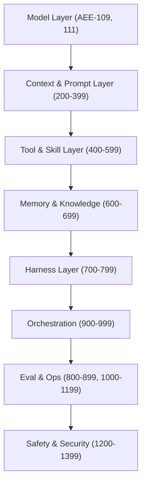

# [AEE-2] Agentic AI 生態全景

## Context

Agentic AI 在 2023 至 2026 年間從研究原型演進為正式的生產部署。這個轉折由三個匯聚的發展推動：前沿模型跨越了能可靠呼叫外部工具的門檻、Context Window 擴展至 128K–1M+ tokens 以支援長任務執行，以及 RLVR（Reinforcement Learning with Verifiable Rewards）讓訓練管道在程式碼與數學任務上擁有可擴展的強化訊號。可量化的成果相當顯著：截至 2026 年初，頂尖的 Agent 在 SWE-bench Verified 上能解決超過 80% 的真實 GitHub Issue；METR 的 Time-Horizon Benchmark 顯示 AI Agent 可以可靠地完成人類工程師約需一小時完成的任務——這項能力三年前幾乎不存在。進入這個領域的工程師面對的不是實驗性的展示，而是一個快速分層的工業化生態，需要有意識地做出架構選擇。

## Design Think

Agentic AI 生態按照能力層級、領域適用性與生態系統成熟度呈現明顯的分層結構。工程師在確立架構之前，**MUST** 理解這種分層。

### 1. 前沿模型能力里程碑

Benchmark 現在確認，程式碼領域的任務已可在有意義的品質門檻下被可靠地自動化。SWE-bench Verified 是一個 500 個實例的 Benchmark，針對開源 Python 專案中的真實 GitHub Issue，以自動測試套件驗證結果。截至 2026 年初，Claude Opus 4.5 達到 80.9%，成為首個突破 80% 門檻的模型；GPT-5.2 與 Gemini 3.1 Pro 也聚集在 80% 附近。這些數字代表能力範圍中有精心篩選的一端。SWE-bench Pro 是一個更難的 1,865 任務 Benchmark，使用專業程式庫並刻意抵抗資料污染，頂尖模型的成績僅約 23.3%（GPT-5）與 23.1%（Claude Opus 4.1）——說明受控 Benchmark 表現與真實世界開放式難度之間仍存在巨大落差。工程師 **MUST** 將 Benchmark 分數視為特定任務類型的上限估算，而非通用能力背書。

METR 的 Time-Horizon Benchmark 提供了另一個維度：它衡量 Agent 在 50% 成功率條件下能完成的最大任務時長。截至 TH1.1 評估套件（2026 年 1 月，228 個任務），前沿 Agent 可可靠完成人類約需一小時努力才能完成的任務。METR 的資料顯示這項能力在過去六年約每 7 個月翻倍，2024 至 2025 年間加速至約每 4 個月翻倍。Claude 3.7 Sonnet（2025 年 4 月評估）是首個在可靠成功率下展現約 1 小時 Time Horizon 的模型。

### 2. 領域不對稱性

並非所有領域都同等受惠於這一進展。技術領域擁有可驗證的正確性訊號——軟體工程、數學、資料轉換——進展最快，因為 RLVR 提供了明確的訓練訊號：測試要麼通過，要麼失敗。軟性領域——策略寫作、細膩建議、人際溝通——缺乏等效的程式化正確性標準，相對其難度的進展較慢。

工程師 **MUST** 根據自身具體領域校準預期，而非依賴匯總的 Benchmark 頭條。建構法律文件審查 Agent 的團隊 **SHOULD NOT** 假設 80% 的 SWE-bench Verified 分數適用於其任務。可靠性與領域的對應關係是一階架構考量。越接近「可執行規格」的領域（程式碼、SQL、結構化資料），目前可實現的自主性越高；越接近「開放式判斷」的領域，則需要更多 Human-in-the-Loop 的設計。

### 3. 生態系統碎片化

Agentic AI 生態系統在四個不同層次上呈現碎片化，目前尚無穩定的主導標準：

- **模型提供商** — Anthropic、OpenAI、Google DeepMind、Meta、Mistral 等各自擁有不同的 API 介面、能力層級、定價模型與速率限制。沒有任何單一提供商在所有任務類型上佔據主導。
- **編排框架** — LangChain、LangGraph、AutoGen、CrewAI、Smolagents 等提供競爭性的 Agent Loop、多 Agent 協調與工具註冊抽象。這些框架變動迅速，重大破壞性更新時有發生。
- **評估套件** — SWE-bench、METR、MMLU、HumanEval 及各種自訂內部 Benchmark 衡量不同的能力切面。生產級 Agentic 系統目前沒有通用的評估標準。
- **部署平台** — Azure AI Agent Service、AWS Bedrock Agents、Google Vertex AI Agent Builder 及自託管選項，各自在記憶體、工具存取與可觀測性方面施加不同約束。

工程師 **SHOULD** 建構與模型無關、與框架無關的抽象層，以避免在生態系統整合之前陷入供應商綁定。Agent 的領域邏輯——它知道什麼、做出什麼決策、呼叫哪些工具——**SHOULD** 與提供商 API 層和編排框架層隔離。整合終將發生；獲勝的標準尚未確定。

## Deep Dive

### SWE-bench 實際衡量什麼

SWE-bench Verified 是一個包含 500 個真實 GitHub Issue 的 Benchmark，取自熱門開源 Python 程式庫。每個實例提供程式庫程式碼、自然語言問題描述與測試套件。「解決」意味著 Agent 產出的程式碼補丁能讓提供的測試通過——不涉及人工評估。這使 SWE-bench 成為程式碼撰寫與除錯任務的高品質 Benchmark，但有結構性限制：任務被限定在單一程式庫內、以現有測試覆蓋率定義成功，且程式庫公開可得（引發訓練資料污染的疑慮）。SWE-bench Pro 透過使用在模型訓練期間尚未公開的專業內部程式庫來解決污染問題，這解釋了從 ~80% 到 ~23% 的大幅效能下降。

### METR Time-Horizon Benchmark 實際衡量什麼

METR 的 Time-Horizon Benchmark 問的是不同問題：不是「Agent 能完成多少比例的任務？」而是「任務可以多長，才能讓 Agent 的成功率維持在 50% 以上？」評估套件涵蓋 ML 工程、網路安全與軟體工程任務，估計人類完成所需時間介於 1 分鐘到 8 小時以上。TH1.1 套件（2026 年 1 月）擴展至 228 個任務，新增來自 HCAST 的 73 個任務，其中 31 個任務屬於人類需要 8 小時以上的範疇。這個 Benchmark 在方法論上的重要性在於它捕捉了長時程自主性——在不需人工介入的情況下維持上下文、從錯誤中恢復並完成複合任務的能力——這是標準 Benchmark 透過平均簡單與困難實例所掩蓋的維度。

### 框架類別

2025 年的 Agentic 框架生態可分為六大類別，各自適合不同的使用情境：

1. **自主 Agent**（AutoGPT、BabyAGI、AgentGPT）— 以最少人工介入自我提示完成目標的單一 Agent Loop。適合開放式任務探索；較不適合需要生產可靠性的場景。

2. **多 Agent 協作**（AutoGen、CrewAI、MetaGPT、OpenAI Swarm）— 用於協調專業 Agent 共同完成目標的框架。適合可分解為平行或序列子角色的任務。

3. **RAG 導向**（LangChain、LlamaIndex、Haystack）— 以 Retrieval-Augmented Generation 為核心，將 Agent 連接至外部知識庫的框架。適合需要以文件語料庫為基礎的知識密集型任務。

4. **推理最佳化**（LangGraph、Smolagents、n8n）— 公開顯式推理圖結構或輕量 Agent 封裝的框架。LangGraph 強調有狀態的循環圖；Smolagents 強調程式碼撰寫 Agent 的最小額外負擔。

5. **領域專屬**（Azure AI Agent Service、AWS Bedrock Agents、Google Vertex AI Agent Builder）— 以更緊密的廠商耦合換取基礎設施抽象的托管雲端平台。適合優先考慮營運簡單性而非可攜性的團隊。

6. **低程式碼 / 無程式碼**（Flowise、Dify、Relevance AI）— 用於視覺化組合 Agent 工作流程而無需撰寫框架程式碼的工具。適合快速原型開發與非工程師團隊；通常以客製性換取速度。

理解框架屬於哪個類別是評估適用性的前提——適合單一 Agent RAG Pipeline 的編排選擇很可能不適合多 Agent 程式碼審查系統。

## Best Practices

1. 在選擇模型層級之前，先審核你的使用情境實際需要哪些能力。只需要單輪分類的任務不需要前沿推理模型——而前沿模型帶來更高的延遲、成本與速率限制風險。
2. 追蹤針對你任務領域的 Benchmark 進展。通用 Benchmark（例如 MMLU）對生產 Agent 效能的預測價值有限。SWE-bench 分數預測程式碼任務可靠性；對文件摘要或策略規劃任務幾乎沒有參考意義。
3. 建構與模型無關的抽象層：模型提供商 API 與框架 API 的變動速度快於你的領域邏輯。隔離整合點，使提供商切換或框架升級不需要重寫業務邏輯。

## Visual

## Related AEEs

- [AEE-0](0) -- AEE Overview
- [AEE-1](1) -- Glossary
- [AEE-101](../Foundations and Mental Models/101) -- The Agentic Capability Gap

## References

- [Agentic AI: A Comprehensive Survey of Architectures, Applications, and Future Directions (arXiv 2510.25445)](https://arxiv.org/abs/2510.25445) — 涵蓋 90 篇研究（2018–2025）的 PRISMA 系統性回顧；雙典範框架與後 2022 生態轉移的基礎來源。
- [SWE-bench Leaderboard](https://www.swebench.com/) — 追蹤 500 個真實 GitHub Issue 上 Coding Agent 效能的即時排行榜；Verified 分數的主要來源。
- [SWE-bench Pro Leaderboard (Scale Labs)](https://labs.scale.com/leaderboard/swe_bench_pro_public) — 專業程式庫上更難的 1,865 任務 Benchmark；展示真實世界難度落差的 Pro 分數主要來源。
- [Measuring AI Ability to Complete Long Tasks — METR (March 2025)](https://metr.org/blog/2025-03-19-measuring-ai-ability-to-complete-long-tasks/) — 原始 Time-Horizon 方法論論文；定義 50% 成功率 Time-Horizon 指標並記錄 ~7 個月翻倍趨勢。
- [Time Horizon 1.1 — METR (January 2026)](https://metr.org/blog/2026-1-29-time-horizon-1-1/) — 包含 228 個任務的更新評估套件；本文使用的最新 METR 資料點。
- [Top Agentic AI Frameworks in 2025 (Data Science Collective)](https://medium.com/data-science-collective/top-agentic-ai-frameworks-in-2025-which-one-fits-your-needs-0eb95dcd7c58) — 六類別框架分類的次級來源。

## Changelog

- 2026-04-13 -- 初始草稿
