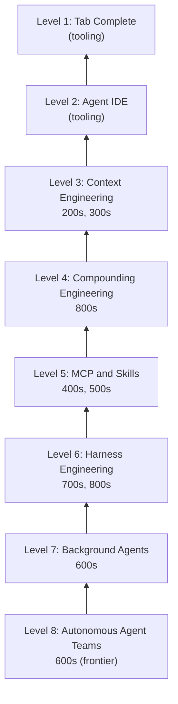

# [AEE-3] 代理工程等級

## 背景脈絡

「使用 AI」與「以 AI 為基礎進行工程開發」之間存在一道鴻溝，而這道鴻溝無法單靠更好的提示詞來彌補。已在正式環境中建構可靠代理系統的工程師，描述了一段相似的成長歷程：從 Tab 補全到自主代理團隊。這段歷程的關鍵，與其說是你能存取哪個模型，不如說是你在模型周圍建構了什麼樣的基礎設施、工作流程與工程紀律。

Bassim Eledath 的八等級框架（eight-level framework），源自直接的正式環境實踐經驗，為這段歷程提供了精確的命名。它的價值不在於排名，而在於提供一張地圖：幫助你找到目前實踐的所在位置、釐清可能略過了哪些基礎，以及判斷哪些 AEE 層次與你下一步的目標最為相關。

## 核心思想

代理工程（agentic engineering）的成熟度，不在於模型的能力，而在於工程師在模型周圍所建構的基礎設施與工程紀律。每一個等級，都在填補模型能力與工程師所建置環境之間的落差——讓模型能夠可靠地發揮其能力。

### 成長歷程

這八個等級構成了一套實踐者成熟度模型。閱讀時有三項原則需要掌握：

1. **每個等級的定義，在於工程師建構了什麼，而非模型能做什麼。** Level 6 工程師與 Level 3 工程師可能使用相同的前沿模型；差別在於他們在模型周圍建構了什麼。
2. **各等級是層層疊加的基礎，而非一個個里程碑。** Level 6 的工程師仍然依賴 Level 3–5 的基礎。跳過等級並不能讓你進步，只會留下漏洞，在更高等級累積成可靠性問題。
3. **這份框架是導航地圖，不是線性清單。** 大多數工程師同時在多個等級上運作。下表的用途是方向定位，不是成績評量。

## 深度探討

### 等級與 AEE 對照表

| 等級 | 名稱 | 工程師建構的內容 | AEE 層次 |
|------|------|-----------------|----------|
| 1 | Tab 補全（Tab complete） | IDE 設定之外無任何建構 | （工具層，AEE 不涵蓋） |
| 2 | 代理 IDE（Agent IDE） | 多檔案對話、計畫模式 | （工具層，AEE 不涵蓋） |
| 3 | 情境工程（Context engineering） | 系統提示詞、規則檔案、節省 token 的對話歷史 | 200–299、300–399 |
| 4 | 複利工程（Compounding engineering） | 知識編碼規則、會話文件 | 800–899 |
| 5 | MCP 與技能（MCP and skills） | 工具伺服器、技能套件、共享登錄表 | 400–499、500–599 |
| 6 | 執行框架工程與自動化回饋（Harness engineering & automated feedback） | 代理迴圈、生命週期鉤子、自動化回饋 | 700–799、800–899 |
| 7 | 背景代理（Background agents） | 非同步編排、平行工作者 | 600–699 |
| 8 | 自主代理團隊（Autonomous agent teams） | 多代理協調、前沿實驗 | 600–699（前沿） |

### Level 1–2：工具層結束，工程開始

Level 1 與 Level 2 關乎的是 IDE 工具——自動補全，以及具備計畫模式的多檔案對話。這些帶來了真實的生產力提升，但在 AEE 的定義下，這還不是工程。工程師尚未建構任何具有持久性的東西：沒有系統提示詞、沒有規則檔案、沒有編碼過的情境、沒有執行框架（harness）。每次會話都從零開始。

AEE 從 Level 3 開始。工程紀律在 IDE 工具結束的地方起步：當工程師開始對模型看到什麼、以及為什麼看到這些內容，承擔刻意的責任。

### Level 3：情境工程

在 Level 3，工程師開始刻意管理模型所接收的資訊。這意味著精心設計系統提示詞、撰寫規則檔案（`.cursorrules`、`CLAUDE.md`）、設計節省 token 而非窮舉的對話歷史，以及決定每次對話輪次應暴露哪些工具。

Eledath 提出的核心洞見是：「每個 token 都必須在提示詞中爭取自己的位置。」MCP 與圖片輸入會快速消耗 token；數十個工具透過 schema 額外負擔讓模型不堪負荷。在實務上，CLI 工具逐漸取代 MCP，因為代理執行針對性指令，只有相關輸出進入情境，而非 MCP 每次都注入完整的 schema。

AEE 200–299 涵蓋提示詞與情境設計；AEE 300–399 涵蓋規則、記憶與情境管理。

### Level 4：複利工程

Level 4 引入複利洞見：每一次會話都可以讓下一次更有能力。代理完成工作後，工程師評估輸出，並將有用的模式編碼回規則檔案、文件與結構化情境——讓代理在未來的會話中自動發現這些模式。

大型語言模型是無狀態的。如果不明確編碼學到的模式，它們會重複相同的錯誤。這個編碼迴圈——計畫、委派、評估、編碼——正是將單次高效會話轉化為持久能力的關鍵。

這也是為何 Level 4 在對照表中與 Level 6（執行框架工程）同樣對應 AEE 800–899：生命週期層涵蓋工程決策如何在會話之間被捕捉與強化。在此投入的成本，會在所有更高等級中複利累積。

### Level 5：MCP 與技能

在 Level 5，工程師透過建構工具伺服器、並將重複的工作流程打包成可共享的技能，來擴展模型的觸及範圍。這包括 MCP 伺服器（讓代理存取資料庫、API、CI 流水線、設計系統與通知頻道），以及可跨會話、跨團隊重用的技能套件。

成熟的 Level 5 實踐包含具備版本控制的共享技能登錄表，讓一個 PR 審查技能（會分散成多個專門子代理，分別檢查資料庫安全性、複雜度、提示詞標準與 linting）可以由團隊共同維護與改進，而非每次重新實作。

### Level 6：執行框架工程

Level 6 是代理迴圈從臨時腳本轉變為工程系統的關鍵。工程師將可觀測性工具、型別系統、測試、linter 與 pre-commit hooks 接入代理執行時期——讓模型能夠自主偵測並修正錯誤，不需要人類介入每一類錯誤。

成熟執行框架工程的兩項設計原則：「以吞吐量為設計目標，而非追求完美」（容忍不阻塞的小錯誤，在發布前進行最終品質審查），以及「約束的效果優於逐步指令」（定義邊界而非清單——由執行框架強制執行）。

### Level 7–8：前沿地帶

Level 7 將模型移出互動迴圈。代理在隔離的情境中非同步執行，由一個調度器（dispatcher）協調。多個模型實例承擔不同角色——實作者、審查者、研究者——而實作者與審查者的分離是刻意為之：不同的模型實例不應為自己的工作評分。

計畫模式在 Level 7 逐漸淡出。模型可靠地在無需人類確認的情況下規劃；計畫本身成為探索——探索程式碼庫、在 worktree 中原型驗證、繪製解決方案空間的地圖。

Level 8 移除中心輻射式（hub-and-spoke）的瓶頸，讓代理能夠直接協調：認領任務、分享發現、標記相依性、解決衝突——無需透過單一的中央編排器路由。這是目前的前沿地帶。Eledath 的評估是：Claude Code 的實驗性 Agent Teams 功能，以及 Anthropic 自身的 16 代理 C 語言編譯器實驗，都揭示了現實的接縫——沒有層級結構時代理會過度保守、沒有 CI 強制執行時會出現迴歸，多代理協調確實是一個尚未解決的難題。目前的模型在速度與 token 效率上，尚不足以讓大多數專案之外的部署具備經濟效益。對於一般的工程工作，Level 7 提供了更大的槓桿效益。

## 最佳實踐

1. 使用此表來定位你目前的實踐所在，而非當作線性清單來逐項勾選。大多數工程師同時在多個等級上運作。這張地圖的價值在於方向感——了解你依賴哪些基礎，以及留下了哪些空缺。
2. 以深度優先，而非以等級晉升為優先。紮實的 Level 5 實踐——設計清晰介面的技能、版本控制的登錄表、測試過的工具整合——優於淺薄的 Level 7 實踐（平行代理在沒有技能紀律的情況下執行，產生不可靠、無法重現的結果）。
3. Level 4 的編碼紀律，在所有更高等級中複利累積。跳過 Level 4 直接進入 Level 6 或 Level 7 的團隊，會發現代理的錯誤缺乏一致性、執行框架沒有可強制執行的依據，而技能也缺乏機構記憶。在進入更高等級之前，先投資於知識編碼。

## 視覺化

## 相關 AEE

- [AEE-0](0) -- AEE 總覽
- [AEE-104](../Foundations and Mental Models/104) -- 能力層級
- [AEE-106](../Foundations and Mental Models/106) -- 自主性光譜
- [AEE-204](../Context Engineering/204) -- 系統提示詞工程
- [AEE-501](../Skills/501) -- 什麼是代理技能
- [AEE-601](../Multi-Agent Orchestration/601) -- 代理角色與拓撲
- [AEE-700](../Harness Engineering/700) -- 什麼是執行框架
- [AEE-801](../Lifecycle and Ops/801) -- AI 驅動的開發生命週期

## 參考資料

- [The 8 Levels of Agentic Engineering — Bassim Eledath](https://www.bassimeledath.com/blog/levels-of-agentic-engineering) — 本文八等級實踐者成熟度框架的主要來源。

## 更新記錄

- 2026-04-15 -- 初稿
