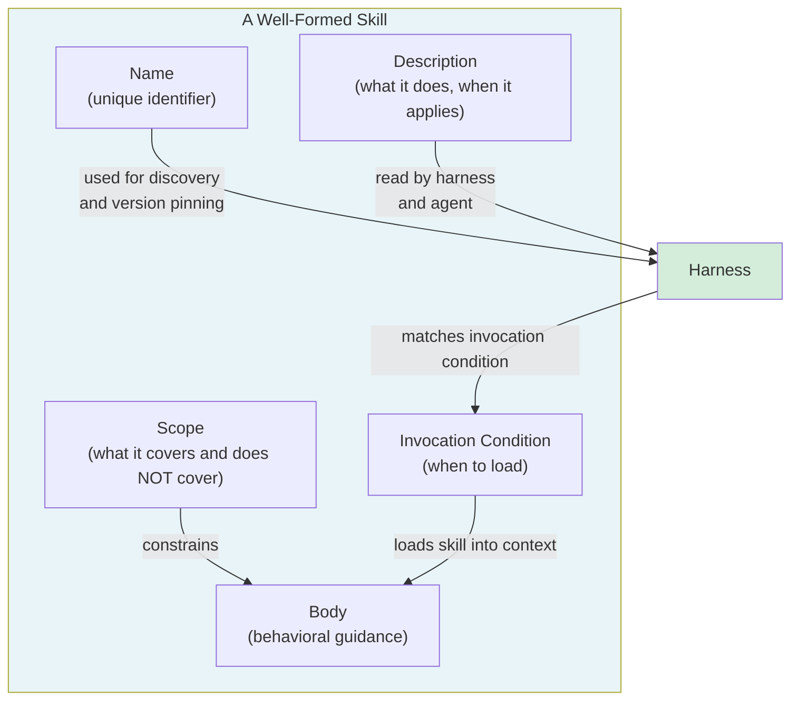

# [AEE-501] 什麼是代理技能

## 情境

AEE-500 確立了工具與技能之間的區別：工具是可執行的能力；技能則是封裝的行為指引。本文更進一步，探討技能的內部結構。它由哪些部分組成？執行框架（harness）如何知道何時載入它？存在哪些類型的技能？技能的生命週期又在何時結束？

這些問題之所以重要，是因為技能與工具不同，並沒有強制性的結構規範。工具定義必須符合 JSON Schema；技能則是純文字描述。若缺乏一套共同的技能結構詞彙，團隊將以不一致的方式建構技能，執行框架無法可靠地處理它們，技能庫也會堆積無人能盤點的雜亂產物。

## 設計思維

核心主張：技能是一份封裝的行為契約。它具備名稱、觸發條件（invocation condition）、定義好的範疇（scope），以及對代理推理的預期影響。將技能視為臨時指令的工程師，只會累積脆弱的一次性產物；將技能設計為契約的工程師，則能建構可重用的系統。

**代理技能（agent skill）的剖析——五個組成部分：**

1. **名稱**：技能在其散佈範疇內的唯一識別符。名稱應以動作為導向，例如 `debugging`、`write-commit-message`、`review-pull-request`。名稱是呼叫、探索與版本固定的主要依據。

2. **描述**：一到兩句話說明技能的功能及其適用時機。執行框架與代理都會讀取這段描述。執行框架可能用它來比對使用者請求與技能；代理讀取它以理解自己獲得了什麼。

3. **觸發條件**：明確指定此技能應於何時載入。這是最重要、也最常缺失的組成部分。沒有觸發條件，執行框架就無法自動選擇技能。觸發條件可以是事件導向（「當使用者執行 `/commit` 時」）、意圖導向（「當使用者要求程式碼審查時」），或情境導向（「當在有測試失敗的儲存庫中工作時」）。

4. **主體（Body）**：行為指引本身，即當此技能啟用時塑造代理方式的指令、限制與模式。

5. **範疇**：技能涵蓋的內容，以及關鍵地，不涵蓋的內容。沒有定義範疇的技能，會擴展以填滿代理正在做的一切事情。範疇邊界能防止萬能技能（god-skill）的出現，並實現技能組合（AEE-504）。

**情境注入（context injection）vs. 函式呼叫：**

技能在代理處理請求之前就被載入代理的情境（context）中，從一開始就塑造推理過程。這與工具不同，工具是在代理發出 `tool_use` 區塊時於執行期呼叫的。執行框架決定何時注入技能；注入機制包括前置於系統提示詞、以先前使用者輪次載入，或使用結構化訊息類型。代理將技能視為其指令集的一部分，而非它「呼叫」的東西。

**技能類型：**

- **流程技能（process skills）**：引導代理處理一類任務的方式。範例：如何除錯、如何撰寫提交訊息、如何進行程式碼審查。最常見的類型。
- **領域技能（domain skills）**：為特定領域編碼知識與慣例。範例：特定程式碼庫的慣例、公司的 API 風格指南。回答「我們在這裡怎麼做」而非「我們如何做到」。
- **工具引導技能（tool-guidance skills）**：指定如何使用特定工具或工具集。範例：偏好哪些 Bash 指令、如何格式化 git 提交、遵循哪些測試模式。

一個技能可以結合多種類型，但應有一個決定其範疇的主要類型。

**技能生命週期（skill lifecycle）：**

1. **撰寫**：在本機撰寫並測試。定義觸發條件。指定「不應使用的時機」。
2. **發佈**：散佈至某個範疇（個人、團隊、組織或公開）。指定版本。
3. **呼叫**：當觸發條件符合時，執行框架載入技能。
4. **退役**：先標記為棄用，再日落，最後移除。通知消費者替代方案。

跳過退役步驟的技能會在技能庫中累積，成為維護負擔（AEE-506）。

- 技能 MUST 定義觸發條件。沒有觸發條件的技能無法被自動選擇，也無法針對正確應用進行測試。
- 技能 MUST 定義範疇：技能涵蓋與不涵蓋的內容。
- 技能 SHOULD 指定「不應呼叫它們的時機」。負面觸發條件與正面觸發條件同樣重要。

## 深入探討

### 實踐中的剖析

一個最小的完整技能範例：

```yaml
---
name: write-commit-message
description: Write a well-formed git commit message following conventional commits format. Use when the user asks for a commit message or runs /commit.
invocation: when the user says /commit or asks for a commit message
scope: "commit message authoring only — does not cover staging, pushing, or PR creation"
---

Write a commit message following the Conventional Commits specification.

Format: `<type>(<scope>): <description>`

Types: feat, fix, docs, style, refactor, perf, test, chore

Rules:
- Subject line: imperative mood, no period, max 72 characters
- Body (if needed): explain WHY, not what. Wrap at 72 characters.
- Breaking changes: add `BREAKING CHANGE:` in footer

Do NOT include the `git commit` command — only the message text.
Do NOT use this skill when the user is asking about git history, branching, or merging.
```

（技能的 YAML 範例以英文撰寫，與語言環境無關。）

這個技能具備全部五個組成部分：名稱、描述、觸發條件（兩個觸發器）、主體，以及範疇（僅限提交訊息撰寫，並有明確的排除項目）。

### 什麼讓技能成為萬能技能

萬能技能沒有有效的範疇邊界。徵兆如下：
- 描述寫著「協助工程任務」
- 觸發條件是「當使用者有程式碼問題時」
- 主體包含除錯、程式碼審查、文件、測試和架構的指令
- 隨著時間推移不斷追加新指令而成長

萬能技能會與專門技能衝突、被應用於並非為其設計的請求，且無法進行全面測試。當一個技能超過 500 行指引時，它幾乎可以確定是一個萬能技能。請將其分解（AEE-503）。

## 視覺化



## 最佳實踐

1. **在撰寫本文之前先寫觸發條件。** 定義技能的適用時機，能在撰寫任何指引之前就強制釐清其目的。若一個技能的觸發條件無法用一句話寫出，代表它的範疇尚未妥善界定。

2. **以技能讓代理做什麼來命名，而非技能是什麼。** `debugging` 是一個分類；`diagnose-root-cause` 才是技能。動詞-名詞名稱（`write-commit-message`、`review-pull-request`）比純名詞名稱更易於呼叫。

3. **範疇欄位不是選填的。** 省略範疇等同於說「這個技能適用於一切事物」。範疇邊界能實現組合、探索與測試。

## 相關 AEE

- [AEE-500](500) — 技能 vs. 工具（本文建立於其上的概念區別）
- [AEE-503](503) — 技能設計（如何以正確的範疇邊界撰寫技能）
- [AEE-504](504) — 技能組合（完整技能如何共存與串接）
- [AEE-506](506) — 技能治理（生命週期執行與技能退場）
- [AEE-700](../Harness Engineering/700) — 什麼是執行框架？（執行框架在技能注入中的角色）

## 參考資料

- [Conventional Commits Specification](https://www.conventionalcommits.org/en/v1.0.0/)

## 更新記錄

- 2026-04-14 -- 初稿
