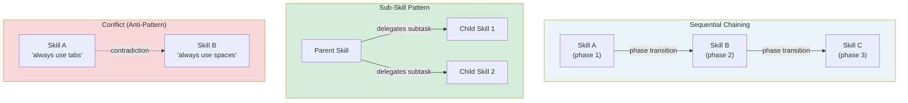

# [AEE-504] 技能組合

## 情境

能夠設計出邊界清晰技能（AEE-503）的從業者很快就會發現，真實任務往往需要不止一項技能。除錯需要診斷、修復、再測試；開發流程需要腦力激盪、規劃、再實作。問題在於：如何讓技能組合（skill composition）涵蓋多步驟任務，同時又不重蹈「全能技能」的覆轍？

答案是組合——明確定義技能如何鏈式銜接、委派與共存的模式。理解這些模式，是讓技能庫在規模擴大後仍保持實用，而非陷入指引重疊的關鍵所在。

## 設計思維

核心論點：技能透過情境（context）組合，而非透過函式呼叫。與工具不同，技能在執行期不會互相呼叫——它們被載入同一個情境中，由代理人在其間導航。組合發生在設計期（哪些技能共存）與調用期（執行框架選擇哪項技能）。為組合而設計，意味著為共存而設計。

**為何是情境，而非函式呼叫：**

工具呼叫另一個工具是執行期事件——一個程序調用另一個並取得結果。當技能「呼叫」另一項技能時，執行框架會將被呼叫技能的指引載入情境，與呼叫端技能並存。代理人同時擁有兩套指令集，必須在其間導航。技能組合本質上是情境管理（context management）：哪些指引存在、以何種順序排列、以及彼此是否相容。

**四種組合模式：**

1. **循序鏈式（sequential chaining）**：執行框架依照既定順序調用技能。每項技能在其階段內啟用；前一階段結束後，下一項技能才載入。同一時間只有一項技能啟用——無衝突風險。

2. **子技能（sub-skill）**：父技能的本文明確指示代理人針對特定子任務調用具名的子技能。執行框架解析引用並載入子技能。父技能掌握整體方向；子技能處理特定的子問題。

3. **並行共存（parallel coexistence）**：多項技能同時啟用，各自涵蓋不重疊的領域。僅在範疇邊界嚴格時有效（AEE-503）。重疊的技能會產生衝突。

4. **衝突（反模式）**：兩項技能同時載入，對相同情境提供矛盾的指引。代理人的選擇無從預測。這是需要診斷的失效模式，而非應當使用的模式。

**RFC 2119：**

- 調用子技能的技能 MUST 以子技能的已註冊名稱明確命名。在未命名的情況下描述子技能的行為，會產生隱性依賴，一旦子技能重新命名即告失效。
- 支援多項技能同時啟用的執行框架 SHOULD 偵測並呈現衝突，而非無聲地自行解決。衝突是設計問題；隱藏衝突只會使設計問題永久存在。

## 深入探討

### 循序鏈式的實務應用

Superpowers 開發工作流程是典型範例：

1. **brainstorming** 技能——在設計階段啟用。引導代理人理解問題、提出方案、撰寫規格。
2. **writing-plans** 技能——在規劃階段啟用。引導代理人根據核准的規格撰寫詳細實作計畫。
3. **subagent-driven-development** 技能——在執行階段啟用。引導代理人依任務派遣子代理人並審閱其產出。

每項技能專為其所屬階段打造。執行框架在每次階段轉換時載入對應技能。交接資料（例如腦力激盪階段產出的規格文件）以檔案成品的形式在各階段之間流動，而非透過技能間通訊傳遞。

循序鏈式的必要條件：
- 明確的階段轉換：執行框架必須知道何時推進至下一項技能
- 交接資料：第 N 階段產出什麼供第 N+1 階段使用？
- 無重疊：鏈式中的兩項技能絕不能同時啟用

### 子技能的實務應用

父技能將特定子任務委派給具名的子技能：

```markdown
---
name: incident-response
description: Guide the agent through a structured incident response process.
---

Follow this incident response workflow:

**Step 1: Triage**
Identify the scope and severity. Classify as P1/P2/P3.

**Step 2: Diagnosis**
REQUIRED SUB-SKILL: Use the `diagnose-root-cause` skill to identify the root cause before proceeding.

**Step 3: Mitigation**
Propose and implement a mitigation. Prefer reversible mitigations during an active incident.

**Step 4: Post-mortem**
REQUIRED SUB-SKILL: Use the `write-post-mortem` skill after the incident is resolved.
```

（技能本文以英文撰寫，與語言環境無關。）

父技能負責編排工作流程。子技能處理各專業階段。父技能不重複子技能的指引——只以已註冊名稱引用子技能。

### 衝突偵測

當兩項技能對相同情境提供矛盾指引時，衝突便會發生。常見原因：與專業技能重疊的全能技能；範疇邊界重疊的兩項專業技能；涵蓋相同領域但標準不同的組織技能與個人技能。

偵測方式：設計技能時，檢查其與所有共存技能之間的重疊情形。自問：「若兩者同時啟用，是否存在任何情境會讓代理人收到矛盾指令？」若有，縮窄其中一項技能的範疇。

### 以技能為執行框架模式（skill-as-harness pattern）

某些技能主要用於編排——它們透過指定依序調用哪些技能來定義工作流程，而非為特定領域編碼行為指引。技能本文大部分是「在 Y 階段使用技能 X」；行為指引存在於子技能中。

此模式適用於以下情況：
- 工作流程過於複雜，無法放入單一技能本文
- 工作流程重用現有、經充分測試的技能
- 工作流程需要獨立於其組成技能進行演進

## 視覺化



## 最佳實踐

1. **優先選擇循序鏈式，而非並行共存。** 循序鏈式讓同一時間只有一項技能啟用，消除衝突風險。並行共存僅在範疇邊界嚴格且可驗證不重疊時才安全。

2. **在子技能引用中，務必使用已註冊的技能名稱。** `REQUIRED SUB-SKILL: Use the diagnose-root-cause skill` 是正確做法。「使用一個除錯技能找出根本原因」是錯誤做法——執行框架無法解析「一個除錯技能」。

3. **組合技能前，先稽核其範疇邊界。** 列出組合中所有將被啟用的技能，逐一檢查每個配對是否有重疊。五分鐘的稽核能節省數小時除錯無法預測的代理人行為。

## 相關 AEE

- [AEE-501](501) — 什麼是代理技能（組合中每項技能的結構）
- [AEE-503](503) — 技能設計（使組合安全的範疇邊界）
- [AEE-505](505) — 技能管理（如何跨範疇管理組合後的技能集）

## 參考資料

- [Conventional Commits](https://www.conventionalcommits.org/en/v1.0.0/)

## 更新記錄

- 2026-04-14 -- 初稿
