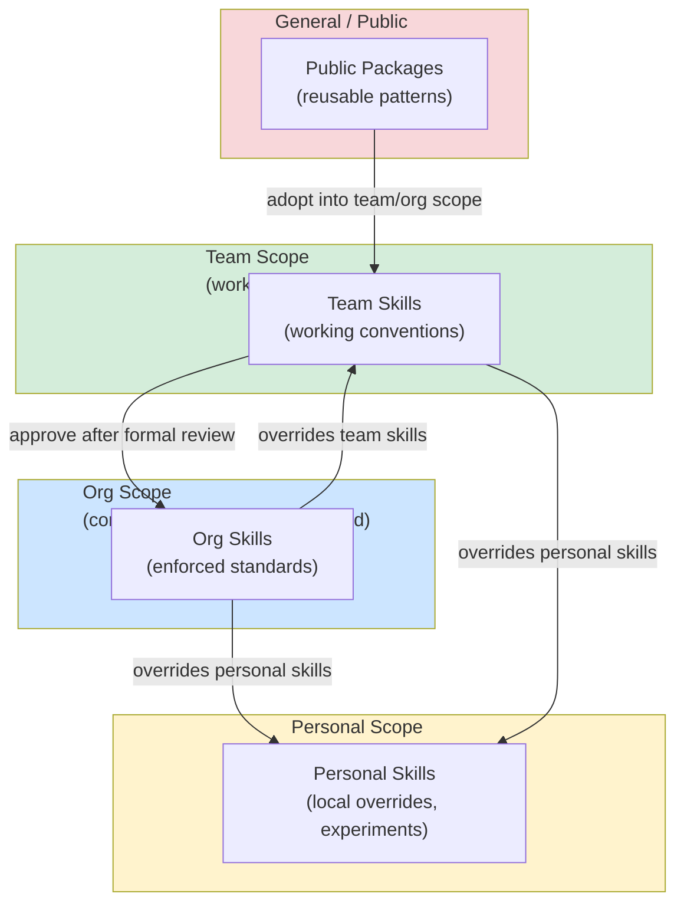

# [AEE-505] 技能管理 (Skill Management)

## 情境

一位工程師使用一兩個技能，擁有的是一個技能庫。一個團隊共用十個技能，面對的是協調問題。一個組織統一採用五十個技能，面對的是技能管理 (skill management) 問題。從技能庫演變成管理問題的速度，往往超過多數團隊的預期——技能會持續累積，因為新增技能很容易，而刪除或更新技能卻需要協調。

範疇模型——個人範疇 (personal scope)、團隊範疇 (team scope)、組織範疇 (org scope)，以及公開範疇 (general/public scope)——是技能管理的基礎框架。它回答了：技能存放在哪裡、由誰維護、誰可以使用，以及來自不同範疇的技能發生衝突時該如何處理？

## 設計思維

核心主張：未受管理的技能庫是一種負債。技能會不斷累積——個人實驗、團隊慣例、組織標準、公開套件——若沒有範疇模型，就無從得知哪個技能適用於哪種情境、誰負責維護什麼，以及不同範疇的技能如何相互作用。個人 → 團隊 → 組織 → 公開的範疇層級，不只是一個儲存模型；更是一個信任與維護模型。

**四個範疇：**

| Scope | Who maintains | Who uses | Review required | Trust level |
|-------|--------------|----------|-----------------|-------------|
| Personal | Individual | Individual only | None | Low (experimental) |
| Team | Team members | Team | Informal (peer) | Medium |
| Org | Designated owners | Entire org | Formal (approval) | High |
| General/public | Community / maintainers | Anyone | Varies | Depends on publisher |

**個人範疇：** 工程師在本機目錄（例如 `~/.claude/skills/`）中維護個人技能。這些是實驗性質的技能、本機覆寫，以及一次性使用的腳本。不需審查；不保證正確或最新。個人技能可在個別工作階段中覆寫團隊或組織技能。

**團隊範疇：** 在工作小組內共用的技能，存放於專案儲存庫或團隊層級的套件中。以非正式方式審查（由隊友在合併前看過即可）。團隊技能編碼了團隊的工作慣例——命名標準、審查清單、工作流程偏好。應透過 git 標籤或套件版本進行版本控制。

**組織範疇：** 在組織層級核准並維護的技能。組織技能代表的是標準，而非建議。它們有具名的擁有者，在發布前須通過正式審查，並以受支援的生命週期進行版本管理。組織內每位工程師在適用時都應使用組織技能；組織技能會覆寫團隊與個人技能。

**公開範疇：** 發布至公開登錄表（npm、GitHub）的技能。由發布者維護；信任程度取決於發布者的聲譽。公開技能是不特定於任何組織的可重用模式來源。

**範疇繼承 (scope inheritance) 與覆寫：**

信任程度較高的範疇，在相同領域中優先於信任程度較低的範疇：
- 組織技能在覆蓋相同領域時，覆寫團隊技能
- 團隊技能覆寫個人技能
- 個人技能可明確鎖定至特定版本的團隊或組織技能，覆寫預設的最新版本

當兩個技能對同一個請求具有重疊的觸發條件時，才適用覆寫規則。

**RFC 2119：**

- 組織層級的技能 MUST 有具名的擁有者。沒有擁有者的組織技能將無人維護、更新或廢棄——它終將腐化。
- 發布至團隊或組織範疇的技能 MUST 包含版本號。使用者需要知道自己使用的版本，以及版本之間的變更內容。
- 個人技能 SHOULD NOT 在未經審查的情況下悄悄升級至團隊範疇。一個從個人實驗演變為團隊標準的技能，應通過團隊的非正式審查流程。

## 深入探討

### 技能登錄表的樣貌

在組織規模下，技能探索需要一份目錄。一份最小化的組織技能登錄表 (skill registry)：

| Skill Name | Scope | Owner | Version | Invocation Condition | Status |
|------------|-------|-------|---------|----------------------|--------|
| `diagnose-root-cause` | org | @platform-team | 2.1.0 | user reports unexpected behavior | active |
| `review-pull-request` | org | @engineering-leads | 1.4.2 | user shares code for review | active |
| `write-commit-message` | org | @dx-team | 3.0.1 | user asks for commit message | active |
| `backend:api-design` | team (backend) | @backend-lead | 1.0.0 | user designing a new API | active |
| `frontend:component-review` | team (frontend) | @frontend-lead | 0.9.0 | user reviewing a React component | beta |
| `legacy-migration` | org | @platform-team | 1.2.0 | user migrating from v1 to v2 | deprecated — use `v2-migration` |

登錄表回答了：「這件事有對應的技能嗎？」它也揭露了管理問題：沒有替代方案的已廢棄技能、停留在 beta 長達六個月的技能、沒有擁有者的技能。

### 技能探索

**個人範疇**：列出檔案。`ls ~/.claude/skills/` 即可查看可用技能。

**團隊範疇**：團隊技能儲存庫的 README 列出可用技能、其觸發條件，以及應鎖定的版本。新成員在入職時閱讀此文件。

**組織範疇**：正式的登錄表（如上表），可能整合至 IDE 中。依領域、觸發條件或擁有者進行搜尋。

**公開範疇**：套件登錄表（npm search、GitHub topics）。沒有單一權威目錄；工程師依賴推薦與搜尋來發現技能。

### 版本鎖定

版本鎖定 (version pinning) 將技能鎖定至特定版本，而非跟隨最新版本：

```yaml
# Project skill configuration
skills:
  - name: review-pull-request
    version: "1.4.2"   # pinned
  - name: write-commit-message
    version: "latest"  # follow latest (default)
```

**何時應鎖定版本：** 最新版本改變了行為，導致團隊工作流程中斷；團隊正處於專案中期，無法承受行為變更。

**何時應解除鎖定：** 先在個人範疇測試新版本之後；在新專案週期開始時；當組織技能擁有者發布正確性修正時。

### 管理債務

技能在無人擁有時會腐化。徵兆：
- 組織登錄表中沒有具名擁有者的技能
- 標記為「active」但超過一年未更新的技能
- 觸發條件與其他三個技能重疊的技能
- 工程師習慣性以個人技能覆寫的技能

管理債務 (management debt) 的正確回應不是刪除一切——而是指派擁有權：確認每個技能是否仍然相關，廢棄不再適用的技能，更新已過時的技能。

## 視覺化



## 最佳實踐

1. **在問題出現之前就指派擁有者。** 每個發布至個人範疇以外的技能，都應在發布時即有具名的擁有者，而不是等到技能成為維護負擔之後才指派。

2. **將技能登錄表視為活文件，而非歷史紀錄。** 一份包含已廢棄技能、無擁有者技能，以及早已解散的團隊所留下技能的登錄表，是檔案館，不是登錄表。每季進行審查並修剪非活躍技能，才能讓目錄保持實用。

3. **在新成員入職時進行技能稽核。** 如果新進工程師無法在 5 分鐘內找到常見任務所需的技能，代表登錄表的可探索性已出現問題。新成員入職是發現探索性問題的最佳回饋機制。

## 相關 AEE

- [AEE-503](503) — Skill Design（技能設計——構成管理系統的個別技能品質）
- [AEE-506](506) — Skill Governance（技能治理——執行管理模型的運營層）
- [AEE-501](501) — What Is an Agent Skill（代理人技能是什麼——每個被管理技能的解剖結構）

## 參考資料

- [npm packages and modules](https://docs.npmjs.com/about-packages-and-modules)
- [Semantic Versioning](https://semver.org/)

## 更新記錄

- 2026-04-14 -- 初稿
