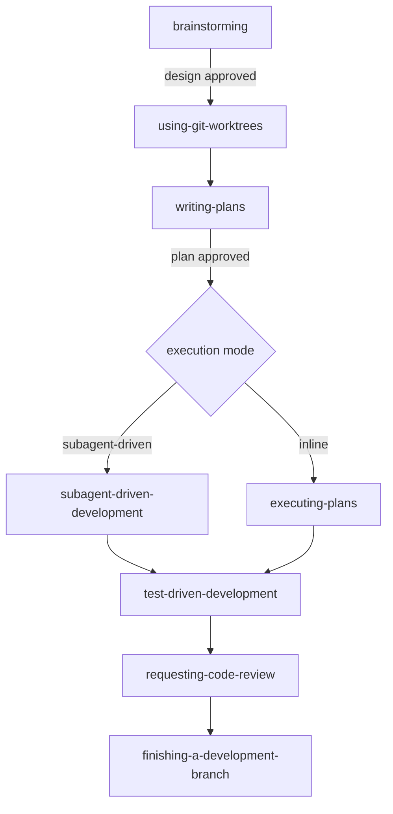

# [AEE-507] Superpowers：技能系統案例研究

## 背景脈絡

500 系列以抽象方式描述技能生態系。[AEE-500](500) 劃出技能與工具的分界，[AEE-501](501) 描述技能結構，[AEE-502](502) 描述周邊生態系，[AEE-503](503) 至 [AEE-506](506) 處理設計、組合、管理與治理層面。這個系列沒有提供一個可供研究的具體成熟技能系統。建置自己技能庫的讀者，在某個具體的實例中看到這些抽象概念被如何實現，往往比單看抽象概念更有收穫。

本文將 [Superpowers](https://github.com/obra/superpowers) 作為該案例研究。它是開源、多平台、持續維護、文件公開的專案，而且是本文作者有直接操作經驗的框架。這是一個站得住腳的選擇。

揭露事項：本文由一位正在使用 Superpowers 的人撰寫。文中提到的每一個技能都曾在產出本文的會話中被調用過。這是此案例研究的明確前提，不是需要隱藏的利益衝突。一位使用者撰寫的公開揭露案例研究，與中立的全景調查，是兩件不同的事，這個差異對於閱讀本文的方式很重要。

指標：[AEE-807](../Agentic%20Development%20Workflows/807) 已在規格驅動開發框架的調查深度涵蓋 Superpowers，與 OpenSpec、BMAD、Kiro 等並列。本文則走更窄更深的角度，以 Superpowers 將 500 系列的概念具象化。

## 設計思考

有三項特性讓 Superpowers 成為 500 系列有用的研究對象。第一，它的技能庫小而組合規則清晰：十四個技能，各自聚焦，透過 `REQUIRED SUB-SKILL` 指標明確串接，而非內嵌複製。第二，它的技能是被「工程化」出來的，而非僅僅「寫」出來的。這個技能庫把技能內容當作針對壓力測試調校過的行為碼，採用 `EXTREMELY-IMPORTANT` 標記、紅旗表、`HARD-GATE` 標記、`SUBAGENT-STOP` 等模式——這些在其他框架的純 markdown 技能文件中並不常見。第三，框架閉合了後設迴圈：`writing-skills` 本身就是一個技能，並且將技能撰寫視為 TDD，而 `tests/` 目錄存放跨平台的情境評估測試。

正確的閱讀方式是把此案例研究視為 500 系列所描述空間中的一個有效實現。建置自己技能庫的團隊應該採用真正能解決自身問題的模式。規模小、沒有合理化壓力的技能庫不需要紅旗表；沒有不可逆轉換的技能庫也不需要硬性閘門。

誠實地看待此案例研究，對讀者會有幾項約束：

- 讀者 MUST 把 Superpowers 當作一個具體示例，而非機械複製的參考實作。
- 建置技能系統的團隊 SHOULD 從此案例研究中採用真正能解決自身問題的模式。
- 工程師 MUST NOT 假設此處呈現的每個行為塑形模式都是每個技能庫必需的。Superpowers 刻意採用這些模式，是因為它的技能是剛性（rigid）且流程關鍵（process-critical）的。
- 想要中立的技能分發系統調查的讀者 SHOULD 閱讀 [AEE-502](502) 以了解生態系，並閱讀 [AEE-807](../Agentic%20Development%20Workflows/807) 以了解框架層級的比較。

## 深度解析

### 1. 框架概覽

Superpowers 內建 14 個技能，分為四個類別。測試類別包含 `test-driven-development`。除錯類別包含 `systematic-debugging` 與 `verification-before-completion`。協作類別最大：`brainstorming`、`writing-plans`、`executing-plans`、`subagent-driven-development`、`dispatching-parallel-agents`、`requesting-code-review`、`receiving-code-review`、`using-git-worktrees`、`finishing-a-development-branch`。後設類別包含 `writing-skills` 與 `using-superpowers`。

分發是多平台的。同一個外掛可以安裝到 Claude Code（透過官方市集）、Cursor（透過其外掛市集）、Codex、OpenCode、GitHub Copilot CLI 與 Gemini CLI。每個目標平台在倉庫中都有自己的初始化目錄（`.claude-plugin/`、`.codex/`、`.cursor-plugin/`、`.opencode/`，外加 `gemini-extension.json` 與 `GEMINI.md`）。技能本身是共用的；各平台差異只在啟動設定。

與更廣泛的 AGENTS.md 慣例互通方式，是 `AGENTS.md -> CLAUDE.md` 的符號連結，設於倉庫根目錄。這正是 [AEE-808](../Agentic%20Development%20Workflows/808) 所記載的模式：單一真實來源、零重複、各工具期望的檔名指向同樣的內容。Superpowers 是這種互通模式的現場範例，在自己的倉庫中採用。

`hooks/session-start` 下的會話 hook 在每次新會話時自動載入 `using-superpowers`，這是為什麼這個入口技能看起來不需使用者顯式呼叫就會觸發。

### 2. 技能結構

Superpowers 的技能是一個 `skills/<skill-name>/` 目錄，包含一個 `SKILL.md` 入口檔案與選擇性的支援檔案。`SKILL.md` 使用雙欄位 YAML 前置資訊：`name`（字母、數字、連字號）與 `description`。前置資訊上限為 1024 個字元。

`description` 欄位描述「何時使用」此技能，而不是「這個技能做什麼」。慣用的寫法是以「Use when ...」開頭，如此欄位便能直接對應執行框架的配對邏輯：執行框架評估是否要調用一個技能時，比對的是使用者意圖與描述中的觸發條件，而不是功能目錄。這和 Anthropic 自己在 [Claude Code 技能文件](https://code.claude.com/docs/en/skills)中對 `description` 的描述原則一致，但 Superpowers 把它當作硬性規定，而非建議。

具體範例——入口技能的前置資訊：

```yaml
---
name: using-superpowers
description: Use when starting any conversation - establishes how to find and use skills, requiring Skill tool invocation before ANY response including clarifying questions
---
```

支援檔案與 `SKILL.md` 放在同一目錄，用於內容較重或可重用的情形：超過 100 行的參考資料、專職審查代理用的可重用提示詞樣板、範例檔案與腳本。brainstorming 技能中的範例包括 `visual-companion.md` 與 `spec-document-reviewer-prompt.md`。把這些檔案從 `SKILL.md` 分離，讓主文件保持可瀏覽。

Superpowers 的技能自行宣告類型。剛性技能（TDD、systematic-debugging）必須嚴格依循；改寫它們就失去了效用。彈性技能（模式、設計建議）則可根據情境調整原則。技能自己會說明它屬於哪一種類型，代理因此知道該怎麼讀它。

Superpowers 的貢獻者指南明確指出，本框架採用的慣例與 Anthropic 公開發布的技能撰寫指引有所不同。下一小節的行為塑形模式解釋了為什麼這樣做。

### 3. 行為塑形模式

技能只有被代理調用時才會發揮作用。在時間壓力下，代理會對技能進行合理化：判定任務過於單純、概念已知、或此技能對這個情境來說「太重了」。本小節列出的模式，正是為了防守這些合理化。這些是工程化的控制點，不是可有可無的建議。

**`EXTREMELY-IMPORTANT` 標記搭配「1% 規則」**。`using-superpowers` 技能一開始就寫著這條規則：「If you think there is even a 1% chance a skill might apply to what you are doing, you ABSOLUTELY MUST invoke the skill.」此規則強制代理在任何回應（包含澄清問題）之前先檢查可用技能。此閾值刻意不對稱：沒必要調用技能的代價很小，跳過該調用的技能的代價很大。

**紅旗表**。明列合理化思路與對應反駁的表格。範例列：「This is just a simple question」→「Questions are tasks. Check for skills.」「I remember this skill」→「Skills evolve. Read current version.」「The skill is overkill」→「Simple things become complex. Use it.」此表是窮舉式、而非代表性抽樣。它列舉壓力測試中觀察到的失敗模式，並逐一補丁。

**`HARD-GATE` 標記**。阻止進度往前推進的審核檢查點。`brainstorming` 技能的硬性閘門寫的是：「Do NOT invoke any implementation skill, write any code, scaffold any project, or take any implementation action until you have presented a design and the user has approved it.」這個標記是一個流程標誌；代理讀到後會把接下來的轉換視為阻塞，直到閘門條件消解。

**`SUBAGENT-STOP` 標記**。當執行環境是被派遣的子代理而非頂層會話時，抑制技能的啟動。`using-superpowers` 技能寫著：「If you were dispatched as a subagent to execute a specific task, skip this skill.」子代理從派遣者那裡收到情境適配的指示，而非頂層入口的行為。這個標記防止子代理在受限任務中重跑入口流程。

**Graphviz `digraph` 流程圖**。`SKILL.md` 中嵌入 dot 記號的決策圖。流程圖成為正典的決策樹；讀者與代理依循同一張圖。圖形讓分支明示化，這是散文無法達到的。

**刻意的措辭**。使用「your human partner」而非「the user」。Superpowers 的貢獻者指南明確指出此措辭不可替換為「the user」。這個選擇把人類定位為協作者而非請求方，這影響了代理如何處理歧義——傾向聽從人類夥伴，而不是滿足使用者。

相對於整個代理生態系常見的純 markdown 技能文件，這些模式屬於新東西。它們存在是因為 Superpowers 把技能當作需要工程紀律的行為碼。

### 4. 工作流程組合

七階段流水線是正規的主要路徑：`brainstorming` → `using-git-worktrees` → `writing-plans` → `subagent-driven-development` 或 `executing-plans` → `test-driven-development` → `requesting-code-review` → `finishing-a-development-branch`。

每一階段在進入下一階段之前都有硬性閘門。brainstorming 在設計未被核准前不會轉入 writing-plans；writing-plans 在計畫未寫完與審閱前不會轉入執行；執行在實作未完成前不會轉入審查。閘門是流程事實，而非僅僅指引——技能被如此撰寫，會在前一階段缺少必要產物時拒絕推進。

技能透過各自 overview 中的 `REQUIRED SUB-SKILL` 標頭明確互相指名。流水線被編碼於技能本身之中，而非由外部編排者負責。`brainstorming` 把 writing-plans 列為後繼者；writing-plans 把 subagent-driven-development 與 executing-plans 列為兩種執行替代方案；兩個執行技能都把 finishing-a-development-branch 列為終端步驟。

每個技能的流程圖都有明確指向下一個技能的終點狀態。brainstorming 的終點是「Invoke writing-plans skill」。writing-plans 的終點是「Offer execution choice」。這條鏈條在文件中是可見的，使讀者不必執行框架也能理解組合關係。

執行階段存在兩條替代路徑：`executing-plans` 在當前會話中以批次檢查點方式行進計畫；`subagent-driven-development` 為每個任務派遣一個全新子代理，搭配兩階段審查（先合規，再品質）。兩者都在完整、已寫就的計畫面前才開啟硬性閘門。

### 5. 後設技能與測試工具

`writing-skills` 技能把技能撰寫視為套用於文件的 TDD。對應關係：測試案例 = 子代理壓力情境；正式程式碼 = `SKILL.md` 文件；RED = 代理在缺少此技能時違反預期規則；GREEN = 代理在此技能就位後合規；重構 = 一邊維持合規、一邊補上新冒出的合理化漏洞。

`writing-skills` 指定的流程是具體的。第一，寫技能「之前」先跑一次基準壓力情境。記錄代理在沒有技能時會做錯什麼。第二，針對那些具體違規寫技能，而非泛泛框出問題。第三，重跑情境以驗證代理現在是否合規。第四，尋找新的合理化漏洞，補上，再驗證。

`tests/` 目錄存放情境評估測試。子目錄包括 `brainstorm-server`、`claude-code`、`explicit-skill-requests`、`opencode`、`skill-triggering`、`subagent-driven-dev`。這些是跨平台的情境式行為評估，而非程式碼的單元測試。修改技能內容的 PR 若沒有評估證據顯示改進，就會被拒絕；貢獻者指南明確寫道：「Skills are not prose — they are code that shapes agent behavior.」

Superpowers 只有一個專職子代理：`agents/code-reviewer.md`。其他全部使用通用子代理載入相關技能來處理任務。其他框架常見的「每個任務配一個專職子代理」模式被拒絕；技能透過通用子代理載入相關技能來組合，這讓技能庫保持為首要的重用單位，防止平行的代理庫與之脫節。

### 6. 帶立場的哲學

TDD 是剛性的。`test-driven-development` 是剛性技能；把它從 RED-GREEN-REFACTOR 改寫掉就失去了它的效用。框架不允許這種改寫。

技能覆蓋預設系統提示的行為；而使用者指示（專案 `CLAUDE.md`、`GEMINI.md`、`AGENTS.md`、直接請求）則覆蓋技能。優先順序在 `using-superpowers` 中寫得清楚：使用者指示永遠最高、技能次之、預設系統提示最低。框架對預設系統提示主張權威，但對人類退讓。

「Evidence over claims」是 `verification-before-completion` 背後的明確哲學。此技能要求在聲明工作完成之前，先執行驗證指令並確認輸出。它與 `systematic-debugging` 搭配使用；兩者對其支援的工作流程皆非可選。

貢獻者紀律是此框架帶立場的邊界。貢獻者指南開頭即寫：「This repo has a 94% PR rejection rate.」並直接對嘗試機會性 PR 的 AI 代理提出警示。專案拒絕特定領域的技能納入核心；零相依是一條規則；沒有評估證據的「合規化」改寫會被拒絕；針對 issue 列表「批量修 bug」的代理 PR 會被拒絕。

此技能庫刻意保持小巧與通用。十四個技能、通用、零相依。特定領域的技能應放進獨立的外掛。這個限制防止技能庫累積那種未經節制的成長所帶來的維護債。

此案例研究提供的對比：不加節制、缺乏評估紀律或組合約束的技能庫，累積維護債的速度遠比這一套快得多。Superpowers 帶立場的哲學是一個有已知取捨的設計選擇；500 系列的讀者選擇自己的技能系統設計時，應該理解每項約束買到了什麼。

## 最佳實踐

1. **撰寫技能描述時說明「何時使用」，而非「這個技能做什麼」。** `description` 欄位是執行框架把使用者意圖與技能配對的依據。「Use when ...」的措辭讓描述聚焦於觸發條件，而不是功能清單式的散文。

2. **對技能進行針對合理化的壓力測試，而非只測試順利路徑。** 一個技能如果只在代理「願意」調用時奏效、在時間壓力下就失效，那正是它最該發揮作用的時候反而不會觸發。先把失敗情境寫出來，再寫技能。

3. **以參照組合，而非複製組合。** 嵌入其他技能片段的技能會與原始來源平行腐化。透過 `REQUIRED SUB-SKILL` 指標明確參照其他技能，才能讓每個技能獨立演化。

4. **把技能庫視為需要評估的程式碼。** 任何技能內容變更都有造成行為漂移的風險。沒有情境測試套件的技能庫無法偵測漂移；最終會累積一堆「作者覺得能用、其他人用不出來」的技能。

5. **把核心技能庫保持小且通用。** 特定領域的技能屬於獨立外掛或專案層級的 `CLAUDE.md`。讓核心庫不加節制地成長，會對每個新撰寫的技能課稅。

6. **對不可逆的轉換加上硬性閘門。** 技能的下一步若是檔案變更、分支合併或使用者可見的訊息，就插入明確的核准閘門。硬性閘門是讓自主運作值得信任的機制。

## 視覺

七階段流水線與其硬性閘門轉換，接一張行為塑形模式的參照表。



**行為塑形模式參照：**

| 模式 | 所解決的問題 | 範例位置 |
|---|---|---|
| `EXTREMELY-IMPORTANT` + 1% 規則 | 時間壓力下跳過技能調用 | `skills/using-superpowers/SKILL.md` |
| 紅旗表 | 繞過技能調用的合理化 | `skills/using-superpowers/SKILL.md` |
| `HARD-GATE` 標記 | 設計未核准前就開始實作 | `skills/brainstorming/SKILL.md` |
| `SUBAGENT-STOP` | 子代理重跑頂層入口流程 | `skills/using-superpowers/SKILL.md` |
| `digraph` 流程圖 | 分支決策不清 | 多個技能 |
| 「human partner」措辭 | 與「the user」互換造成行動主體感弱化 | 貢獻者 `CLAUDE.md` |

## 相關 AEE

- [AEE-500](500) — 技能與工具 — 本案例研究所預設的基礎分界
- [AEE-501](501) — 什麼是代理技能 — 技能結構；深度解析第 2 節把它具象化
- [AEE-502](502) — 代理技能生態系 — 框架概覽呈現生態系
- [AEE-503](503) — 技能設計 — 深度解析第 3 節的行為塑形模式延伸此
- [AEE-504](504) — 技能組合 — 深度解析第 4 節的工作流程組合延伸此
- [AEE-505](505) — 技能管理 — 深度解析第 5 節的後設技能與測試工具延伸此
- [AEE-506](506) — 技能治理 — 深度解析第 6 節的貢獻者紀律延伸此
- [AEE-807](../Agentic%20Development%20Workflows/807) — 規格驅動開發框架實務 — Superpowers 於框架調查層級的條目；本文是其更窄、更深的姊妹篇
- [AEE-808](../Agentic%20Development%20Workflows/808) — AGENTS.md 與撰寫最佳實踐 — Superpowers 的 `AGENTS.md -> CLAUDE.md` 符號連結是 AEE-808 符號連結互通模式的現場範例

## 參考資料

- [Superpowers — obra/superpowers](https://github.com/obra/superpowers) — 正典外掛倉庫。
- [Superpowers README](https://github.com/obra/superpowers/blob/main/README.md) — 框架概覽、七階段工作流程、技能類別、多平台安裝說明。
- [Superpowers contributor guide — CLAUDE.md](https://github.com/obra/superpowers/blob/main/CLAUDE.md) — 帶立場的貢獻者指南；「skills are not prose — they are code」的哲學；94% PR 拒絕率的表述。
- [using-superpowers skill](https://github.com/obra/superpowers/blob/main/skills/using-superpowers/SKILL.md) — 入口技能；1% 規則、紅旗表、SUBAGENT-STOP 標記。
- [writing-skills skill](https://github.com/obra/superpowers/blob/main/skills/writing-skills/SKILL.md) — 後設技能；技能撰寫的 TDD 對應。
- [brainstorming skill](https://github.com/obra/superpowers/blob/main/skills/brainstorming/SKILL.md) — HARD-GATE 模式的實際運用。
- [Superpowers for Claude Code — Jesse Vincent](https://blog.fsck.com/2025/10/09/superpowers/) — 作者介紹此框架的部落格文章。
- [Extend Claude with skills — Claude Code docs](https://code.claude.com/docs/en/skills) — Anthropic 的 Claude Code 技能撰寫官方文件；Superpowers 的貢獻者指南明確指出框架採用不同的慣例。

## 更新記錄

- 2026-04-19 — 初始草稿
