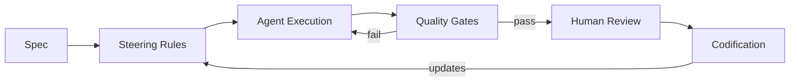

# [AEE-800] 代理開發工作流程

## 情境

代理工程中大多數的失敗不是模型失敗，而是工作流程失敗：含糊的指令讓代理（agent）無法執行、沒有記錄哪些方式奏效、在代理做出具有後果的決策時缺乏監督、也沒有回饋機制來防止下一個工作階段重蹈覆轍。

第 100 到 700 系列涵蓋基礎設施層——模型、情境、提示詞工程、工具、技能、多代理協作與執行框架（harness）。這些基礎設施是必要條件，但不是充分條件。一個代理即使運行在優秀的執行框架上、情境層配置完善，如果實踐者給予的任務模糊不清、不審查任何輸出、也不在失敗後做任何調整，仍然會產生不可靠的結果。

第 800 系列涵蓋方法論層（methodology layer）：規格（spec）、引導規則（steering rules）、監督結構與回饋系統——讓代理能夠跨工作階段、跨團隊、跨專案地可靠運作。

## 設計思維

### 方法論缺口

基礎設施系列建立了代理能做什麼，卻未解答如何組織工作才能讓代理可靠地推動執行。這個缺口就是方法論層。

一位只提升模型存取能力、卻不改善工作流程紀律的實踐者，終將碰到天花板——不是模型能力的天花板，而是自身流程的天花板。這個天花板有可預測的表現：工作階段產出不一致、代理跨執行重複犯相同錯誤、審查週期隨代理產出線性擴張、工作階段之間沒有累積任何知識。

第 800 系列正是要解決這個天花板。

### 三大工作流程關切

代理開發工作流程（agentic development workflows）的方法論可整理為三大關切：

**1. 輸入品質：規格與引導規則。** 代理執行它所接收到的內容。模糊的提示詞會產生合理但往往錯誤的解讀。一份具備明確成功標準、限制條件與介面定義的完整規格，能給代理一份可執行的行為契約。引導規則進一步延伸這一點：它們將持久的行為限制編碼化，使其在每個工作階段都適用，避免代理每次都重新摸索相同的邊界。

**2. 流程完整性：人工監督（human oversight）與品質關卡（quality gates）。** 代理會做決策，其中有些是具有後果且不可逆的。若沒有明確的檢查點，代理將自主跨越那些邊界——有時正確，有時不然，且始終不留決策記錄。人工監督模式定義了工作流程中哪些地方需要人類判斷、以何種形式介入。品質關卡則將監督延伸至自動化：測試、程式碼風格檢查工具（linter）與型別系統，在代理產出到達人工審查者之前就給予反壓（backpressure）。

**3. 改進迴圈：編碼化（codification）。** 一個產生了教訓卻未記錄的工作階段，是浪費掉的知識。編碼化是將工作階段所學轉化為可重複使用規則的實踐——更新引導規則檔案、精煉規格範本、補充品質關卡檢查——讓未來的工作階段從過去已發現的知識開始，而非從零出發。

代理工作流程在執行具有不可逆後果的任務時，MUST（必須）至少包含一個人工檢查點。引導規則 SHOULD（應當）與程式碼一起進行版本控制。

### 為何方法論在規模化時至關重要

在獨立專案、單一代理、單一工作階段的情況下，即興式的工作流程尚可接受。實踐者將所有情境保存在腦中，直接審查所有產出，並由自己承擔每次錯誤的代價。

但這些條件在規模化後不再成立。跨團隊運作時，情境分散——使用不同引導規則的代理往往產出不一致的結果，造成沒有單一根源可解釋的整合失敗。跨多個工作階段時，未被編碼化的教訓通常會在下一個代理工作階段或下一位工程師手中被重新發現，每次都需要付出代價。當多個代理平行運作時，具有後果的決策面積擴張速度，遠超過任何一位審查者能覆蓋的範圍。

工作流程紀律不是等規模化到來才變得有價值的。它必須在規模化之前就到位，因為事後在一個運行中的多代理工作流程上補裝方法論，遠比一開始就建立起來困難得多。

## 深入探討

AEE-801 至 AEE-806 各自涵蓋一個方法論關切。合在一起，它們構成完整的工作流程方法論層。

| 文章 | 主題 | 涵蓋內容 |
|---|---|---|
| AEE-801 | AI 驅動開發生命週期 | 三階段生命週期（Inception/Construction/Operations）、自適應工作流程、引導規則作為階段層級的行為限制 |
| AEE-802 | 規格驅動開發 | 撰寫代理可執行的規格；成功標準；DESIGN.md 模式 |
| AEE-803 | 引導規則與代理指令 | 持久行為限制；跨平台實作；範疇與優先順序 |
| AEE-804 | 人工監督模式 | 中斷點、批准閘門、非同步審查、信心閾值、模式選擇 |
| AEE-805 | 工作流程編碼化 | 將工作階段知識轉化為可重複使用規則；編碼化迴圈；規則腐化 |
| AEE-806 | 代理品質關卡 | 自動化回饋機制；反壓；關卡回饋品質 |

**各文章的關聯性。** AEE-802 與 AEE-803 處理輸入品質：代理在工作階段開始時接收什麼。AEE-804 處理流程完整性：在執行過程中何處插入人類判斷。AEE-806 處理自動化的流程完整性：機器在人工審查之前的反壓機制。AEE-805 處理改進迴圈：教訓如何成為下一個工作階段的輸入。AEE-801 則將上述一切框架化為一個結構化生命週期——本系列中最完整的工作流程整合。

### 應用實踐文章

AEE-807 與 AEE-808 以應用實踐的深度延伸特定的方法論關切。

| 文章 | 主題 | 涵蓋內容 |
|---|---|---|
| AEE-807 | 規格驅動開發框架實務 | 調查 OpenSpec、BMAD-METHOD、Kiro、GitHub Spec Kit、Superpowers、Compound Engineering、get-shit-done 等框架；延伸 AEE-802 |
| AEE-808 | AGENTS.md 與撰寫最佳實踐 | AGENTS.md 跨工具慣例、與 CLAUDE.md 的互通、精簡派與完備派的撰寫辯論；延伸 AEE-803 |

### 依實踐者等級的建議閱讀順序

並非所有實踐者都需要立即閱讀每篇文章。建議的入門文章依等級區分如下：

- **等級 3-4（情境工程、編碼化）：** AEE-802 → AEE-803 → AEE-805。先建立規格與規則紀律，再增加監督或自動化。
- **等級 5-6（技能、執行框架 + 自動化回饋）：** AEE-800 → AEE-801 → AEE-806。理解生命週期框架以及自動化的位置。
- **等級 7-8（背景代理、自主團隊）：** AEE-800 → AEE-804 → 完整系列。當代理在沒有持續人類陪同的情況下運作時，監督模式變得至關重要。

## 最佳實踐

1. **在增加協作複雜度之前，先從規格紀律入手。** 一個無法撰寫代理可執行規格的團隊，不會因為增加更多代理到工作流程中而受益。代理會放大清晰指令的產能，也會放大模糊指令的代價。先修正輸入，再擴展系統。

2. **將引導規則與程式碼一起進行版本控制。** 一條沒有提交記錄就改變的規則，對審查者而言是隱形的，也無法回滾。引導規則是可執行的配置——它們值得與程式碼庫中任何其他配置檔案同等的版本控制紀律。

3. **找出你的不可逆操作，優先在那裡設置人工檢查點。** 並非所有操作都需要相同密度的監督。不可逆操作——破壞性寫入、外部 API 呼叫、部署——是價值最高的監督點。從那裡開始，再隨著工作流程成熟逐步增加覆蓋範圍。

## 視覺化

此圖將工作流程呈現為有向循環。規格與引導規則定義代理輸入。品質關卡在人工審查前提供自動化回饋。編碼化封閉迴圈：人工審查的教訓回饋至引導規則，改善下一次執行。

## 相關 AEE

- [AEE-3](../AEE Overall/3) -- 代理工程等級——等級 4 與 6 直接對應本系列所處理的關切
- [AEE-500](../Agent Skills/500) -- 技能 vs. 工具——技能定義代理如何行動；第 800 系列定義工作流程如何組織
- [AEE-700](../Harness Engineering/700) -- 什麼是執行框架？——執行框架負責執行工作流程；第 800 系列定義工作流程本身
- [AEE-801](801) -- AI 驅動開發生命週期——本系列中最完整的工作流程框架
- [AEE-806](806) -- 代理品質關卡——使工作流程紀律得以規模化的自動化層

## 參考資料

- [Building Effective Agents - Anthropic](https://www.anthropic.com/research/building-effective-agents)

## 更新記錄

- 2026-04-15 -- 初稿
