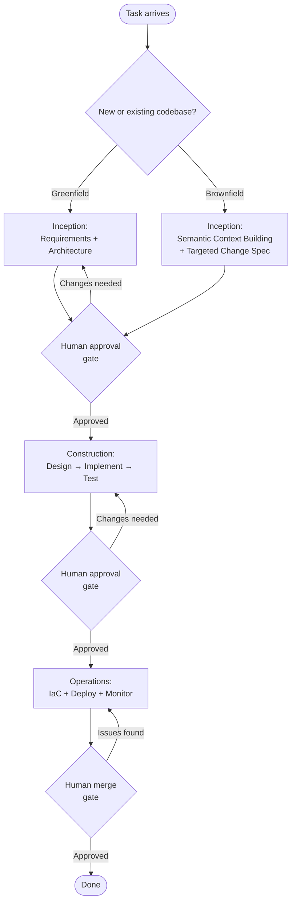

# [AEE-801] AI 驅動開發生命週期

## 背景脈絡

大多數「在開發中使用 AI」的嘗試，都把 AI 當作嫁接在既有工作流程上的加速器：叫 AI 寫程式、貼上去、繼續做。代理（agent）只是更好的自動補全，工作流程本身沒有改變。

AI 驅動開發生命週期（AI-Driven Development Lifecycle，AI-DLC）採取截然不同的做法。它不是把 AI 嫁接到現有的 SDLC 上，而是重新架構 SDLC 本身，讓每個階段產出的結構化內容，恰好是代理驅動下一個階段所需的輸入。最終形成的系統中，代理不是輔助人類產出的助手，而是在人類監督下驅動定義好流程的執行者。

AI-DLC 源自 AWS，於 2025 年以 `awslabs/aidlc-workflows` GitHub 儲存庫的形式開源。它定義三個階段——初始階段（Inception）、建構階段（Construction）、維運階段（Operations）——每個階段都有明確的代理行為、人工核准閘道，以及對應的引導規則（steering rules）集合。主要實作目標是 Amazon 自家的 Kiro IDE 與 Amazon Q Developer，但框架本身與工具無關：引導規則是純 Markdown 檔案，任何代理都能讀取。

## 設計思維

AI-DLC 的核心主張是：代理在接收到**結構化的階段輸入**時才能可靠運作，而非面對開放式的授權。一個階段產出一份定義明確的成果物；下一個階段以此為輸入。每次階段轉換都由人工核准閘道隔開，代理永遠無法自行推進到下一階段。

### 三個階段

AI-DLC 將開發組織成三個階段：

**初始階段（Inception）** 將業務意圖轉化為已驗證的需求與工作單元。機制是群體闡述（Mob Elaboration）：團隊——人類與代理共同——即時協同闡述需求。代理提出問題、使用者故事與驗收標準，人類即時驗證並修正。代理在團隊確認理解前無法繼續。輸出成果為詳細需求、使用者故事、驗收標準，以及程式碼庫的語義情境模型（semantic context model）。

**建構階段（Construction）** 將已驗證的初始成果物轉化為可運作、已測試的程式碼。機制是群體建構（Mob Construction）：代理提出邏輯架構、領域模型、程式碼與測試；人類在每個步驟釐清技術決策。每個階段都遵循計畫-驗證-生成循環（plan-verify-generate cycle）：代理建立計畫、人類驗證、代理執行、人類確認輸出。此循環在設計、實作、測試三個子階段中依序重複。

**維運階段（Operations）** 利用前兩個階段累積的情境，處理部署、基礎設施即程式碼（IaC）與監控。專責的 PR 審查代理——各自負責程式碼品質、FinOps 成本分析與資安審查——在人工審查者確認業務意圖並核准合併之前先行審查 Pull Request。

### 綠地專案與棕地專案的分流

初始階段依程式碼庫狀態分為兩條路徑。

**綠地專案（greenfield）** 走標準路徑：需求闡述直接進入架構設計。

**棕地專案（brownfield）** 先執行逆向工程步驟：代理在產出針對性變更規格之前，先建立現有程式碼庫的語義情境模型。這可防止代理在不了解程式碼庫的情況下做出無邊界的變更。語義情境模型將代理錨定在實際存在的內容上，而非開發者腦中記憶的樣貌。

### 自適應工作流程（Adaptive Workflow）

並非所有任務都需要跑完完整的生命週期。AI-DLC 的自適應工作流程（adaptive workflow）機制會偵測工作區情境與任務複雜度，並選擇要納入哪些階段。修復一個熟悉模組中的缺陷，會略過大部分初始階段，直接進入有限範圍的建構。在不熟悉的程式碼庫上開發新功能，則會跑完完整的棕地逆向工程路徑。框架自我調適，實踐者不必為簡單任務手動設定縮減版工作流程。

### 引導規則（Steering Rules）

每個階段由一組引導規則（steering rules）管控：放置在工具專屬目錄中的 Markdown 檔案，在任何代理執行開始前載入為情境。它們不是執行期程式碼，而是在 Session 啟動時注入的情境，用以約束代理在該階段期間的行為。

| 工具 | 目錄 | 格式 |
|------|------|------|
| Kiro | `.kiro/steering/aws-aidlc-rules/` | Markdown |
| Amazon Q Developer | `.amazonq/rules/aws-aidlc-rules/` | YAML-based rules |
| Cursor | `.cursor/rules/ai-dlc-workflow.mdc` | MDC（Markdown + YAML frontmatter） |
| Cline / Claude Code | `.clinerules/`（Cline）或 `CLAUDE.md` / `AGENTS.md`（Claude Code） | Markdown |

所有平台共用 `aws-aidlc-rule-details/` 下相同的階段專屬規則目錄，包含子目錄：`common/`、`inception/`、`construction/`、`operations/` 與 `extensions/`。`core-workflow.md` 錨點檔案定義頂層階段序列與閘道要求，所有階段專屬規則皆以此為基礎延伸。

### 人工監督

每次階段轉換都需要明確的人工核准，代理不能自主推進階段。在建構階段內部，計畫-驗證-生成循環在每個階段都插入額外的驗證點（verification point）。re:Invent 2025 AI-DLC 發表場次的筆記顯示，每個 bolt（工作單元，大致相當於一個 Sprint）約有 10 至 26 個人工驗證點（此數據來自第三方場次筆記，非 AWS 官方規格）。

- 每次 AI-DLC 階段轉換，在下一個階段開始前 MUST 需要明確的人工核准。
- 代理 MUST 將不確定性以釐清請求的形式提出，而非自行決斷。
- 引導規則 MUST 在任何階段執行開始前載入——在沒有階段情境下運作的代理會產出無方向的輸出。

## 深度解析

### 1. 初始階段（Inception）

初始階段是臨時性代理工作流程中最常被略過的階段，也是略過代價最高的。未經過驗證需求就直接進入建構的代理，會以和做對的事相同的速度，把錯誤的需求實作得很正確。

群體闡述（Mob Elaboration）流程作為即時協作 Session 進行。代理不是接收一份完整的規格然後執行，而是參與闡述：提出使用者故事、將模糊需求轉化為釐清問題，並起草驗收標準供團隊即時審查。這需要人類的積極參與——代理無法獨自完成初始階段。

初始階段的輸出精確到足以執行：具有明確驗收標準的使用者故事、架構草圖，以及語義情境模型。語義情境模型是棕地專案中最關鍵的成果物，是程式碼庫領域概念、介面與約束的結構化表示，代理將以此為基礎限定後續所有決策的範圍。

### 2. 建構階段（Construction）

建構階段結構化為三個子階段——設計、實作、測試——每個子階段都由計畫-驗證-生成循環管控：

1. **計畫：** 代理根據初始成果物提出計畫（架構決策、實作方式或測試策略）。
2. **驗證：** 人類審查並核准計畫；若計畫有誤則提出修改要求。
3. **生成：** 代理執行已核准的計畫。
4. **驗證：** 人類確認輸出後，循環才推進到下一步。

群體建構（Mob Construction）不代表人類被動觀察。人類在每個步驟釐清技術決策——尤其是設計子階段，因為架構決策若有誤，會傳播到實作與測試兩個子階段。設計與實作之間的核准閘道，是整個生命週期中槓桿最高的審查點之一。

建構階段的輸出是可運作、已測試的程式碼，並附有每次計畫核准與驗證決策的審計軌跡。

### 3. 維運階段（Operations）

維運階段消費初始與建構兩個階段累積的完整情境。代理利用此情境管理 IaC 設定與部署 Pipeline，實踐者不需要重新解釋上游已經捕獲的領域約束。

PR 審查由負責不同關注面的專責代理並行處理：程式碼品質、FinOps 成本分析與資安審查。這些代理並行運作，產出結構化的審查意見。人工審查者隨後評估代理發現的問題、確認業務意圖——這是專責代理無法評估的唯一關注面——並核准合併。人工合併閘道是生命週期中最後一個核准點。

### 4. 自適應工作流程機制

自適應工作流程機制在兩個維度上運作：

**階段選擇（Stage selection）** 評估工作區情境（現有檔案、近期變更、分支結構）與任務複雜度（缺陷修復 vs. 新功能 vs. 架構變更），以推薦納入哪些階段。修復熟悉函式中的迴歸問題，不需要對整個程式碼庫執行棕地逆向工程，框架會將範圍縮小到任務所需的程度。

**棕地逆向工程** 是讓 AI-DLC 在現有程式碼庫上安全運作的具體機制。在建構開始前，代理分析程式碼庫並產出語義情境模型：領域概念、公開介面、依賴關係與約束模式。此模型約束後續所有代理決策。沒有它，代理在現有程式碼庫上做變更，就像憑著描述而非地圖在導航。

### 5. 引導規則實作

`awslabs/aidlc-workflows` 儲存庫以開源檔案的形式提供完整引導規則集，任何團隊都可以直接採用。儲存庫的組織方式支援從單一規則來源服務多種代理工具：每個工具的規則引用共享的 `aws-aidlc-rule-details/` 階段目錄，而非重複其內容。

`core-workflow.md` 錨點檔案是入口點。它定義三階段序列、每次轉換的閘道要求，以及適用於所有階段的行為約束。`inception/`、`construction/` 與 `operations/` 目錄中的階段專屬規則檔案以錨點為基礎延伸出階段層級的細節。

引導規則是 Markdown（Amazon Q 則是 YAML-based Markdown）。這一點很重要：它們不需要編譯、不需要部署、也不需要執行。它們在 Session 啟動時被代理讀取，就像開發者在開始工作前閱讀簡報一樣。任何能讀取文字的代理都可以遵循引導規則。

### 6. 與 Kiro 的關係

Kiro 是 Amazon 的代理 IDE（kiro.dev）。AI-DLC 引導規則以 Kiro Steering Files 的形式原生實作於 `.kiro/steering/` 目錄中。Kiro 的核心工作流程方法論是規格驅動開發（spec-driven development）——以 `requirements.md`、`design.md` 和 `tasks.md` 作為核心規格成果物，這些直接對應 AI-DLC 在建構階段開始前所需的初始輸出。`awslabs/aidlc-workflows` 儲存庫將 Kiro 與 Amazon Q Developer 列為 AI-DLC 引導規則的第一優先實作目標。

## 最佳實踐

1. **每個新任務都從初始階段開始，即使是小變更也不例外。** 略過初始階段直接跳到建構的代理，會以和解決正確問題相同的速度，去解決錯誤的問題。對一個小任務進行一次聚焦的群體闡述 Session，額外花費以分鐘計；修正一個跑在錯誤需求上的建構階段，代價以小時計。

2. **即使對自己熟悉的程式碼庫，也要使用棕地逆向工程步驟。** 它產出的語義情境模型能防止代理做出無邊界的變更——它將代理錨定在實際存在的內容上，而非你記憶中的樣貌。開發者對程式碼庫的記憶會隨時間衰退，而且永遠不完整；模型是客觀的。

3. **把計畫-驗證-生成循環視為不可妥協的環節。** 建構階段最常見的失敗模式是沒有仔細閱讀就核准 AI 生成的計畫。計畫階段的錯誤會傳播到實作與測試生成中。一份需要兩分鐘仔細審查的計畫，遠比略讀省下的時間更有價值。

## 視覺化

圖示呈現完整的 AI-DLC 生命週期。初始階段的綠地/棕地分流決定通往第一個核准閘道的路徑。人工核准閘道隔開每次階段轉換。建構階段內部的計畫-驗證-生成循環在此層級未顯示，但在建構階段的每個子階段中持續運作。

## 相關文章

- [AEE-800](800) -- Agentic Development Workflows -- 類別總覽；AI-DLC 是本類別中最完整的工作流程框架
- [AEE-802](802) -- 規格驅動開發 -- 初始階段產出代理可執行的規格；Kiro 同時實作 AI-DLC 與規格驅動開發
- [AEE-803](803) -- 引導規則與代理指令 -- 引導規則是 AI-DLC 階段約束的實作機制
- [AEE-804](804) -- 人工監督模式 -- AI-DLC 的核准閘道是監督模式的具體參考實作
- [AEE-3](../AEE Overall/3) -- Agentic Engineering Levels -- AI-DLC 橫跨第 4 至第 6 級

## 參考資料

- [AI-Driven Development Life Cycle -- AWS DevOps Blog](https://aws.amazon.com/blogs/devops/ai-driven-development-life-cycle/)
- [Open-Sourcing Adaptive Workflows for AI-DLC -- AWS DevOps Blog](https://aws.amazon.com/blogs/devops/open-sourcing-adaptive-workflows-for-ai-driven-development-life-cycle-ai-dlc/)
- [awslabs/aidlc-workflows -- GitHub](https://github.com/awslabs/aidlc-workflows)

## 更新日誌

- 2026-04-17 -- 初稿
