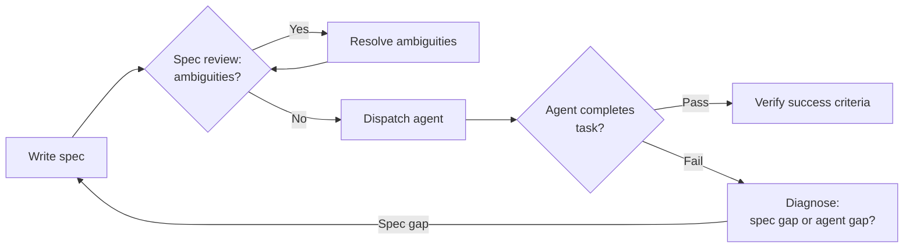

# [AEE-802] 規格驅動開發

## 背景

代理執行的是你告訴它的內容，而非你的意圖。開發者讀到模糊的規格時，會主動提問、運用判斷、做出合理的選擇。代理讀到相同的規格時，可能任意解決這個歧義，默默地將錯誤假設傳遞到每一個下游步驟，最終產出技術上正確、但方向錯誤的實作。

這不是代理的失敗，而是規格的失敗。

對從業者來說，問題不是「如何取得更好的代理？」而是「如何撰寫代理能夠可靠執行的規格？」規格驅動開發（spec-driven development）就是系統性回答這個問題的方法論。

## 設計思維

人類可以閱讀的規格，不一定是代理能夠執行的規格。人類可讀的規格依賴共享脈絡、隱性慣例，以及讀者透過判斷填補空白的能力。開發者帶著多年累積的脈絡閱讀規格，他們知道「標準錯誤處理」在這個程式庫裡是什麼意思、團隊的命名慣例是什麼、哪些系統部分不能碰。而這些脈絡沒有一項寫在文件裡。

可執行規格（agent-executable spec）無法依賴這一切。它必須自給自足、沒有歧義，並且結構化到讓每個需求都能對應到可驗證的動作。撰寫可執行規格是一項獨立的技能，有別於撰寫人類可讀的設計文件。

**核心區別：** 人類可讀的規格是敘事性的——描述要建構什麼以及原因。可執行規格是行為合約（behavioral contract）——定義輸入／輸出映射、前置條件、後置條件、不變量（invariant）與限制。敘事傳達意圖；行為合約使驗證成為可能。

**可執行規格的要求：**

- **自給自足：** 無隱性脈絡、無預設慣例、無「你懂我的意思」的模糊指涉
- **可測試的需求：** 每個需求對應到可以檢驗的輸出——如果你無法描述「完成」是什麼樣子，這個需求就尚未被指定
- **明確性（unambiguity）：** 範疇（scope）的邊界要清楚——哪些在內、哪些在外；代理不會自行推斷邊界
- **已解決的歧義：** 推遲給代理處理的歧義，將成為代理自行發明的詮釋

**規格結構** — 一份完整的可執行規格包含五個部分：

1. **目標陳述：** 一句話說明這份規格產出什麼
2. **架構：** 技術方法、關鍵技術決策，以及代理必須遵守的限制
3. **檔案映射：** 每個要建立或修改的檔案的確切路徑——「建立認證模組」不是檔案映射；`src/auth/login.ts` 才是
4. **任務分解：** 每個任務包含輸入材料（input materials）、輸出合約（output contract）與成功標準（success criteria）
5. **成功標準：** 整份規格完成時的驗證方式——用來關閉規格的測試

**DESIGN.md 模式：** 一份放在儲存庫根目錄（或元件目錄）的文件，指定設計系統限制：元件名稱、間距 token、無障礙需求、命名規則。它不是任務規格，而是一份導引文件（steering document）。實作 UI 的代理會載入 DESIGN.md 作為脈絡，並在每次工作階段中受其約束。它的目的是防止代理發明既有的慣例。個別功能規格會參照 DESIGN.md，但不重複其內容。

**何時值得撰寫規格：** 多步驟任務、跨越多個檔案的任務、需要跨工作階段重現的任務，以及需要追蹤中間狀態的任務。單步驟且可立即驗證的任務不需要正式規格。門檻問題是：這個任務需要超過一個代理回合才能完成嗎？

**RFC 2119:**

- 可執行規格對每個任務都 MUST 定義成功標準——沒有成功標準的任務無法完成，也無法驗證。
- 規格在代理開始執行之前 MUST 解決所有歧義——歧義將成為代理自行發明的詮釋。
- 代理 SHOULD NOT 在規格含有未解決的範疇問題時開始執行——應先將這些問題浮出檯面。

## 深度解析

### 1. 規格結構詳解

五部分結構不是形式主義，每個部分都在防止特定的失敗模式。

**(a) 目標陳述** — 一句話。「本規格產出一個具備工作階段持久化的完整登入流程」是目標陳述。「實作認證」不是。目標陳述是錨點：當代理遇到規格未涵蓋的決策點時，它依靠的就是目標陳述。

**(b) 架構** — 技術方法及其限制。使用什麼模式（例如：帶有 refresh rotation 的 token-based auth）？允許使用哪些函式庫、哪些不行？什麼不能改動（例如：「不要修改現有的使用者模型 schema」）？架構是放置「永不」限制的層級。缺乏架構脈絡的代理會自行做出架構決策——而這些決策不會是你會做的決策。

**(c) 檔案映射** — 每個要建立或修改的檔案，附上路徑。不是類別，不是模組——是路徑。`src/auth/login.ts`、`src/auth/types.ts`、`src/auth/__tests__/login.test.ts`。檔案映射雙向明確範疇：列表上的檔案在範疇內；未列出的檔案在範疇外。這是防止代理做出無邊界修改的主要機制。

**(d) 任務分解** — 將規格拆解為離散的、依序執行的任務。每個任務包含：
- **輸入材料：** 它讀取哪些檔案、schema 或前一個任務的輸出
- **輸出合約：** 輸出必須包含或滿足的內容（介面、型別、回傳結構、行為）
- **成功標準：** 確認這個特定任務已完成的測試

任務應該小到其成功標準是單一可驗證的檢核。成功標準是「整體能運作」的任務，不是任務——那只是重新陳述了規格。

**(e) 成功標準** — 整份規格的驗證。通常是：測試套件通過、定義的介面被滿足、檔案映射完整，且沒有修改範疇外的檔案。

### 2. 可執行規格檢核表

根據 Addy Osmani 對 2,500 多個代理設定檔的分析，六個要素能讓代理可靠地執行規格：

| 要素 | 含義 | 範例 |
|---|---|---|
| 指令 | 完整的可執行指令（含旗標），而非描述 | `npm test -- --coverage`，而非「執行測試」 |
| 測試 | 框架名稱、檔案位置、覆蓋率期望 | 「Jest，測試放在 `src/**/__tests__/`，80% 分支覆蓋率」 |
| 專案結構 | 每個關注點的明確路徑 | 「`src/` 放應用程式碼，`tests/` 放單元測試」 |
| 程式碼風格 | 一段真實的程式碼片段勝過大量描述 | 包含介面定義，而非描述它 |
| Git 工作流程 | 分支命名、commit 格式、PR 要求 | 「分支：`feat/<ticket>`，commits：Conventional Commits」 |
| 邊界 | 三級漸進式限制 | 永遠做（Always do）／先詢問（Ask first）／永不做（Never do） |

邊界層級是最常缺失、也最關鍵的要素。「永不提交 secrets」是 Osmani 研究中最常見的有效限制——不是因為它複雜，而是因為沒有明確指定，代理根本不知道這是個限制。

### 3. 何時撰寫規格

門檻測試：

- 這個任務需要超過一個代理回合才能完成嗎？
- 它是否跨越多個檔案，或需要追蹤中間狀態？
- 它需要可重現嗎（相同輸入 → 可預測輸出）？

任何一個答案為是，就撰寫規格。

常見的反模式是把「小」修改當成太瑣碎而不值得寫規格，結果發現它實際上是六個相互關聯的子任務，花在修正代理行為分歧的時間，比原本寫規格所需的時間還多。

單步驟任務——「重新命名這個變數」、「在這裡加一個 null check」——不需要規格。立即驗證輸出就好。正式規格的成本只有在任務的複雜度讓追蹤狀態與驗證中間輸出變得不容忽視時，才值得付出。

### 4. Kiro 的三件式規格實作

Kiro（Amazon 的代理式 IDE）原生實作規格驅動開發。每份 Kiro 規格在 `.kiro/specs/` 下產出三個檔案：

**`requirements.md`** — 以「As a...」格式撰寫的使用者故事，附有 GIVEN/WHEN/THEN 驗收標準。這是需求層：從使用者角度描述功能做什麼，以及定義可接受行為的明確場景。

**`design.md`** — 系統架構、元件設計、序列圖、資料流、錯誤處理策略與測試策略。這是設計文件（DESIGN.md）層：描述功能如何建構，細節足以讓代理做出一致的實作決策。

**`tasks.md`** — 離散的、可追蹤的實作任務，附有即時狀態更新。這是代理執行層：代理實際讀取並更新的檔案。

`tasks.md` 是代理執行的關鍵檔案。在三個檔案中，它是代理直接操作的唯一一個——讀取任務定義、執行任務、更新狀態。`requirements.md` 與 `design.md` 提供脈絡；`tasks.md` 驅動行動。

有兩個起點：需求優先（Requirements-First，先定義使用者故事，再設計以滿足需求）與設計優先（Design-First，從架構開始，再從中衍生需求）。有明確使用者影響的複雜功能偏向需求優先；技術基礎設施工作（架構決定行為的情況）偏向設計優先。

根據 Fowler/Böckeler 對 Kiro 的分析：三件式規格工作流程對小問題而言過於龐大——為微小的 bug 修復產生過量的文件。應將完整規格工作流程保留給適當複雜度的功能。

### 5. DESIGN.md 模式

DESIGN.md 是導引文件——不是任務規格，不是需求文件，也不是架構文件。它的目的單一而重要：防止實作 UI 或遵循設計慣例的代理發明既有的規則。

**內容：** 元件名稱（這個程式庫使用的正式名稱）、間距 token（設計系統的值，而非隨意的像素值）、無障礙需求（團隊承諾的基線）、命名規則（檔案、元件、變數的命名方式）。

**放置位置：** 儲存庫根目錄（適用於專案範圍的慣例）；元件目錄（適用於元件專屬的慣例）。

**範疇：** 與其他導引規則（CLAUDE.md、AGENTS.md、.cursorrules）一起作為工作階段脈絡載入。管轄元件／UI 層。不針對特定任務——適用於每個觸及 UI 的工作階段。

**與功能規格的關係：** 個別功能規格在載入 DESIGN.md 的工作階段中執行，因此隱性地參照了它，而不需重複其內容。DESIGN.md 作為長效限制文件持續存在；個別規格是暫時性的。

### 6. 失敗模式

來自 Osmani 研究與 Fowler/Böckeler SDD 分析的七種模式，以及防止每種模式的規格特性：

| 失敗模式 | 具體表現 | 防止方式 |
|---|---|---|
| 誤解詮釋 | 代理為現有程式碼建立重複的實作 | 明確的範疇邊界：「不要修改現有的 X」 |
| 指令不遵從 | 代理在長脈絡下忽略需求 | 更短、模組化的規格；每個任務一個需求 |
| 過度積極 | 代理違反規格中未明確的架構限制 | 含有明確「永不」層級的限制區塊 |
| 非確定性 | 相同規格在多次執行中產生不同輸出 | 更嚴格的輸出合約；schema 驗證 |
| 邊界混淆 | 功能性規格與技術性規格邊界模糊 | 兩份獨立的規格檔案：需求 + 設計 |
| 脈絡超載 | 規格隨著成長導致效能下降 | 拆分為子規格；循序執行的任務檔案 |
| 缺乏具體性 | 「React 專案」導致錯誤的技術堆疊 | 明確的技術版本、路徑、框架 |

最可預防的失敗是缺乏具體性。「React 專案」與「React 18 搭配 TypeScript、Vite 與 Tailwind CSS，目標為 ES2022」是兩份不同的規格。收到前者的代理將自行做出四個你沒有做出的決策；收到後者的代理執行的是一份合約。

## 最佳實踐

1. **在撰寫任務描述之前，先寫成功標準。** 如果你無法說明你將如何知道任務已完成，這個任務就尚未被指定。從終點開始：先定義「完成」的樣子，再寫出產生那個狀態的任務。

2. **用具體的檔案路徑取代類別描述。** 「建立認證模組」不是規格指令；「建立 `src/auth/login.ts`，介面定義於 `src/auth/types.ts`」才是。檔案路徑雙向明確範疇：哪些在內，以及——隱含地——哪些在外。

3. **在派遣代理之前先審查規格。** 以代理的身分閱讀規格——你只有文件上寫的脈絡。找出每個需要做出判斷的地方。那些就是要在派遣前而非之後解決的歧義。

## 圖解

規格審查關卡是最高槓桿的介入點。在派遣前發現的歧義只需花幾分鐘處理；同樣的歧義若由代理在執行期間自行解決，可能默默傳遞到每一個下游步驟。

## 相關 AEE

- [AEE-800](800) -- Agentic Development Workflows — 類別概覽
- [AEE-801](801) -- AI 驅動開發生命週期 — Kiro 以規格驅動開發作為原生工作流程；AI-DLC 的 Inception 階段產出建構（Construction）階段所需的規格檔案
- [AEE-803](803) -- 導引規則與代理指令 — DESIGN.md 是導引文件；規格邊界的「永不」層級對應導引規則中的硬性停止
- [AEE-603](../Task%20Decomposition%20and%20Delegation/603) -- 任務分解與委派 — 規格的任務分解與協調者（orchestrator）的任務分解是同一種技能
- [AEE-606](../Multi-Agent%20Failure%20Modes/606) -- 多代理失敗模式 — 失敗模式表格將規格缺口對應到具體的失敗模式

## 參考資料

- [Kiro 規格文件](https://kiro.dev/docs/specs/) — Kiro 的三件式規格工作流程（requirements.md、design.md、tasks.md）
- [Addy Osmani，"Good Spec"](https://addyosmani.com/blog/good-spec/) — 對 2,500 多個代理設定檔的分析；六要素可執行規格檢核表的來源
- [Fowler/Böckeler，SDD 工具分析](https://martinfowler.com/articles/exploring-gen-ai/sdd-3-tools.html) — 規格驅動開發工具（含 Kiro）的比較分析

## 更新記錄

- 2026-04-17 — 初稿
