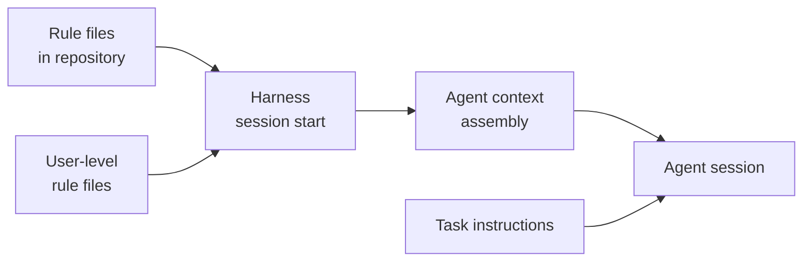

# [AEE-803] 引導規則與代理指示

## 背景

每次代理工作階段都面臨相同的問題：代理對你的專案慣例、團隊標準，以及已經犯過的錯誤一無所知。系統提示（system prompt）可以解決單一工作階段的問題——在代理開始工作前對其進行設定。但系統提示不會持久化。下一個工作階段從零開始。

引導規則（steering rules）從根本上解決這個問題。它們存在於版本控制的檔案中，與其所管理的程式碼並排存放，並在工作階段啟動時載入代理的脈絡（context）。開發者不需要記得手動引入它們；工作階段結束後它們也不會消失；它們隨著專案一起移動。

這個區別在實務上至關重要：系統提示是開發者撰寫的；引導規則檔案是專案維護的。

## 設計思維

引導規則是持久約束（persistent constraints）。不同於每次回合重新建構的系統提示，引導規則存在於儲存庫或設定中的檔案裡。它們將代理應該「永遠做」、「永不做」，以及「如何處理某類任務」的規範予以明文化——獨立於任何特定的任務指示之外。

這使得引導規則在結構上不同於系統提示與任務指示：

- **任務指示** — 針對單次任務。現在要做什麼。
- **系統提示** — 針對單次工作階段的設定。代理如何為這次工作階段初始化。
- **引導規則** — 持久性。代理在這個專案中、跨越每個工作階段的行為方式。

**引導規則的內容：** 普遍適用的慣例。不是「建立一個登入表單」——那是任務。不是「要徹底且仔細」——那太模糊，無法執行。引導規則回答的問題是：代理需要知道什麼，才能在不需要每次告知的情況下，持續表現出符合團隊標準的行為？

**三個真實世界的實作**展示了這個概念在不同平台上的落地方式：

*AWS AI-DLC（AI 驅動開發生命週期，AI-Driven Development Lifecycle）* 將引導規則以 markdown 檔案的形式放置在平台專屬目錄中。核心工作流程錨定在 `core-workflow.md`，而階段專屬的規則則放在子目錄中（`inception/`、`construction/`、`operations/`）。每個參與工作流程的工具——Kiro、Amazon Q Developer、Cursor、Claude Code——都在工作階段啟動時載入對應目錄。無論使用哪個工具，適用的都是相同的規則。

*Cursor 規則* 使用位於 `.cursor/rules/` 目錄中的 `.mdc` 檔案（帶有 YAML 前言的 markdown）。四種規則類型控制規則的套用時機：Always（每次提示）、Auto Attached（當符合 glob 模式的檔案被引用時）、Agent Requested（AI 根據使用者意圖決定是否引入；由 description 欄位驅動這個決策）、Manual（僅在明確附加時套用）。嵌套規則（子目錄中的規則）會在引用該目錄中的檔案時自動附加，實現細粒度的範疇控制：`.cursor/rules/src/api/` 中的規則只在處理 `src/api/` 時才適用。

*Claude Code CLAUDE.md* 檔案在工作階段啟動時以使用者訊息的形式載入。它們是脈絡——Claude 閱讀並遵循，但遵從程度取決於指示的具體性與簡潔性。範疇模型（scope model）決定哪些檔案適用：受管理原則（org-wide，不可排除）→ 使用者（所有專案的個人偏好）→ 專案（透過版本控制共享）→ 本機（gitignored，當前專案的個人偏好）。所有發現的檔案皆被串接（concatenate）；沒有任何檔案能完全覆蓋另一個。子目錄 CLAUDE.md 檔案採用懶加載（lazy loading），在存取該目錄中的檔案時才載入。

**DESIGN.md 作為導引文件：** 放置在儲存庫根目錄（或元件目錄）的設計文件（DESIGN.md），指定設計系統的限制——元件名稱、間距 token、無障礙需求、命名規則。它不是功能規格，而是所有功能規格都必須遵守的不變層（immutable layer）。實作 UI 的代理將 DESIGN.md 作為工作階段脈絡載入，在每個工作階段中都受其約束。目前沒有針對此模式的獨立正式規範，但其功能清晰：持久性的設計系統狀態，代理無法在每次工作階段中憑空發明。

**範疇與優先順序（precedence）：** 當多個規則檔案適用時，大多數實作採用串接（concatenate）所有符合規則的方式，而非覆蓋。Cursor 將所有符合的規則一起載入；Claude Code 串接所有發現的 CLAUDE.md 檔案。受管理或組織層級的規則依慣例具有最高優先順序，且不可排除。這意味著來自兩個規則檔案的衝突指示都對代理可見，因此避免跨範疇的矛盾至關重要。

**撰寫原則：** 規則必須具體到讓代理無需判斷即可套用。測試方法是二元的：代理能在不對指令含義做任何判斷的情況下套用這條規則嗎？

- 「使用良好的命名」— 不是規則。代理必須自行決定何謂「良好」。
- 「變數使用 camelCase，型別使用 PascalCase」— 是規則。
- 「對日誌記錄要有所考量」— 不是規則。
- 「永不在生產環境檔案中加入 `console.log` 陳述式」— 是規則。

模糊的指引屬於文件或系統提示，由人類判斷來詮釋。引導規則是給不需要詮釋的指示使用的。

**版本控制：** 規則檔案必須與其所管理的程式碼一起進行版本控制。一條不再反映程式庫現狀的規則，不是中性的——它會積極地誤導代理。當慣例改變時，規則檔案也應隨之改變。

**RFC 2119:**

- 引導規則檔案 MUST 與其所管理的程式碼一起進行版本控制。
- 規則 MUST 具體到讓代理無需判斷即可套用——模糊的指引 SHOULD 移入系統提示，而非留在規則檔案中。
- 規則檔案 SHOULD 保持簡短（每個檔案不超過 200 行）；過長的規則檔案會降低代理的遵從程度。

## 深度解析

### 1. 平台比較

| 平台 | 檔案格式 | 範疇模型 | 優先順序 | 值得注意的特性 |
|---|---|---|---|---|
| Kiro | Markdown（`.kiro/steering/`） | 每個工作階段載入所有檔案 | 串接 | 預設專案檔案：`product.md`、`structure.md`、`tech.md` |
| Amazon Q Developer | YAML 規則（`.amazonq/rules/`） | AI-DLC 階段專屬子目錄 | 串接 | 按階段組織規則 |
| Cursor | 帶有 YAML 前言的 MDC（`.cursor/rules/`） | Always / Auto-Attached / Agent Requested / Manual | 串接 | 基於 glob 的檔案模式自動附加 |
| Cline / Claude Code | Markdown（`CLAUDE.md`、`.clinerules/`） | 組織 → 使用者 → 專案 → 本機 → 子目錄 | 串接（所有檔案） | 子目錄檔案的懶加載 |

AWS AI-DLC 規則設計為平台無關：相同的 markdown 規則跨 Kiro、Amazon Q Developer、Cursor 與 Claude Code 載入，各工具間僅有路徑差異。`core-workflow.md` 作為所有平台皆載入的錨點；隨著工作在 AI-DLC 各階段間推進，階段專屬的子目錄會依序啟動。

Cursor 的四種規則類型（Always、Auto Attached、Agent Requested、Manual）由多個獨立來源記載，但官方文件頁面已重新導向，無法直接驗證。基於 glob 的自動附加模型是其獨特功能：針對 TypeScript 介面的規則在引用 `.ts` 檔案時自動附加，無需任何明確的啟動操作。

Amazon Q Developer 的 YAML 規則格式（`.amazonq/rules/`）係根據 AI-DLC GitHub 儲存庫結構推斷而得；此格式尚未從 Amazon Q Developer 官方文件中得到獨立佐證。

Claude Code 範疇層次是最細粒度的。每個範疇服務不同的目的：受管理原則涵蓋適用於組織所有使用者的合規要求；使用者層級涵蓋跨所有專案的個人偏好；專案層級涵蓋團隊共享的慣例；本機層級涵蓋不應提交的個人覆蓋設定。

### 2. 撰寫良好的規則

規則與指引的區別：

| 是規則嗎？ | 範例 |
|---|---|
| 規則 | `永不在生產環境檔案中加入 console.log 陳述式` |
| 指引 | `對日誌記錄要有所考量` |
| 規則 | `提交前務必執行 pnpm test` |
| 指引 | `確保測試通過` |
| 規則 | `CSS 類別名稱使用 kebab-case` |
| 指引 | `遵循一致的命名` |
| 規則 | `import 必須分組：先外部依賴，再內部模組，之間用空行分隔` |
| 指引 | `清晰地組織 import` |

測試方法：代理能在不對指令含義做任何判斷的情況下套用這條規則嗎？如果答案需要代理詮釋「良好」、「有所考量」、「一致」或「清晰」在此脈絡下的含義，那它就不是規則。

規則是祈使句，描述特定情境下的具體動作或限制。撰寫規則候選時，問自己：如果我把這條指令給一個沒有任何其他脈絡的代理，它每次都會產生相同的行為嗎？如果不會，就重寫直到可以為止。

邊界層級的規則值得特別關注：「永不」限制是最常缺失、也最關鍵的規則。不知道某事是硬性停止（hard stop）的代理，會把它當成一個選項。「永不直接提交到 main」、「永不刪除指定範疇之外的檔案」、「永不在未獲批准的情況下新增依賴項」——這些指示能防止影響最大的錯誤，卻也是開發者最常忘記寫的規則，因為它們看起來理所當然。

### 3. DESIGN.md 作為導引文件

放置在儲存庫根目錄的設計文件（DESIGN.md）是與其他引導規則一起載入的設計系統規範。它有別於功能規格或架構文件：它不描述要建構什麼，而是描述所有建構的東西必須遵守的約束。

DESIGN.md 的內容範本：

- **元件命名慣例** — 此程式庫使用的正式名稱（例如：`Button` 而非 `Btn`；`NavigationBar` 而非 `NavBar`）
- **顏色與間距 token 參照** — 設計系統的值，而非隨意的像素或十六進位值（例如：`$spacing-md` 而非 `16px`）
- **無障礙需求** — 團隊承諾的 WCAG 等級；使用中的 aria 標準；互動元素的必要屬性
- **排版規則** — 字型大小比例、行高規則、響應式行為
- **新增元件的模式** — 目錄結構、必要檔案（story、test、types）、命名慣例
- **應避免的反模式** — 已知的錯誤方式及其原因

這不是功能規格；它是所有功能規格都必須遵守的不變層。實作新 UI 元件的代理載入 DESIGN.md 並套用其約束，無需明確告知。其價值隨時間累積：DESIGN.md 中記載的每一項慣例，都是代理無法錯誤發明的慣例。

### 4. 範疇與載入機制

**Claude Code 範疇層次** — 每個檔案依序載入並串接：

| 範疇 | 位置 | 共享對象 |
|---|---|---|
| 受管理原則 | 系統層級路徑（macOS：`/Library/Application Support/ClaudeCode/CLAUDE.md`） | 所有組織使用者；不可排除 |
| 使用者 | `~/.claude/CLAUDE.md` | 僅限自己，跨所有專案 |
| 專案 | `./CLAUDE.md` 或 `./.claude/CLAUDE.md` | 透過版本控制共享給團隊 |
| 本機 | `./CLAUDE.local.md`（gitignored） | 僅限自己，當前專案 |

import 語法（`@path/to/file`）允許 CLAUDE.md 檔案引用其他檔案——最多五層深度。透過 `.claude/rules/*.md` 中帶有 `paths` YAML 前言欄位的路徑範疇規則，可以讓規則僅套用於特定的檔案模式（例如：`paths: ["src/**/*.ts"]`）。

**Cursor 串接：** 所有觸發條件符合的規則一起載入。沒有明確的優先順序讓某條規則覆蓋另一條。互相矛盾的規則會同時對模型呈現兩條指示。

**AI-DLC 錨點方式：** `core-workflow.md` 建立跨所有階段適用的基線。階段專屬的子目錄（`inception/`、`construction/`、`operations/`）以僅在該階段工作時適用的規則加以延伸。這創造了一個分層系統，無需任何檔案明確列出所有規則。

### 5. 規則維護

規則檔案就像程式碼一樣會累積技術債。三種維護觸發時機表明需要進行規則審查：

**(a) 代理重複犯下相同的錯誤** — 如果代理在多個工作階段中重複了規則本應防止的錯誤，表示規則缺失，或不夠具體，無法防止該詮釋。新增或強化規則。

**(b) 程式庫經歷重大架構變更** — 引用舊架構路徑、模式或慣例的規則，會積極誤導代理。架構變更時，規則審查應作為同一批工作的一部分。

**(c) 團隊新進成員** — 當有新成員加入時，與他們一起審查規則檔案。如果一個人需要詢問的慣例本應記錄在規則檔案中，那它就應該在規則檔案中。如果規則檔案中的某條慣例不再反映團隊的工作方式，就更新它。

規則腐化（rule rot）是真實存在的失敗模式：一條不再適用的規則不會靜靜地躺在那裡——它透過宣稱錯誤的約束來混淆代理。定期的規則審查（至少：在新人入職時、重大重構後，以及某類代理錯誤重複出現時）是維護規則檔案準確性的必要工作。

## 最佳實踐

1. **按範疇組織規則：專案慣例放在專案層級檔案，個人偏好放在使用者層級檔案，切勿混入同一個檔案。** 整個團隊應遵循的慣例屬於提交至版本控制的專案層級規則檔案。僅適用於你個人工作流程的偏好（編輯器設定、個人快捷鍵、團隊尚未採用的風格偏好）屬於使用者層級或本機規則檔案。混合存放會導致規則檔案在不附帶個人偏好的情況下無法共享，或在不覆蓋團隊慣例的情況下無法個人化。

2. **以祈使句撰寫規則，而非原則。**「CSS 類別名稱使用 kebab-case」是規則。「遵循一致的命名」不是。原則需要代理所沒有的判斷力。當你發現自己在寫原則時，問自己它要求什麼具體行為，然後改寫那個行為。

3. **在新成員入職時審查規則檔案。** 如果一個人需要詢問的慣例本應記錄在規則檔案中，那它就應該在規則檔案中。如果新成員詢問「應該用單引號還是雙引號？」而答案是「我們永遠用單引號」，那就是一條遺漏的規則。把入職當作系統性審查：每一個關於本應記錄在案的慣例的問題，都是一個缺口。

## 圖解

規則檔案在任務指示到達之前就已載入。當代理讀取任務時，持久性的行為約束已在脈絡中就位。任務指示不需要重複它們；規則檔案自動地將它們帶入每個工作階段。

**Claude Code 範疇層次：**

| 範疇 | 位置 | 共享對象 |
|---|---|---|
| 受管理原則 | 系統層級路徑（macOS：`/Library/Application Support/ClaudeCode/CLAUDE.md`） | 所有組織使用者；不可排除 |
| 使用者 | `~/.claude/CLAUDE.md` | 僅限自己，跨所有專案 |
| 專案 | `./CLAUDE.md` 或 `./.claude/CLAUDE.md` | 透過版本控制共享給團隊 |
| 本機 | `./CLAUDE.local.md`（gitignored） | 僅限自己，當前專案 |

所有範疇皆串接。較具體的位置在串接脈絡中出現較晚；對於衝突的指示，較晚出現的指示可能具有優先順序。

## 相關 AEE

- [AEE-800](800) -- Agentic Development Workflows — 類別概覽
- [AEE-801](801) -- AI 驅動開發生命週期 — 引導規則是 AI-DLC 工作流程在各工具間強制執行的實作機制
- [AEE-802](802) -- 規格驅動開發 — DESIGN.md 同時是導引文件與規格模式；規格邊界的「永不」層級對應導引規則中的硬性停止
- [AEE-805](805) -- 工作流程編碼化 — 規則檔案是主要的編碼化產物；引導規則將工作流程編碼化所操作化的慣例予以明文化
- [AEE-204](../System%20Prompt%20Engineering/204) -- 系統提示工程 — 系統提示對單次工作階段設定代理；引導規則跨工作階段持久存在；這個區別決定什麼應放在哪裡

## 參考資料

- [awslabs/aidlc-workflows](https://github.com/awslabs/aidlc-workflows) — AWS AI-DLC 引導規則儲存庫；平台專屬目錄與核心工作流程檔案
- [Claude Code 記憶文件](https://code.claude.com/docs/en/memory) — CLAUDE.md 範疇層次、載入行為、路徑範疇規則與 import 語法
- [Kiro 規格文件](https://kiro.dev/docs/specs/) — Kiro 的引導目錄與預設專案脈絡檔案

## 更新記錄

- 2026-04-17 — 初稿
