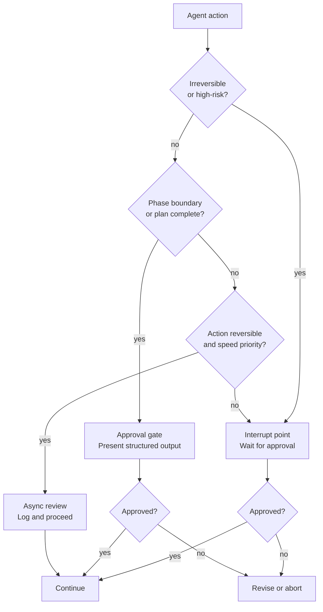

# [AEE-804] 人工監督模式

## 背景脈絡

對於監督（oversight）的樸素理解是「讓代理（agent）在行動前先詢問」。問題在於，這會產生兩個世界中最糟的結果：你承受了人工審查帶來的所有延遲與中斷，但代理依然在沒有工程師理解其應在何時、為何停止的情況下運行。在隨機時間點中斷的代理並不受監督——它只是變慢了。

真正的張力來自兩種失敗模式之間。過多的監督扼殺了代理工作流程的生產力效益：如果每一步都需要人工批准，代理不過是個緩慢的自動完成工具。過少的監督則意味著錯誤會靜默地累積，直到代價高昂時才被發現。一個在重構過程中沒有任何檢查點就持續推進的代理，可能交付五百行系統性錯誤套用了錯誤模式的輸出——而撤銷這些錯誤的代價，遠高於當初做審查的代價。

設計問題不是「需要多少監督」，而是：工作流程中的哪個環節，人工介入迴圈（human-in-the-loop）能提供代理無法提供的價值，以及如何有效率地路由至該環節？監督模式（oversight pattern）將此作為工程決策來回答，而非哲學立場。每種模式都有其成本、觸發條件，以及使其成為正確選擇的前提。

## 設計思考

三種監督模式對應工作流程中的不同位置與不同的風險特性。

**中斷點（interrupt point）** 是代理停止並等待人類輸入後才繼續執行的明確暫停點。代理已到達一個無法自行推進的動作——因為該動作不可逆、超出範疇閾值，或代理自身的信心低於定義水準。中斷是同步的：工作流程暫停，直到人類回應為止。

**批准閘門（approval gate）** 是代理在執行下一階段之前，將計劃或已完成的階段輸出呈現給人類審查的結構化檢查點。與中斷點的區別至關重要：代理已完成了工作——完成了研究、生成了計劃、撰寫了草稿——並將其呈現以供簽核。閘門位於階段之間，而非動作內部。代理不是在尋求指引；它是在呈現工作成果以供評估。

**非同步審查（async review）** 是代理繼續執行並記錄其動作、人類在事後審查日誌的模式。沒有同步暫停。代理完成其工作，監督在執行後發生。這是摩擦力最低的模式，但要求錯誤可復原，且日誌格式須足夠結構化，讓審查者能有效率地評估。

三種模式並不互斥。單一工作流程可以對不可逆動作使用中斷點，在主要階段邊界使用批准閘門，並對每個階段內部的迭代工作使用非同步審查。

**RFC 2119:**

- 不可逆動作（檔案刪除、schema 遷移、具有副作用的外部 API 呼叫）MUST 在執行前設置中斷點，而非執行後。
- 批准閘門的輸出 MUST 為結構化格式（而非自然語言摘要），讓審查者無需重新閱讀代理的完整脈絡即可作出決策。
- 非同步審查日誌 MUST 同時記錄所採取的動作與推理過程，而不僅僅是動作本身。

## 深度解析

### 1. 中斷點設計

中斷點在代理到達一個無法評估為安全可逆的動作時被觸發。三類觸發條件決定何時應中斷：

**動作類型觸發：** 檔案刪除、資料庫寫入、外部服務呼叫、憑證存取，任何會修改本地工作區以外狀態的動作。無論代理的信心如何，這些動作都觸發中斷。

**範疇觸發：** 動作影響超過 N 個檔案、記錄或實體，其中 N 是團隊定義的閾值。重構 3 個檔案與重構 300 個檔案是不同的情況。閾值是政策決定，而非技術決定，應在工作流程設定中明確定義。

**信心觸發：** 代理自身表達的不確定性超過閾值。當代理出現猶豫（「我認為 X 是正確的，但不確定該用 Y 還是 Z」），這個猶豫本身就是資料。將其作為中斷觸發，可以將不確定的決策路由給人類，而非讓代理猜測。

中斷點必須包含的內容：
- 代理想要採取的具體動作——具體的，而非其思考過程的摘要。
- 人類批准與拒絕後各自的後果——包括依賴此決策的任何後續步驟。
- 人類做決定所需的最少脈絡——而非代理完整的脈絡傾倒。

反模式是一個呈現代理完整推理過程並詢問「我應該繼續嗎？」的中斷點。這不是有用的中斷。人類無法有效率地處理代理的完整脈絡。一個需要審查者閱讀五百字才能批准的中斷，最終會在未讀完的情況下被批准。中斷輸出是決策封包（decision packet），而非脈絡交接。

### 2. 批准閘門設計

批准閘門位於多階段工作流程的各階段之間。當代理完成一個離散的工作階段並準備開始下一個時，閘門被觸發：

- 完成研究 → 在撰寫前呈現發現
- 完成計劃 → 在執行前呈現計劃
- 完成草稿 → 在發布前呈現草稿

結構化輸出的要求是使閘門發揮功能的關鍵。代理發現內容的五百字散文摘要是一份文件。列出關鍵發現並明確提供「繼續 / 修改 / 拒絕」選項的條列式清單，才是閘門輸出。區別在於人類能否在不從頭重建代理推理的情況下快速評估。

閘門輸出還必須記錄人類的決定，以及在決定為「修改」或「拒絕」時的原因。沒有原因，代理在下一次迭代中無法調整——它只能重複。只回傳是/否的閘門，在拒絕時不提供任何信號，形成一個無效的迴圈。

閘門輸出的格式：

```json
{
  "phase_completed": "research",
  "summary": ["finding 1", "finding 2", "finding 3"],
  "proposed_next_phase": "drafting",
  "proposed_approach": "...",
  "decision": null,
  "revision_notes": null
}
```

代理填寫此結構。人類填入 `decision` 和 `revision_notes`。工作流程執行器（harness）讀取決定並據此路由。

### 3. 非同步審查設計

非同步審查在三個條件成立時適用：動作可逆、速度比即時監督更重要，以及團隊已定義「良好輸出」的樣貌，並能有效率地評估日誌。

日誌格式是關鍵依賴。沒有結構化日誌的非同步審查不是監督——而是寄望有人在一大片文字中發現問題。每個動作條目必須包含：

- **時間戳記** — 動作發生的時間
- **動作** — 機器可讀的動作描述（而非散文）
- **輸入** — 觸發該動作的內容
- **推理** — 代理為何選擇此動作而非其他替代方案
- **輸出** — 動作產生或改變了什麼

推理欄位是讓日誌在校準（calibration）而非僅僅審計（auditing）方面發揮作用的關鍵。沒有推理的動作日誌告訴你代理做了什麼。有推理的動作日誌告訴你代理的決策過程是否健全——這是改進提示、引導規則或工作流程設計所需的輸入。

非同步審查只有在有人閱讀日誌時才能形成回饋迴圈（feedback loop）。採用非同步審查但沒有定義審查節奏的團隊（誰審查、多頻繁、關注什麼）——不是在做非同步審查，而是在記錄日誌並寄望好結果。

### 4. 信心閾值（confidence threshold）作為監督觸發條件

當代理表達不確定性時，工程師面臨選擇：忽略這個猶豫，或將其視為監督觸發條件。忽略它讓代理猜測。將其視為觸發條件，則將不確定的決策路由至合適的模式。

實際實作需要三個組件：

**結構化信心回報。** 代理以一致的機器可讀格式，將信心作為輸出的一部分回報：

```json
{
  "action": "...",
  "confidence": 0.72,
  "uncertainty_reason": "two equally valid approaches; unable to determine which matches team convention"
}
```

**執行器路由。** 工作流程執行器讀取信心欄位，並根據定義的閾值路由。信心高於 0.9：繼續執行。信心 0.7–0.9：非同步審查。信心低於 0.7：中斷點。

**定義閾值。** 閾值因團隊和領域而異。在錯誤代價低的領域（草稿文案、探索性分析），較低的閾值是合適的。在錯誤代價高的領域（基礎設施設定、資料庫 schema），閾值應更高，且預設應傾向中斷。

信心閾值（confidence threshold）不能取代動作類型觸發。一個對資料庫 schema 遷移信心達 0.95 的代理仍應暫停——決定因素是錯誤的代價，而非錯誤的概率。

### 5. 選擇正確的模式

| 情境 | 建議模式 | 原因 |
|---|---|---|
| 不可逆動作（檔案刪除、資料庫寫入） | 中斷點 | 無法撤銷；人類必須在執行前批准，而非執行後 |
| 具有主要階段邊界的多階段工作流程 | 批准閘門 | 在進入下一階段前驗證方向 |
| 迭代式內容生成（草稿、摘要） | 非同步審查 | 可逆；速度重要；結構化日誌已足夠 |
| 代理信心低於閾值 | 中斷點 | 代理自身發出需要指引的信號 |
| 高量、低風險、重複性任務 | 無閘門（僅監控） | 開銷超過風險；審查整體模式，而非個別動作 |

「無閘門」那一列不是監督失敗——而是一個經過校準的決策。並非每個動作都需要閘門。對一批動作監控整體模式（錯誤率、輸出分佈、異常值）提供了監督，而無需對每個動作增加摩擦。

## 最佳實踐

1. **根據動作類型設計中斷點，而不僅僅依靠代理的信心。** 信心閾值是有用的觸發條件，但不可逆動作無論代理多有信心都需要中斷點。一個對資料庫 schema 遷移信心達 95% 的代理仍應暫停。決定因素是錯誤的代價，而非錯誤的概率。信心與可逆性是兩個正交的軸向，應分開處理。

2. **將閘門輸出結構化為決策封包，而非摘要。** 閘門輸出是一個資料結構：做了什麼、下一步是什麼、人類正在批准什麼。如果審查者需要理解代理的完整脈絡才能作出決定，閘門輸出的結構化程度就不夠。將輸出壓縮至決策所需的最少資訊——然後再壓縮一次。

3. **在動作日誌中同時記錄推理，而不只是動作。** 沒有推理的動作日誌對事後審計有用。有推理的動作日誌對校準代理有用——你能判斷代理的決策過程是否健全，而不只是輸出是否正確。校準比審計更有價值；在設計日誌格式時，以校準為目標。

## 圖解



## 相關 AEE

- [AEE-800](800) -- Agentic Development Workflows — 類別概覽
- [AEE-801](801) -- AI 驅動開發生命週期 — 監督模式對應 AI-DLC 建構階段的閘門
- [AEE-802](802) -- 規格驅動開發 — 批准閘門的輸入是規格產物
- [AEE-803](803) -- 引導規則與代理指示 — 引導規則可編碼何時觸發中斷點
- [AEE-805](805) -- 工作流程編碼化 — 有效的監督模式是編碼化的候選對象
- [AEE-606](../Multi-Agent%20Systems/606) -- 多代理失敗模式 — 監督模式是級聯失敗的緩解手段

## 參考資料

- [Building Effective Agents - Anthropic](https://www.anthropic.com/research/building-effective-agents)
- [Tool use and agentic behaviors - Claude Code](https://docs.anthropic.com/en/docs/agents-and-tools/tool-use-and-agentic-behaviors)

## 更新紀錄

- 2026-04-17 — 初稿
