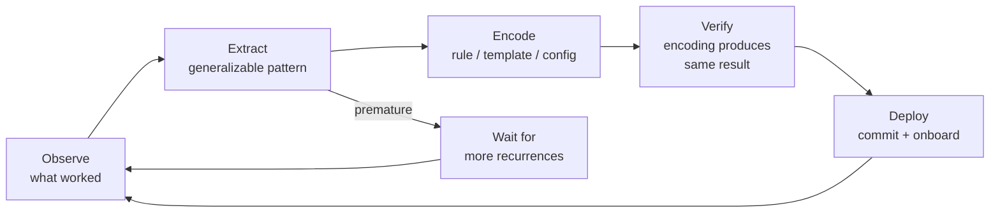

# [AEE-805] 工作流程編碼化

## 背景脈絡

團隊第一次從代理（agent）獲得良好輸出，通常是因為有人精心設計了提示、進行了恰當的對話，或手動組裝了正確的上下文。這些知識存在於工程師的腦中，而非系統中。下次出現相同任務時，就必須有人重複手動的準備工作——否則團隊會得到不一致的結果。

工作流程編碼化（workflow codification）是將這種隱性知識移入系統的實踐。這不是為了自動化而自動化，而是為了確保有效的做法能可靠地重複——讓產生良好輸出的條件，不再依賴特定工程師在場才能重現。

編碼化迴圈：觀察有效的做法 → 提取可泛化的模式 → 編碼為規則、模板或執行器（harness）設定 → 驗證編碼產生相同結果 → 部署。這個迴圈是持續進行的。為某個模型版本或任務所編碼的內容，可能在模型更新或任務範疇擴展時需要修訂。編碼化不是一次性的設定，而是一種維護承諾。

## 設計思考

三種機制承載了編碼化工作的主要重量：

**引導規則（steering rules）** — 編碼於規則檔案中的行為約束（CLAUDE.md、`.cursor/rules/`、`.kiro/steering/`），在工作階段之間持續有效。它們編碼了代理無論執行何種任務都必須和不得做的事。詳見 AEE-803；此處引用是因為它們是最常被編碼化的產物。

**規格模板（spec templates）** — 可重用的規格結構，編碼了代理在一類任務中需要多少格式與細節才能產生一致的輸出。不是每個任務都需要從頭撰寫自訂規格。模板是對以下問題的編碼化回答：這類任務究竟需要哪些東西，代理才能成功？

**執行器設定（harness configuration）** — 執行環境的不變量：代理能使用哪些工具、永遠注入哪些上下文、如何處理錯誤、輸出格式為何。執行器設定的編碼化，讓預設的執行時狀態變得顯式——而非讓每次執行累積未記錄的偏差。

編碼化的反模式：過早編碼化。如果模式尚未穩定——團隊還在探索「良好輸出」的樣貌——將其編碼會鎖定不完整或錯誤的理解。一個模式準備好被編碼化的信號：團隊已執行過至少三次，獲得了一致的結果，並且能夠描述是什麼讓它有效。「三次」是一個啟發式原則，而非硬性規定。根本的判斷標準是：模式是否穩定到足以可靠描述。

**RFC 2119:**

- 模式 MUST 在經過反覆執行驗證後才能編碼化；在單次成功後就編碼化，會鎖定未經驗證的假設。
- 編碼化的模式 SHOULD 與其所治理的程式碼一同進行版本控制；與其所編寫的程式碼庫產生偏差的規則或模板，會主動誤導代理。
- 當編碼化的模式在模型更新後持續產生錯誤輸出，MUST 在重新部署前進行審計與修訂；繼續套用已損壞的模式並非中立行為。

## 深度解析

### 1. 哪些內容值得編碼化

不是每個有效的做法都值得編碼化。這個決策是成本效益的計算：成本是提取、編碼、測試和維護模式的工作量；效益是未來執行中變異性的降低。

以下情況值得編碼化：

- 任務以相同結構或可預測的變形重複出現
- 每次執行的準備成本很高——長篇提示、手動組裝上下文、必須重複的工具設定
- 準備工作的差異導致輸出品質的差異
- 團隊對該模式積累了足夠的經驗，能夠描述其有效的原因

以下信號表明編碼化尚為時過早：

- 任務只執行過一次或兩次
- 每次執行時正確的提示或上下文差異顯著
- 任務屬於探索性質——範疇仍在定義中
- 模型或工具變化太快，任何編碼都需要立即修訂

過早編碼化的代價不為零。一個編碼了對任務錯誤理解的模式會製造虛假的信心：團隊以為模式能處理這個案例，但編碼化的模式是錯誤的。糾正一個已編碼化的錯誤理解，比從未將其編碼化代價更高。

### 2. 引導規則的編碼化

引導規則的編碼化生命週期遵循清晰的順序：

1. 代理犯了同樣的錯誤兩次，或在某個規範上產生了不一致的輸出
2. 工程師撰寫一條規則來阻止或約束該模式
3. 規則經過測試：重現觸發錯誤的情境；驗證規則能阻止它
4. 規則與其所治理的程式碼一同提交
5. 規則被納入新成員導入（onboarding）：新代理和新團隊成員都能接觸到它

要避免的錯誤：在單次事件後撰寫規則。在一次發生後寫下的規則，傾向於過度擬合到具體案例而非通用模式。兩次或更多次重複，才是該規則解決的是真實的、可重現的失敗模式——而非一次性異常——的信號。

規則也會老化。為特定模型版本撰寫的規則，可能在模型更新後不再適用。引用已棄用 API 或過時規範的規則，會製造噪音並降低整體引導規則的信號品質。適用於其他編碼化產物的審計節奏——在模型升級、重大重構和新成員導入時——同樣適用於引導規則。

### 3. 規格模板的編碼化

規格模板編碼了代理在一類任務中產生一致輸出所需的結構與細節程度。它不是填空表格，而是一個支架，確保代理能收到：

- 正確的上下文——代理需要哪些背景資訊才能正確詮釋任務
- 正確的約束——代理不能做什麼；無論具體任務實例如何，都適用的硬性停止點
- 預期的輸出合約（output contract）——格式、欄位、成功條件
- 一到兩個可接受輸出的範例

模板組件：

- **上下文區塊** — 代理需要了解的任務環境資訊
- **約束區塊** — 代理不得做的事；硬性停止點
- **輸出合約區塊** — 格式、欄位、成功條件
- **範例區塊** — 一到兩個可接受輸出的範例（可選，但對輸出格式不直觀的複雜任務有極高價值）

當團隊使用相同結構三次或以上——這是模式已穩定的啟發式信號——並發現填寫後能產生一致的代理輸出，該模板便成為一個編碼化的模式。此後，模板是預設值；從頭撰寫的自訂規格是例外，需要理由。

### 4. 執行器設定的編碼化

執行器是執行時環境：工具存取、上下文注入、錯誤處理、輸出格式。執行器設定的編碼化意味著讓預設的執行器狀態顯式——明確說明在此工作流程中代理執行任務時，什麼是永遠成立的。

需要編碼化的關鍵執行器不變量：

- **工具允許清單** — 代理可以呼叫哪些工具，哪些明確不可用。隱式的工具集合（代理恰好能存取的任何工具）不是執行器合約；它是等待造成不一致的意外。
- **上下文注入順序** — 哪些上下文先注入（設計約束、引導規則、規格），哪些按任務注入。順序很重要：後注入的上下文可能覆蓋或稀釋先注入的上下文。
- **輸出格式** — 結構化 JSON、markdown 還是散文；欄位名稱；必填欄位。輸出格式即輸出合約，必須明確。
- **錯誤預算** — 在升級至人工介入前重試幾次；什麼構成值得重試的失敗，什麼構成中止條件。

執行器設定的偏移（drift）是一種失敗模式。當工程師在未記錄原因的情況下按任務修改執行器設定，執行器狀態變成隱式的，工作流程變得脆弱。編碼化的執行器設定是合約；按任務的偏差是有記錄的例外，而非未記錄的個案。

### 5. 編碼化迴圈

編碼化迴圈是一個持續的改進週期，而非一次性的設定。每個任務週期結束後：

1. **觀察** — 什麼有效、什麼需要手動介入、什麼產生了意外的輸出
2. **提取** — 可泛化的模式是什麼？這是第三次需要這種設定了嗎？
3. **編碼** — 撰寫規則、模板或執行器設定變更
4. **驗證** — 在已知良好的案例上執行編碼化的模式；確認它產生等效的輸出
5. **部署** — 與程式碼一同提交，如同對待程式碼變更一樣進行審查，更新新成員導入材料

迴圈不在「部署」時結束。模型更新、範疇變化和團隊規範的轉變都可能使任何編碼化的模式失效。定期審計是維護機制。至少應在以下時機觸發審計：模型升級、重大重構和新工程師新成員導入。等到代理產生錯誤輸出才審計編碼化的模式是被動反應；在失敗被偵測到之前，該模式已錯誤地部署運行了不確定的次數。

迴圈也有分支：當提取步驟揭示模式尚未穩定——每次執行的設定仍有顯著差異——正確的行動是等待——觀察更多、積累更多資料——而非倉促編碼。

## 最佳實踐

1. **在第三次出現時編碼化，而非第一次。** 模式第一次和第二次出現時，團隊仍在探索是什麼讓它有效。在第一次成功後就編碼化，有鎖定錯誤理解的風險。到第三次出現時，模式已足夠穩定，能夠可靠地描述。這個啟發式原則不是關於計數，而是關於穩定性。如果模式仍在變化，就還沒準備好。

2. **將編碼化的模式視為程式碼：版本控制、測試並審查它們。** 未進行版本控制的引導規則或規格模板，會與其所治理的程式碼庫產生偏差。對編碼化模式的變更應該經歷與程式碼變更相同的審查流程——因為它們定義了該工作流程中每一次未來代理執行的行為合約。未經審查地變更引導規則，就是靜默地改變該工作流程中所有後續代理的行為。

3. **在環境改變時安排審計，而非在出問題時才審計。** 模型更新、重大重構和團隊組成的變化，是編碼化模式可能變得過時的可預測時機。等到代理產生錯誤輸出才審計模式是被動反應；應將編碼化審計納入模型升級和重大重構的核對清單中。

## 圖解

## 相關 AEE

- [AEE-800](800) -- Agentic Development Workflows — 類別概覽
- [AEE-803](803) -- 引導規則與代理指示 — 引導規則是行為約束的主要編碼化產物
- [AEE-804](804) -- 人工監督模式 — 穩定有效的監督模式是編碼化的候選對象
- [AEE-806](806) -- 代理品質閘門 — 品質閘門驗證編碼化的模式是否仍能產生正確輸出
- [AEE-3](../../Foundations%20and%20Mental%20Models/3) -- 代理工程等級 — Level 4 描述了編碼化迴圈：規劃 → 委派 → 評估 → 編碼化

## 參考資料

- [Building Effective Agents - Anthropic](https://www.anthropic.com/research/building-effective-agents)
- [Agentic Engineering Levels - Bassim Eledath](https://www.bassimeledath.com/blog/levels-of-agentic-engineering)

## 更新紀錄

- 2026-04-17 — 初稿
