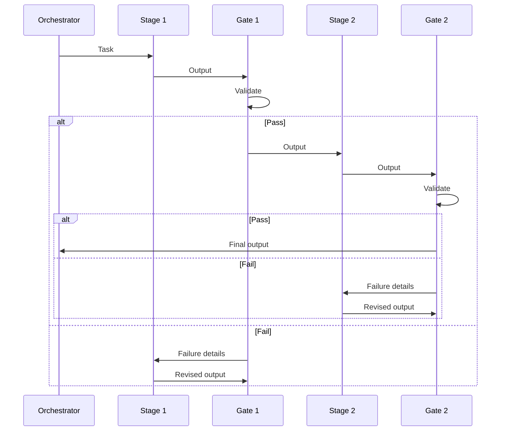

# [AEE-806] 代理品質閘門

## 背景脈絡

代理式工作流程（agentic workflow）的品質問題，不在於代理（agent）有時會產生錯誤的輸出。問題在於：錯誤的輸出往往語法正確、外觀合理——一個產生錯誤 JSON 的代理，仍然產生了可解析的 JSON；一個幻覺出方法呼叫的代理，產生的程式碼仍然能夠編譯。錯誤通過了顯而易見的檢查，只在更下游的地方失敗，或根本不被發現。

品質閘門（quality gates）是應對這個問題的工程手段：在執行管線（pipeline）的定義點上設置的檢查點，在工作流程繼續之前，依據明確的標準驗證代理的輸出。它們有別於人工批准閘門（approval gate，參見 AEE-804）——品質閘門是程式化的，自動執行，且測試具體的、可驗證的屬性。

沒有品質閘門的代價，不只是輸出不良——而是難以診斷的不良輸出。當下游代理產生意外結果時，問題在於：是哪個上游階段產生了不良的輸入？品質閘門創造了固定點，確認在該點上的輸出已依據明確的合約驗證完畢；這限縮了故障的搜索空間。

## 設計思考

三種閘門類型承載了代理管線中的驗證工作：

**綱要驗證閘門（schema validation gates）** — 驗證代理的輸出是否符合已宣告的結構定義（JSON schema、TypeScript 型別、OpenAPI 規格）。測試結構正確性，而非語意正確性。

**語意驗證閘門（semantic validation gates）** — 驗證代理的輸出是否滿足內容層面的要求（所有必要章節均存在、無佔位文字、字數在範圍內、情緒非負面）。無法完全自動化，但可透過結構化檢查部分自動化。

**執行閘門（execution gates）** — 執行輸出並驗證結果。適用於代理輸出為程式碼、命令或查詢的情況：編譯它、執行它、檢查退出碼或輸出。

閘門放置原則：閘門屬於管線各階段之間，而非階段內部。一個階段的輸出，在傳遞至下一個階段之前，要嘛有效，要嘛無效。閘門的失敗模式是：拒絕並將驗證失敗返回給產生該輸出的階段，而非跳過閘門繼續進行。

**RFC 2119:**

- 品質閘門 MUST 是程式化的，並產生結構化的結果（通過 / 失敗 + 原因），而非自然語言評估。
- 每個管線階段 MUST 擁有輸出合約（output contract）；品質閘門驗證此合約。
- 輸出未通過品質閘門的階段 MUST NOT 將輸出傳遞至下一個階段；失敗 MUST 連同驗證詳情返回給產生該輸出的階段。

## 深度解析

### 1. 綱要驗證

最基本可行的品質閘門。任何產生結構化輸出（JSON、YAML、結構化 markdown）的代理，都應該在其輸出上設置綱要驗證閘門。綱要驗證測試：

- 必要欄位是否存在
- 欄位型別是否符合宣告的結構定義
- 列舉值是否來自允許的集合
- 是否沒有多餘的欄位（若結構定義是嚴格的）

綱要驗證不測試語意正確性——它測試的是結構正確性。一個產生有效 JSON、所有必要欄位均在，但欄位值錯誤的代理，能通過結構閘門。這是特性，不是缺陷：結構閘門快速、確定性高，且可以廉價地在每次輸出上執行。

工具選項：JSON Schema（ajv、jsonschema）、TypeScript 搭配 Zod、Pydantic（Python）、OpenAPI 規格驗證。

常見的漏洞：代理產生的輸出沒有明確的結構定義。如果代理的輸出結構是「模型返回什麼就是什麼」，就沒有閘門可寫。閘門的存在，強制要求定義輸出合約。

### 2. 語意驗證

語意驗證測試綱要驗證無法觸及的內容屬性。例如：

- 所有必要章節均存在（一份綱要驗證通過，但缺少「摘要」章節的文件）
- 沒有殘留的佔位文字（`TODO`、`[PLACEHOLDER]`、`...`）
- 字數在範圍內（一份什麼都沒有摘要的摘要，相較於一份比原文更長的摘要）
- 程式碼範例符合宣告的語言
- 內部引用可解析（一份引用了第三節，卻沒有第三節的文件）

語意閘門可以透過 LLM 輔助——一個評估代理針對輸出執行，並產生結構化的通過/失敗判斷。LLM 輔助閘門引入了預言機問題（oracle problem，誰來評判評判者？），可透過以下方式緩解：

- 將評估標準限縮至二元的、可驗證的問題（不是「這好嗎？」，而是「輸出中是否包含標題為『摘要』的章節？」）
- 多次執行評估代理，要求共識（在 3 次執行中全部通過，再繼續進行）
- 使用與生產不同的模型進行評估（以避免相關的失敗模式）
- 將 LLM 輔助閘門與結構閘門分開，使失敗可歸因

### 3. 執行閘門

當代理的輸出是可執行的——程式碼、shell 命令、SQL、設定——最強的閘門是執行它並檢查結果。執行閘門：

- 編譯程式碼並檢查錯誤（編譯閘門）
- 針對測試套件執行程式碼，並要求通過率閾值（測試閘門）
- 在沙盒中執行並檢查退出碼或輸出（沙盒執行閘門）

執行閘門是可用的最高信號品質檢查，但有以下需求：

- 安全的執行環境（沙盒，而非正式環境）——即執行器（harness）所提供的隔離執行容器
- 「通過」的明確預言機（退出碼 0、測試覆蓋率 ≥ N%、特定輸出存在）
- 重試預算（代理在任務升級之前，可以修改並重新提交幾次）

執行閘門的輸出應包含完整的失敗日誌，而非僅僅是「失敗」——代理需要失敗詳情才能有效修改。

### 4. 閘門鏈與失敗路由

在多階段管線中，閘門形成鏈式結構：每個階段的輸出閘門必須通過，下一個階段才能開始。失敗時，閘門封鎖管線：輸出不會推進至下一個階段，失敗詳情會返回給產生該輸出的階段。失敗路由至關重要：

- **結構閘門失敗**：連同結構違規詳情返回給產生該輸出的階段。給定結構差異，代理能夠修正結構錯誤。
- **語意閘門失敗**：連同評估者的具體失敗標準返回給產生該輸出的階段。「找不到『摘要』章節」是可操作的；「輸出不完整」則不是。
- **執行閘門失敗**：連同完整的失敗日誌返回給產生該輸出的階段。堆疊追蹤、編譯器錯誤和測試輸出，是代理的診斷輸入。

重試預算是必要的：沒有重試預算，失敗的輸出可以無限期地在閘門迴圈中循環。為每種閘門類型定義重試預算上限；耗盡後，升級至人工批准閘門（AEE-804）。

### 5. LLM 輔助閘門的預言機問題

當閘門本身使用 LLM（用於語意驗證）時，存在一條判斷鏈：生產 LLM → 評估 LLM → 閘門決策。評估者可能以生產者無法出現的方式失敗：它可能在多次執行中與自己意見不一致（非確定性），它可能通過措辭自信的不良輸出，或可能不一致地套用評估標準。

緩解措施：

- 盡可能將評估標準限縮至二元的、可驗證的問題
- 多次執行評估代理（執行 3 次，高風險閘門要求 3/3 通過）
- 使用與生產不同的模型進行評估（以避免相關的失敗模式）
- 將評估者的推理過程連同其判斷一起記錄，以便審計

## 最佳實踐

1. **在撰寫閘門之前定義輸出合約。** 如果你無法用一句話說明代理輸出必須滿足什麼，就無法撰寫閘門。輸出合約是規格；閘門是測試。先撰寫閘門，產生的是針對未定義行為的測試。

2. **對結構屬性優先使用結構閘門，對行為屬性優先使用執行閘門。** LLM 輔助的語意閘門代價高昂且非確定性。只在無法以其他方式驗證的屬性上使用它們。結構性檢查（綱要驗證、正規表達式、AST 分析）快速且確定——優先選用。

3. **返回失敗詳情，而非失敗旗標。** 一個返回 `false` 的閘門，給代理什麼都沒有。一個返回具體結構違規、缺少的章節名稱或編譯器錯誤的閘門，給代理一個明確的修改目標。失敗訊息是代理下一次嘗試的輸入。

## 圖解

## 相關 AEE

- [AEE-800](800) -- 代理式開發工作流程 — 類別概覽
- [AEE-802](802) -- 規格驅動開發 — 輸出合約在規格中定義；品質閘門測試合約
- [AEE-804](804) -- 人工監督模式 — 品質閘門是程式化的；人工閘門用於品質閘門無法涵蓋的情況
- [AEE-805](805) -- 工作流程編碼化（codification）— 成功的閘門配置是編碼化的候選對象
- [AEE-605](../../Multi-Agent%20and%20Orchestration/605) -- 協調模式 — 協調模式中涵蓋了帶有驗證閘門的管線模式
- [AEE-606](../../Multi-Agent%20and%20Orchestration/606) -- 多代理失敗模式 — 品質閘門是緩解不良輸出靜默傳播的手段

## 參考資料

- [Building Effective Agents - Anthropic](https://www.anthropic.com/research/building-effective-agents)
- [Tool use and agentic behaviors - Claude Docs](https://docs.anthropic.com/en/docs/agents-and-tools/tool-use-and-agentic-behaviors)

## 更新紀錄

- 2026-04-17 — 初稿
