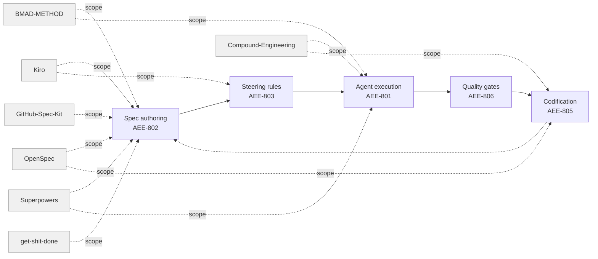

# [AEE-807] 規格驅動開發框架實務

## 背景脈絡

AEE-802 定義了代理可執行規格（agent-executable specs）的原則——包含成功標準、明確範疇以及已釐清的歧義的行為契約。讀完之後，實踐者自然會有後續問題：現有工具中有哪些體現了這些原則，彼此之間又有何差異？本文透過梳理當前規格驅動代理框架的全貌來回答這個問題。

規格驅動代理工具的市場正快速分裂。在 2024 年至 2026 年間，一波框架從不同起點湧現——IDE 廠商、媒體公司、新創加速器、開源貢獻者——各自將帶有主見的工作流程編碼化為斜線指令、YAML 人格檔案，或版本控制的 Markdown。結果是大量選擇相互重疊，而且生命週期假設彼此不相容。

本文調查具有可觀察規格與生命週期結構的框架。納入標準為：一個框架必須產出一個具名、版本化的規格工件（spec artifact）以驅動代理執行，而非僅僅是一組風格偏好或任務提示。調查範圍內的框架包括：OpenSpec、BMAD-METHOD、Kiro、GitHub Spec Kit、Superpowers、Compound Engineering 和 get-shit-done。範圍外的有：僅設定代理行為而不產出規格工件的規則型框架（Cursor rules、CLAUDE.md 慣例、AGENTS.md 模式）；無工具支援的教學與方法論指南；以及在專屬 AEE 文章中已涵蓋的框架。

本文的目標不是推薦——團隊情境決定適合性。目標是提供一張地圖：這些框架在哪裡達成共識，在哪裡分歧，以及實踐者在採用之前應該問哪些問題？

## 設計思考

四個維度能比任何功能清單更有效地預測框架的適用性。

**規格細粒度（spec granularity）** — 一份規格描述什麼樣的工作單元？框架從能力層級的需求差異提案（OpenSpec）、跨越 PRD 到 Story 的完整專案瀑布（BMAD-METHOD），到每個功能三個檔案的工件（Kiro、GitHub Spec Kit）各有不同。細粒度決定了框架在開發週期中的附著點：史詩（epic）層級、故事（story）層級，還是任務層級。

**生命週期整合（lifecycle integration）** — 框架是一次管理一個功能，還是擁有完整的開發生命週期？一次性框架（Superpowers、GitHub Spec Kit）為單一功能產出規格與計畫，然後退場。持續性框架（OpenSpec、BMAD-METHOD、get-shit-done）在多個功能間持續存在，累積變更歷史、專案狀態或機構學習，為後續週期提供資訊。一個採用一次性框架的團隊，若專案需要持續的變更管理，將發現自己必須手動維護狀態。

**人工閘門位置（human gate placement）** — 框架在哪裡要求人工審查才能繼續？所有受調查的框架在「定義要建構什麼」與「開始建構」之間，至少設置一個明確的閘門。框架的差異在於閘門的數量及其強制程度：硬編碼的 WAIT 指令（Superpowers）、無法跳過的明確 CLI 指令（OpenSpec validate），或需要紀律而非強制執行的慣例型檢查點（Compound Engineering）。閘門位置決定了人工介入之間累積的風險量。

**再生模型（regeneration model）** — 當需求改變時，會發生什麼？調查中出現兩種哲學。規格作為真實來源（spec-as-source-of-truth）框架（OpenSpec、Kiro、GitHub Spec Kit、get-shit-done）將規格工件視為持久的真實，並將變更串聯向下傳遞：更新規格、重新產生計畫、重新產生任務。規格作為輸入（spec-as-input）框架（BMAD-METHOD、Superpowers）將規格視為一次性生成週期的輸入；改變需求意味著從更早的階段重新進入工作流程。再生模型決定了中途變更需求所觸發的返工量。

**RFC 2119:**

- 實踐者 SHOULD 沿著這四個維度評估框架，而非依功能清單。
- 框架 SHOULD NOT 在規格層混用——它們的生命週期假設相互衝突。

## 深度解析

### Tier 1 框架

---

#### OpenSpec

OpenSpec 是一個規格驅動開發 CLI 與工作流程系統，旨在讓需求與程式碼一起進行版本控制。其核心洞見是：只存在於聊天記錄中的需求不算是需求——它們是已遺失的脈絡。OpenSpec 的解決方式是在任何實作開始之前，將每個提案變更作為結構化工件提交到儲存庫中。

**是什麼。** 一個以提案、設計、任務和規格差異文件組織代理式開發的結構化變更管理工作流程，所有文件皆提交至儲存庫。每個變更單元都是可追溯的提案，具有明確的生命週期。

**格式。** 變更存放於 `openspec/changes/<change-id>/`，包含 `proposal.md`（原因、內容、影響）、可選的 `design.md`（技術決策）、`tasks.md`（核取方塊格式的實作清單），以及 `specs/<capability>/spec.md` 差異提案（delta proposals）檔案。差異提案檔案使用章節標題標記新增、修改、刪除和重命名（`## ADDED Requirements`、`## MODIFIED Requirements` 等）。每個需求必須包含至少一個 `#### Scenario:` 區塊，使用 WHEN/THEN 結構。已整合的能力狀態存放於 `openspec/specs/<capability>/spec.md`——這是所建構內容的權威記錄。

**生命週期。** 三個順序性階段：建立變更（搭建 proposal、spec 差異提案、tasks；執行 `openspec validate --strict`）、實作變更（閱讀 proposal → design → tasks；依序實作；標記任務完成）、歸檔變更（部署後，將 `changes/<id>/` 移至 `changes/archive/YYYY-MM-DD-<id>/`；將差異提案合併回 `specs/`）。Change ID 使用 kebab-case、動詞開頭（`add-`、`update-`、`remove-`、`refactor-`）。

**人工閘門。** 在實作前有一個明確的核准閘門：「在 proposal 審查並獲批准之前，不要開始實作。」這是一個慣例強制的硬性停止，由必須在分享前通過的 `openspec validate --strict` 作為後盾。實作過程中的任務層級審查，以及部署後的歸檔審查，構成完整的閘門組。

**再生模型。** 規格作為真實來源（spec-as-source-of-truth）。`specs/` 是「當前真實——已建構的內容」。每個已核准的變更是一個執行週期；重新執行需要一個新的變更 proposal。歸檔將差異提案合併回整合規格，使其在累積的變更歷史中保持權威性。

**AEE 對應。** 位於 AEE-802（代理可執行規格）與 AEE-805（工作流程編碼化）的交集。`openspec/` 目錄作為編碼化（codification）層：每個架構決策、需求差異提案和實作任務都是持久工件，其壽命超過產生它的工作階段。

**何時選用。** 需要可稽核、可審查的變更 proposal 並與程式碼一起提交的團隊。特別適合能力邊界已存在的棕地（brownfield）專案，以及需要在聊天記錄之外共享脈絡的多工程師入職團隊。

---

#### BMAD-METHOD

BMAD-METHOD（「突破性敏捷 AI 驅動開發方法」）是一個代理式敏捷（agentic agile）框架，將具名的 AI 人格對映到敏捷角色，引導專案從初始想法到部署。其口號是「代理式敏捷（agentic agile）」：由專門的 AI 代理執行敏捷儀式與工件，人類擔任引導規則（steering rules）角色。

**是什麼。**「突破式敏捷 AI 驅動開發方法」——一個多代理方法論，將敏捷角色（分析師、PM、架構師、開發者、QA）對應至具名的 AI 代理人格（agent persona）。每個人格驅動一個階段，形成 PRD → 架構 → 史詩 → 故事的串接。

**格式。** 代理人格（agent persona）在 `.agent.yaml` 檔案中定義（BMAD v6），編譯為 `.md` 供 IDE 使用。專案工件存放於 `_bmad-output/`：`planning-artifacts/PRD.md`、`planning-artifacts/architecture.md`、`planning-artifacts/epics/`（史詩與故事檔案）、`implementation-artifacts/sprint-status.yaml`，以及 `project-context.md`。具名代理：Mary（業務分析師）、Preston（產品經理）、Winston（架構師）、Sally（產品負責人）、Simon（Scrum Master）、Devon（開發者）、Quinn（QA 工程師）。框架附帶 34 種以上的工作流程範本，以及允許在單一工作階段中使用多個人格的「Party Mode」。

**生命週期。** 依序的敏捷階段，各由具名代理負責：腦力激盪 / 想法捕捉（Mary/Preston）、PRD 建立（Preston）、架構（Winston）、故事精煉（Sally）、衝刺規劃（Simon）、開發（Devon）、QA / 測試（Quinn）。Scale-Domain-Adaptive Intelligence 根據專案規模自動調整規劃深度。

**人工閘門。** 階段轉換需要人工引導。在 PRD 核准、架構核准和故事驗收時有明確的決策點。`bmad-help` 技能可在任何時候查詢下一步的指引。人類定義範疇方向；代理在範疇內執行。

**再生模型。** 規格作為輸入（spec-as-input）帶有串聯。PRD 驅動架構生成；架構驅動故事建立；故事驅動實作。若 PRD 改變，下游工件必須透過代理鏈重新生成。每個重新生成步驟都需要人工與代理的協作——串聯並非完全自動化。

**AEE 對應。** 完整專案生命週期覆蓋，透過品質閘門對映到 AEE-801（AI-DLC 建構階段）。人格結構與 AEE-603（透過代理人格進行任務分解）一致：每個具名代理是一個具有有限職責的專門子代理。

**何時選用。** 想要具有熟悉敏捷工件的角色結構化代理工作流程的團隊。最適合需要從想法到部署端對端結構的綠地（greenfield）專案，以及已熟悉 Scrum 或 Kanban 儀式的組織——具名代理模型可以清晰地對映到現有角色。

---

#### Kiro AI-DLC Spec Mode

Kiro 的 spec mode 是內建於 Kiro AI IDE 中的每功能規劃層。它在任何程式碼編寫之前，將高層次的功能想法轉換為三個依序產出的工件。這不同於更廣泛的 AWS AI-DLC 方法論：spec mode 是 Kiro 工具中功能範疇的規劃工作流程，而非 AEE-801 所涵蓋的完整生命週期編排。

**是什麼。** 內建於 Kiro IDE 的規格撰寫與執行模式，實作 AWS 的 AI 驅動開發生命週期。每個功能在 `.kiro/specs/<feature>/` 下獲得一個三文件規格產物，驅動代理的實作。

**格式。** 所有工件存放於 `.kiro/specs/<feature-name>/`：`requirements.md`（以「As a...」格式的使用者故事，帶有 GIVEN/WHEN/THEN 驗收標準）、`design.md`（技術架構、序列圖、實作策略、錯誤處理、測試方法），以及 `tasks.md`（具有即時進度追蹤的離散可追蹤實作任務）。針對錯誤修復軌道，存在以 `bugfix.md` 取代 `requirements.md` 的變體。

**生命週期。** 三個閘控的順序性階段：需求 / 分析（產出 `requirements.md` 或 `bugfix.md`）、設計（產出 `design.md`）、任務（產出帶有即時狀態顯示的 `tasks.md`）。每個階段在下一個開始前完成。框架支援兩個進入點：需求優先（定義使用者故事，然後設計以滿足需求）和設計優先（從架構開始，從中推導需求）。支援迭代：可以修改需求或設計，下游階段將相應地重新生成。

**人工閘門。** 需求與設計之間的階段邊界（人類在設計開始前審查需求）、設計與任務之間的階段邊界（人類在任務生成前審查設計），以及由人控制的任務執行模式（逐一或全部一次）。

**再生模型。** 推斷為規格作為輸入（spec-as-input）：代理從 `tasks.md` 實作；規格不在實作後從程式碼重新生成。研究注記表明這是從工作流程文件推斷而來——Kiro 的公開文件中並未明確說明。三檔案結構在上游檔案被編輯時支援下游重新生成，但自動重新生成行為尚未確認。

**AEE 對應。** 直接實作 AEE-802 規格原則：三工件結構對映到目標陳述（requirements）、架構（design.md）和任務分解（tasks.md）。Kiro IDE 中的引導規則（steering rules）在工作階段層級強制執行 AI-DLC 慣例（AEE-803）。

**何時選用。** 使用 Kiro IDE 或 AWS AI-DLC 方法論的團隊。IDE 原生整合——即時任務狀態顯示、直接上下文載入——使其成為 Kiro 使用者阻力最小的入門選擇。`bugfix.md` 變體使其對具有功能與錯誤修復混合工作流程的團隊特別有用。

---

#### GitHub Spec Kit

GitHub Spec Kit 是 GitHub 推出的開源工具套件，透過斜線指令引入規格驅動開發。它不依賴特定框架或技術堆疊，定位為在任何代理執行環境或 IDE 前端運作的規劃層。

**是什麼。** 一組用於 GitHub Copilot Workspace（及相容工具）的斜線指令，驅動每個功能的規格 → 計畫 → 任務結構化分解。與框架無關：無需重構儲存庫即可與其他 AI 工具協同使用。

**格式。** 位於 `.specify/memory/constitution.md` 的一次性章程文件確立專案的指導原則。每功能工件存放於 `specs/<feature>/`：`spec.md`（功能需求、使用者故事、驗收標準）、`plan.md`（技術實作方法），以及 `tasks.md`（有序、依賴追蹤的任務清單）。支援工件可包括資料模型、API 合約和研究文件。七個主要指令驅動工作流程：`/speckit.constitution`（專案原則）、`/speckit.specify`（需求）、`/speckit.clarify`（規劃前的釐清）、`/speckit.plan`（實作策略）、`/speckit.tasks`（依賴有序的任務）、`/speckit.implement`（任務執行），以及 `/speckit.analyze`（跨工件一致性）。可選工具包括 `/speckit.taskstoissues`（轉換為 GitHub Issues）和 `/speckit.checklist`（品質清單）。

**生命週期。** 五階段結構化進程：章程（一次性）、specify、clarify（建議在規劃前進行以減少下游返工）、plan、tasks、implement。`/speckit.refine` 指令在實作中途更新規格；計畫在修改後重新生成下游工件。

**人工閘門。** 規劃前的釐清階段、任務生成前的計畫驗證、實作前的明確技術堆疊確認，以及要求手動簽署驗收標準的審查清單。閘門基於慣例：指令不強制等待，但工作流程假設各階段之間有審查。

**再生模型。** 規格作為真實來源（spec-as-source-of-truth）帶有迭代精煉。`/speckit.refine` 可在任何時候更新規格；計畫和任務在變更後向下游重新生成。工件是活文件；在修改後的規格上重新執行指令會產生更新的輸出。

**AEE 對應。** 進入 AEE-802 原則的最輕量入口：不需要專案基礎設施、不依賴 IDE、除 `specs/` 之外沒有規定的目錄結構。章程文件對映到 AEE-803（引導規則）——跨所有功能規格持久存在的專案層級原則。

**何時選用。** 已使用 GitHub Copilot 且希望輕量採用路徑而無需重組儲存庫的團隊。GitHub Issues 整合（`/speckit.taskstoissues`）使其成為任務追蹤在 GitHub 中的團隊的自然選擇。代理無關的定位適用於未鎖定特定 IDE 的團隊。

---

### Tier 2 框架

---

#### Superpowers

Superpowers 是 Claude Code 內建的規格驅動開發技能樹，以外掛形式發布。它實作了腦力激盪 → 規格撰寫 → 計畫撰寫 → 執行的流程，每個階段都有硬性閘控核准。

**格式。** `docs/superpowers/specs/YYYY-MM-DD-<topic>-design.md`（來自腦力激盪的設計文件）和 `docs/superpowers/plans/YYYY-MM-DD-<feature-name>.md`（來自 writing-plans 的實作計畫）。計畫使用核取方塊語法進行任務追蹤，帶有必要的標頭區塊（目標、架構、技術堆疊）。任務各自範疇在 2-5 分鐘內，TDD 優先，每步驟都有精確的檔案路徑和完整程式碼。

**生命週期。** 四個依序的技能：`brainstorming`（協作設計對話；產出設計文件；在任何程式碼前的硬性閘門）、`writing-plans`（將核准的設計轉換為帶有 TDD 任務的實作計畫）、`executing-plans` 或 `subagent-driven-development`（逐任務執行並有檢查點）、`verification-before-completion`（在宣稱完成前確認工作符合規格）。

**人工閘門。** 三個明確的核准點。設計核准：`brainstorming` 技能硬編碼了一個 `<HARD-GATE>`——「在呈現設計並獲得使用者核准之前，不要呼叫任何實作技能。」規格審查：代理等待明確的使用者核准後才開始 writing-plans。計畫核准：人類選擇執行模式（子代理 vs. 行內），並審查每個任務檢查點。

**再生模型。** 規格作為輸入（spec-as-input）；每個核准規格一個實作週期。設計變更需要手動重新執行 `brainstorming` 或 `writing-plans`。

**何時選用。** 希望在每個階段都有人工在迴路的結構化規格到實作紀律的 Claude Code 使用者。腦力激盪、規劃和執行在單一工具中的緊密整合，使其成為已在 Superpowers 生態系中的獨立開發者或小型團隊的預設選擇。

---

#### Compound Engineering

Compound Engineering 是一個源自 Every, Inc.（「Chain of Thought」AI 電子報）的 42 種以上斜線指令外掛。其定義性論點是：每個工程工作單元都應該透過自動記錄課程並將其回饋到代理上下文，讓後續單元更容易。它是本調查中按採用軌跡衡量最廣泛採用的框架，支援 Claude Code、Cursor、OpenCode、Codex、Kiro、Windsurf、Gemini CLI 等。

**格式。** 計畫按慣例由 `/ce:plan` 輸出，並撰寫於 `.claude/plan-<task>.md` 下的 Markdown；沒有強制的結構描述。設定工件：`.claude/launch.json`（開發伺服器指令）、`CLAUDE.md`（專案標準）、`AGENTS.md`（代理文件）。類規格結構從 `/ce:plan` 輸出中浮現，而非來自規定的範本。

**生命週期。** 六階段循環：構思（`/ce:ideate`）、腦力激盪（`/ce:brainstorm`）、規劃（`/ce:plan`）、執行（`/ce:work`——100% 代理執行）、審查（`/ce:review` 帶有分層人格代理 + 可選的 `/ce:polish-beta` 人工潤飾）、複利（`/ce:compound`——記錄課程到機構知識庫，在下一個規劃週期由 `learnings-researcher` 查詢）。80/20 框架將主要人工投入放在規劃和審查。

**人工閘門。** 計畫核准（隱性——工程師在對計畫滿意時觸發 `/ce:work`；沒有硬編碼等待）、審查閘門（`/ce:review` → `/ce:polish-beta` 明確的人工在迴路潤飾階段）、複利閘門（工程師決定要浮現和保存哪些課程），以及需要人工簽署的部署清單。

**再生模型。** 學習累積器（learning accumulator）。每個週期沉積課程（`/ce:compound`），在後續規劃週期由 `learnings-researcher` 代理自動查詢。`/ce:compound-refresh` 評估過去的課程是否仍然有效。這不是工件版本化再生——而是機構知識複利。

**何時選用。** 優先考慮速度複利而非正式規格嚴謹性的團隊，以及以保留編排和審查為目標將 100% 程式碼撰寫委派給代理的團隊。多平台支援使其成為在同一程式碼庫上跨多個 AI 編程工具工作的團隊的選擇。

---

#### get-shit-done

get-shit-done（GSD）是一個元提示和上下文工程框架，旨在解決上下文腐爛（context rot）問題——即工作階段累積對話記錄時的品質下降。它將專案狀態外部化為版本化的 Markdown 檔案，並在每個任務的隔離、新鮮子代理上下文中分散工作。

**格式。** 專案狀態存放於 `.planning/`：`PROJECT.md`（願景）、`REQUIREMENTS.md`（帶有階段對映的範疇化功能）、`ROADMAP.md`（分階段交付）、`STATE.md`（跨工作階段的決策、阻礙、進度）、`research/`，以及包含 `{N}-CONTEXT.md`、`{N}-RESEARCH.md`、`{N}-{task}-PLAN.md`（XML 結構化的原子任務規格）和 `{N}-SUMMARY.md`（執行結果和 git 提交）的每階段目錄。每任務計畫使用 XML 結構作為機器可讀的原子規格。

**生命週期。** 七階段週期：`/gsd-new-project`（訪談 → 需求 → 路線圖）、`/gsd-discuss-phase`（人類塑造實作偏好）、`/gsd-plan-phase`（研究 + 原子任務規劃）、`/gsd-execute-phase`（並行波浪執行，每任務新鮮上下文）、`/gsd-verify-work`（手動使用者驗收測試）、`/gsd-ship`（PR 建立）、`/gsd-complete-milestone`（歸檔和標記）。透過 `HANDOFF.json` 實現工作階段暫停 / 恢復，實現跨工作階段連續性。

**人工閘門。** `/gsd-discuss-phase` 是任何規劃開始前的必要人工塑造步驟。`/gsd-verify-work` 需要手動驗收測試——人類在交付前確認成果物。階段轉換在重新規劃或重新執行前需要人類確認。

**再生模型。** 每階段模組化。「保留已完成的工作，僅重新生成已變更的部分。」階段可以插入、移除或調整，而無需重建整個專案。失敗恢復會派生除錯代理並建立修復計畫以重新執行。

**何時選用。** 跨長工作階段的上下文腐爛是主要痛點的團隊。棕地專案（明確支援 `/gsd-map-codebase`）。希望有階段閘控、新鮮上下文執行而不需要完整 BMAD 風格代理團隊的開發者。

---

### 榮譽提及（Honorable Mentions）

**gstack** 是 Garry Tan 圍繞具名專家角色（CEO 審查、工程師審查、設計審查、QA、發布、回顧）建立的 23 技能框架。它作為執行品質補充而非獨立的規格撰寫框架。其角色串聯和複利學習技術旨在疊加在另一個規格撰寫工作流程之上——gstack 可以強化團隊的審查和 QA 實踐，無論他們使用 OpenSpec 還是 Kiro 進行規格撰寫。將其定位為獨立的 SDD 框架將誤代其範疇。

**claude-task-master**（eyaltoledano/claude-task-master，15k+ 星）接受 PRD 或規格並產出 AI 驅動的任務分解，提供依序、防幻覺的任務服務。它以精準度覆蓋工作流程的任務分解階段——包括 TDD 自動駕駛模式和 90% 錯誤減少聲稱——但不涉及規格撰寫、生命週期管理或變更歷史。代理任務管理框架的專屬調查是此工具的適當歸宿；AEE-807 的重點是規格和生命週期層，而 claude-task-master 明確不擁有這一層。

## 比較表

| 框架 | 規格細粒度 | 生命週期整合 | 人工閘門位置 | 再生模型 |
|---|---|---|---|---|
| OpenSpec | 能力層級差異提案 | 持續變更管理 | 實作前（validate）、實作中（任務審查）、實作後（歸檔） | 規格作為真實來源；歸檔累積 |
| BMAD-METHOD | PRD → 架構 → 史詩 / 故事串聯 | 每史詩持續進行 | 每個人格移交時 | 規格作為輸入；代理鏈 |
| Kiro AI-DLC spec mode | 每功能多階段（需求 → 設計 → 任務） | 持續進行（實作後更新規格） | 階段轉換時 | 規格作為輸入（推斷） |
| GitHub Spec Kit | 每功能多階段（specify → plan → tasks） | 每功能一次性 | 斜線指令之間 | 規格作為輸入 |
| Superpowers | 每專案多階段（brainstorm → spec → plan） | 每核准規格一次性 | 設計核准、規格審查、計畫核准 | 規格作為輸入 |
| Compound Engineering | 每週期慣例型計畫 | 持續進行（累積課程） | 計畫核准、潤飾審查、複利策管 | 學習累積器 |
| get-shit-done | 每階段範疇 XML 計畫 | 每階段持續進行 | 每階段前後 | 每階段模組化 |

## 最佳實踐

1. **依團隊工作流程形態選擇，而非依人氣。** 具有強稽核軌跡的框架（OpenSpec）為需要在聊天記錄之外共享脈絡的多工程師入職團隊增加了值得的額外負擔，但對於聊天記錄已足夠的獨立專案而言則是過度設計。一次性框架（GitHub Spec Kit）提供了進入 AEE-802 原則的輕量入口，但當需求跨多個功能演進時，無法提供團隊需要的變更歷史。在匹配功能之前，先將框架的生命週期整合（lifecycle integration）模型與團隊的實際工作流程相匹配。

2. **不要在規格層混用兩個框架。** 它們的生命週期假設相互衝突。為 OpenSpec 差異提案模型撰寫的規格——帶有 `## ADDED Requirements` 標頭、WHEN/THEN 情境和變更歸檔——在 Kiro 的三檔案結構下無法正確運作。BMAD-METHOD PRD 串聯無法嫁接到 get-shit-done 的階段層級 XML 任務計畫上。選擇一個框架的慣例並將其編碼化（codification）為引導規則（steering rules）。在執行層混用框架（例如，OpenSpec 用於規格撰寫，gstack 用於審查品質）是可行的；在規格層混用則不行。

3. **將選定的框架編碼化（codification）為引導規則（steering rules）。** 一旦採用，將框架的目錄慣例、命名規則、必要章節和閘門程序，捕捉到專案層級的引導規則（steering rules）檔案中（參見 AEE-803），以便代理在跨工作階段時能一致地應用。新工作階段中的新代理不應需要從頭發現框架的慣例——引導規則（steering rules）應該使其明確。在編碼化（codification）迴路中記錄您對框架邊緣案例的學習（AEE-805）。

4. **為框架遷移做好規劃。** 框架會演進、被廢棄或被收購。本文調查的所有七個框架都在 2023 年之後才出現；兩年後的全貌將大不相同。將規格保持在具有可預測目錄結構的純 Markdown 中。避免使用框架特有的二進位格式、專有結構描述或工具特有的 frontmatter 欄位，這些在遷移時需要非瑣碎的轉換。可作為純 Markdown 閱讀的規格可以匯入任何後繼框架；需要原始 CLI 才能解析的規格則不行。

## 圖解

每個框架的範疇箭頭顯示它覆蓋了 AEE 800 系列工作流程的哪些部分。OpenSpec 和 Compound Engineering 都到達 Codification 節點——OpenSpec 透過其歸檔並合併機制，Compound Engineering 透過其學習累積器（learning accumulator）。BMAD-METHOD 和 Superpowers 都到達 Execution——它們不僅擁有規格撰寫，還擁有消費規格的代理執行階段。Kiro 延伸到 Steering，因為其 IDE 原生引導規則（steering rules）在工作階段層級強制執行 AI-DLC 慣例。

## 相關 AEE

- [AEE-801](801) — AI 驅動開發生命週期
- [AEE-802](802) — 規格驅動開發——本文將其原則落實於實踐的基礎
- [AEE-803](803) — 引導規則與代理指令
- [AEE-805](805) — 工作流程編碼化
- [AEE-806](806) — 代理品質閘門

## 參考資料

**OpenSpec**
- [OpenSpec — Fission-AI/OpenSpec](https://github.com/Fission-AI/OpenSpec)

**BMAD-METHOD**
- [BMAD-METHOD — bmad-code-org/BMAD-METHOD](https://github.com/bmad-code-org/BMAD-METHOD)

**Kiro AI-DLC Spec Mode**
- [Kiro Spec Documentation](https://kiro.dev/docs/specs/)
- [AWS AI-Driven Development Life Cycle](https://aws.amazon.com/blogs/devops/ai-driven-development-life-cycle/)

**GitHub Spec Kit**
- [GitHub Spec Kit — github/spec-kit](https://github.com/github/spec-kit)

**Compound Engineering**
- [Compound Engineering Plugin — EveryInc/compound-engineering-plugin](https://github.com/EveryInc/compound-engineering-plugin)
- [Compound Engineering Methodology — Every](https://every.to/chain-of-thought/compound-engineering-how-every-codes-with-agents)

**get-shit-done**
- [get-shit-done — gsd-build/get-shit-done](https://github.com/gsd-build/get-shit-done)

**gstack**
- [gstack — garrytan/gstack](https://github.com/garrytan/gstack)

**claude-task-master**
- [claude-task-master — eyaltoledano/claude-task-master](https://github.com/eyaltoledano/claude-task-master)

## 更新紀錄

- 2026-04-17 — 初稿
