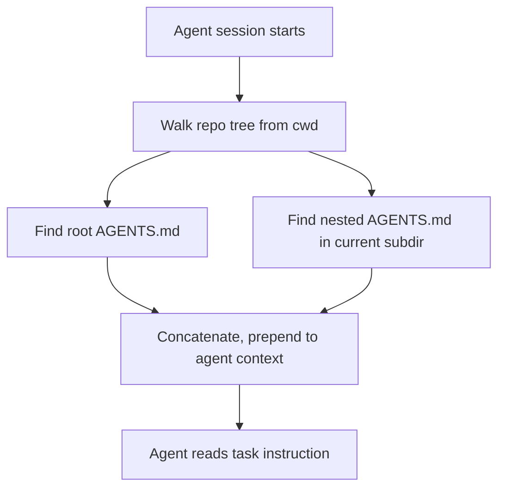

# [AEE-808] AGENTS.md 與撰寫最佳實踐

## 背景脈絡

每一種代理工具都引入了自己的指示檔案。Anthropic Claude Code 讀取 `CLAUDE.md`。Cursor 讀取 `.cursor/rules/*.mdc`。Windsurf 讀取 `.windsurfrules`。Gemini CLI 讀取 `GEMINI.md`。GitHub Copilot 另有其慣例。一個使用多種工具的團隊最後往往要在三到五個檔案中重述相同的慣例，而這些檔案隨時間逐漸失去一致性。每當出現新的爭議點——重新命名的目錄、變更的測試指令、新的「永不如此」規則——有人會更新他正在使用的工具對應的檔案，然後忘了其他檔案。

[AGENTS.md](https://agents.md/) 是被提議的匯聚慣例。儲存庫根目錄的一份 markdown 檔案，讓任何同意尋找它的代理工具都能讀取。此慣例由 Linux 基金會旗下的 Agentic AI Foundation 託管，並已被 OpenAI Codex、Google Jules、Cognition（Devin、Windsurf）、Factory、JetBrains Junie、Cursor、Zed、Aider、GitHub Copilot 等工具採納。根據其官方網站，目前已有超過 60,000 個開源儲存庫在根目錄提供 AGENTS.md。

AGENTS.md 不是正式的 RFC、不是強制綱要、也不由任何標準機構執行。它是一個匯聚慣例：工具們對檔名與位置達成共識，僅此而已。這份輕量的共識正是其力量所在——任何團隊都能在不必等待規範委員會的情況下採用，任何工具也都能透過新增一個檔案讀取器來支援它。

本文聚焦於 AGENTS.md 本身。關於引導規則的整體概念與跨工具規則系統的比較，請參見 [AEE-803](803)。

## 設計思考

AGENTS.md 座落於兩條軸線上。第一，它是一個 *探索慣例（discovery convention）* ——儲存庫與任何代理工具之間關於「在哪裡找得到操作指示」的契約。契約本身很小（檔名、位置、markdown 格式），但報酬很大：新工具不必要求世界上每個儲存庫新增另一個檔案就能整合進來。第二，它是一個 *撰寫契約（authoring contract）* ——儲存庫對自己的承諾，以代理可直接執行、不需人類詮釋的形式表達。同一份檔案同時承載這兩種承諾，這正是為什麼它的結構至關重要。

這份檔案必須同時服務兩種截然不同的讀者。人類審閱者需要簡潔以保持更新：一份 600 行沒人有時間重讀的 AGENTS.md 就是一份會無聲過時的檔案。在脈絡受限的工作階段中的代理，當慣例無法從程式碼本身推知時，會因明確規則而受惠。這兩種壓力造就了實踐者之間一場真實的設計辯論，經常被表述為「精簡 AGENTS.md」對上「完備 AGENTS.md」。兩種立場都有其道理，而在它們之間的選擇形塑了其他所有撰寫決策。本文將這場辯論視為一個需要在其中定位的光譜，而非一個需要裁決的二元選擇。

採用 AGENTS.md 帶來一組小而確定的硬性約束：

- AGENTS.md MUST 放置於儲存庫根目錄。子目錄的 AGENTS.md MAY 補充但不能取代根目錄檔案。
- 機器可驗證的指示（精確的建構／測試指令、必要的環境變數、硬性邊界）MUST 在檔案結構中與風格偏好分離——通常以不同章節呈現——讓略讀的代理不需解析散文就能擷取所需。
- 專案如果已經有 `CLAUDE.md`、`GEMINI.md` 或 `.cursorrules`，SHOULD 透過互通層（symlink 或 `@import`）遷移到 AGENTS.md，而非維護多個會逐漸失去一致性的平行檔案。
- 根目錄 AGENTS.md SHOULD 保持在 100 行以下。超出部分 SHOULD 存放於巢狀 AGENTS.md，在代理於該目錄工作時按需載入。
- 不再反映程式庫現狀的章節 MUST 被移除，而非放任其腐化。失效的規則不是中性的——它透過主張虛假的約束積極地誤導代理。

## 深度解析

### 1. AGENTS.md 慣例與採用

檔案採純 markdown，沒有強制綱要，也不要求前置資訊（frontmatter）。[agents.md 站點](https://agents.md/)將 AGENTS.md 描述為「一個簡單、開放的格式，用以引導程式碼代理」，並「補充 README 檔案」——README 服務人類，AGENTS.md 承載的是會讓 README 變得混亂、或者人類協作者根本不需要的操作細節。AGENTS.md 放置於儲存庫根目錄。在 monorepo 中，可於子目錄放置額外的 AGENTS.md；agents.md 慣例指出，當多份檔案適用時，「最接近的一份優先（the closest one takes precedence）」。

目前的採用者集合橫跨代理工具市場的每一層。具有直接公開文件提及 AGENTS.md 的工具包括 [OpenAI Codex](https://developers.openai.com/codex/guides/agents-md)——將 AGENTS.md 正式化為頭等輸入並附有自己的探索鏈；[Cursor](https://cursor.com/docs/rules)——支援 AGENTS.md 作為 `.cursor/rules/*.mdc` 的替代品，描述為「不含中繼資料或複雜設定的純 markdown 檔案」；以及 [Factory](https://docs.factory.ai/cli/configuration/agents-md)——其 CLI 從目前工作目錄向上走到儲存庫根目錄搜尋最近的檔案。出現在[官方採用者列表](https://agents.md/)上、但個別文件較不顯眼的工具包括 Google Jules、Cognition 的 Devin 與 Windsurf、JetBrains Junie、UiPath、Amp、[Zed](https://zed.dev/docs/ai/agent-panel)、RooCode、[Aider](https://aider.chat/docs/usage/conventions.html)（透過 `--conventions-file`）、Gemini CLI、GitHub Copilot、goose、opencode、Warp、Kilo Code、Phoenix、Semgrep、Ona 和 Augment Code。

本文撰寫之時，Anthropic Claude Code 並未原生讀取 AGENTS.md。整合透過下一小節的互通模式達成。

### 2. 與 CLAUDE.md 及工具特定檔案的互通

使用混合工具鏈的團隊需要 AGENTS.md 能夠在不重複內容的情況下餵給各工具特定的檔案。實務中常見兩種互通模式。

**模式 A — Symlink。** `CLAUDE.md -> AGENTS.md`（如需要，其他工具特定的檔名亦同）。零重複，永遠同步。缺點在於對檔案系統 symlink 的支援：Windows 檢出需要啟用開發者模式，部分工具可能不追隨 symlink。採用 macOS/Linux 並且沒有 Claude Code 特定補充內容的團隊，通常可以採用這種模式並不再煩惱。

**模式 B — `@import`。** [Claude Code 官方文件](https://code.claude.com/docs/en/memory)記載了 CLAUDE.md 內的 `@path/to/file` 匯入語法。一份只包含 `@AGENTS.md` 的極簡 `CLAUDE.md` 會將實質內容委派給正典檔案。Anthropic 明確推薦此模式：「如果你的儲存庫已使用 AGENTS.md 來服務其他程式碼代理，建立一份匯入它的 CLAUDE.md，讓兩種工具讀取同一份指示而不必重複。」相較於 symlink 的優勢是可攜性：它在 Windows 上也能運作，而且 Claude Code 特定的補充內容可以疊加於共用的 AGENTS.md 之上，不會影響其他工具如何讀取基礎檔案。取捨是 `@import` 語法為 Claude Code 特有；其他工具不會把 `@AGENTS.md` 當作匯入執行。

| 模式 | 適用於 | 需注意 |
|---|---|---|
| Symlink（`CLAUDE.md -> AGENTS.md`） | 內容 100% 共用；團隊在 macOS/Linux | 未啟用開發者模式的 Windows 檢出；不追隨 symlink 的工具 |
| `@import`（`CLAUDE.md` 內含 `@AGENTS.md`） | 需要在共用內容之上疊加 Claude Code 特定的補充 | 各工具對 `@import` 的支援不一；目前僅 Claude Code 支援此語法 |

AGENTS.md 並**未**取代：Claude Code 的使用者層級 `~/.claude/CLAUDE.md`（跨所有專案的個人偏好）與本地 `CLAUDE.local.md`（加入 gitignore、單一專案的個人偏好）與 AGENTS.md 正交，仍然保持原狀。AGENTS.md 僅取代專案層級的 CLAUDE.md。Claude Code 完整的範疇階層請見 [AEE-803](803)。

### 3. 精簡派與完備派的光譜

實踐者對於 AGENTS.md 該包含多少內容意見分歧。這場辯論是真實的，而且兩種立場都有其道理。最好把兩個端點理解為光譜而非二元——實際上，大多數經過團隊數月迭代後的 AGENTS.md 檔案都落在兩端之間。

**精簡派（Short pole）—— 極簡 AGENTS.md：**

- 典型規模：20–80 行。
- 包含：建構與測試指令、非顯而易見的本地設定步驟、3–5 條硬性「永不」約束（例如永不提交到 main、永不碰 `infra/prod/`）。
- 刻意省略：風格偏好（代理可以讀取既有程式碼）、廣為人知的慣例，以及任何可由工具（linter、formatter、型別檢查器）驗證的東西。
- 優化目標：脈絡成本、低過期風險、快速的人工審閱。
- 失敗情境：代理反覆違反無法從程式碼本身看出的慣例，或程式庫過大以致「讀取既有程式碼」無法在單一脈絡視窗內可靠地完成。

`agentsmd/agents.md` 儲存庫自身[提供了一份精簡 AGENTS.md](https://github.com/agentsmd/agents.md/blob/main/AGENTS.md)，約 65 行。內容涵蓋開發伺服器相對於生產建構的紀律、相依性同步、少量編碼慣例，以及指令彙整——此外別無其他。

**完備派（Comprehensive pole）—— 完整 AGENTS.md：**

- 典型規模：200–1000+ 行，常跨多份巢狀 AGENTS.md 分配。
- 包含：完整慣例、架構決策、部落知識、審閱禮儀、安全限制、領域術語。
- 優化目標：跨大量代理與貢獻者的一致性、累積機構記憶、減少反覆出現的錯誤。
- 失敗情境：檔案腐化的速度快於維護速度、脈絡預算被擠壓、訊號雜訊比下降導致代理略讀並錯過關鍵項目。

`openai/codex` 儲存庫[提供了一份完整 AGENTS.md](https://github.com/openai/codex/blob/main/AGENTS.md)，約 213 行，涵蓋 Rust crate 組織、TUI 慣例、樣式規則、測試模式、快照測試、整合測試、app-server 請求負載，以及開發工作流程本身。

**判斷依據：**

| 因素 | 傾向精簡 | 傾向完備 |
|---|---|---|
| 團隊規模 | 小型（1–3 人） | 大型（10+ 人） |
| 程式庫成熟度 | 新專案、慣例仍在流動 | 成熟、慣例已固化 |
| 代理反覆犯錯頻率 | 低 | 高 |
| 人工審閱代理產出的頻寬 | 高（緊密回饋迴圈） | 低（需要先發制人的規則） |
| 工具覆蓋（linter、formatter、型別檢查） | 高 | 低 |
| 脈絡預算壓力 | 高（長時代理、跨檔案任務） | 低 |

**混合模式（常見解答）：**

一份短小的根目錄 AGENTS.md（100 行以下）承載全專案的必要事項。子目錄的 AGENTS.md 在代理於該目錄工作時按需載入，並在深度真正重要的地方承載深度。這讓頂層享有精簡派的優勢——快速人工審閱、低脈絡成本、低過期風險——同時在有必要的地方享有完備派的優勢。混合模式也與 Claude Code 對子目錄 CLAUDE.md 的處理方式（延遲載入）一致；機制請見 [AEE-803](803)。OpenAI Codex、Cursor 和 Factory 都支援巢狀 AGENTS.md 與最近者優先的規則，因此此模式在跨工具鏈中可行。

本文不宣告哪一端才是「正確」的。團隊依據上表判斷。下方的最佳實踐章節則列出無論落在光譜哪一側皆適用的規則。

### 4. 章節結構

無論採取精簡或完備的哲學，大多數 AGENTS.md 檔案取材自同一組章節目錄。知道哪些章節值得占用版面，正是讓兩個端點保持紀律的方法——精簡派把目錄當作上限，完備派把目錄當作結構。

[GitHub 官方部落格對 2,500+ AGENTS.md 檔案的分析](https://github.blog/ai-and-ml/github-copilot/how-to-write-a-great-agents-md-lessons-from-over-2500-repositories/)辨識出六個在所研究的儲存庫間反覆出現的核心區塊：

- **建構與執行指令** ——要精確的指令，而非描述。`pnpm dev` 值得占位；「本專案使用建構系統」則不然。
- **測試指令** ——精確的測試呼叫、任何覆蓋率門檻，以及此儲存庫特有的測試撰寫慣例。
- **專案結構** ——只列出非顯而易見的部分。代理可以走目錄樹；此章節該解釋不直觀的佈局，而非重新描述 `src/` 與 `tests/`。
- **編碼慣例** ——只列出工具無法強制執行的部分。若 linter 能抓到，就省略。
- **安全與權限邊界** ——「永不」規則。例如「永不直接提交到 main」、「永不修改 `infra/prod/` 以下的檔案」、「永不在未獲批准的情況下新增相依項目」。這些規則防止影響最大的錯誤。
- **PR 與提交禮儀** ——提交訊息格式、PR 描述要求、審閱期望。

再加上一個值得點名的章節——**已知陷阱** ——記錄讓過往貢獻者（人類或代理）真正付出時間代價的陷阱。

「值得占位（earns its place）」的測試：省略這個章節會不會導致代理（或人類）反覆出錯？若不會，它就不屬於這份檔案。此測試無論哪一端皆適用。完備的 AGENTS.md 仍然受其約束；只是門檻較低，因為團隊已認為更多規則值得其成本。

## 最佳實踐

1. **把機器可驗證的指示與風格偏好分開。** 指令、環境變數、硬性邊界放一個章節；風格與慣例指引放另一個。略讀的代理不必解析散文就能抓到所需，人類審閱者也能在幾秒內核對機器可驗證的章節與現實是否一致。

2. **把指令寫成可直接貼上的 shell 一行，而非散文。** `pnpm test` 勝過「執行測試套件」。代理不需要詮釋；它直接執行。必要時加上旗標與特定選項——`pytest -v --maxfail=1` 勝過 `pytest`。

3. **偏好多份巢狀 AGENTS.md，而非一份巨大檔案。** 一份 100 行以下的根 AGENTS.md 加上子目錄檔案，對代理（脈絡預算）與人類（審閱疲勞）兩方都比一份 500 行的根檔案更好擴展。每個支援此慣例的工具都把最近的 AGENTS.md 當作優先，因此巢狀檔案是頭等機制，而非變通做法。

4. **從極簡開始，代理犯錯時再增加。** GitHub 部落格對 2,500 份 AGENTS.md 的分析推薦漸進成長：從名稱、目的、少量指令開始；每當代理重複犯錯時新增一條規則。如此產出的是一份以實際產值換取長度的檔案，而不是一份為預想每種可能問題而寫的檔案。

5. **讓檔案同時服務人類新進成員的 onboarding。** 一份讓新成員能在十分鐘內讀完並上手的 AGENTS.md，通常也是代理能正確套用的 AGENTS.md。若人類需要詢問某個應該寫在檔案內的慣例，那麼檔案就不完整——把 onboarding 對話當作系統性審核。

6. **每次重大架構變更時做一次審核。** 若規則檔案仍然引用已移除的路徑、已淘汰的工具或舊慣例，它會積極地誤導代理。當架構變更時，AGENTS.md 的變更是同一項工作的一部分，而非後續任務。定期審核（至少：onboarding、重大重構後、某類代理錯誤反覆出現時）是維持檔案忠實度的必要工作。

7. **從工具特定檔案遷移時使用互通層，而非複製。** 採用 symlink 或 `@import`——不要維護平行的 `CLAUDE.md`、`GEMINI.md` 與 `.cursorrules`。平行檔案會失去一致性；一份加上互通層的 AGENTS.md 不會。

## 視覺

探索流程與精簡／完備判斷的一眼覽。

當多份 AGENTS.md 同時適用時，最近的一份優先。巢狀檔案在代理於該目錄工作時按需載入，讓工作階段啟動時的根檔案保持便宜。

**判斷依據（取自深度解析，便於一眼覽）：**

| 因素 | 傾向精簡 | 傾向完備 |
|---|---|---|
| 團隊規模 | 小型（1–3 人） | 大型（10+ 人） |
| 程式庫成熟度 | 新專案、慣例仍在流動 | 成熟、慣例已固化 |
| 代理反覆犯錯頻率 | 低 | 高 |
| 人工審閱代理產出的頻寬 | 高（緊密回饋迴圈） | 低（需要先發制人的規則） |
| 工具覆蓋（linter、formatter、型別檢查） | 高 | 低 |
| 脈絡預算壓力 | 高（長時代理、跨檔案任務） | 低 |

## 相關 AEE

- [AEE-800](800) — 代理開發工作流程 — 類別總覽
- [AEE-803](803) — 引導規則與代理指示 — 引導規則的整體性處理與跨工具比較；本文是其更聚焦的姊妹篇
- [AEE-204](../Model%20and%20Context%20Layer/204) — 系統提示工程 — 區隔 AGENTS.md（持久化的倉庫狀態）與系統提示（單次工作階段組態）
- [AEE-703](../Harness%20Engineering/703) — 情境組裝 — 執行框架如何載入並將 AGENTS.md 前置於代理脈絡
- [AEE-805](805) — 工作流程法典化 — AGENTS.md 作為主要法典化產物

## 參考資料

**AGENTS.md 慣例**

- [AGENTS.md — agents.md 官方站點](https://agents.md/) ——此慣例的規範站點，由 Linux 基金會旗下的 Agentic AI Foundation 託管；列出採用者，並記載根目錄放置／巢狀／最近者優先的語意。

**直接採用者文件**

- [Custom instructions with AGENTS.md — OpenAI Codex](https://developers.openai.com/codex/guides/agents-md) —— Codex 的三層探索鏈（`~/.codex`、由 git 根目錄向下走、巢狀子目錄）與 `AGENTS.override.md` 慣例。
- [Rules — Cursor Docs](https://cursor.com/docs/rules) —— Cursor 對 AGENTS.md 的支援描述為「不含中繼資料或複雜設定的純 markdown 檔案」；支援根目錄與子目錄檔案，採最近者優先。
- [AGENTS.md — Factory Documentation](https://docs.factory.ai/cli/configuration/agents-md) —— Factory CLI 的階層式探索，並在 `~/.factory/AGENTS.md` 提供個人層級 override。

**與 Claude Code 的互通**

- [How Claude remembers your project — Claude Code memory docs](https://code.claude.com/docs/en/memory) —— CLAUDE.md 範疇階層、`@import` 語法，以及在 CLAUDE.md 中使用 `@AGENTS.md` 與其他代理互通的明確建議。

**撰寫指引**

- [How to write a great agents.md: Lessons from over 2,500 repositories — GitHub Blog](https://github.blog/ai-and-ml/github-copilot/how-to-write-a-great-agents-md-lessons-from-over-2500-repositories/) ——從數千份 AGENTS.md 中萃取的模式：漸進成長、六大常見章節、精確性勝過模糊、反模式。

**參考範例**

- [Short AGENTS.md — agentsmd/agents.md](https://github.com/agentsmd/agents.md/blob/main/AGENTS.md) ——約 65 行，精簡派的代表。
- [Comprehensive AGENTS.md — openai/codex](https://github.com/openai/codex/blob/main/AGENTS.md) ——約 213 行，完備派的代表。

**相鄰採用者與工具文件**

- [Agent Panel — Zed](https://zed.dev/docs/ai/agent-panel) —— Zed 的代理模式。
- [Specifying coding conventions — Aider](https://aider.chat/docs/usage/conventions.html) —— Aider 的 `--conventions-file` 機制；可透過此旗標使用 AGENTS.md。
- [awslabs/aidlc-workflows](https://github.com/awslabs/aidlc-workflows) —— AWS AI-DLC 規則；提及 AGENTS.md 作為與程式碼代理互通的備援檔名。

## 更新記錄

- 2026-04-18 — 初始草稿
