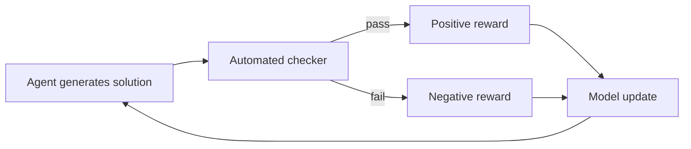

# [AEE-102] 為何技術領域卓越：強化學習與可驗證獎勵

## Context

智能體 AI 系統在程式設計、數學和形式推理方面的進步，遠快於寫作、建議或通用搜索。這並非偶然，而是反映了這些系統訓練方式的基本屬性。理解這種不對稱性，有助於工程師做出更好的決策：在哪裡信任智能體，在哪裡加入防護。

## Design Think

現代前沿模型使用**可驗證獎勵強化學習**（RLVR）訓練。當獎勵同時滿足以下條件時，訓練信號最強：

1. **可驗證** -- 有客觀的、自動化的方式檢查智能體是否成功（測試通過、證明有效、答案符合基準）
2. **可擴展** -- 驗證可以應用於數百萬個訓練樣本，無需人工審查

程式設計完美滿足這兩個條件。單元測試要嘛通過要嘛失敗。構建要嘛成功要嘛不成功。這使得軟體工程任務成為強化學習的理想訓練環境：模型可以嘗試、觀察結果，並以清晰的二元信號更新。

相較之下，寫作任務的問題是：「這篇文章好嗎？」需要人工判斷，成本高、速度慢且不一致。獎勵信號雜訊大，限制了模型在寫作任務上透過強化學習進步的速度。

實際結論：在具有可驗證結果的領域（程式碼、形式邏輯、資料轉換、結構化查詢）中，工程師 SHOULD 最信任智能體；在需要主觀判斷的領域（內容品質、策略建議、人際溝通）中，SHOULD 更謹慎對待。

## 深入探討

### RLHF vs. RLVR

基於人類回饋的強化學習（RLHF）使用根據人類偏好比較訓練的獎勵模型。它在技術領域的可擴展性很差：人類評分者無法可靠地評估程式碼正確性、證明有效性或複雜的資料轉換。RLVR（可驗證獎勵）透過使用自動化檢查器，完全繞過人類瓶頸。這正是在程式設計和數學任務上訓練的模型，相較於寫作或建議任務有如此顯著進步的原因——信號更便宜、更快速、更一致。

RLHF 綜合調查（Casper et al., arXiv 2307.15217）記錄了學習型獎勵模型的脆弱性：獎勵黑客攻擊、分佈偏移和標註者不一致都會降低信號品質。RLVR 在設計上就避免了這三個問題。

### 訓練循環

在 RLVR 中：
1. 模型生成候選解答
2. 自動化檢查器對其進行評估（測試套件、證明驗證器、數值比較、JSON 架構驗證）
3. 結果（通過/失敗或純量分數）成為獎勵信號
4. 模型更新權重，朝向生成能通過檢查的輸出

這個循環可以在無需人工審查的情況下運行數百萬次。相較於 RLHF，速度優勢在技術領域是決定性的。DeepSeek-R1 等模型已證明，RLVR 單獨即可產生最先進的推理能力，無需在推理軌跡上進行任何監督式微調。

### 對評估設計的意涵

使 RLVR 在訓練中強大的相同屬性，也使可驗證評估在測試時同樣強大。如果你能自動化正確性檢查，就能大規模執行高品質的智能體評估。這直接連結到 AEE-800 系列（執行框架評估）：設計具有可驗證結果的任務，是良好智能體評估的基礎。

### 可驗證性光譜上的各領域

| 領域 | 可驗證性 | 強化學習信號品質 |
|------|---------|----------------|
| 程式碼（單元測試） | 高 | 強 |
| 數學（證明驗證） | 高 | 強 |
| 結構化資料轉換 | 高 | 強 |
| 結構化輸出（JSON 架構） | 中高 | 良好 |
| 資訊檢索（精確匹配） | 中 | 可接受 |
| 摘要 | 低 | 弱 |
| 創意寫作 | 極低 | 差 |
| 策略建議 | 極低 | 差 |

## 最佳實踐

1. **在建構執行框架之前，為你的智能體任務設計可驗證的成功標準。** 如果你無法為成功定義程式化的檢查，你的智能體將更難評估、改進，並在生產環境中獲得信任。
2. **使用可驗證性光譜來界定自動化邊界。** 高可驗證性任務（程式碼、資料轉換）是無監督自動化的候選。低可驗證性任務在最終決策點需要人工審查。
3. **在針對特定任務進行提示或微調時，優先選擇具有自動化基準真相的任務。** 這使測試時的評估能夠與訓練時的信號相匹配，產生更可靠的校準。

## 視覺化

## Related AEEs

- [AEE-101](101) -- 智能體能力差距
- [AEE-1000](1000) -- 評估與品質：可驗證 vs. 主觀獎勵

## References

- [Reinforcement Learning from Human Feedback - Anthropic](https://www.anthropic.com/research/learning-to-summarize)
- [DeepSeek-R1: Incentivizing Reasoning Capability via RL](https://arxiv.org/abs/2501.12948)
- [Let's Verify Step by Step - OpenAI](https://arxiv.org/abs/2305.20050)
- [A Survey of Reinforcement Learning from Human Feedback (arXiv 2312.14925)](https://arxiv.org/abs/2312.14925)
- [RLHF vs RLVR: Why AI Training Is Shifting to Verifiable Rewards (WhatHappenedInAI, 2026)](https://whathappenedinai.space/rise-of-rlvr-verifiable-rewards-ai-reasoning-2026/)

## Changelog

- 2026-04-13 -- 初稿
- 2026-04-13 -- 升級：新增深入探討（RLHF vs RLVR、訓練循環、評估意涵、可驗證性表格）、最佳實踐、視覺化
