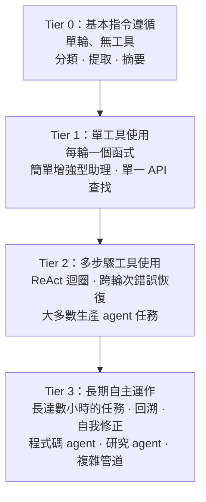

# [AEE-104] Capability Tiers

## Context

Agentic 任務的模型能力並非鐵板一塊。單一「AI 模型」標籤涵蓋了極大範圍的實際任務表現，從單輪文字分類到橫跨數百個 tool call 的長期自主運作。預設對每項任務都使用前沿模型的工程師，會在更便宜的模型可以可靠處理的工作上浪費成本和延遲。對複雜 agentic 任務使用弱模型的工程師，則會產生在多步驟推理和錯誤恢復上失敗的系統，輸出不可靠的結果，損害信任並需要人工補救。Tier 框架為工程師提供了一個實用詞彙，在架構確定之前，針對任務需求對模型選擇進行合適的規模化。MIT AI Agent Index (2025) 的實證資料顯示，大多數已部署的聊天 agent 在較低 tier 運作，而瀏覽器 agent 和程式碼 agent 則在較高 tier 運作——確認了真實生產工作涵蓋整個範圍。

## Design Think

核心主張：agentic 任務的模型能力可以理解為 tier，每個 tier 都有截然不同的架構含義，決定了系統需要什麼基礎設施。

### 四個 Tier

**Tier 0 — 基本指令遵循。**
單輪文字補全、分類、提取和轉換。沒有可靠的工具使用。沒有多步驟推理。模型接收提示並返回回應；互動即完成。適合：批次分類管道、結構化資料提取、簡單問答、有界文件摘要。失敗模式是糟糕的單輪回應，僅此而已。

**Tier 1 — 單工具使用。**
模型每輪可以可靠地呼叫一個函式。多步驟能力有限；每輪基本上是獨立的。適合：簡單的增強型助理、單一 API 查找（獲取記錄、執行搜尋、單位轉換）、具有單一整合點的窄域自動化。失敗模式是單輪上的錯誤 tool call；恢復是直接的。

**Tier 2 — 多步驟工具使用。**
具備可靠的 ReAct 風格迴圈，支援多個工具、跨輪次錯誤恢復和任務內狀態維護。模型可以規劃一系列 tool call、觀察中間結果、根據錯誤進行適應，並完成需要 3–20 步的任務。適合：大多數生產 agent 任務——帶測試執行的程式碼生成、帶網路檢索的研究綜合、表單填寫工作流程、結構化報告生成。這是 agent 基礎設施（harness、tool routing、狀態管理）第一次變得必要的地方。

**Tier 3 — 長期自主運作。**
在時間跨度為數小時、可能有數百個 tool call 的擴展任務中，可靠地進行多工具、多步驟執行。模型處理大量模糊性、在策略失敗時回溯、自我修正，並在長執行追蹤中維持連貫的目標導向行為。適合：複雜程式碼庫上的程式碼 agent、具有廣泛網路存取的研究 agent、具有分支決策樹的複雜自動化管道。Anthropic 自身關於 Claude Code session 的實證資料顯示，隨著使用者建立信任，session 從 25 分鐘增長到 45 分鐘——這是 Tier 3 的領域。

- 工程師 MUST 根據任務對工具使用、多步驟推理和錯誤恢復的實際需求來選擇模型 tier——而非基於品牌熟悉度、預設 API 金鑰或孤立的成本最小化。
- 對 Tier 0 任務使用 Tier 3 能力會在不改善結果的情況下浪費成本和延遲；對 Tier 2 任務使用 Tier 0 能力會產生以難以偵錯且昂貴難以補救的方式失敗的不可靠系統。
- 工程師 SHOULD 在架構確定之前測試 tier 假設：針對候選 tier 和下一個 tier，對真實任務的代表性樣本（非展示或合成輸入）進行執行。
- 工程師 MUST 將其 harness 設計為 tier 無關的：在 tier 之間交換模型 SHOULD NOT 需要重寫 tool routing、生命週期邏輯或 eval harness 配置。

Knight First Amendment Institute 的自主層級框架指出，自主 tier 是一個可以與原始能力解耦的設計決策——Tier 2 模型可以通過設計被限制在 Tier 1 自主層級運作。這讓團隊能夠在維持保守自主邊界的同時，逐步引入更高能力的模型。

## 深入探討

### 成本與延遲影響

Tier 與推理成本和延遲強烈相關。Tier 0 和 Tier 1 任務通常由更小、更快、更便宜的模型很好地服務。LLM routing 文獻記錄了即使將 50% 的查詢從前沿模型轉移到中間層模型，也能在那些段上產生顯著的成本節省。生產紀律是分析你的任務分佈——實際生產請求中有多大比例真正是 Tier 2 或 Tier 3——並相應地進行路由。

大多數系統有異質的任務分佈：少數需要 Tier 2-3 的複雜任務，以及大量只需要 Tier 0-1 的簡單任務。將所有內容發送到同一模型的扁平架構為簡單的多數任務付出了過多代價。

### 實證分類你的任務 Tier 需求

Tier 分類是一個實證問題，而非理論問題。流程如下：

1. 從你的領域中選取真實任務的代表性樣本（至少 20 個，理想情況下 50+ 個）。不要使用展示或精心挑選的範例。
2. 為每個任務定義一個可以在不要求模型自我評分的情況下評估的成功標準。
3. 對 Tier 1 模型（或你假設下方的 tier）執行樣本。如果它可靠地成功（根據你的標準超過 90%），你不需要更高的 tier。
4. 如果 Tier 1 失敗，識別失敗模式：是 tool call 品質、多步驟推理、錯誤恢復還是歧義處理？每種失敗類型都映射到一個 tier 需求。

### Tier 假設風險

假設你的任務是 Tier 1 而實際上是 Tier 2，這是一個常見的生產失敗模式。症狀：系統在乾淨輸入上展示良好，但在需要錯誤恢復或多步驟適應的生產邊緣案例上失敗。根本原因是在合成或理想化輸入上測試，而非真實生產樣本。緩解措施是上述實證分類流程，在架構確定之前對真實資料執行。

相反的風險——假設 Tier 3 而 Tier 1 就足夠了——破壞性較小但仍然代價高昂：它選擇了不必要昂貴的模型、增加了延遲，並創建了比任務所需更複雜的 harness。

## 最佳實踐

1. **在選擇模型之前，定義你的任務的最低 tier 需求。** 從任務屬性（工具使用？多步驟？需要錯誤恢復？）到 tier 需求，然後以最低成本和延遲選擇滿足該需求的模型。
2. **在架構確定之前，用真實任務的代表性樣本測試 tier 假設。** 合成輸入和展示是生產邊緣案例的不可靠代理。對真實資料執行你假設下方的 tier；如果成功，就使用它。
3. **將你的 harness 設計為 tier 無關的。** 在 tier 之間交換模型不應該需要重寫 tool routing 或生命週期邏輯。這使你能夠隨著能力和成本曲線的演進，在不重建系統的情況下升級或降級模型 tier。

## Visual

## Related AEEs

- [AEE-101](101) -- The Agentic Capability Gap
- [AEE-111](111) -- Model Selection for Agentic Tasks

## References

- [Levels of Autonomy for AI Agents (Knight First Amendment Institute)](https://knightcolumbia.org/content/levels-of-autonomy-for-ai-agents-1)
- [Levels of Autonomy for AI Agents Working Paper (arXiv 2506.12469)](https://arxiv.org/abs/2506.12469)
- [Five Levels of AI Agents: From Reactive to Fully Autonomous (Kore.ai)](https://www.kore.ai/blog/five-levels-of-ai-agents)
- [The 2025 AI Agent Index (MIT)](https://aiagentindex.mit.edu/)
- [Measuring AI Agent Autonomy in Practice (Anthropic Research)](https://www.anthropic.com/research/measuring-agent-autonomy)

## Changelog

- 2026-04-13 -- 初始草稿
