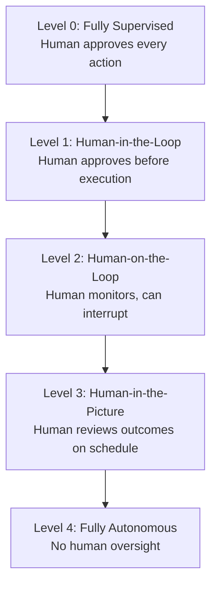

# [AEE-106] The Autonomy Spectrum

## Context

Agentic 系統中的自主性是一個刻度盤，而非開關。一個系統可以被設計為每次行動都需要明確的人工核准，或是在沒有任何人員介入的情況下運行數天——兩者之間的每個位置都是合理的工程選擇。生產系統很少位於完全自主的一端：大多數系統在中間某處運行，在人工監督、運營成本和可接受風險之間刻意選擇了恰當的平衡。所選擇的自主性等級決定了所需的基礎設施、監督模型和錯誤處理設計。這是工程師做出的架構決策，不是模型的自然屬性。

## Design Think

核心主張：在自主性頻譜上的位置是一個具有直接架構後果的設計選擇。選擇更高的自主性等級不是升級——而是一種交換：以更少的人工監督換取更快的吞吐量，代價是更高的基礎設施要求，以及系統出錯時更嚴重的後果。

自主性頻譜的五個等級：

- **Level 0 — 完全監督式：** 每個 agent 行動在執行前都需要明確的人工核准。Agent 提出建議；人類執行。適合高度敏感的領域，其中每個個別行動都必須保持人類問責制。
- **Level 1 — 人在迴圈中 (Human-in-the-Loop)：** Agent 提出計劃或行動；人類在執行開始前審查並核准。Agent 完成工作；人類控制閘門。適合高風險、不可逆的行動，其中錯誤成本高且核准延遲是可以接受的。
- **Level 2 — 人監視迴圈 (Human-on-the-Loop)：** Agent 自主執行；人類實時監控並保留中斷的能力。Agent 運行；人類觀察並可以停止它。這是大多數已展示基準可靠性的生產 agent 的推薦預設值。
- **Level 3 — 人知情 (Human-in-the-Picture)：** Agent 自主運行；人類按計劃審查結果——而非實時。非同步審查取代同步監控。此等級在部署前需要強大的評估基礎設施和防篡改的審計日誌，因為錯誤在人類看到之前可能已複雜化。
- **Level 4 — 完全自主：** Agent 在沒有人工監督的情況下運行。僅適用於低風險、可逆的、已充分評估且具備自動成功驗證的任務。此等級的任何錯誤都不會被檢測到，直到下一次預定審查或自動異常警報觸發。

- Level 3 或以上的系統 MUST 在部署前建立自動化評估和監控基礎設施。
- Level 4 系統 MUST 限於具有可驗證、自動化成功檢查的任務（見 AEE-102）。
- 工程師 SHOULD 預設使用 Level 2，直到系統在代表性任務上展示了持續的可靠性。
- 系統 MUST NOT 部署在其評估覆蓋範圍無法支持的更高自主性等級上。

## 深入探討

### 自主性等級與 Harness 設計

頻譜的每個等級都施加了獨特的基礎設施要求，不僅僅是監督要求。

**Level 1 需要具有低延遲 UX 的核准工作流程。** 如果核准介面緩慢、設計不良或與操作員現有工作流程整合不佳，核准步驟就會成為瓶頸。團隊隨後面臨繞過它的壓力——而一個被常規繞過的 Level 1 系統本質上是一個帶有監督假象的 Level 4 系統。核准 UX 是一個一流的工程關切，而非 UI 事後考慮。

**Level 2 需要人類可以在執行中途觸發的中斷和暫停機制。** 執行 30 個步驟工作流程的 agent 必須在任何時候都可以停止，而不僅僅是在自然檢查點。Harness 必須支持優雅的步驟中途中斷：停止發出新的工具調用、顯示當前狀態並乾淨地移交。無法安全停止的 agent 不適合在 Level 2 部署。

**Level 3 和 4 需要評估 harness、防篡改審計日誌和自動化異常檢測。** 當人工審查是非同步的或缺失時，系統的自我監控必須補償。評估 harness 持續地根據基準真實值對 agent 行為進行評分。審計日誌必須是只可追加且防篡改的，以便事後審查可以重建 agent 的確切行為和原因。異常檢測必須在行為偏離預期分佈時觸發警報——在下一次預定人工審查之前浮現問題。

### 自主性等級與錯誤恢復

更高的自主性等級需要更健壯的錯誤恢復邏輯，而非更少。在 Level 1，壞的行動可以在發生之前被阻止。在 Level 4，壞的行動在任何人看到之前可能已被後續步驟複雜化。這意味著：

- **重試邏輯**在更高的自主性等級必須更保守。在人類正在觀察的 Level 2，在升級前重試失敗的 API 調用三次是合理的。在 Level 4 沒有升級路徑地無限重試可能導致失控行為。
- **回滾能力**在 Level 3 及以上變得至關重要。如果 agent 的行動是不可逆的——向資料庫寫入記錄、發送電子郵件、進行購買——缺乏回滾機制會限制該任務的最大安全自主性等級。
- **升級路徑**必須被明確設計。當 agent 在 Level 3 或 4 遇到超出其訓練分佈的情況時，它必須有一個定義好的路徑將情況浮現給人類——而不是悄悄地繼續低信心的解釋。

### 贏得更高的自主性

更高的自主性不是被授予的；它是通過在較低自主性等級展示可靠性而獲得的。這個路徑是實證性的：

1. 在 Level 2 部署並進行監控。
2. 在代表性任務上積累測量：成功率、錯誤類型分佈、邊緣案例頻率。
3. 當測量結果展示超過閾值的持續可靠性時，評估 Level 3 基礎設施（評估 harness、審計日誌、異常檢測）是否已運行。
4. 只有在可靠性和基礎設施條件都滿足時，才晉升到 Level 3。
5. Level 4 僅適用於 Level 3 運行已展示預定審查窗口中的人工審查持續未發現問題的情況——且僅適用於所有行動可逆或具有自動成功驗證的任務。

## 最佳實踐

1. **選擇滿足延遲和成本要求的最低自主性等級。** 更高的自主性並非本質上更好——它承擔更多風險並需要更多支撐基礎設施。目標是適合任務的正確等級，而不是系統技術上能夠維持的最高等級。
2. **將核准和中斷工作流程設計為一流的 UX，而非事後考慮。** 具有差 UX 的 Level 1 系統在實踐中將被繞過；沒有中斷機制的 Level 2 系統無法安全停止。人機介面的品質決定了所聲稱的監督等級是否真實。
3. **逐步增加自主性等級，而非一次全部增加。** 通過在代表性任務上測量展示 Level 2 的可靠性來贏得 Level 3。通過展示 Level 3 審查未發現需要糾正的內容來贏得 Level 4。跳過等級就是跳過使更高自主性值得信賴的證據。

## Visual

## Related AEEs

- [AEE-103](103) -- Agent vs. Chatbot
- [AEE-700](700) -- What Is a Harness?

## References

- [Human-in-the-Loop vs Human-on-the-Loop: Navigating the Future of AI (Serco)](https://www.serco.com/na/media-and-news/2025/human-in-the-loop-vs-human-on-the-loop-navigating-the-future-of-ai)
- [The Loop Paradox: HITL, Human-above-the-Loop, AI-in-the-Loop, Human-OUT of the Loop (Medium, 2026)](https://medium.com/@savneetsingh_1/the-loop-paradox-human-in-the-loop-human-above-the-loop-ai-in-the-loop-and-human-out-of-the-loop-03fee4d66798)
- [Human-in-the-Loop — Wikipedia](https://en.wikipedia.org/wiki/Human-in-the-loop)
- [From Human-in-the-Loop to Human-on-the-Loop: Evolving AI Agent Autonomy (ByteBridge, Medium)](https://bytebridge.medium.com/from-human-in-the-loop-to-human-on-the-loop-evolving-ai-agent-autonomy-c0ae62c3bf91)

## Changelog

- 2026-04-13 -- 初始草稿
