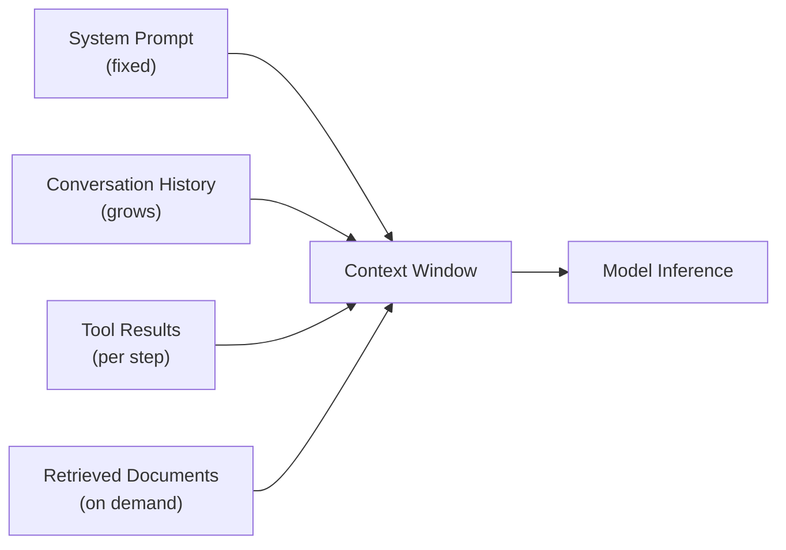

# [AEE-108] Context as a Resource

## Context

Context window 是有限的，並在 agent 運作時被消耗。每個工具調用結果、每個檢索文件、每個對話輪次、以及每個推理步驟都佔用了一旦使用就無法收回的 token。不將 context 視為受管理資源的工程師，會建構出隨著 window 填滿而降級、幻覺、或靜默失敗的系統——不是因為模型有問題，而是因為可供模型使用的資訊已變成一個非受管理的積累，而非刻意的組成。本文建立了資源框架，該框架為 AEE-200 系列（Model and Context Layer）提供基礎：context 必須被積極管理，而非被動積累。

## Design Think

核心主張：context 是一種有限的、可消耗的資源，MUST 被積極管理——而非自行填充的被動緩衝區。

Context window 持有模型在推理時可以注意的所有內容：系統提示、對話歷史、工具結果、檢索文件和當前任務描述。隨著 agent 執行多步驟任務，window 填充。當它填充時，有三種可能的結果：

1. **顯式失敗：** Harness 拋出 token 限制錯誤，agent 停止。失敗是可見的且可恢復的。
2. **靜默截斷：** 舊內容被模型 API 或 harness 的 context 管理層靜默丟棄。Agent 繼續執行，但它推理的資訊不再是工程師預期的資訊。
3. **性能降級：** 模型的有效注意力被稀釋在大量且日益不相關的 context 上。輸出品質逐漸降低，而不產生任何錯誤信號。

結果 3 是最危險的。它不產生錯誤——只是微妙地且逐漸地產生更差的輸出。在多步驟的 agentic 任務中，性能降級可能直到最後一步才變得明顯，此時 window 已開始充斥噪音很久了。到那時，成本已經付出：不正確的工具調用、差的中間推理，以及下游步驟中複合的錯誤。

**RFC 2119：**

- Harness MUST 追蹤 context 使用情況，並在超過 window 之前強制執行預算限制。
- 在長任務上運行的 Agent MUST 使用壓縮、摘要或檢索來管理 context 增長。
- 系統提示 SHOULD 盡可能短；系統提示中的每個 token 都是任務內容無法使用的 token。
- Context 中的內容決定了模型可以推理的內容。工程師 MUST 將 context 組成決策視為架構決策。

## 深入探討

### Lost in the Middle（迷失於中間）

Context 長度本身不等於可用 context 長度——位置很重要。

Liu 等人（2023 年，"Lost in the Middle: How Language Models Use Long Contexts"，arXiv 2307.03172，2024 年發表於 TACL）展示了 LLM 在長 context 上表現出 U 形性能曲線。模型在 context window 開始或結尾放置的資訊上表現最好，而在埋在中間的資訊上表現最差。在多文件問答實驗中，當相關文件被放置在 20 個文件 context 的中間而非開頭或結尾時，GPT-3.5-Turbo 的準確率下降了超過 20 個百分點。這個效果在多個模型家族中被觀察到。

工程啟示：當為多步驟任務組成 context 時，位置是一個設計決策。模型必須在當前步驟中行動的資訊應放置在 context 的末尾附近，而不是埋在 40KB 的對話歷史和工具結果之後。如果位置無法控制（例如，因為 context 由框架組裝），那麼 context 長度本身應最小化，以降低相關資訊落在降級的中間區域的概率。

一個相關但不同的現象是「context rot」（Morph，2025 年）：隨著輸入 token 總數增加，性能降級，與特定資訊的位置無關。即使具有名義上大的 context window，隨著 window 填充，推理品質也會降低——不僅僅是因為位置效果，而且因為注意力分散在更多的 token 上，信號密度減少。Context rot 意味著實際可用 context 小於技術限制。

### Context 預算設計

Context 預算是對可用 token 容量在 agent 將插入 context window 的各類內容之間的明確分配。生產 agent 的基本預算設計可能如下：

- **系統提示：** 固定分配，積極最小化——500 至 1,500 個 token
- **任務描述 + 當前步驟：** 主要的工程內容——1,000 至 3,000 個 token
- **對話歷史：** 最近輪次的滾動窗口——2,000 至 5,000 個 token
- **工具結果：** 帶截斷規則的每步分配——2,000 至 8,000 個 token
- **檢索文件：** 帶檢索範圍限制的按需注入——2,000 至 10,000 個 token
- **預留：** 硬限制前的緩衝區——500 至 1,000 個 token

具體分配因任務類型而異，但原則是不變的：每個類別應有由 harness 強制執行的明確限制，而非填充到剩餘空間的隱式預設值。預設值產生意外行為；預算產生有意圖的行為。

### 壓縮策略

當 context 增長超過預算時，三種策略可以管理它：

1. **滾動摘要：** 較舊的對話輪次被摘要為緊湊的表示。JetBrains Research 研究（2025 年）實證發現，保留 10 個最近的完整輪次並摘要早期輪次產生最佳性能——比逐字保留所有輪次（context rot）更好，也比完全丟棄舊輪次（丟失資訊）更好。

2. **語義分塊與檢索：** 不是逐字注入大型文件，而是將其分塊為語義連貫的片段，並只檢索與當前步驟相關的片段。這將成本從 context token（每次推理消耗）轉移到檢索延遲（每次查找支付一次），對於大型知識庫通常是更好的取捨。

3. **懶加載：** 只在當前步驟需要時才將內容注入 context，而非預先加載。工具文件、參考材料和背景知識應可供檢索，而非預先加載到每個推理請求中。ACON 論文（arXiv 2510.00615，2025 年）展示了動態 context 壓縮——根據任務相關性選擇性地保留和壓縮 context——將峰值 token 使用量降低 26-54%，同時保持任務性能，並在標準基準上將小型語言模型 agent 的性能提升 32-46%。

### 檢索增強生成（RAG）作為 Context 管理

RAG 從根本上是一種 context 管理策略。它不是在每一步驟都將大型知識庫注入 context window，而是只檢索與當前查詢最相關的 2-5KB 內容並注入。取捨：檢索增加延遲（對於優化良好的向量搜索，通常為 50-200 毫秒）並將檢索準確性引入為失敗模式（可能檢索到錯誤的文件）。作為交換，context 消耗受到控制，知識庫可以擴展到任意大小，而不影響推理成本或 context 品質。

使用 RAG 與內聯注入的決定應由知識相對於 context 預算的大小以及不同知識部分被訪問的頻率驅動。對於在每個步驟都訪問的 5 頁參考文件，內聯注入是合適的。對於選擇性訪問的 500 頁語料庫，RAG 是正確的架構。

## 最佳實踐

1. **在每次 agent 調用時檢測 context 使用情況。** 在關鍵檢查點記錄 token 計數——在工具調用之前、在工具結果之後、在最終生成之前。Context 使用數據支持預算校準，識別消耗不成比例 token 的步驟，並在 context 增長趨向限制時提供早期預警。
2. **設計明確的 context 預算：將 token 分配給系統提示、任務描述、歷史記錄和工具結果，作為刻意的比例，而非預設值。** 將 context 視為受管理資源意味著在部署之前就知道每個類別將消耗什麼，以及當類別超過其分配時 harness 將做什麼。預設值產生意外行為；預算產生有意圖的行為。
3. **對於大型知識庫，優先使用檢索而非注入。** 當檢索可以提供相關的 2KB 時，不要將 100KB 的文件注入 context。檢索延遲是每次查找的固定、可預測成本；context 消耗是每 token 的成本，隨著增長而降低輸出品質。

## Visual

## Related AEEs

- [AEE-109](109) -- How LLMs Work
- [AEE-1](../AEE Overall/1) -- Glossary (context window definition)

## References

- [Lost in the Middle: How Language Models Use Long Contexts (Liu et al., arXiv 2307.03172)](https://arxiv.org/abs/2307.03172)
- [Context Rot: Why LLMs Degrade as Context Grows (Morph)](https://www.morphllm.com/context-rot)
- [Cutting Through the Noise: Smarter Context Management for LLM-Powered Agents (JetBrains Research, 2025)](https://blog.jetbrains.com/research/2025/12/efficient-context-management/)
- [ACON: Optimizing Context Compression for Long-Horizon LLM Agents (arXiv 2510.00615)](https://arxiv.org/html/2510.00615v2)

## Changelog

- 2026-04-13 -- 初始草稿
