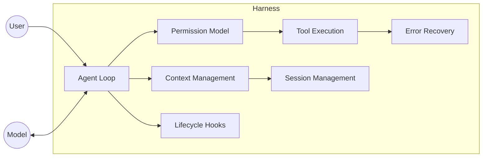

# [AEE-700] 什麼是執行框架？

## 情境

「執行框架（Harness）」是智能體工程中最重要也最缺乏明確定義的術語之一。有些人用它來泛指 LLM 周圍的任何腳手架；有些人特指評估基礎設施。實際上，它涵蓋了使智能體能夠運作的完整軟體基礎設施——模型本身以外的一切。釐清這個定義至關重要，因為它決定了當你部署一個智能體時，你需要負責工程化哪些東西。

## 設計思維

**執行框架**是圍繞 LLM 的完整軟體基礎設施，使其能夠作為自主智能體運作。它涵蓋模型本身以外的所有程式碼、配置和執行邏輯——包括代理循環（agent loop）、工具執行（tool execution）、記憶系統、情境管理（context management）、狀態持久化、錯誤復原（error recovery）和防護欄。

執行框架決定了「能夠回答問題的模型」與「能夠自主完成工作的系統」之間的差距。兩個使用相同 LLM 的產品，可能因為執行框架品質的差異而帶來截然不同的使用者體驗。

執行框架的關切分為兩個主要子學科：

1. **執行型框架** -- 在生產環境部署智能體的執行時基礎設施。負責代理循環、工具分派、生命週期鉤子（lifecycle hooks）、工作階段管理（session management）、權限模型（permission model）、沙箱化與錯誤復原。範例：Claude Code 的執行框架、Cursor。
2. **評估型框架（evaluation harness）** -- 測量智能體能力的標準化測試基礎設施。負責任務規格、沙箱化執行、自動評分與可重現的基準測試。範例：Inspect AI、lm-evaluation-harness、SWE-bench。

工程師必須理解這項區別。在未理解執行型框架設計的情況下建構生產智能體，將導致系統靜默失敗、憑證洩漏或在規模下行為不可預測。在未理解評估型框架設計的情況下建構智能體，將導致系統能力無法被測量或比較。

## 深入探討

### 執行框架的解剖

執行框架不是單一的類別或模組，而是一組各司其職、相互協作的組件：

| 組件 | 職責 |
|---|---|
| 代理循環 | 驅動「推理-行動-觀察」循環，直到達成終止條件 |
| 工具執行 | 分派工具呼叫、驗證輸入、捕獲結果、處理錯誤 |
| 情境管理 | 在每個回合從所有輸入來源組裝完整的情境文件 |
| 記憶 | 跨回合與跨工作階段儲存與檢索智能體知識 |
| 工作階段管理 | 維護跨回合、重啟與重新進入的狀態連續性 |
| 權限模型 | 在任何工具被分派前強制執行能力授權 |
| 錯誤復原 | 在工具失敗、溢位與停頓時維持循環進度 |

這些組件以結構化的方式互動。情境管理依賴工作階段管理（取得對話歷史）與記憶（取得檢索到的知識）。權限模型把關每一次工具執行的呼叫。錯誤復原包裹代理循環的工具分派階段。理解這些依賴關係，是你能夠推斷失敗發生位置的前提。

### 模型職責 vs. 執行框架職責

將職責誤歸給模型的工程師，會建構出脆弱的執行框架。模型只能推理與產生 token——它無法執行工具、持久化狀態或強制執行權限。所有其他操作職責都屬於執行框架。

| 職責 | 模型 | 執行框架 |
|---|---|---|
| 決定下一步做什麼 | 是 | |
| 執行工具 | | 是 |
| 驗證工具輸入 | | 是 |
| 維護工作階段歷史 | | 是 |
| 強制執行權限授權 | | 是 |
| 從工具失敗中復原 | | 是 |
| 在每個回合組裝情境 | | 是 |
| 產生最終文字輸出 | 是 | |

當智能體行為異常時，第一個診斷問題是：哪項職責被違反了，它屬於模型還是執行框架？這張表對最常見的失敗模式給出了明確的答案。

### 執行型框架 vs. 評估型框架

設計思維中介紹的執行與評估區別，值得更精確的比較。這兩者並非同一基礎設施的變體——它們有著不相容的約束條件。

> **編輯說明：** 此區別是用於區分兩類常被混淆之基礎設施的分析框架，並非任何 LLM 廠商的官方分類。

| 維度 | 執行型框架 | 評估型框架 |
|---|---|---|
| 目的 | 在生產環境部署智能體 | 測量智能體能力 |
| 環境 | 真實工具、真實資料、真實副作用 | 沙箱任務、受控輸入 |
| 終止條件 | 使用者目標達成或達到錯誤閾值 | 任務完成，對照基準答案評分 |
| 範例 | Claude Code、Cursor、自訂智能體應用 | Inspect AI、lm-evaluation-harness、SWE-bench |
| 成功指標 | 任務完成率、使用者滿意度 | 基準分數、pass@k |

關鍵的不相容性在於：執行型框架被設計為產生副作用（寫入檔案、呼叫 API、發送訊息）；評估型框架被設計為防止副作用。兩者之間共用程式碼，必然會使其中一方妥協。

## 視覺化

下圖將執行框架呈現為包圍模型的邊界。模型只與代理循環溝通。其他所有事項——工具分派、情境組裝、權限控管、錯誤復原——都在呼叫模型之前由執行框架內部處理。

## 最佳實踐

1. **在架構中明確命名執行框架的各個組件。** 無法說清楚執行框架做了什麼的工程師，就無法推斷智能體為何失敗。在動手建構之前，先寫下哪個組件負責代理循環、哪個負責權限控管、哪個負責錯誤復原。職責不明確，就代表該組件根本不存在。

2. **將執行型框架與評估型框架視為獨立的程式碼庫。** 在兩者之間共用程式碼，會在雙方都產生妥協：帶有副作用洩漏到生產環境的評估程式碼，以及評估介面無法測試的生產程式碼。從一開始就保持分離。

3. **在設計模型互動之前，先設計執行框架。** 模型的行為受限於執行框架所能支援的範圍。如果你先設計提示詞、後設計執行框架，你將會發現你告訴模型要做的事與執行框架能支援的事之間存在落差。

## 相關 AEE

- [AEE-701](701) -- 代理循環（ReAct）
- [AEE-703](703) -- 情境組裝
- [AEE-704](704) -- 工作階段管理
- [AEE-406](../Tool Use and Execution/406) -- 沙箱化與執行安全
- [AEE-500](../Agent Skills/500) -- 技能 vs. 工具

## 參考資料

- [Effective harnesses for long-running agents - Anthropic Engineering](https://www.anthropic.com/engineering/effective-harnesses-for-long-running-agents)
- [What is an agent harness - Parallel AI](https://parallel.ai/articles/what-is-an-agent-harness)
- [12 Agentic Harness Patterns from Claude Code](https://generativeprogrammer.com/p/12-agentic-harness-patterns-from)

## 更新記錄

- 2026-04-14 -- 新增深入探討、視覺化、最佳實踐，完善相關 AEE
- 2026-04-13 -- 初稿
