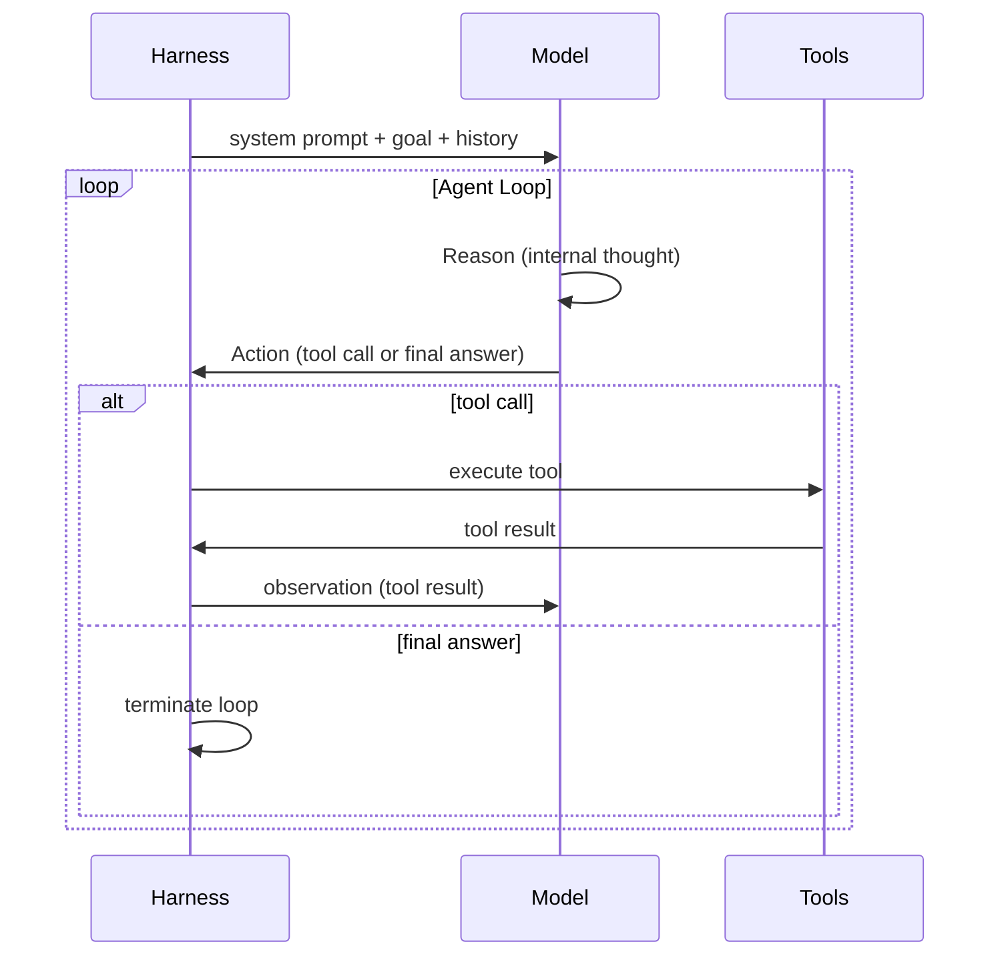

# [AEE-701] 智能體循環（ReAct）

## Context

每個智能體系統都圍繞一個執行循環構建。理解這個循環的結構——以及它可能在哪裡失敗——是設計或除錯任何智能體系統的前提知識。ReAct 模式（推理 + 行動）是 LLM 智能體循環的主流範式，也是大多數生產執行框架的基礎。

## Design Think

**ReAct 循環**（推理 + 行動）將智能體執行結構化為迭代循環：

```
while goal_not_achieved:
    observation = perceive(environment)
    thought = reason(observation, goal, history)
    action = decide(thought)
    result = execute(action)
    history.append(thought, action, result)
```

每次迭代有三個階段：

1. **推理（Reason）** -- 模型思考當前狀態、歷史記錄和目標。它產生一個內部推理（thought），不作為輸出發送。
2. **行動（Act）** -- 模型選擇工具呼叫或產生最終回應。
3. **觀察（Observe）** -- 工具結果或環境反饋被附加到上下文，循環繼續。

執行框架負責：
- 跨迭代維護歷史記錄
- 將工具呼叫分派到相應實作
- 決定循環何時終止（目標達成、最大步數、錯誤閾值）
- 在不崩潰的情況下處理工具失敗

**循環終止**是執行框架最重要的設計決策之一。永不終止的智能體會浪費資源，甚至可能造成真實世界的損害。過早終止的智能體無法完成任務。執行框架 SHOULD 同時實作最大步數限制和目標檢測機制。

## Visual



## Related AEEs

- [AEE-700](700) -- 什麼是執行框架？
- [AEE-702](702) -- 生命週期鉤子

## References

- [ReAct: Synergizing Reasoning and Acting in Language Models](https://arxiv.org/abs/2210.03629)
- [Building Effective Agents - Anthropic](https://www.anthropic.com/research/building-effective-agents)

## Changelog

- 2026-04-13 -- 初稿（補充偽代碼、循環終止說明與視覺化圖表）
