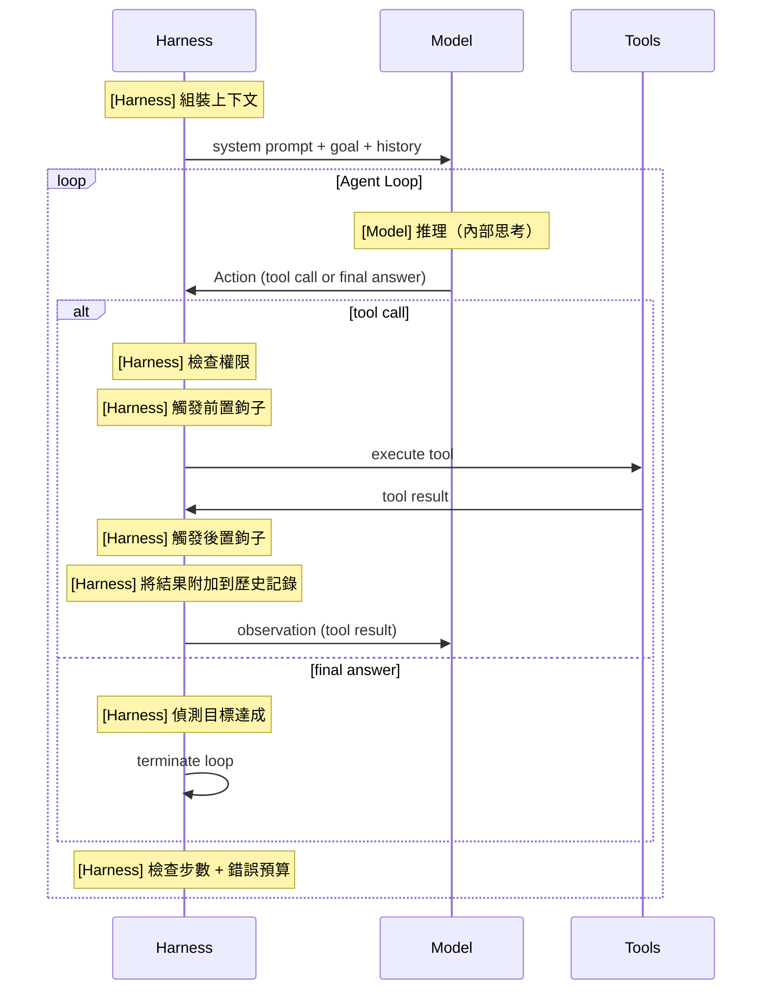

# [AEE-701] 代理循環（ReAct）

## 情境

每個代理系統都圍繞一個執行循環構建。理解這個循環的結構——以及它可能在哪裡失敗——是設計或除錯任何代理系統的前提知識。ReAct 模式（推理 (Reason) + 行動 (Act)）是基於 LLM 的代理循環主流範式，也是大多數生產 harness 的基礎。

## 設計思維

**ReAct 循環**（推理 + 行動）將代理執行結構化為迭代循環：

```
while goal_not_achieved:
    observation = perceive(environment)
    thought = reason(observation, goal, history)
    action = decide(thought)
    result = execute(action)
    history.append(thought, action, result)
```

每次迭代有三個階段：

1. **推理（Reason）** -- 模型思考當前狀態、歷史記錄和目標。它產生一個內部推理（thought），不作為輸出發送。
2. **行動（Act）** -- 模型選擇工具呼叫 (tool call) 或產生最終回應。
3. **觀察（Observe）** -- 工具結果或環境反饋被附加到上下文，循環繼續。

Harness 負責：
- 跨迭代維護歷史記錄
- 將工具呼叫分派到相應實作
- 決定循環何時終止（目標達成、最大步數、錯誤預算）
- 在不崩潰的情況下處理工具失敗

**循環終止**是 harness 最重要的設計決策之一。永不終止的代理會浪費資源，甚至可能造成真實世界的損害。過早終止的代理無法完成任務。Harness SHOULD 同時實作最大步數限制和目標偵測 (goal detection) 機制。

這個循環不僅僅是一個獨立的 `while` 迴圈——它是執行框架（Harness）與模型之間的一份契約。Harness 擁有模型生成以外的一切：組裝情境、調度工具、附加結果，以及決定何時停止。每一個循環設計決策（步驟上限、終止條件、歷史管理）都是 Harness 的職責，而非模型的能力。

- Harness MUST 實作最大步數限制。沒有硬性上限，無法達到目標狀態的循環將無限運行。
- Harness SHOULD 在步數上限之外額外實作目標偵測。僅依靠最大步數終止的循環無法區分成功與失敗。
- Harness MUST 在下一次模型呼叫之前將工具結果附加到歷史記錄中。丟棄結果會破壞觀察階段，導致模型重複發出工具呼叫。

## 深入探討

### 循環終止策略

三種策略，按優先順序排列：

| 策略 | 運作方式 | 使用時機 |
|---|---|---|
| 目標偵測 | 模型發出完成信號（例如 `stop_reason: end_turn` 且無工具呼叫，或結構化的 `DONE` 信號） | 主要終止方式——當目標達成時循環應結束 |
| 最大步數 | 迭代次數的硬性上限 | 安全網——無論目標狀態如何都能防止無限循環 |
| 錯誤預算 (error budget) | N 次連續失敗後升級給人工處理或附帶診斷資訊終止 | 防止在不可恢復的錯誤上無限重試 |

務必同時實作三種策略。目標偵測處理正常路徑。最大步數處理無限循環。錯誤預算處理卡住的代理。

### 歷史記錄累積

每一輪次，harness 都會附加到歷史記錄 (history accumulation)。歷史記錄在循環內單調增長。四種管理策略：

| 策略 | 描述 | 使用時機 |
|---|---|---|
| 全部附加 | 每一輪次逐字附加 | 上下文預算較小的短任務 |
| 滑動視窗 (sliding window) | 保留最後 N 輪次；丟棄最舊的 | 早期輪次不需要的多輪任務 |
| 摘要化 (summarization) | 將舊輪次壓縮摘要；保留最近輪次的完整內容 | 上下文至關重要的長任務 |
| 檢查點 (checkpoint) 與恢復 | 將狀態序列化到磁碟，重置上下文，以注入的檢查點恢復 | 超長任務或多工作階段代理 |

### 停滯偵測

一個循環看似在取得進展，實際上可能在重複相同的行動。以下是停滯偵測 (stall detection) 程式碼：

```python
def detect_stall(history, window=3):
    if len(history) < window:
        return False
    recent = history[-window:]
    actions = [turn["action"] for turn in recent]
    return len(set(str(a) for a in actions)) == 1  # all identical
```

若偵測到停滯，注入恢復提示：「你似乎在重複相同的行動。是什麼阻擋了你？請嘗試不同的方法。」若在額外 M 輪次後仍無進展，則升級處理。

## 視覺化



## 最佳實踐

1. **同時實作三種終止策略。** 只有最大步數限制的循環無法判斷是否成功。只有目標偵測的循環在模型從不發出完成信號時會永遠運行。只有錯誤預算的循環會在可恢復的暫時性故障時終止。三種都需要。

2. **記錄每一輪次，而不只是失敗的。** 如果只記錄錯誤，代理循環就是一個黑盒子。在每次迭代都記錄完整的行動、工具名稱、工具結果和輪次編號。當循環失敗時，你需要完整的歷史記錄來診斷失敗是模型推理錯誤、工具失敗，還是 harness 的終止決策。

3. **每一輪次都將目標注入上下文，而不只是第 0 輪。** 在長循環中，隨著歷史記錄增長，模型對原始目標的關注度會降低。在每一輪次的系統提示或第一條使用者訊息中重複目標（或其摘要），能讓模型保持專注並減少停滯。

## 相關 AEE

- [AEE-700](700) -- 什麼是 Harness？
- [AEE-702](702) -- 生命週期鉤子
- [AEE-703](703) -- 上下文組裝
- [AEE-706](706) -- 錯誤恢復

## 參考資料

- [ReAct: Synergizing Reasoning and Acting in Language Models](https://arxiv.org/abs/2210.03629)
- [The Agent Loop - Oracle Developers](https://blogs.oracle.com/developers/what-is-the-ai-agent-loop-the-core-architecture-behind-autonomous-ai-systems)
- [Building Effective Agents - Anthropic](https://www.anthropic.com/research/building-effective-agents)

## 更新記錄

- 2026-04-14 -- 新增深入探討、以 harness 標籤強化視覺化、最佳實踐、補全相關 AEE；修正代理術語（智能體 → 代理）
- 2026-04-13 -- 初稿（補充偽代碼、循環終止說明與視覺化圖表）
