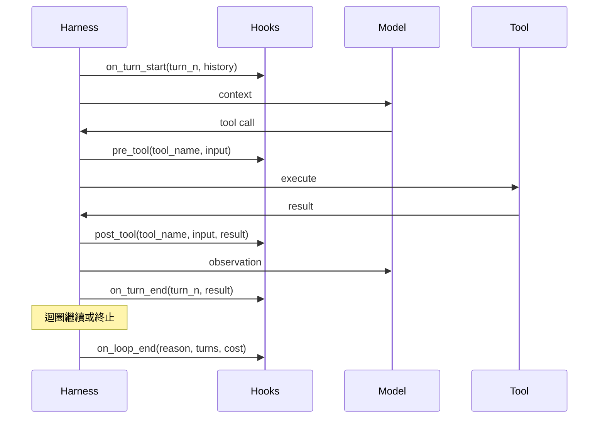

# [AEE-702] 生命週期鉤子

## 情境

一個在沒有可觀測性 (observability) 的情況下執行代理迴圈的框架，本質上是個黑盒子。若沒有迴圈中的擴展點，你無法衡量成本、驗證輸入、審計決策或攔截失敗。生命週期鉤子 (lifecycle hooks) 就是這些擴展點：在代理迴圈的特定時刻觸發的程式化回呼 (callback)，讓操作人員能夠觀察、修改及控制代理行為，而無需更改迴圈的核心邏輯。

從一開始就實作鉤子的工程師，建立的是可運維的系統。跳過鉤子的工程師則往往在事後才痛苦地發現，他們無法回答代理做了什麼、何時做的、以及花費了多少成本等基本問題。

## 設計思維

**生命週期鉤子**是向框架註冊的回呼，在代理迴圈中特定事件發生時觸發。鉤子是將封閉迴圈轉變為可觀測、可控制系統的擴展點。沒有鉤子，框架是個黑盒子；有了鉤子，它就成為具備儀器化的基礎設施。

鉤子不同於中介軟體 (middleware)。中介軟體均勻地包裝每次呼叫；鉤子在特定的具名事件發生時觸發，並附帶事件特定的資料。前置工具鉤子接收工具名稱和輸入；後置工具鉤子接收工具結果；錯誤鉤子接收錯誤類型和回合編號。這種特殊性使鉤子具備中介軟體所不具備的可組合性和可測試性。

**RFC 2119：**

- 前置工具鉤子 MUST 在工具執行開始前完成。失敗的前置工具鉤子 MUST 阻止工具派發，而不能被靜默忽略。
- 鉤子失敗 SHOULD 作為代理迴圈中的錯誤浮現，而不應被吞掉。靜默失敗的鉤子會讓系統看起來健康，實際上卻不是。
- 鉤子 MUST NOT 直接修改訊息歷史。鉤子可以觀察並回傳修改後的輸入，但直接的歷史變動會建立框架無法追蹤的狀態。

## 深入探討

### 鉤子分類

六種鉤子類型涵蓋了完整的代理迴圈：

| 鉤子類型 | 觸發時機 | 事件資料 | 主要用途 |
|---|---|---|---|
| `on_turn_start` | 每次迴圈迭代開始時 | 回合編號、當前歷史 | 成本估算、速率限制、回合日誌 |
| `pre_tool` | 工具呼叫派發前 | 工具名稱、工具輸入 | 輸入驗證、權限檢查、審計紀錄 (audit trail) |
| `post_tool` | 工具呼叫返回後 | 工具名稱、工具輸入、工具結果、執行時間 | 結果轉換、審計紀錄、成本追蹤 |
| `on_error` | 工具呼叫或模型呼叫失敗時 | 錯誤類型、錯誤訊息、回合編號 | 重試邏輯、熔斷器 (circuit breaker)、告警 |
| `on_turn_end` | 每次迴圈迭代結束時 | 回合編號、採取的動作、結果 | 成本追蹤、檢查點寫入、摘要日誌 |
| `on_loop_end` | 迴圈終止時（任何原因） | 終止原因、總回合數、總成本 | 清理、對話摘要、最終審計紀錄 |

### 各鉤子的功能

**`pre_tool`** 是最常需要的鉤子。使用它來：
- 在派發前驗證工具輸入是否符合預期格式
- 檢查當前對話是否有權限呼叫此工具
- 將每次工具呼叫嘗試記錄到審計紀錄
- 封鎖已達速率限制的工具

**`post_tool`** 是最常被低估的鉤子。使用它來：
- 在結果注入上下文之前進行轉換（例如截斷過大的 API 回應）
- 記錄每次工具呼叫的實際結果、執行時間和成本
- 遞增錯誤計數器以回饋錯誤預算 (error budget)

**`on_error`** 回答了這個問題：當事情出錯時我們怎麼辦？使用它來：
- 為瞬態失敗實作帶退避的重試邏輯
- 為持續失敗的工具開啟熔斷器
- 當錯誤預算閾值被超越時發出告警

**`on_loop_end`** 是放置清理邏輯的地方。使用它來：
- 將對話摘要寫入持久化儲存
- 釋放資源（開啟的檔案句柄、資料庫連線）
- 發出包含總成本和終止原因的最終審計紀錄

### 鉤子順序與可組合性

當多個鉤子被註冊到同一個事件時，它們依照註冊順序執行。如果鏈中的任何鉤子拋出錯誤，該鏈中的後續鉤子不會執行（快速失敗語義）。

```python
harness.on("pre_tool", validate_inputs)      # 最先觸發
harness.on("pre_tool", check_permissions)    # 第二觸發
harness.on("pre_tool", audit_log)            # 第三觸發
```

若 `check_permissions` 拋出異常，`audit_log` 就不會觸發。這意味著在任何涉及安全性的鏈中，審計鉤子應優先註冊。

### 鉤子 vs. 中介軟體

| 屬性 | 鉤子 | 中介軟體 |
|---|---|---|
| 觸發方式 | 具名事件，附帶特定資料 | 每次呼叫，統一簽名 |
| 可用資料 | 事件特定（工具名稱、結果、錯誤） | 通用請求/回應 |
| 可組合性 | 每個事件可註冊多個；有序鏈 | 包裝堆疊；順序的影響方式不同 |
| 可測試性 | 使用事件特定的測試夾具 | 使用請求/回應模擬 |
| 使用場景 | 迴圈可觀測性與控制 | HTTP 層關注點（認證、日誌） |

使用鉤子處理代理迴圈的可觀測性。使用中介軟體處理 HTTP 層的關注點。

### Claude Code 鉤子系統

Claude Code 提供了一個透過 `settings.json` 設定的鉤子系統（使用者層級：`~/.claude/settings.json`，專案層級：`.claude/settings.json`）。鉤子在具名事件發生時觸發。處理器類型包括 `command`（Shell 命令）、`http`（HTTP 端點）、`prompt`（模型提示）和 `agent`（子代理）。

部分事件：`PreToolUse`、`PostToolUse`、`SessionStart`、`SessionEnd`、`UserPromptSubmit`、`Stop`、`PermissionRequest`。`command` 鉤子回傳退出碼 2 會封鎖觸發動作；任何其他非零退出碼為非阻塞。

設定範例：
```json
{
  "hooks": {
    "PreToolUse": [
      {
        "matcher": "Bash",
        "hooks": [
          {
            "type": "command",
            "command": "echo \"$TOOL_INPUT\" >> ~/.claude/audit.log"
          }
        ]
      }
    ]
  }
}
```

完整的事件類型和處理器選項清單，請參閱 [Claude Code Hooks 文件](https://code.claude.com/docs/en/hooks)。

## 視覺化



## 最佳實踐

1. **在權限鉤子之前而非之後註冊審計鉤子。** 若你最後才註冊審計鉤子，權限失敗將阻止審計紀錄被寫入——你將沒有任何嘗試發生的證據。在任何前置工具鏈中，應將 `audit_log` 註冊在 `check_permissions` 之前。

2. **讓鉤子具備冪等性 (idempotent)。** 若框架重試某個回合，鉤子可能被多次呼叫。每次呼叫都建立資料庫記錄的鉤子在重試時會產生重複記錄。鉤子應使用 upsert 語義，或在寫入前檢查既有記錄。

3. **保持鉤子快速。** 緩慢的前置工具鉤子會延遲每次工具呼叫。若鉤子需要執行昂貴的操作（遠端 API 呼叫、資料庫寫入），應將其設計為非同步或即發即忘。增加顯著延遲的前置工具鉤子將可量測地降低迴圈吞吐量。

## 相關 AEE

- [AEE-701](701) -- 代理迴圈（ReAct）
- [AEE-705](705) -- 權限模型
- [AEE-706](706) -- 錯誤恢復

## 參考資料

- [Claude Code Hooks 文件](https://code.claude.com/docs/en/hooks)
- [Building Effective Agents - Anthropic](https://www.anthropic.com/research/building-effective-agents)

## 更新記錄

- 2026-04-14 -- 初稿
