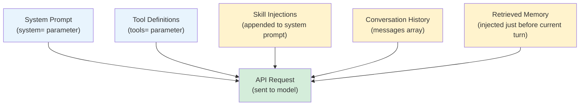

# [AEE-703] 情境組裝

## 情境

模型接收的不是對話，而是一份文件。文件中的每個 token 都是由 harness 所做的決策所放置的——無論是明確的還是隱含的。情境組裝 (context assembly) 是在每一輪中構建這份文件的過程，也是 harness 最重要的責任之一。若組裝出錯，模型將基於不完整、權重錯誤或相互矛盾的資訊進行推理。

把情境視為「只是 messages 陣列」的工程師，會遺漏完整的組裝管線 (assembly pipeline)。當模型看到情境時，harness 早已完成了以下工作：撰寫系統提示詞 (system prompt)、透過 API 的 `tools` 參數注入工具定義 (tool definitions)、載入所有啟用的技能、附加對話歷史 (conversation history)，以及檢索相關記憶。這些元件都是 harness 的決策。

## 設計思維

模型在每一輪收到的情境不是對話，而是 harness 構建的文件。文件中的每個 token 都是 harness 的決策。

組裝是有順序的。系統提示詞作為 API 請求中的頂層 `system` 參數出現，最先被處理，具有最高的權重。messages 陣列緊隨其後。在訊息陣列中，開頭與結尾的內容比中間的內容獲得更多注意——這是 Transformer 注意力機制中已有研究記錄的 U 型檢索模式。就組裝決策而言，這意味著系統提示詞（位於最前）和檢索記憶（注入在最後）都受益於首位效應和近因效應。詳見 AEE-202。

**RFC 2119：**

- Harness 必須 (MUST) 以有文件記錄、可重現的順序組裝情境。組裝過程在不同執行間出現變化，將產生無法除錯的非確定性模型行為。
- 動態元件（技能注入、檢索記憶 (retrieved memory)）必須不 (MUST NOT) 超過其分配的 token 情境預算 (context budget)。無限增長的動態元件將把其他元件推出情境視窗。
- Harness 應該 (SHOULD) 在開發期間將組裝好的情境公開為可檢查的產物。無法看見的情境問題是無法除錯的。

## 深入探討

### 情境組裝元件

在每一輪中，harness 從五個來源組裝情境。其中兩個是獨立的頂層 API 參數（`system=` 和 `tools=`）。技能注入通常附加至系統提示詞。對話歷史和檢索記憶則在 messages 陣列中。

| 元件 | API 位置 | 類型 | 說明 |
|---|---|---|---|
| 系統提示詞 | `system=` 參數 | 靜態或動態 | 基礎行為指令、人格設定與限制條件 |
| 工具定義 | `tools=` 參數 | 動態（來自工具設定） | 模型可能呼叫的所有工具的 JSON schema |
| 技能注入 (skill injections) | 附加至 `system=` 或注入為早期訊息 | 動態（每次呼叫） | 基於呼叫條件載入的行為指引 |
| 對話歷史 | Messages 陣列 | 動態（來自 session） | 當前 session 的先前輪次；可能被截斷 |
| 檢索記憶 | Messages 陣列（在當前輪次前注入） | 動態（每輪） | 從外部儲存中檢索的、與當前輪次相關的知識 |

**一個關鍵區別：** 工具定義不會進入 messages 陣列。Anthropic API 公開了三個與情境相關的頂層參數：`system`（字串或內容區塊陣列）、`messages`（對話輪次陣列）以及 `tools`（工具 schema 陣列）。工具定義屬於 `tools=`，而非嵌入在某個訊息輪次中。

**為何順序重要：** `system=` 中的系統提示詞權重最高。在 messages 陣列中，越早出現的內容獲得越多注意力。如果技能注入 (skill injections) 包含關鍵的行為限制，應盡早注入——可附加到系統提示詞，或作為 messages 陣列中的早期輪次——而不是附加在歷史末尾。

### 動態與靜態元件

| 元件 | 在輪次間是否改變？ | 在 session 間是否改變？ |
|---|---|---|
| 系統提示詞 | 有時（動態提示詞） | 有時 |
| 工具定義 | 很少（工具設定變更時） | 很少 |
| 技能注入 | 是——基於呼叫條件 | 是 |
| 對話歷史 | 是——每輪增長 | 是——新 session 從空白歷史開始 |
| 檢索記憶 | 是——查詢與輪次相關 | 是 |

靜態元件可以被快取。動態元件必須在每輪重新計算。快取動態元件的 harness 將提供過時的情境。

### 情境預算分配

給定模型情境視窗 W 個 token，harness 必須在各元件間分配預算：

```python
def allocate_context_budget(window_size: int) -> dict:
    return {
        "system_prompt":        int(window_size * 0.10),  # 10% — 受控，不應增長
        "tool_definitions":     int(window_size * 0.10),  # 10% — 受工具數量控制
        "skill_injections":     int(window_size * 0.10),  # 10% — 受啟用技能數量控制
        "conversation_history": int(window_size * 0.50),  # 50% — 主要工作空間
        "retrieved_memory":     int(window_size * 0.10),  # 10% — 即時注入
        "model_output_reserve": int(window_size * 0.10),  # 10% — 保留給生成輸出
    }
```

這些百分比是起點，不是規則。工具密集型代理 (agent) 可能需要為工具定義分配更多空間。關鍵不變式：分配總和必須為 100%，且動態元件必須有強制執行的上限。

### 組裝管線

組裝管線是一個純函式：給定 session 狀態和工具設定，產生確定性的 API 請求。這意味著可以在不執行模型的情況下進行單元測試。

```python
def assemble_context(
    session: Session,
    tool_config: list[ToolDefinition],
    active_skills: list[Skill],
    retrieved_memory: list[MemoryChunk],
    budget: dict[str, int],
) -> dict:  # 回傳 API 請求主體
    # System prompt — top-level system= parameter
    system = build_system_prompt(session.persona, session.constraints)
    # Append skill injections up to the aggregate skill budget
    skill_budget_remaining = budget["skill_injections"]
    for skill in active_skills:
        if skill_budget_remaining <= 0:
            break
        chunk = truncate(skill.body, skill_budget_remaining)
        system += "\n\n" + chunk
        skill_budget_remaining -= len(chunk.split())  # approximate token count

    # Messages 陣列：歷史 + 檢索記憶
    messages = []
    history = truncate_history(session.history, budget["conversation_history"])
    messages.extend(history)

    if retrieved_memory:
        memory_text = format_memory(retrieved_memory)
        messages.append({
            "role": "user",
            "content": f"[Retrieved context]\n{truncate(memory_text, budget['retrieved_memory'])}"
        })

    return {
        "system": truncate(system, budget["system_prompt"] + budget["skill_injections"]),  # final ceiling
        "messages": messages,
        "tools": [t.to_api_schema() for t in tool_config],  # 獨立的 tools= 參數，不在 messages 中
    }
```

## 視覺化



## 最佳實踐

1. **將情境組裝設計為可測試、可檢查的單元。** 組裝管線是一個純函式：給定 session 狀態和工具設定，產生 API 請求主體。撰寫單元測試驗證已知輸入的輸出。新增除錯模式，在每次模型呼叫前記錄組裝好的情境。無法看見的情境問題是無法除錯的。

2. **對動態元件強制執行 token 硬性上限。** 隨時間增長的技能，或回傳大量內容的記憶檢索，將把對話歷史推出情境視窗。在組裝前為動態元件設定硬性上限並強制執行。截斷，而非忽略。

3. **將最重要的行為限制放在系統提示詞中，而非檢索記憶中。** 檢索記憶被注入在 messages 陣列末尾，獲得最少的注意力。如果你的代理有必須遵守的限制（「未確認前絕不刪除檔案」），它屬於系統提示詞，而非注入在歷史末尾的記憶片段。

4. **保持工具定義精簡。** `tools=` 參數中的工具定義會消耗情境預算中的 token。冗長的描述或深層巢狀的 schema 在工具密集型代理中會迅速累積。撰寫精確、簡潔的工具描述，並在當前任務不需要時將未使用的工具從啟用集合中移除。

## 相關 AEE

- [AEE-701](701) -- 代理迴圈（ReAct）
- [AEE-704](704) -- Session 管理
- [AEE-204](../Prompt Engineering/204) -- 系統提示詞工程

## 參考資料

- [Messages API Reference - Anthropic](https://docs.anthropic.com/en/api/messages)
- [System Prompts - Anthropic](https://docs.anthropic.com/en/docs/build-with-claude/prompt-engineering/system-prompts)
- [Building Effective Agents - Anthropic](https://www.anthropic.com/research/building-effective-agents)

## 更新記錄

- 2026-04-14 -- 初稿
