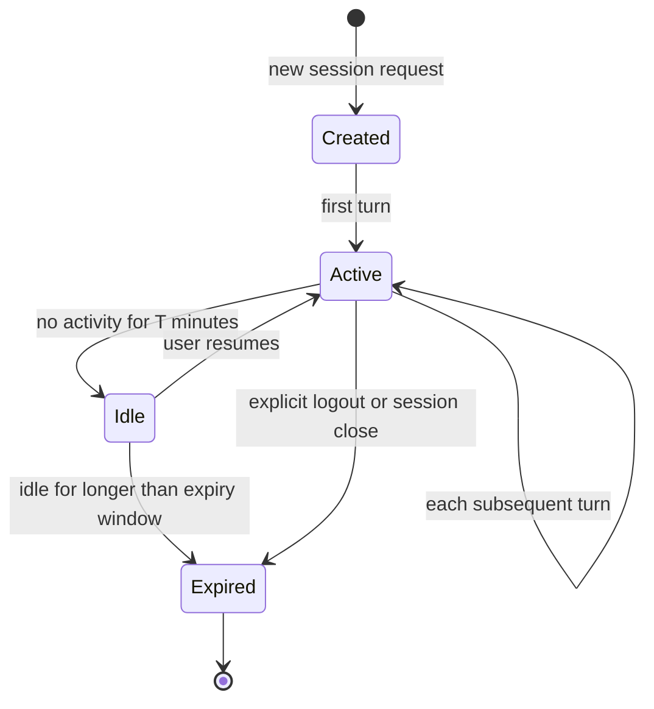

# [AEE-704] 工作階段管理

## 情境

每次呼叫都從零開始的代理，無法處理跨多個回合的任務。它無法在失敗後恢復，也無法記住先前在長任務中所做的決策。工作階段管理（session management）是 harness 對此問題的解方：它定義了什麼是連續性的單元、哪些狀態在回合之間被保留，以及這些狀態如何被儲存與恢復。

若缺少明確的工作階段管理，每個回合都是全新的開始。有了它，代理便能跨越時間、分頁與重啟持續作業。

## 設計思維

**工作階段**（session）是 harness 的連續性單元。它是一個容器，存放代理對進行中對話所知道的一切：訊息歷史、啟用的工具、啟用的技能、使用者身份，以及當前的權限授予。工作階段讓代理能在回合之間「記住」事情。

工作階段有其生命週期。它們被建立、進入活躍狀態、可能閒置、可以恢復，最終過期（expiry）。harness 負責管理這個生命週期——按需建立工作階段、在回合之間持久化狀態、在重啟後恢復工作階段，以及讓閒置過久的工作階段過期。

**RFC 2119：**

- 工作階段 MUST 依使用者隔離。一個使用者的工作階段歷史 MUST NOT 以直接方式或透過模型上下文的方式被另一個使用者存取。
- 工作階段歷史 MUST NOT 跨越使用者邊界共享。跨使用者的歷史洩漏是安全性故障，而非效能問題。
- 工作階段 SHOULD 具有可設定的過期時間。永不過期的工作階段最終會消耗無限的儲存空間，並可能提供過時的上下文。

## 深入探討

### 工作階段內容

設計良好的工作階段記錄包含：

| 欄位 | 類型 | 說明 |
|---|---|---|
| `session_id` | string (UUID) | 唯一識別碼；用於檢索和稽核 |
| `user_id` | string | 此工作階段所屬的使用者；強制執行隔離 |
| `created_at` | timestamp | 工作階段開始的時間 |
| `last_active_at` | timestamp | 最後一個回合的時間戳記；用於計算過期時間 |
| `history` | array of messages | 此工作階段的完整對話歷史 |
| `active_tools` | array of tool names | 此工作階段中啟用的工具 |
| `active_skills` | array of skill refs | 此工作階段載入的技能 |
| `permissions` | permission grant object | 代理在此工作階段被允許執行的操作 |
| `metadata` | key-value object | 應用程式特定資料（任務 ID、專案等） |

### 歷史持久化策略

歷史持久化（history persistence）的常見策略比較：

| 策略 | 持久性 | 查詢能力 | 操作成本 | 適用情境 |
|---|---|---|---|---|
| 記憶體內 | 重啟後遺失 | 快速、在程式內 | 低 | 開發環境、短期工作階段 |
| 檔案 (JSON/JSONL) | 重啟後存活 | 僅能以 Grep 搜尋 | 低 | 簡單部署、單程式代理 |
| 資料庫 (SQL/NoSQL) | 持久、可複製 | 完整查詢支援 | 中 | 生產環境、多使用者、多工作階段 |

對於具有多個使用者的生產部署，請使用資料庫。若無額外的鎖定機制，記憶體內和檔案策略無法安全地支援並發工作階段。

### 工作階段邊界與可恢復的工作階段

長時間執行的任務可能跨越多個工作階段——例如，一個跨兩個獨立工作期間執行的程式碼重構任務。為支援可恢復的工作階段：

1. **在每個回合結束時寫入檢查點（checkpoint）。** 在每個回合結束時，而非僅在工作階段結束時，將完整的工作階段狀態寫入持久儲存。
2. **產生恢復令牌（resume token）。** 使用者取得一個工作階段 ID 或令牌，可用於恢復。
3. **恢復時注入檢查點上下文。** 恢復時，harness 載入序列化的工作階段，並注入簡短摘要：「你正在處理 X。最後動作：Y。當前狀態：Z。」

### 狀態：工作階段 vs. 外部記憶體

並非所有狀態都屬於工作階段。

| 狀態類型 | 所屬位置 | 原因 |
|---|---|---|
| 當前回合歷史 | 工作階段 | 每個回合都需要；必須在上下文中 |
| 活躍技能與工具 | 工作階段 | 很少變更；上下文組裝時需要 |
| 當前任務的工作筆記 | 工作階段 | 暫時性，任務範圍的 |
| 長期使用者偏好 | 外部記憶體（external memory） | 跨工作階段持久；按需檢索 |
| 領域知識 | 外部記憶體 | 對上下文來說太大；選擇性檢索 |
| 專案檔案與產出物 | 檔案系統 / 資料庫 | 不是對話狀態 |

### 工作階段安全性

工作階段隔離（session isolation）是 harness 必須實作的工程要求。生產多使用者代理 SHOULD 強制執行：

- **使用密碼學隨機的工作階段 ID。** 可預測的工作階段 ID（連續整數、時間戳記）允許工作階段枚舉。最低使用 UUID v4。
- **查詢時驗證使用者 ID。** 驗證工作階段記錄中的 `user_id` 與已驗證的使用者相符，方可返回工作階段資料。僅以 session_id 查詢，允許任何已驗證的使用者讀取任何工作階段。
- **對敏感工作階段進行靜態加密。** 包含工具輸出、使用者輸入或憑證的工作階段 SHOULD 進行靜態加密。
- **安全處理工作階段令牌。** 將傳遞給客戶端的工作階段令牌視為憑證——僅透過 HTTPS 傳輸；對於網路部署，使用 HttpOnly cookie；對於其他客戶端，使用適合該平台的安全儲存。

## 視覺化

## 最佳實踐

1. **在每個回合後寫入檢查點，而非僅在工作階段結束時。** 只在對話結束時持久化狀態的工作階段，若 harness 在回合中途崩潰，將遺失一切。在每個回合結束時將更新的歷史和狀態寫入儲存。每個回合額外一次寫入的成本，與遺失一個 50 回合工作階段的成本相比微不足道。

2. **在開發環境中積極讓閒置工作階段過期。** 開發中較短的過期視窗（15--30 分鐘）迫使你盡早實作並測試恢復路徑。較長的過期視窗會隱藏工作階段管理程式碼中的缺口，直到它們在生產環境中於不方便的時機浮現。

3. **將工作階段生命週期事件記錄到稽核追蹤中。** 工作階段建立、工作階段恢復、工作階段過期——這些事件回答了當出錯時「代理在做什麼以及何時做」的問題。在每個生命週期事件日誌條目中包含 user_id、session_id 和時間戳記。

## 相關 AEE

- [AEE-700](700) -- 什麼是 Harness？
- [AEE-703](703) -- 上下文組裝
- [AEE-705](705) -- 權限模型

## 參考資料

- [Building Effective Agents - Anthropic](https://www.anthropic.com/research/building-effective-agents)
- [Effective harnesses for long-running agents - Anthropic Engineering](https://www.anthropic.com/engineering/effective-harnesses-for-long-running-agents)

## 更新記錄

- 2026-04-14 -- 初稿
