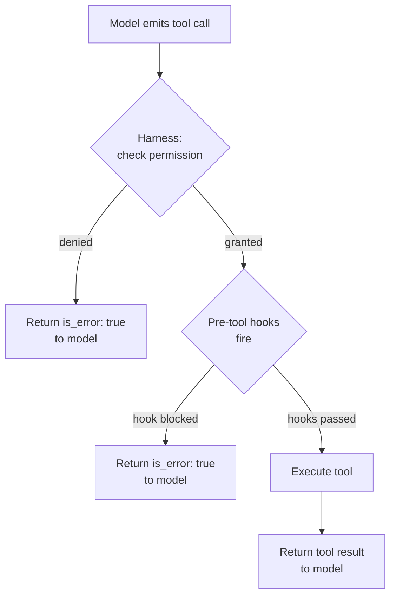

# [AEE-705] 權限模型

## 情境

一個可以呼叫任何已知工具的代理，就是一個可能造成意外損害的代理。問題不在於工具能做什麼，而在於代理是否在此情境下被授予權限去執行該動作。權限管理是一種架構約束，決定了代理在「決定要做什麼」之前「能做什麼」。

把權限視為事後追加安全功能的工程師，最終會讓權限檢查散落在各個工具實作中。把權限視為架構約束的工程師，則會將其建構進 harness 的工具調度 (tool dispatch) 層，在那裡可以一致地執行、集中審計，並且不需要更動工具程式碼就能更新。

## 設計思維

**權限** (permission) 不是安全功能，而是決定代理在「決定要做什麼」之前「能做什麼」的架構約束。能力 (capability) 與權限的區別至關重要：一個工具「能夠」刪除檔案，並不代表代理「有權限」刪除檔案。能力是工具實作所支援的事項；權限是 harness 所授予的事項。

執行應屬於 harness，而非工具本身。一個在執行前自行檢查權限的工具，是在彌補一個本不應派送該呼叫的 harness 的不足。
Harness 應在調度前執行權限；工具應假設自身已獲授權。

- Harness 在派送工具呼叫前 **必須 (MUST)** 先執行權限檢查。一個已到達工具實作的工具呼叫，**必須 (MUST)** 已經過授權。
- 工具 **不得 (MUST NOT)** 以自身的權限檢查來替代 harness 的執行。工具層級的權限檢查是在彌補 harness 的不足，並導致無法維護的權限邏輯散落在整個程式碼庫中。
- 權限模型 (permission model) **應該 (SHOULD)** 遵循最小權限原則 (principle of least privilege)：從無能力開始，僅授予當前任務所需的能力，完成後撤銷。

## 深入探討

### 能力與權限

| 概念 | 定義 | 控制者 |
|---|---|---|
| 能力 (Capability) | 工具實作能做的事 | 工具作者 |
| 權限 (Permission) | 代理是否被授予使用該能力 | Harness 操作者 |

一個 `file_delete` 工具具有刪除檔案的*能力*。代理在當前 session 中是否有*權限*呼叫 `file_delete`，取決於為該 session 設定的權限授予。這是兩個獨立的關注點。

### 權限授予模型

三種模型，從最簡單到最動態：

**1. 靜態設定 (Static configuration)** — 在部署時於設定檔中定義權限。所有 session 共用相同的權限集。

```yaml
# harness.config.yaml
permissions:
  allow:
    - read_file
    - search_web
    - write_file
  deny:
    - execute_shell
    - delete_file
```

簡單且易於審計，但缺乏彈性。Deny 優先於 allow。

**2. 動態逐請求授予 (Dynamic per-request)** — 由使用者在執行期間授予權限。Claude Code 採用此模型：在需要較高權限的動作之前，它會向使用者提示確認。

```python
def request_permission(tool_name: str, user: User) -> bool:
    if tool_name in user.pre_granted:
        return True
    return prompt_user(f"Allow agent to use {tool_name}? [y/n]")
```

靈活但對每次新的工具呼叫增加了摩擦。適用於使用者必須保持對能力授予控制權的情境。

**3. 使用者委派 (User-delegated)** — 代理繼承已驗證使用者的權限。當代理代表特定使用者在現有權限系統內行動時使用（例如，遵循使用者文件存取控制的企業知識代理）。

### 最小權限原則

應用於代理：從無能力開始。僅授予當前任務所需的能力。完成後撤銷。

實際步驟：
1. 為每種任務類型定義最小工具集。
2. 當該任務類型的 session 啟動時，僅授予該集合。
3. 除非使用者明確同意，否則不在 session 中途擴展授予。
4. Session 結束時，記錄已使用的與已授予的工具（未使用的授予是移除的候選）。

### 執行期間的範圍縮減 (Scope Narrowing)

即使在同一個 session 中，也可以縮減活躍工具集。如果任務處於「唯讀」階段，在該階段停用寫入工具：

```python
session.restrict_tools(["read_file", "search_web"])  # restrict to read-only
result = run_agent_phase(session, phase="analysis")
session.restore_tools()  # restore full grant for next phase
```

### 權限執行流程

執行發生在 harness 派送工具之前。模型永遠不會看到拒絕訊息——harness 在未授權的呼叫被派送之前就將其攔截。

```python
def dispatch_tool(tool_name: str, input: dict, session: Session) -> ToolResult:
    # 1. Check permission grant
    if tool_name not in session.permissions.allow:
        return ToolResult(
            is_error=True,
            content=f"Tool '{tool_name}' is not permitted in this session."
        )

    # 2. Fire pre-tool hooks (including audit logging)
    hook_result = hooks.fire("pre_tool", tool_name=tool_name, input=input, session=session)
    if hook_result.blocked:
        return ToolResult(is_error=True, content=hook_result.reason)

    # 3. Execute tool
    return tools[tool_name].execute(input)
```

### Claude Code 權限系統

Claude Code 實作了具有靜態設定層的動態逐請求模型。設定定義於 `settings.json`（使用者層級：`~/.claude/settings.json`，專案層級：`.claude/settings.json`）的 `permissions` 鍵下，包含 `allow`、`deny` 和 `ask` 陣列。Deny 優先於 `ask`，`ask` 優先於 `allow`。

規則語法支援指定符：`Bash(npm run test *)` 僅允許符合該模式的 Bash 命令；`Read(./.env)` 允許讀取特定檔案。

```json
{
  "permissions": {
    "allow": ["Bash(npm run test *)", "Read(./.env)"],
    "deny": ["Bash(rm *)", "Write(**/.env)"],
    "ask": ["WebFetch"]
  }
}
```

**執行範圍注意事項：** 權限 deny 規則適用於代理的直接工具呼叫。它們不會自動阻止已授權的工具（例如 `Bash`）在內部存取原本會被拒絕的資源。權限規則縮小了攻擊面；它們不提供完全隔離的沙箱環境。如需完全隔離，請參閱 AEE-406。

## 視覺化



## 最佳實踐

1. **將預設權限集定義為空。** 從不授予任何工具開始，然後僅添加任務所需的工具。從「允許所有工具」開始的代理會以意外的方式使用工具。從無工具開始並被授予特定集合的代理，則保持在其職責範圍內。

2. **在一個地方執行權限。** 如果 harness 派送層和工具實作內部都存在權限邏輯，它們將會出現分歧。當 harness 更新時，工具內的檢查會被遺忘。選擇 harness 派送層，僅在那裡執行權限。

3. **記錄每次權限拒絕。** 權限拒絕是安全事件。記錄每次拒絕的工具名稱、session ID、使用者 ID 和時間戳。一系列拒絕可能表示提示注入攻擊或 session 設定錯誤。

## 相關 AEE

- [AEE-700](700) -- 什麼是 Harness？
- [AEE-702](702) -- 生命週期 Hooks
- [AEE-406](../Tool Use and Execution/406) -- 沙箱與執行安全

## 參考資料

- [Claude Code Permissions documentation](https://code.claude.com/docs/en/permissions)
- [Building Effective Agents - Anthropic](https://www.anthropic.com/research/building-effective-agents)
- [Principle of Least Privilege - NIST](https://csrc.nist.gov/glossary/term/least_privilege)

## 更新記錄

- 2026-04-14 -- 初稿
