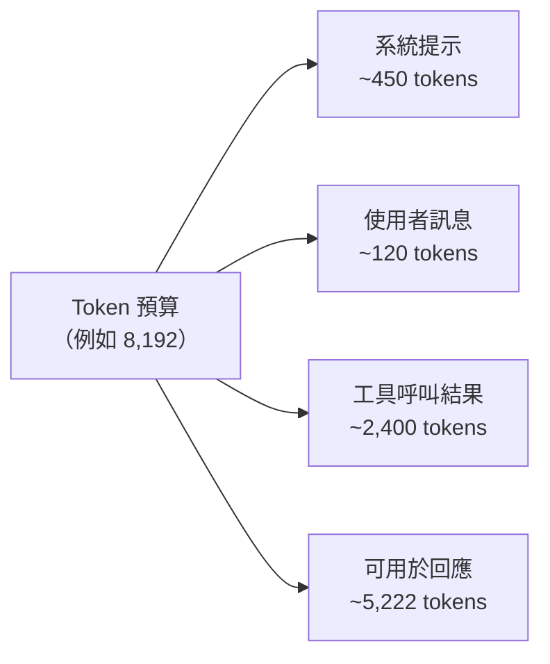

# [AEE-201] 實務中的 Token 化

## 情境

工程師與 LLM 互動的計量單位是 token：計費以 token 為單位，速率限制以 token 表示，上下文預算（context budget）也以 token 衡量。但 token 既不是詞，也不是字元。「詞數 ≈ token 數」的假設與實際計數之間的落差，就是上下文剛好容納與悄悄溢出的差距。一段看起來 300 個詞的系統提示，可能消耗 400 個 token；一批看似未超出預算的使用者輸入，在執行時可能已超限。依賴詞數估算而非精確計算 token 的工程師，將遭遇計費異常、速率限制錯誤，以及難以診斷的上下文截斷問題。精確計算 token 不是優化，而是正確性的基本要求。

## 設計思維

**Token 邊界由 tokenizer（分詞器）決定，而非人類語言單位。** BPE（位元組對編碼，Byte-Pair Encoding）將文字編碼為子詞單元（subword unit），這些單元源自訓練語料中的統計頻率。在語料中頻繁出現的常見英文詞——如 "the"、"is"、"agent"——通常是單一 token。複合詞、技術術語、專有名詞和罕見詞彙則可能拆分為兩個、三個或四個子詞 token。"tokenization" 這個詞本身，在不同 tokenizer 家族中的拆分方式也可能不同。

**特定的 tokenizer 詞表至關重要。** 不同的模型家族使用不同的編碼方式，同一段輸入文字在不同 tokenizer 下產生的 token 數量也不同。OpenAI 的 `cl100k_base` 編碼（用於 GPT-3.5-turbo 和 GPT-4）詞表約有 100,000 個 token。`o200k_base` 編碼（用於 GPT-4o、o1、o3、o4-mini 及 GPT-5 系列）詞表達 200,000 個，對非英語語言和程式碼的 token 化效率更高。Anthropic 的 Claude 模型使用自家以 SentencePiece 為基礎的 tokenizer，具有各自的詞表與邊界規則。**絕對不可**假設 token 數量可以跨模型家族通用。

- 管理上下文預算的 Agent **必須（MUST）**使用 tokenizer API 或 `tiktoken` 進行精確的 token 計算，而非詞數或字元數估算。
- Token 用量較高的工作負載的成本預估**必須（MUST）**使用精確的 token 計數。詞數不能替代 token 數。
- 以 token 為單位執行速率限制的系統，**必須（MUST）**在提交前計算 token，而非從文字長度估算。
- 跨模型的成本比較**應該（SHOULD）**考量 tokenizer 差異；同一段文字在不同供應商可能產生不同的 token 數。

在早期就採用精確的 token 計算，可預防一類在事後難以診斷的生產事故：無聲的上下文截斷、意外的計費超支，以及只在大規模時才出現的間歇性速率限制錯誤。

## 深度探討

### BPE 的實際運作

位元組對編碼（BPE）是大型語言模型最主流的 token 化演算法。它從單一位元組或字元出發，反覆合併頻率最高的相鄰對，形成一個由子詞單元組成的詞表。結果是：常見字串成為單一 token，罕見字串則被拆解為更小的片段。

tiktoken 的 README 確認，英語文字平均每個 token 約對應 4 個位元組。這意味著一個典型的 4–6 字元英文詞通常是一個 token，而較長或不常見的詞可能變成兩個或三個。關鍵的實務含義是：「1 個詞 = 1 個 token」的粗略估算會系統性地低估 token 數，而技術術語、專有名詞和非英語內容越多，誤差就越大。

### Tokenizer 家族

| 編碼 | 詞表大小 | 使用模型 |
|---|---|---|
| `cl100k_base` | 約 100,000 | GPT-3.5-turbo、GPT-4 |
| `o200k_base` | 約 200,000 | GPT-4o、o1、o3、o4-mini、GPT-5 系列 |
| Anthropic tokenizer | （內部） | Claude 模型家族 |

較大的 `o200k_base` 詞表讓更多的字元空間——包括多語言文字和常見程式碼模式——得以用單一 token 表示，與 `cl100k_base` 相比，此類輸入的 token 數因此減少。這意味著，同一個提示分別提交給 GPT-4 和 GPT-4o 可能產生不同的 token 數與不同的費用。

對於 Anthropic 模型，tiktoken 無法提供精確的 token 計數，請改用 Anthropic 的 token 計算端點（詳見下文）。

### 非英語語言與程式碼

CJK 字元（中文、日文、韓文）和原始碼通常比英語散文每單位意義需要更多 token。一個中文句子，如果英文只需 10 個 token 來表達，則可能需要顯著更多的 token，因為 CJK 文字在以英語為主訓練的 BPE 子詞單元中覆蓋率較低。`o200k_base` 詞表改善了這一點，但差距並未消除。

原始碼也有其獨特的 token 化模式。縮排空白（在 Python 中具有語義）、運算符號、底線識別符以及數字字面量，其 token 化方式均與自然語言散文不同。不要將散文的 token 估算套用到含大量程式碼的提示。

### 工程師常遇到的邊緣案例

- **多位數數字**：BPE 詞表無法表示所有可能的數字字串。大數字可能被逐位元或以小組形式 token 化，使 token 數遠超字元長度的預期。
- **URL**：URL 在標點符號處——斜線、點、連字號、查詢參數分隔符——被拆分。像 `https://api.example.com/v1/messages?model=claude-sonnet-4-6` 這樣的 URL，儘管在語義上是一個單元，卻可能 token 化為 15 個甚至更多 token。
- **程式碼中的空白**：縮排和空行都會計入 token。Python 函式使用 4 格縮排與 2 格縮排，token 數量並不相同。

當這些邊緣案例出現在工具呼叫結果、使用者提供的輸入或檢索到的文件片段中，而這些內容在提示開發階段未經測試時，就會演變為生產事故。

### 使用 tiktoken 進行精確計數

對於 OpenAI 模型，tiktoken 可在不發送網路請求的情況下提供精確的 token 計數：

```python
import tiktoken

def count_tokens(text: str, model: str = "gpt-4o") -> int:
    enc = tiktoken.encoding_for_model(model)
    return len(enc.encode(text))
```

`tiktoken.encoding_for_model` 會自動解析模型名稱對應的編碼（例如 `gpt-4o` → `o200k_base`）。若要直接指定編碼，可使用 `tiktoken.get_encoding("cl100k_base")`。

對於 Anthropic 模型，請使用 `/v1/messages/count_tokens` 端點。它接受與 Messages API 相同的結構化輸入（系統提示、訊息陣列、工具、圖片、PDF），並返回 `{ "input_tokens": N }`。此端點符合零資料保留（ZDR）條件。

## 最佳實踐

1. **對於任何管理上下文預算、按 token 計費或執行速率限制的系統，必須使用 tokenizer 進行計算。** 在組裝輸入的邊界——API 呼叫之前而非之後——整合 token 計數。OpenAI 模型使用 tiktoken；Anthropic 模型使用 `/v1/messages/count_tokens` 端點。詞數不是 token 數的替代指標。

2. **在部署前使用邊緣案例輸入測試提示。** 在測試套件中納入多位數數字、URL、非英語文字和程式碼片段，並測量實際 token 數。在測試中發現的驚喜，就是你在生產環境中避免的事故。

3. **在跨模型的成本與預算比較中考量 tokenizer 差異。** 同一段文字在不同模型家族可能產生不同的 token 數。從 GPT-4 遷移到 GPT-4o 時，tokenizer 從 `cl100k_base` 變更為 `o200k_base`；在更新成本預估之前，請先對你的實際提示執行兩種編碼並比較結果。

## 視覺化



## 相關 AEE

- [AEE-108](../Foundations and Mental Models/108) — 上下文作為資源（token 預算管理）
- [AEE-109](../Foundations and Mental Models/109) — LLM 的運作原理（介紹 BPE）
- [AEE-202](202) — 上下文視窗架構

## 參考資料

- tiktoken（OpenAI BPE tokenizer 函式庫）：<https://github.com/openai/tiktoken>
- Anthropic token 計算 API：<https://docs.anthropic.com/en/docs/build-with-claude/token-counting>
- OpenAI tokenizer 操場（僅限瀏覽器）：<https://platform.openai.com/tokenizer>

## 更新記錄

- 2026-04-14 -- 初稿
