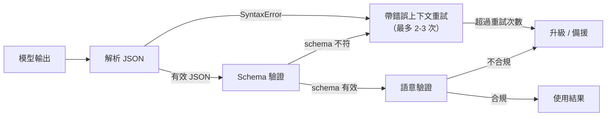

# [AEE-203] 結構化輸出設計

## 情境

代理系統（agentic system）經常需要從模型取得結構化資料：欄位擷取、附帶詮釋資料的決策、行動參數、分類結果等。JSON 模式（JSON mode）與工具呼叫 schema（tool call schema）雖有所幫助，但它們並不保證輸出符合 schema。工程師若假設模型一定符合 schema 而省略驗證，最終會建出在格式錯誤的資料悄悄流入下游消費者時才無聲失敗的系統。

## 設計思維

**JSON 模式保證的是有效的 JSON 語法，而非 schema 合規性。** 啟用 JSON 模式時，模型被限制產生可解析為 JSON 的輸出——僅此而已。模型仍可能產生鍵值錯誤、型別錯誤、缺少必要欄位，或含有 schema 不允許的額外欄位的有效 JSON。如果下游消費者嘗試從含有 `result["actions"]` 的輸出中讀取 `result["action"]`，它收到的是 `KeyError`，而非任何關於 schema 不符的有意義錯誤訊息。

**工具呼叫 schema 提供更強的約束，但仍非保證。** 函式呼叫（function calling）/ 工具使用（tool use）會將明確的 JSON Schema 定義傳給模型，並在訓練期間培養模型遵循該定義的能力。在大多數輸入下，這比純 JSON 模式可靠得多。然而，在分布偏移（distribution shift）、對抗性輸入，或複雜的巢狀 schema 下，模型仍可能產生不符合 schema 驗證的輸出。

**約束解碼（constrained decoding）是最強的形式。** 語法採樣（grammar-based sampling）在每個解碼步驟限制哪些 token 是有效的延續，在 token 層級執行語法，而非依賴模型的學習行為。這並非所有託管服務供應商都支援，但 Outlines 等函式庫（github.com/dottxt-ai/outlines）為自行托管的模型實作了此機制。

**RFC 2119 要求：**

- 任何將被程式化消費的結構化輸出，在使用前**必須（MUST）**針對目標 schema 進行驗證。
- 應用程式**不得（MUST NOT）**在未經驗證的情況下假設模型輸出符合 schema。
- 將結構化輸出傳遞給下游流程的系統，**必須（MUST）**定義驗證失敗時的重試與升級路徑。

## 深度探討

### 結構化輸出的三個層級

**第一層——JSON 模式（僅限語法）。** 模型被限制產生語法上有效的 JSON。輸出可以在不引發 `SyntaxError` 的情況下被解析，但其結構不保證符合任何特定 schema。這是最弱的結構化輸出形式。僅在需要有效 JSON 且確切結構有彈性、或供應商不支援 schema 引導輸出時才使用。

**第二層——工具呼叫 / 函式呼叫 schema（schema 引導）。** 模型在請求中收到明確的 JSON Schema（工具定義），供應商和模型都針對生成符合該 schema 的輸出進行了訓練。OpenAI 函式呼叫與 Anthropic 工具使用均以此方式運作。這是大多數生產用途的建議基準。Schema 合規性顯著優於 JSON 模式，但驗證仍是必要的，因為沒有任何供應商保證在所有輸入下都能完全符合 schema。

**第三層——約束解碼（token 層級語法約束）。** 在每個解碼步驟，有效的下一個 token 集合被限制為只有那些能形成有效語法延續的 token。由於無效 token 在採樣前即被遮蔽，模型無法產生不合規的輸出。這從根本上消除了 schema 違規，代價是需要相容的推理執行環境。Outlines 函式庫（[github.com/dottxt-ai/outlines](https://github.com/dottxt-ai/outlines)）為自行托管的模型提供語法採樣功能。

### OpenAI 結構化輸出的嚴格模式（Strict Mode）

OpenAI 透過 `response_format` 參數推出了專用的結構化輸出功能：

```json
{
  "response_format": {
    "type": "json_schema",
    "json_schema": {
      "name": "ExtractedFields",
      "schema": { ... },
      "strict": true
    }
  }
}
```

啟用 `strict: true` 後，OpenAI 會約束模型只產生符合所提供 schema 的輸出。其可靠性介於第二層與第三層之間——比一般函式呼叫的執行更強，但僅適用於 JSON Schema 功能的子集。完整的功能集與 schema 限制條件請參閱 OpenAI 結構化輸出文件。

### 為可靠性而設計的 Schema

以下是設計原則，而非實驗性主張。對人類來說容易閱讀的 schema，往往也是模型更容易遵循的 schema。

**優先選擇扁平結構，而非深度巢狀結構。** 有三層巢狀的 schema，要求模型在生成許多 token 的過程中持續追蹤上下文。錯誤會向下傳遞：第 2 層的欄位錯誤，會連帶導致第 3 層也出錯。盡可能將階層結構攤平為頂層的並列欄位。

**對有界值使用列舉（enum），而非自由文字字串。** 若某個欄位只能取五個值之一，請用 `enum` 而非 `string` 來表示。自由文字字串讓模型有空間自行創造變體（`"completed"` vs. `"complete"` vs. `"done"`）。列舉收窄了輸出空間，讓下游解析行為可預期。

**明確表達可為 null 的欄位。** 不要依賴欄位的缺席來表示「不適用」。改為將欄位宣告為可 null（`type: ["string", "null"]`），要求模型明確回傳 `null`。隱性缺席會造成歧義：欄位是遺漏的，還是模型判斷為不適用？

**避免 `additionalProperties: true`。** 允許任意額外欄位，會讓模型有機會幻構（hallucinate）不在 schema 中的鍵值。除非有特定理由，否則設定 `additionalProperties: false`，讓額外欄位被標記為 schema 違規。

### 驗證管道（Validation Pipeline）

結構化輸出的驗證應是多階段的管道，而非單一步驟的檢查。

**第一階段——解析 JSON。** 嘗試將模型輸出的字串解析為 JSON。此階段的 `SyntaxError` 表示輸出根本不是有效的 JSON。在 JSON 模式或工具呼叫 schema 下這應屬罕見，但並非不可能。

**第二階段——Schema 驗證。** 使用函式庫（如 Python 的 Pydantic、TypeScript 的 Zod，或 JSON Schema 驗證器）將解析後的 JSON 對照目標 schema 進行驗證。這會捕捉到錯誤的鍵值、錯誤的型別、缺失的必要欄位，以及不允許的額外屬性。Schema 驗證錯誤應包含足夠的細節，以便為重試提示詞建構有用的錯誤訊息。

**第三階段——語意驗證。** 套用 schema 無法表達的業務邏輯檢查。例如：日期欄位包含有效的 ISO 8601 字串，但代表過去的日期，而業務要求是未來日期；數值欄位符合 JSON Schema 的 `minimum`/`maximum` 範圍，但違反領域不變量。語意驗證失敗較難透過重試恢復——通常代表提示詞或 schema 設計問題，而非模型生成錯誤。

### 重試策略

當驗證在第一或第二階段失敗時，在重試提示詞中附上驗證錯誤訊息以及原本失敗的輸出。這讓模型有具體資訊來修正特定錯誤，而非從頭重新生成一個回應。

典型的重試提示詞：

```
您的上一次回應未能通過 schema 驗證，錯誤如下：
<error>
{validation_error_message}
</error>

您的上一次輸出為：
<output>
{failed_output}
</output>

請修正輸出以符合所要求的 schema。
```

重試次數限制在 2–3 次。超過此門檻，失敗幾乎必然是系統性問題：schema 對模型而言過於複雜、提示詞規格不足，或輸入資料本身不支援產生所需的輸出。此時應升級處理，而非無限重試。

記錄所有驗證失敗。第一階段失敗率偏高，表示 JSON 模式或工具呼叫設定有問題。特定欄位的第二階段失敗率偏高，表示該欄位的 schema 設計有問題——模型可能難以可靠地產生該欄位。失敗是診斷訊號。

## 最佳實踐

1. **只要供應商支援，優先使用工具呼叫 schema，而非純 JSON 模式。** 工具呼叫 schema 提供明確的結構供模型遵循，能產生更一致的輸出。純 JSON 模式只保證語法有效，不保證 schema 合規。

2. **為可靠性設計 schema：扁平優於巢狀，列舉優於字串，明確表達可為 null 的欄位。** 對人類而言容易閱讀的 schema，對模型而言也更容易遵循。除非有特定理由，否則移除 `additionalProperties: true`。

3. **消費前務必完整驗證：解析、schema 驗證、語意驗證。記錄所有失敗。** 驗證失敗是診斷訊號，不是應吞下的錯誤。特定欄位的高失敗率，正是提示你該修改該欄位的 schema 或提示詞描述。

## 視覺化



## 相關 AEE

- [AEE-110](../Foundations and Mental Models/110) — LLM 的限制與失效模式（幻覺與推理侷限）
- [AEE-204](204) — 系統提示詞工程（提示詞可以約束輸出格式）

## 參考資料

- OpenAI 結構化輸出：<https://platform.openai.com/docs/guides/structured-outputs>
- Anthropic 工具使用：<https://docs.anthropic.com/en/docs/build-with-claude/tool-use>
- Outlines — 結構化文字生成函式庫：<https://github.com/dottxt-ai/outlines>

## 更新記錄

- 2026-04-14 -- 初稿
