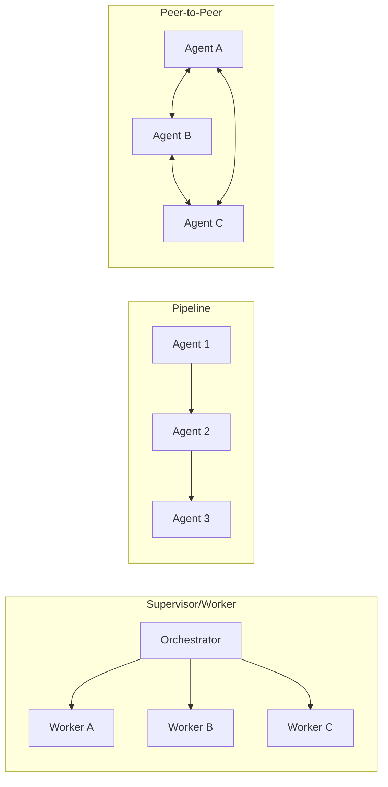

# [AEE-600] 何時協作多個代理

## 情境

大多數能由單一代理（agent）解決的代理任務，就應該由單一代理解決。多代理（multi-agent）架構並非一種升級——它是一種具有不同失敗模式的不同系統。單一代理只有一個情境視窗、一個代理循環、一個錯誤介面。多代理系統將這些介面乘以你部署的代理數量，再在上層疊加協作編排（orchestration）邏輯。

工程師在遇到單一代理無法突破的天花板（ceiling）時，才會考慮多代理系統。本文定義了這道天花板，並介紹安全突破它的工程紀律。600 系列（AEE-601 至 AEE-606）涵蓋一旦確認多代理架構確有必要之後的所有後續內容。

## 設計思維

單一代理的天花板由其情境視窗、已指派的工具，以及可用時間所決定。多代理系統的存在，是為了突破這道天花板——但它引入了單代理系統所不需面對的協調成本（coordination cost）。在不理解這些成本的情況下就採用多代理架構的工程師，所建構的系統會比一個設計良好的單代理更慢、更脆弱、更難除錯。

本類別的規則：

- 工程師**不得（MUST NOT）**在單一代理能於其情境視窗與時間預算內完成任務的情況下使用多代理架構。
- 多代理系統**應（SHOULD）**僅在某個特定天花板（情境、工具、時間或規模）已被確認為瓶頸時才引入。

## 深入探討

### 單代理的天花板

單一代理在三個不同維度上會耗盡能力：

**情境。** 任務所需的 token 數超過單一情境視窗所能容納的上限。包含數百個檔案的程式碼庫、橫跨數千頁的文件語料庫，或需要同時掌握許多獨立來源的研究任務——無論提示詞管理得多麼精細，這些都無法塞入單一情境視窗。這是轉向多代理架構最常見的正當理由。

**工具。** 任務需要在單一代理的工具集中相互衝突的專業能力。同時執行程式碼與瀏覽網頁的代理，其工具 schema 比任一個專門化代理都更龐大複雜。更糟的是，某些工具組合在捆綁時會帶來安全或正確性風險——具備生產系統寫入權限的代理，不應同時擁有不受限制的網路存取。將這些關切分離到具備受限工具集的專屬代理中，更安全也更可靠。

**時間。** 任務有截止期限，需要平行執行才能達成。有些任務在結構上是循序的；有些則可分解為能夠同時進行的獨立子任務。當單一代理循序工作無法滿足時間預算時，跨多個代理的平行執行就是適當的解法。

### 協調成本

每一次代理對代理的互動都是潛在的失敗點。這不是理論上的顧慮——它是多代理系統在實務中失敗的主要原因。

- **情境重建。** 每次交接（handoff）都需要協作編排器（orchestrator）為工作者（worker）重新建構情境。工作者不會繼承協作編排器的對話歷史。工作者所需的任何資訊都必須明確包含在其啟動提示詞中。
- **結果驗證。** 每個工作者的結果在使用前都必須經過驗證。在不同情境下運作的工作者，可能產出技術上正確但與協作編排器對整體任務所做假設不一致的輸出。
- **狀態管理。** 共享狀態需要明確的鎖定或循序處理。兩個工作者寫入同一個檔案、資料庫記錄或共享資料結構，將產生單一代理循序執行永遠不會遇到的衝突。
- **失敗介面倍增。** 一個 5 代理系統有 4 個交接介面；每一個都可以獨立失敗。協作編排器未能偵測並復原的單一交接失敗，可能在最終結果中留下無聲的錯誤。

這些成本是真實且不可忽視的。引入多代理架構的決策必須由已確認的天花板驅動，而非架構複雜性的吸引力。

### 多代理設計檢查清單

在建構多代理系統之前，回答以下每一個問題。未回答的問題就是未解決的失敗模式。

1. **要突破的是哪個具體天花板？** 明確說出來：情境、工具、時間或規模。若答案含糊，代表架構的引入尚不成熟。
2. **哪種拓撲（topology）符合協調模式？** 監督者/工作者（supervisor/worker）、循序流水線（pipeline）或點對點（peer-to-peer）網格，各自適合不同的任務結構。（AEE-601）
3. **代理之間如何通訊，輸出契約是什麼？** 每個代理邊界都需要定義好的輸入格式與輸出 schema。未定義的契約產生未定義的行為。（AEE-602）
4. **協作編排器將如何分解與委派工作？** 靜態分解（預先定義的子任務）與動態分解（協作編排器在執行時決定子任務）具有不同的複雜度與可靠性特性。（AEE-603）
5. **哪些任務可以平行執行，結果如何合併？** 識別獨立子任務、合併邏輯與同步點。（AEE-604）
6. **失敗復原計畫是什麼？** 針對每個交接介面，定義工作者失敗、回傳非預期輸出，或完全沒有回應時的處理方式。（AEE-606）

## 最佳實踐

1. **從能解決問題的最簡拓撲開始。** 監督者分派工作者比點對點網格更容易除錯。從這裡出發，只有在較簡單的拓撲明確無法處理你的任務所需的協調模式時，才移向更複雜的拓撲。

2. **在撰寫任何程式碼之前，明確定義代理邊界。** 每個代理應有單一明確的角色與定義好的輸出契約——對它接收什麼、產出什麼，以及不負責什麼的精確描述。角色模糊的代理會隨時間累積職責，成為多代理系統中的單體架構（monolith）等價物。

3. **優先採用無狀態工作者。** 在啟動時從協作編排器接收完整情境的工作者，比維護自身工作階段狀態的工作者更容易重試、替換與推理。無狀態工作者在失敗時可以乾淨地重新啟動。有工作階段狀態的工作者則需要協作編排器管理該狀態的連續性——這會隨工作者數量增加而擴大協調成本。

## 視覺化

多代理系統最常見的三種拓撲類型，並排呈現：

**監督者/工作者（Supervisor/Worker）** — 協作編排器分解任務並委派給專屬工作者。工作者只將結果回報給協作編排器；它們彼此之間不通訊。最容易除錯；建議作為預設的起始拓撲。

**流水線（Pipeline）** — 每個代理依定義的順序處理前一個代理的輸出。適合具有可預期的有序結構、且每個階段都有明確轉換職責的任務。

**點對點（Peer-to-Peer）** — 代理之間直接通訊，無中央協調者。最靈活；協調成本最高。適合需要代理辯論發現結果並相互挑戰結論的協作調查任務。

## 相關 AEE

- [AEE-3](../Foundations and Mental Models/3) -- 代理工程等級
- [AEE-501](../Agent Skills/501) -- 什麼是代理技能
- [AEE-700](../Harness Engineering/700) -- 什麼是執行框架？
- [AEE-701](../Harness Engineering/701) -- 代理循環
- [AEE-601](601) -- 代理角色與拓撲
- [AEE-602](602) -- 代理通訊
- [AEE-603](603) -- 任務分解與委派
- [AEE-604](604) -- 並行與同步
- [AEE-606](606) -- 多代理失敗模式

## 參考資料

- [Building effective agents - Anthropic Research](https://www.anthropic.com/research/building-effective-agents)
- [Sub-agents - Claude Code Documentation](https://code.claude.com/docs/en/sub-agents)
- [Agent teams (experimental) - Claude Code Documentation](https://code.claude.com/docs/en/agent-teams)

## 更新記錄

- 2026-04-15 -- 初稿
