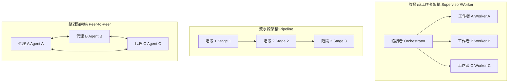

# [AEE-601] 代理角色與拓撲

## 背景脈絡

多代理系統（multi-agent system）的失敗方式因拓撲（topology）而異。監督者/工作者架構（supervisor/worker topology）的失敗點在於監督者（orchestrator）本身——一個元件倒下，所有依賴它的工作都會停擺。流水線架構（pipeline topology）的失敗點在於輸出有問題的那個階段，且這個錯誤會在下游悄悄傳播，直到後續階段偵測到或最終輸出錯誤才會被發現。點對點架構（peer-to-peer topology）則是同時在所有地方失敗，因為每一條連線都是潛在的協調失敗點，且沒有單一的主控端來偵測或恢復。

最危險的拓撲是「意外形成」的那種。沒有刻意選擇拓撲的工程師，幾乎都會在不知不覺中建出點對點網格（peer-to-peer mesh）：代理（agent）A 需要與代理 B 溝通，B 需要詢問 C，C 又回頭呼叫 A。每一條連線當下看起來都有其必要。最終的結果是一個每個代理都與其他代理緊密耦合的系統，除錯時必須追蹤 N 個節點之間的路徑，任何一個代理的介面改動都可能波及所有其他代理。

優先選定拓撲，能將後續所有設計決策約束在一個更小、更可管理的空間中。拓撲決定了協調成本（讓代理保持一致需要多少工作量）、失敗面（哪些元件可能出問題，出問題的方式為何）以及系統的可除錯性（追蹤問題根源的難易程度）。

## 設計思考

拓撲是多代理系統中的第一個架構決策。在決定代理之間如何溝通或如何分配任務之前，必須先決定代理之間的關係結構。拓撲決定了協調成本、失敗面以及系統的可除錯性。

三種標準拓撲：

- **監督者/工作者架構** — 一個協調者將任務委派給 N 個獨立工作者，再彙整其結果。
- **流水線架構** — 代理依序排列，每個代理轉換前一個階段的輸出。
- **點對點架構** — 代理之間直接溝通，沒有中央主控端。

**RFC 2119：**

- 多代理系統中，每個代理在實作開始前，MUST 明確定義其唯一的主要角色（role）。
- 拓撲 MUST 在實作開始前選定——事後將拓撲套用到既有系統，幾乎等同於完整重寫。
- 拓撲的變更 SHOULD 視為架構層級的異動，需要獨立的審查與遷移計畫。

## 深入探討

### 三種標準拓撲

| 拓撲 | 結構 | 協調成本 | 失敗面 | 適用情境 |
|---|---|---|---|---|
| 監督者/工作者架構 | 一個協調者，N 個工作者 | 低 — 單一主控端 | 協調者本身 | 可並行的獨立任務 |
| 流水線架構 | 代理依序排列 | 低 — 無共享狀態 | 每個依序執行的階段 | 多階段資料轉換 |
| 點對點架構 | 代理直接互通 | 高 — N² 協調複雜度 | 每一條連線 | 協作式問題解決（少見）|

#### 監督者/工作者架構

單一的協調者代理（orchestrator agent）負責協調整個系統。它接收頂層任務，將其分解為子任務，把每個子任務委派給對應的工作者代理（worker agent），最後將工作者的結果彙整為最終輸出。工作者之間不互相溝通——它們從協調者接收任務，並將結果回傳給協調者。

**適用時機：** 任務可分解為彼此獨立的子任務，工作者之間不需要協調。協調者能評估每個工作者的結果是否可接受，再進行彙整。

**主要失敗模式：** 協調者是單點故障（single point of failure）。若協調者遺失工作者的完成狀態、產生不良的任務分解，或在彙整途中失敗，整個任務便會失敗。工作者失敗可以恢復（協調者可以重試工作者）；協調者失敗則無法自動恢復。

**範例：** 一個程式碼審查代理（協調者）生成三個工作者代理——分別負責資安問題、效能、測試覆蓋率——再將其發現整合成一份報告。

#### 流水線架構

代理排列成固定的順序。每個代理接收前一個代理的輸出，加以轉換後傳遞給下一個代理。各階段之間無共享狀態；每個代理的唯一輸入，就是它從上游收到的內容。

**適用時機：** 任務具有自然的依序結構，每個步驟必須完成後才能進行下一個，且前一步驟的輸出即是下一步驟的完整輸入。多階段文件轉換（擷取 → 解析 → 摘要 → 翻譯）是典型範例。

**主要失敗模式：** 錯誤輸出的靜默傳播。若第 2 階段產生細微的錯誤輸出，第 3 階段無從得知——它只看得到它收到的內容。錯誤隨每個階段累積，最終輸出可能以難以追溯的方式出錯。在各階段之間加入程式化的驗證閘門（programmatic gate，驗證輸出格式或內容後再傳遞至下游）是主要的緩解手段。

**範例：** 一個研究流水線，代理 1 擷取文件，代理 2 提取關鍵事實，代理 3 將事實彙整為結構化報告。

#### 點對點架構

代理之間直接溝通，沒有中央主控端；任何代理都可以主動與其他代理通訊。協調是透過代理間的互動自發形成，而非由單一協調者驅動。

**適用時機：** 任務需要代理積極挑戰彼此的推論、迭代共同假設，或協商結果。多個代理調查相互競爭的假設並辯論發現結果的除錯情境，是目前最有文獻支持的使用案例。只有在直接代理協作是明確需求時才使用此拓撲——協調成本相當高。

**主要失敗模式：** N² 協調複雜度。隨著代理數量增加，潛在通訊路徑呈二次方成長。沒有單一主控端能偵測代理卡住、輸出不良，或與另一個代理陷入協調迴圈的情況。除錯時必須追蹤整個代理圖中的路徑。

**範例（實驗性）：** 一個根因分析小組，五個代理各自調查不同的假設，並積極挑戰彼此的發現，以收斂到最具說服力的解釋。

### 混合拓撲

兩種模式可在更大或更複雜的系統中擴展標準的三種拓撲。

**階層式架構（hierarchical topology）** 是在監督者之上再加一層監督者——一個頂層協調者管理一組子協調者，每個子協調者各自管理其工作者池。當任務規模超出單一協調者的有效管理範圍時使用：工作者數量超過單一協調者可追蹤的上限，或任務可分解為各自獨立管理的大型領域。階層式系統的失敗面存在於每一個協調者層級；子協調者失敗會使其工作者池停擺，但不影響整個系統的其他部分。

**審查迴圈（review loop）** 並非基礎拓撲——它是套用在監督者/工作者架構之上的品質保證模式。工作者產出輸出，另一個審查者代理（reviewer agent）對其評估，若評審失敗，輸出會回傳給工作者進行修訂。迴圈持續直到審查者滿意或達到重試上限。Anthropic 的 Level 7 分析中指出的關鍵原則：實作者與審查者必須是不同的代理實例——同一個實例評估自己的輸出會引入偏誤，審查便無法發現原本的錯誤。

### 定義代理角色

一個定義良好的代理角色（role）包含五個要素：

- **一個描述代理行為的名稱**（而非代理的身份）。「code-reviewer」描述行為；「reviewer-agent」描述身份。描述行為的名稱讓輸出合約（output contract）自我說明。
- **主要職責** — 代理最擅長的一件事。擁有兩個主要職責的代理是兩個代理的合體；當第一個職責耗盡了代理的上下文（context），第二個職責的表現將難以預測。
- **輸入合約（input contract）** — 代理開始工作時接收的內容。包含格式、必要欄位，以及任何前置條件。
- **輸出合約（output contract）** — 代理完成時產出的內容。包含格式、成功條件，以及下游代理或協調者需要如何處理它。
- **錯誤合約（error contract）** — 代理無法完成時回傳的內容。若代理在失敗時回傳非結構化的字串，呼叫端就必須解析自然語言才能判斷出了什麼問題。

需要避免的反模式是「包辦一切」的代理（do-everything agent）：一個隨著時間被賦予多個不相關角色、逐漸淪為行為不一致的通才代理（generalist agent）。包辦一切的代理通常源於把新能力加到既有代理比定義新角色更省事。代價在除錯時才顯現：代理的行為取決於哪個角色被特定輸入觸發，而角色之間的交互作用在邊緣情境下會產生難以預測的輸出。

### 專才與通才

專才代理（specialist agent）與通才代理之間的選擇，是輸出品質與協調開銷之間的取捨。

**專才代理** 在其狹窄任務上產出更可預期的結果。只做資安審查的程式碼審查代理，會比同時做資安、效能和風格審查的代理更為一致。代價是協調開銷：代理越多，交接越多，需要維護的介面合約越多，交接失誤的機會也越多。

**通才代理** 的協調開銷較低——代理越少，交接越少。代價是在特定任務上的輸出較難預期，且代理失敗的爆炸半徑更大（一個失敗的通才代理會阻塞比失敗的專才代理更多的工作）。

實用的判斷原則：**當輸出品質比協調成本更重要時，選擇專才；當可靠性與簡單性比輸出品質更重要時，選擇通才。** 需要高品質專業輸出的系統（程式碼審查、法律文件分析、醫療摘要）從專才化中受益；需要以最少基礎設施可靠完成任務的系統，則從通才化中受益。

## 最佳實踐

1. **優先選擇監督者/工作者架構。** 這是最容易除錯和理解的拓撲：單一主控端、責任清晰、工作者的失敗相互隔離。只有在資料流具有明確的順序結構、且每個步驟的輸出是下一個步驟的完整輸入時，才改用流水線架構。只有在有明確、文件化的直接代理協作需求，且無法透過監督者/工作者分解滿足時，才改用點對點架構。

2. **以代理的行為而非身份來命名角色。**「code-reviewer」優於「reviewer-agent」；「document-summarizer」優於「summarizer」。描述行為的名稱讓輸出合約自我說明——閱讀協調者的任務委派時，不需要看工作者的系統提示就能知道每個工作者會產出什麼。

3. **在撰寫代理的系統提示之前，先寫好輸出合約。** 如果你無法用一句話描述代理會回傳什麼，這個角色尚未定義清楚。輸出合約是規格；系統提示是實作。在規格之前先寫實作，會讓代理的輸出由模型碰巧回傳什麼來隱性定義，一旦模型行為改變就會失效。

## 視覺化

## 相關 AEE

- [AEE-600](600) -- 何時協調代理（When to Coordinate Agents）
- [AEE-602](602) -- 代理通訊（Agent Communication）
- [AEE-603](603) -- 任務分解與委派（Task Decomposition and Delegation）
- [AEE-605](605) -- 協調模式（Orchestration Patterns）
- [AEE-606](606) -- 多代理失敗模式（Multi-Agent Failure Modes）
- [AEE-700](../Harness Engineering/700) -- 什麼是 Harness？（What Is a Harness?）

## 參考資料

- [Building Effective Agents - Anthropic](https://www.anthropic.com/research/building-effective-agents)
- [Sub-agents - Claude Code](https://code.claude.com/docs/en/sub-agents)
- [Agent Teams (experimental) - Claude Code](https://code.claude.com/docs/en/agent-teams)

## 更新紀錄

- 2026-04-15 -- 初稿
