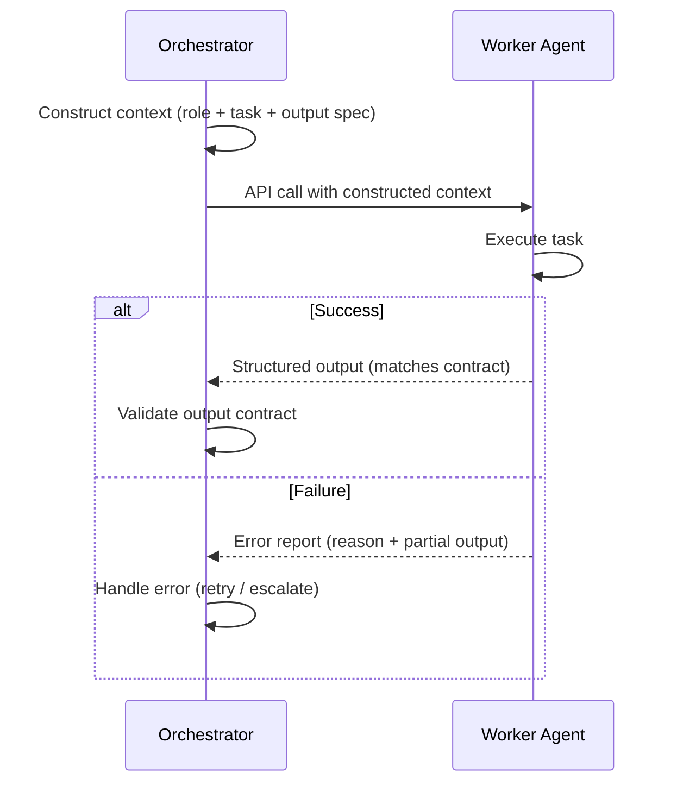

# [AEE-602] 代理通訊

## 背景脈絡

在單一代理系統中，每一次互動都發生在同一個由協調者（orchestrator）管理的上下文視窗內。代理可以看到一切：使用者的請求、先前的對話輪次、工具執行結果與中間推理過程。協調是隱式的——它只是單一上下文的流動。

多代理系統打破了這個架構。工作必須在代理之間傳遞，而代理無法共用同一個上下文視窗。問題不在於「代理如何互相溝通？」——它們並不像程序透過 socket 傳送訊息那樣通訊。問題是：一個代理的輸出，如何以能夠讓下游代理可靠執行的形式，成為另一個代理的輸入？

答案是上下文建構。代理之間的每一次移交（handoff）本質上都是一個上下文建構問題。協調者為接收端代理組裝一份上下文文件，發起一個全新的 API 呼叫，工作者（worker）僅依據這份文件執行任務。把代理通訊視為訊息系統的工程師誤解了其運作機制——這裡沒有持久連線、沒有 pub/sub 頻道、沒有共享記憶體。唯一存在的是協調者建構出來的上下文視窗。

## 設計思考

**代理實際上如何通訊**

當協調者委派任務給工作者時，它並非在任何網路意義上「傳送訊息」。它建構工作者的完整上下文——系統提示、任務描述、相關歷史紀錄、工具定義、輸出格式規範——並發起一個全新的 API 呼叫。工作者不知道協調者的存在，沒有先前工作階段的記憶，也無法存取更廣泛的系統，除非協調者在建構的上下文中明確加入這些資訊。

代理與代理之間沒有直接連線。每一則「訊息」都是協調者組裝出來的上下文文件。

**訊息傳遞（message passing）與共享狀態（shared state）**

兩種協調模型各有不同取捨：

*訊息傳遞*：協調者為每次代理呼叫建構完整的上下文。工作者所需的所有資訊都包含在 API 呼叫本身之中。工作者相對於整個系統是無狀態的——它處理自己的上下文並返回結果。這個模型簡單、易於重試，且能產生隔離的失敗。

*共享狀態*：代理從共同的資料儲存體讀取並寫入——可以是檔案、資料庫或記憶體系統。協調者不在上下文中嵌入完整內容，而是傳遞一個參考（「目前草稿位於 `output/draft.md`」）。工作者直接存取並更新共享的產出物。這個模型能實現更豐富的協調，但引入了訊息傳遞所沒有的鎖定、衝突解決與失敗模式。

**結構化移交**

一個完善的移交包含三個部分：

- *輸入合約（input contract）*：工作者接收到的內容——任務描述、所有必要的輸入，以及可用的工具
- *輸出合約（output contract）*：工作者返回的內容——成功結果的格式、結構與完整性要求
- *錯誤合約（error contract）*：工作者無法完成任務時返回的內容——一個包含原因與部分輸出的結構化錯誤，而非沉默

**多代理系統中的對話歷史**

工作者通常不會接收完整的對話歷史。它們接收的是與任務相關的精選上下文。歷史紀錄的累積是協調者的責任，而非工作者的關注點。協調者決定哪些先前上下文與每次工作者呼叫相關，並只納入那些內容。

**避免上下文污染**

向工作者傳遞超出所需的上下文會增加成本與延遲，並可能降低輸出品質——一個上下文被無關歷史主導的工作者，更可能產生失焦的結果。舉例來說，一個接收到 50,000 個 token 協調歷史、而實際上只需要 2,000 個 token 任務上下文的工作者，會把更多 token 花在雜訊上而非實際任務。協調者的工作不是轉發它所知道的一切——而是精選每個工作者成功所需的內容。

**RFC 2119:**

- 工作者 SHOULD 只接收執行任務所需的上下文，而非完整的協調歷史紀錄。
- 代理移交 MUST 包含明確的輸出合約——接收代理預期返回的內容。
- 協調者 MUST NOT 在未經整理的情況下將原始對話歷史傳遞給工作者。

## 深入探討

**上下文建構的細節**

一個完善建構的工作者上下文包含五個要素：

1. *角色描述 / 系統提示*：工作者是誰、其專業領域為何，以及適用的行為限制。這在工作者看到任務之前就塑造了它的推理姿態。
2. *附帶所有必要輸入的任務描述*：工作者必須做什麼，以足夠具體的方式表達，使工作者不需要猜測意圖。模糊的任務描述產生模糊的輸出。
3. *輸出格式規範*：協調者期望返回的確切結構——JSON schema、Markdown 格式、一組特定欄位。這是輸出合約的明確呈現。
4. *錯誤回報指示*：工作者無法完成任務時應返回什麼。沒有這個，工作者會以靜默方式失敗，或返回協調者無法與成功區分的格式錯誤輸出。
5. *相關工具*：只提供工作者執行此任務所需的工具。提供不必要的工具會增加誤用的機率，並擴大攻擊面。

這五個要素之外的所有內容都是排除的候選項目。

**訊息傳遞與共享狀態在實作層面的差異**

在訊息傳遞中，協調者將工作者所需的完整內容直接嵌入 API 呼叫。如果工作者需要一份文件的文字來進行摘要，協調者就在上下文中包含該文字。工作者從不需要接觸任何外部系統來取得其輸入。

在共享狀態中，協調者傳遞一個參考。上下文可能這樣說：「目前草稿位於 `output/draft.md`。讀取它，套用請求的修訂，並將結果寫回同一個檔案。」工作者負責讀取和寫入產出物。協調者透過管理誰在何時存取共享產出物來協調工作。

**為何共享狀態引入了訊息傳遞所沒有的失敗模式**

訊息傳遞的工作者是隔離的。如果兩個工作者透過獨立的 API 呼叫接收各自的任務，彼此都無法干擾對方的輸入或輸出。失敗是局部的。

共享狀態的工作者透過產出物相互耦合。兩個工作者寫入同一個檔案可能產生衝突的內容。一個在另一個工作者完成寫入之前讀取產出物的工作者，會在過時的中間狀態上採取行動。協調者必須實施協調紀律——寫入鎖、排序或合併邏輯——這些都是訊息傳遞從不需要的。

每一個共享狀態相依都是一個必須管理的新失敗面。一個變得不可用的外部檔案、一個靜默失敗的資料庫寫入、一個返回過時值的記憶體系統——這些都是純訊息傳遞中不存在的失敗模式。

**共享狀態值得其複雜性的情況**

共享狀態在兩種情況下值得其引入的複雜性：

- *輸出太大而無法放入上下文視窗*：一個 10,000 行的程式碼庫無法在單一 API 呼叫中傳遞給工作者。程式碼庫存在於磁碟上；工作者接收檔案參考並在檔案系統上操作。
- *跨工作者的增量進展*：某些任務需要工作者在完成自己的任務之前看到彼此的部分結果。共享產出物讓工作者能夠觀察並建立在彼此的中間輸出上，而無需協調者序列化並重新傳遞它們。

當這兩個條件都不成立時，訊息傳遞是更好的預設選擇。每個共享狀態依賴都是新的協調成本（coordination cost）——在引入之前，衡量它是否真的解決了訊息傳遞無法處理的瓶頸。

**錯誤合約**

錯誤合約規定了工作者無法完成任務時返回的內容。三個選項按有用性降序排列：

1. *附帶原因與部分輸出的結構化錯誤*：工作者回報它嘗試了什麼、為何失敗，以及進行到哪個程度。協調者可以用此來智慧地重試、上報給人類，或採取不同的方案。
2. *標記為失敗的部分輸出*：工作者返回它已完成的內容，並標記為不完整。協調者可以決定部分輸出是否可用。
3. *沉默*：工作者不返回任何內容，或返回一個空結果而不加說明。這是最糟糕的選項——協調者無法區分失敗與緩慢的成功，且沒有任何資訊可以採取行動。

在撰寫系統提示之前設計錯誤合約，能迫使我們釐清每個任務的失敗樣貌。

## 最佳實踐

1. **在撰寫系統提示之前先設計輸出合約。** 輸出合約是移交中最重要的部分。如果協調者不知道預期的格式，它就無法使用結果。先定義輸出合約，再撰寫能夠產生它的系統提示。

2. **積極精選工作者上下文。** 一個好的啟發原則：如果你無法解釋工作者上下文中每個元素對於這個特定任務的必要性，就移除它。加入工作者上下文的每個 token 都是一個決策——因為工作者需要它而納入，而非因為轉發方便。

3. **以訊息傳遞為預設；僅在訊息傳遞無法運作時才引入共享狀態。** 使共享狀態合理的條件是特定的：輸出太大而無法放入上下文視窗，或跨工作者需要增量進展。在這些條件之外，訊息傳遞能產生更簡單、更可靠的系統。每新增一個共享狀態相依，就是一個必須管理的新失敗面。

## 視覺圖解

## 相關 AEE

- [AEE-601](601) — 代理角色與拓撲：拓撲決定了誰與誰通訊
- [AEE-603](603) — 任務分解與委派：分解決定了每次移交的內容
- [AEE-604](604) — 並行與同步：並行派遣與扇入是特定的通訊模式
- [AEE-606](606) — 多代理失敗模式：通訊失敗是最常見的失敗模式

## 參考資料

- Anthropic. "Building Effective Agents." Anthropic Research. https://www.anthropic.com/research/building-effective-agents

## 更新日誌

- 2026-04-15 — 初稿
