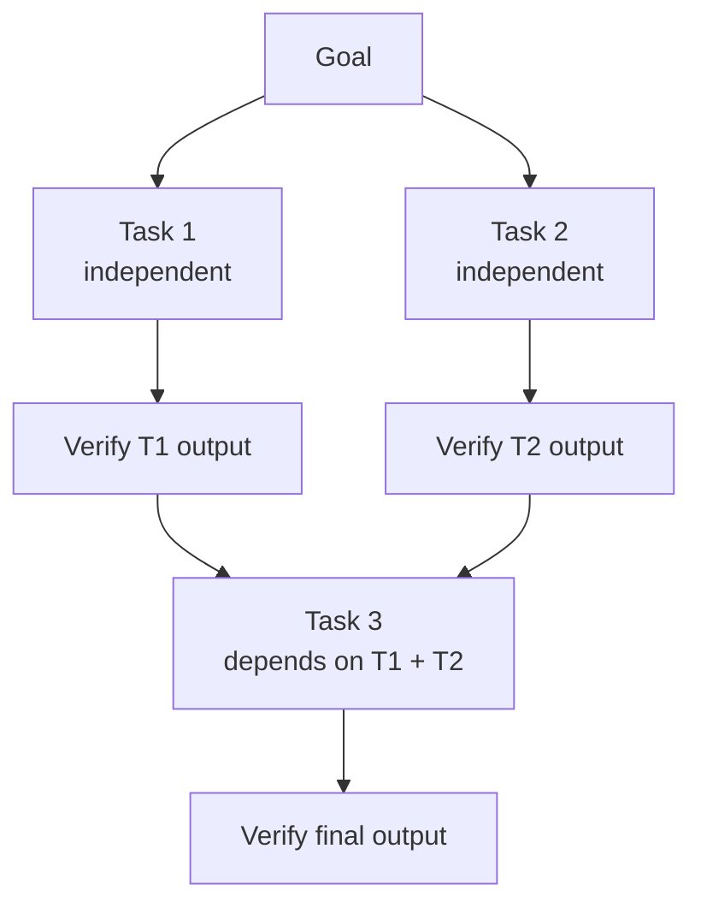

# [AEE-603] 任務分解與委派

## 背景

多代理架構能突破單代理上限（single-agent ceiling）——但前提是工作必須被正確地拆分。將目標拆解為子任務的方式，決定了架構是否能兌現其承諾。拆解得當，工作者（worker）便能平行執行並完成乾淨的交接；拆解失當，工作者就會彼此互相等待、產出無法合併的結果，或是重複完成相同的工作。

大多數多代理系統的失敗，根源不在代理本身，而在於任務分解（task decomposition）的方式出了問題。協調者（orchestrator）的最關鍵的設計決策——在撰寫任何系統提示、派發任何工作者之前——就是如何分解目標。這個決策奠定了依賴結構、平行化潛力，以及後續所有步驟的驗證需求。

## 設計思考

**什麼樣的任務可以被分解**

當一個目標的每個子任務都具備以下三個特性時，該目標便可被分解：

- *與其他子任務之間沒有隱藏依賴*：工作者只需使用協調者提供的輸入，就能完成子任務，無需仰賴同時執行的其他工作者的中間產出。
- *可完成的輸出合約（output contract）*：子任務有明確的終點。工作者知道何時算完成，協調者也知道應該收到什麼。
- *可合併的輸出*：子任務的輸出可以由協調者整合進最終結果，不需要代價高昂的調和（reconciliation）過程。

當這些特性不成立時，問題出在分解方式，而非代理本身。

**獨立性與順序性**

並非所有子任務都能平行執行。有些任務依賴前置任務必須先產出的結果。在派發任何工作者之前，協調者應先識別哪些任務是獨立的（沒有前置依賴），哪些是有順序的（必須等待上游輸出）。獨立任務可以平行派發，有順序的任務則必須等待。在派發前釐清這張依賴圖（dependency graph），能防止工作者提前被派發，在前置輸入尚未存在時就開始產出無效的結果。

**粒度（Granularity）**

分解粒度過粗，多代理架構毫無優勢——單一工作者仍然承擔整個複雜任務的負荷。分解粒度過細，協調成本（context 建構、驗證、錯誤處理）就會主導時間與成本預算。

適當的粒度是最小的自給自足且可驗證的單元：工作者無需請求額外情境即可完成它，輸出合約可以清楚陳述，協調者也能驗證結果而無需要求工作者解釋。

**委派（Delegation）機制**

當一個任務準備好委派時，協調者會建構工作者的完整情境並發出 API 呼叫。工作者對協調者一無所知，對更廣泛系統沒有記憶，除非協調者明確將相關資訊納入其情境，否則也無法存取其他工作者的輸出。如果分解正確，工作者應能在不提出澄清問題的情況下完成任務——它收到的情境包含了所有需要的資訊。

**神諭問題（The Oracle Problem）**

工作者回傳輸出之後，協調者必須在將其用於後續任務之前判斷輸出是否正確。三種策略可供選擇：自動化驗證（測試、lint、schema 驗證）、審查代理（第二個代理對照輸出合約評估結果）、以及人工檢查點。每種策略都在速度、成本與可靠性之間做不同的取捨。協調者必須在派發之前就選定驗證策略——而非在收到輸出之後。

- 每項委派任務在委派開始之前 MUST 定義好輸出合約。
- 協調者在將工作者輸出納入後續任務之前 MUST 進行驗證。
- 子任務 SHOULD 設計成工作者無需向協調者請求額外情境即可完成。

## 深入探討

**依賴圖**

在派發任何工作者之前，協調者應能畫出任務依賴圖：哪些任務依賴哪些輸出。沒有前置依賴的任務可以平行執行；有前置依賴的任務必須等到上游輸出存在且通過驗證之後才能開始。

用來識別隱藏依賴的實用測試：「如果任務 B 的工作者收到的是垃圾版本的任務 A 輸出，任務 B 會失敗，還是默默產出錯誤的結果？」如果答案是「失敗」，依賴是真實的，必須納入模型。如果答案是「默默產出錯誤結果」，那麼任務 A 與任務 B 之間的輸出合約規格不足——必須在派發前收緊。

隱藏依賴是最常見的分解錯誤來源。它們通常出現在兩個任務對系統狀態（同一個檔案、同一個變數、同一個設定值）有隱性假設，而協調者未將其識別為依賴時。

**委派情境應包含的內容**

一個完整的委派情境包含五個元素：

1. *角色 / 系統提示*：工作者的身份與主要職責。這在工作者看到任務之前就形塑了它的推理姿態。
2. *任務描述*：工作者應產出什麼、以何種格式呈現，具體程度需達到不留模糊空間。
3. *輸入材料*：工作者完成任務所需的全部情境——不多也不少。過度納入會浪費 token，並可能因為將任務相關資訊埋在雜訊中而降低輸出品質。
4. *輸出合約*：協調者預期收到的確切格式與內容。若工作者的輸出不符合此合約，協調者能立即偵測到失敗。
5. *錯誤合約（error contract）*：工作者在無法完成任務時應回傳的內容——一份包含原因與局部完成（partial completion）成果的結構化報告。沉默（silence）永遠不可接受。

若這五個元素中有任何一項缺失或規格不足，委派尚未準備好。

**粒度啟發式原則**

當一個任務符合以下條件時，其大小適合委派：

- 輸出合約可以用一段文字陳述清楚。
- 工作者能在單一代理迴圈中完成它——無需在任務途中再次委派給子工作者。
- 成功或失敗是明確的：協調者無需要求工作者解釋，就能驗證輸出。

任何一個條件不符合的任務太大。輸出合約無法與鄰近任務的輸出合約區分的任務可能太小——考慮合併它們。

**局部完成**

工作者完成了任務的一部分，但在其餘部分失敗。協調者收到局部輸出。接下來的處理方式取決於協調者在派發前就必須定義好的策略：

- *視局部為失敗*：丟棄局部輸出，以更多情境或更窄的任務定義重新派發。安全但在局部輸出品質良好時浪費資源。
- *使用局部，委派餘下部分*：從局部輸出中提取已完成的子子任務，將剩餘部分作為新任務委派。要求局部輸出可以被獨立驗證。
- *標記人工審查*：當局部輸出無法透過程式化方式驗證時升級處理，尤其是在它會成為高風險後續任務輸入的情況下。

在派發之前未定義此策略，意味著協調者必須在最糟的時刻即興應對——工作者已經失敗之後。

**神諭問題的實際應對**

三種驗證策略，可靠性由低至高排列：

1. *自動化驗證*——測試、lint、schema 驗證。速度快、成本低。能捕捉結構性與語法性錯誤。無法捕捉語意錯誤：一份符合 schema 驗證但內容事實上有誤的 JSON 輸出，會通過自動化驗證。

2. *審查代理*——第二個代理對照輸出合約評估工作者的輸出。能捕捉自動化檢查遺漏的語意錯誤。增加約等於一次額外代理輪次的延遲與成本。審查代理本身的輸出合約也必須明確：「可接受」意味著什麼？審查代理如何傳達拒絕？

3. *人工檢查點*——速度最慢，但可靠性最高。用於供給高風險後續任務的輸出，在下游發現並修正錯誤代價高昂時使用。人工檢查點的成本幾乎總是低於在五個任務之後才發現語意錯誤的成本。

實務上，正確的做法是分層：自動化驗證作為第一道篩選，審查代理用於輸出將供給後續高風險工作的任務，人工檢查點設置在最高風險的交接點。

## 最佳實踐

1. **在派發任何工作者之前先畫出依賴圖。** 依賴圖揭示了哪些任務可以平行執行、哪些必須依序執行、以及哪些看似獨立但共享隱藏狀態的任務。明確地畫出來，能在任何工作開始之前強制釐清這些關係——也讓在任務失敗時推論後果成為可能。

2. **在撰寫工作者系統提示之前先寫輸出合約。** 如果你無法定義工作者應該回傳什麼，這個任務還沒有準備好被委派。輸出合約是協調者用來驗證完成的規格。先寫輸出合約也讓系統提示更容易撰寫——工作者的指令源自它必須產出的內容。

3. **以自動化驗證作為第一道防線，但不要單獨依賴它來處理後續高風險任務的輸出。** 自動化檢查能快速廉價地捕捉結構性錯誤，但無法捕捉語意錯誤。對於輸出將供給後續高風險工作的任務，將自動化驗證與審查代理串聯起來。合計成本仍低於在多個代理輪次都建立在有缺陷的基礎上之後才在下游發現語意錯誤的代價。

## 視覺化

## 相關 AEE

- [AEE-600](600) — 多代理與協調：為何分解是首要設計決策
- [AEE-602](602) — 代理通訊：分解後的任務如何在代理間交接
- [AEE-604](604) — 平行性與同步：分解後的獨立子任務如何平行化
- [AEE-605](605) — 協調模式：實現特定分解策略的架構模式
- [AEE-606](606) — 多代理失敗模式：分解失當時會發生什麼

## 參考資料

- Anthropic. "Building Effective Agents." Anthropic Research. https://www.anthropic.com/research/building-effective-agents

## 更新紀錄

- 2026-04-15 — 初稿
