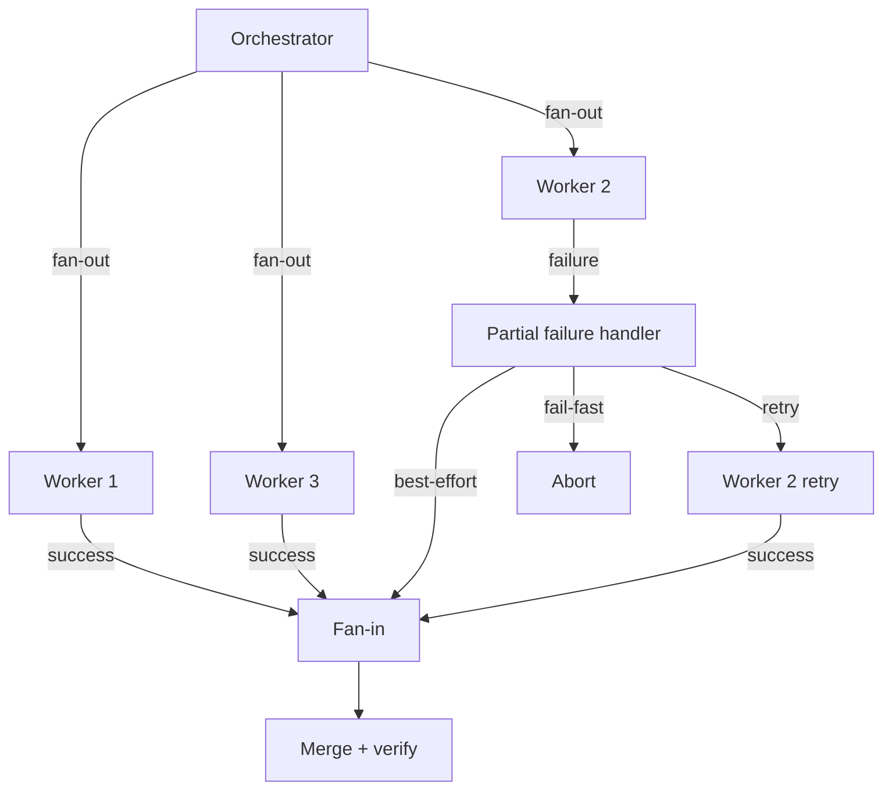

# [AEE-604] 並行與同步

## 情境

一旦你建立了依賴圖（AEE-603），就能知道哪些任務是獨立的。獨立任務可以並行（parallelism）執行。但並行有其自身的成本：每個同時運行的分支都是新的失敗面，而分支匯合的同步（synchronization）點則是新的瓶頸。理解並行何時有益、何時有害，是有效多代理架構與緩慢、脆弱、難以除錯的系統之間的分野。

## 設計思考

**並行何時有益**

真正獨立的任務——無共享狀態、無輸出依賴——且各自足夠耗時，使並行開銷值得付出，才是合適的候選項。當一個工作代理（worker）需要 60 秒，而你有五個彼此無依賴的工作代理時，並行執行可將總耗時從 300 秒降至約 60 秒加上開銷。這個交換幾乎總是值得的。

**並行何時有害**

三種情況使並行適得其反：

- *隱藏依賴*：兩個工作代理因共享協調者未識別為依賴的隱含假設，而產生衝突的輸出。衝突在扇入（fan-in）時才被發現，此時兩個工作代理都已執行完畢。
- *任務過短*：上下文建構、API 呼叫設置與結果收集會對每個工作代理施加固定開銷。對於在五秒內完成的任務，此開銷往往佔主導地位。
- *共享可變狀態*：若兩個工作代理在未協調的情況下寫入同一資源，其中一個會覆蓋另一個的成果，且衝突往往是靜默的。

**並行分派的運作方式**

協調者（orchestrator）同時發出多個 API 呼叫。每個工作代理接收其完整的上下文文件——對其他工作代理沒有可見性，也沒有共享的會話狀態。Python 的 `asyncio.gather` 是並行工作代理分派的標準模式。工作代理獨立執行；協調者在扇入步驟收集結果。

**同步模式**

標準模式是扇出（fan-out）接著扇入（fan-in）：

- *扇出*：協調者同時分派 N 個工作代理，每個代理都有自己的上下文。
- *扇入*：協調者等待所有 N 個結果，並依照預定的合併策略（merge strategy）將其合併為單一輸出。

「合併」的含義取決於輸出類型。不重疊的文字段落可以串接。重疊的文字需要審查代理來產生連貫的結果。對同一檔案的程式碼修改需要基於差異的合併與衝突偵測。結構化資料需要帶衝突偵測的聯集。分數與分類可以用平均或多數決進行聚合。

**部分失敗（partial failure）**

當五個工作代理中三個成功、兩個失敗時，協調者必須採取行動。有三種策略：

- *快速失敗（fail-fast）*：在第一個失敗時中止所有進行中的工作代理。適用於所有輸出都是下游任務所必需的情況。缺點：任何單一失敗都會丟棄所有已完成的工作。
- *盡力而為（best-effort）*：收集已完成的輸出，記錄失敗，以現有內容繼續。適用於下游任務可以處理部分結果的情況。缺點：下游任務必須被設計為能處理不完整的輸入。
- *退避重試（retry with backoff）*：最多重新分派失敗的工作代理至最大重試次數。適用於失敗可能是暫時性的情況——速率限制、逾時。缺點：增加延遲與成本。

**同步瓶頸（synchronization bottleneck）**

任何需要等待全部 N 個並行輸出才能繼續的扇入步驟，都會成為整個系統吞吐量的上限。若其中一個工作代理比其他人慢 10 倍，協調者就必須等待最慢的那個。在設計系統之前，先識別這些瓶頸點。

- 並行工作代理在沒有明確並行策略的情況下，不得（MUST NOT）共享可變狀態。
- 扇入步驟必須（MUST）在分派開始前定義合併策略。
- 協調者在後續任務依賴所有輸出時，應（SHOULD）對部分失敗採用快速失敗策略；在後續任務可以處理部分結果時，應（SHOULD）採用盡力而為策略。

## 深入探討

**並行前的獨立性測試**

在並行分派之前，執行兩項檢查：

1. 任一工作代理是否需要讀取另一個工作代理正在寫入的內容？若是，則它們並非獨立。
2. 任一工作代理的輸出合約是否限制了另一個工作代理的輸出合約所能包含的內容？若是，則它們存在隱藏依賴。

只有通過兩項檢查的任務才能安全並行。在飛行途中發現的隱藏依賴，遠比在分派前發現的更昂貴——兩個工作代理可能在衝突可被偵測到之前就已執行完畢。

**開銷閾值**

只有當單個任務的延遲超過上下文建構、API 呼叫設置與結果收集的開銷時，並行才有幫助。對於在五秒內完成的任務，開銷往往佔主導地位。對於各自需要超過 30 秒的任務，並行幾乎總是有益的。盈虧平衡點取決於具體的執行環境；在假設之前先進行測量。

**扇出/扇入機制**

具體而言，該模式分三個步驟：

1. *扇出*：建構 N 個上下文文件，同時分派 N 個 API 呼叫。
2. *收集*：等待所有結果，並設置每個工作代理的逾時。
3. *扇入*：依照預定策略合併結果。

概念性 Python 模式：

```python
async def dispatch_workers(contexts: list[str]) -> list[str | BaseException]:
    tasks = [call_agent(ctx) for ctx in contexts]
    results = await asyncio.gather(*tasks, return_exceptions=True)
    return results  # exceptions appear as BaseException values in results
```

`return_exceptions=True` 使失敗的工作代理返回例外物件而非拋出例外，讓協調者能夠檢視部分失敗，而非在第一個例外時中止。

**按輸出類型的合併策略**

| 輸出類型 | 合併策略 | 風險 |
|---|---|---|
| 獨立文字段落 | 串接 | 低——段落不重疊 |
| 重疊文字 | 串接 + 審查代理 | 中——需要審查以確保連貫性 |
| 對同一檔案的程式碼修改 | 基於差異的合併 + 衝突偵測 | 高——可能產生合併衝突 |
| 結構化資料（JSON/schema） | 帶衝突偵測的聯集 | 中——可能發生欄位衝突 |
| 分數或分類 | 聚合（平均、多數決） | 低——無內容衝突 |

合併策略必須在設計時定義。在扇入步驟臨時制定合併策略的做法，會導致每次執行產生不一致的輸出。

**部分失敗處理**

三種策略的詳細說明：

- *快速失敗*：在第一個失敗時中止所有進行中的工作代理；向協調者回報錯誤。適用於下游任務需要所有輸出的情況。缺點：即使失敗是暫時性的，任何單一失敗都會丟棄所有已完成的高品質工作。

- *盡力而為*：收集所有已完成的輸出，記錄失敗，以現有內容繼續。適用於下游任務可以處理部分結果的情況。缺點：下游任務必須被明確設計為能處理不完整的輸入——未經驗證的完整性假設將產生靜默錯誤。

- *退避重試*：以逐漸增加的間隔重新分派失敗的工作代理，最多達最大重試次數。適用於失敗可能是暫時性的情況——速率限制、網路逾時、短暫服務不可用。缺點：增加延遲與成本。在分派前設定最大重試次數；無限制的重試是等待發生的生產事故。

**同步瓶頸**

任何在繼續之前需要所有 N 個並行輸出的扇入步驟都是瓶頸。若一個工作代理比其他代理慢十倍，扇入就會等待最慢的工作代理。並行階段的整體延遲由最慢的工作代理決定，而非平均值。

兩種設計選擇可緩解此問題：

- *每工作代理逾時*：為每個工作代理設定最大耗用時間。超過逾時的工作代理被視為失敗的工作代理，由部分失敗策略處理。
- *最低門檻*：若至少 K 個（共 N 個）工作代理成功，則繼續執行。在分派前定義 K。這將快速失敗語義轉換為帶底限的盡力而為語義——當某個最低法定人數的輸出足以支撐下游任務時很有用。

## 最佳實踐

1. **並行前執行獨立性測試。** 在飛行途中發現的隱藏依賴，遠比在分派前發現的更昂貴修復。兩項檢查只需幾秒；在兩個工作代理執行完畢後才從衝突的扇入中恢復，需要更長的時間。

2. **設定每工作代理的逾時。** 永不返回的工作代理在協調者掛起等待它之前，與緩慢的工作代理沒有區別。每次並行分派都應有明確的逾時；部分失敗策略定義逾時觸發時的處理方式。

3. **在設計時定義合併策略，而非在扇入時臨時制定。** 在扇入步驟臨時制定合併策略的做法，會導致每次執行產生不一致的輸出。合併策略是並行階段輸出合約的一部分——必須在任何工作代理分派之前指定。

## 視覺化



## 相關 AEE

- [AEE-600](600) — 多代理與協調：協調成本框架，說明並行取捨的動機
- [AEE-603](603) — 任務分解與委派：依賴圖是並行的先決條件
- [AEE-605](605) — 協調模式：扇出/扇入與 map-reduce 是實現並行的模式
- [AEE-606](606) — 多代理失敗模式：部分失敗是多代理特有的失敗模式
- [AEE-704](../Session Management/704) — 會話管理：工作代理會話與狀態持久化上下文

## 參考資料

- Anthropic. "Building Effective Agents." Anthropic Research. https://www.anthropic.com/research/building-effective-agents

## 更新記錄

- 2026-04-15 — 初稿
