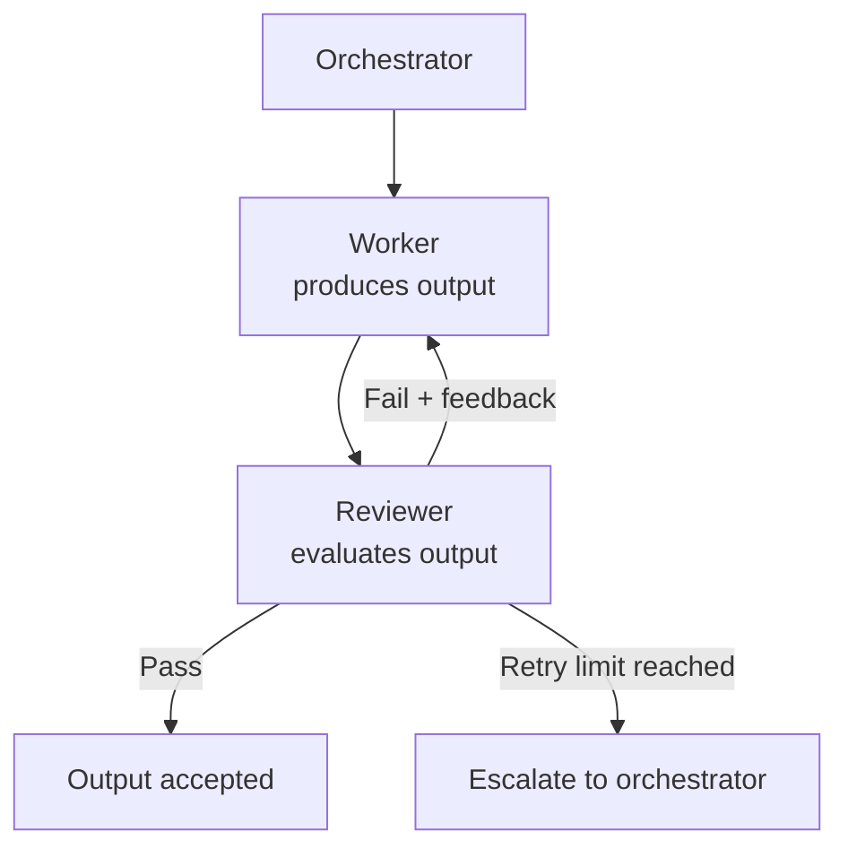

# [AEE-605] 協作編排模式

## 情境

每個多代理系統都面臨相同的協調問題：如何在代理（agent）之間分配工作、如何確保品質、如何聚合結果。每個專案都從第一原則出發的工程師，會一遍又一遍地重新發明相同的解決方案。編排模式（orchestration patterns）是這些反覆出現問題的具名、可複用解法——這套詞彙讓從業者說出「這是審查迴圈」或「這是流水線」時，便能立即傳達完整的架構結構。

本文涵蓋五種模式：映射歸約（map-reduce）、扇出/扇入（fan-out/fan-in）、流水線（pipeline）、審查迴圈（review loop）、階層式委派（hierarchical delegation）。每種模式都有清晰的意圖、明確的結構、適用條件，以及典型的取捨。理解一種模式的結構，讓你在寫下任何一行程式碼之前就能看清其取捨。

## 設計思考

**為何命名模式至關重要**

若你無法為正在實作的模式命名，代表架構設計尚未完成。一個具名模式自帶其取捨——說出「審查迴圈」，團隊中的每位工程師立即知道其中有一個工作代理（worker）、一個審查代理（reviewer）、一個重試上限，以及通過/失敗的標準。你無需從頭重新描述架構；名稱本身就完成了這項工作。

此處涵蓋的五種模式並非窮舉，但它們是多代理系統中最常見的反覆出現結構。真實的工作流程會組合它們。每個階段都執行審查迴圈的流水線是一種常見且廣為理解的組合；每個分支本身是流水線的扇出是另一種。模式組合（pattern composition）才是真正的設計工作所在。

**模式目錄概覽**

| 模式 | 核心結構 | 主要用途 |
|---|---|---|
| 映射歸約（map-reduce） | 每個輸入項目一個工作代理，然後聚合 | 批次處理 N 個獨立項目 |
| 扇出/扇入（fan-out/fan-in） | N 個專業代理處理同一輸入，然後合併 | 多視角分析 |
| 流水線（pipeline） | 循序階段，每個階段餵入下一個 | 具有依賴關係的多階段轉換 |
| 審查迴圈（review loop） | 工作代理產出，審查代理評估，工作代理修訂 | 需要迭代的高品質要求輸出 |
| 階層式委派（hierarchical delegation） | 元協調者委派給子協調者 | 超出單一協調者容量的任務 |

**模式選擇**

| 若你的任務... | 使用模式 |
|---|---|
| 有 N 個獨立輸入項目需要處理 | 映射歸約（map-reduce） |
| 需要對同一輸入進行多個專業視角的審視 | 扇出/扇入（fan-out/fan-in） |
| 有清晰的循序階段，每個階段依賴前一個 | 流水線（pipeline） |
| 需要對單一輸出進行品質迭代 | 審查迴圈（review loop） |
| 對單一協調者而言過於龐大而難以協調 | 階層式委派（hierarchical delegation） |

## 深入探討

### 映射歸約（Map-reduce）

**意圖**

用每個輸入項目一個工作代理的方式處理 N 個獨立輸入項目，然後將所有結果聚合為單一輸出。

**結構**

協調者（orchestrator）為每個輸入項目分派一個工作代理——映射（map）階段。每個工作代理獨立處理其項目並返回結果。協調者收集所有結果並執行聚合步驟——歸約（reduce）階段。聚合本身可以是一次模型呼叫：一個彙整代理將 N 個個別分析合成為單一連貫的報告。

**適用時機**

每個項目獨立且聚合比個別結果更有用的批次處理任務：分析 N 個文件、評估 N 個程式碼檔案、為 N 個候選人評分。關鍵條件是真正的獨立性——每個工作代理的輸出不得依賴任何其他工作代理的輸出。

**取捨**

- 線性擴展：N 個輸入項目在映射階段產生 N 次 API 呼叫，在歸約階段產生一次聚合呼叫。
- 當個別項目很大時，歸約階段成為新的瓶頸——聚合代理接收 N 個輸出，必須在單一上下文視窗中合成它們。
- 只有當項目真正獨立時才有效。項目之間的隱藏依賴在歸約階段才被發現，此時所有映射工作代理都已執行完畢。

---

### 扇出/扇入（Fan-out/fan-in）

**意圖**

將多個專業代理應用於同一輸入，然後將其不同視角合併為單一輸出。

**結構**

協調者以相同（或高度相似）的輸入分派 N 個專業工作代理。每個工作代理從其專業角度產出——安全審查者、正確性審查者、風格審查者各自分析同一份程式碼。扇入步驟將 N 個輸出合併為組合結果。

扇出/扇入與映射歸約的區別在於工作代理的性質：映射歸約使用相同的工作代理處理不同的輸入；扇出/扇入使用專業化的工作代理處理同一輸入。

**適用時機**

單一通才會比多個專家產出更低品質的多視角任務。程式碼審查是典型案例：被要求同時評估安全性、正確性和風格的單一代理，在每個維度都會妥協；三個各自專注於一個維度的專家則能產出更深入的分析。

**取捨**

- 所有工作代理必須在扇入開始之前被分派——若某個專家很慢，其他所有人都在等待。
- 扇入步驟需要在分派前定義好的合併/合成策略。N 份獨立的專家報告不會自動變成一份連貫的組合報告。
- 比單代理方法成本更高。當專家深度比成本效益更重要時，這個成本是合理的。

---

### 流水線（Pipeline）

**意圖**

通過循序階段轉換輸入，每個階段的輸出是下一個階段的輸入。

**結構**

代理按順序排列：A → B → C → D。每個代理接收前一個代理的輸出作為其主要輸入。在前一個階段完成並產生滿足下一個階段輸入合約（output contract）的輸出之前，任何階段都無法開始。

**適用時機**

具有清晰循序依賴的多階段轉換：研究 → 大綱 → 草稿 → 編輯 → 審查。每個階段需要前一個階段完整輸出的任務——草稿代理在沒有完整大綱的情況下無法開始；編輯代理在沒有完整草稿的情況下無法開始。

**取捨**

- 無並行性。總延遲是所有階段延遲的總和，而非最大值。
- 階段 N 的失敗會阻塞所有後續階段。系統無法通過重試後面的階段來恢復——上游階段必須被修復或重新執行。
- 階段輸出必須與下一個階段的輸入合約相容。階段之間的不匹配只有在下游階段收到意外輸入時才會被發現。
- 易於除錯：從失敗的階段向後追溯以找到錯誤來源。

**常見誤識**

不要將循序階段標記為扇出/扇入。扇出意味著具有相同輸入的並行工作代理。若你的階段彼此有輸出依賴關係——階段 B 需要階段 A 的輸出——它們是流水線，而非扇出。將流水線誤識為扇出會導致錯誤的上下文建構和排序錯誤。

---

### 審查迴圈（Review loop）

**意圖**

使用審查代理評估、工作代理修訂的方式，對產出的輸出進行迭代，直到它達到品質標準。

**結構**

工作代理產生初始輸出。審查代理根據明確的品質標準評估輸出。若審查代理返回通過（PASS），則輸出被接受。若審查代理返回失敗（FAIL），審查代理同時返回結構化的回饋；工作代理使用該回饋進行修訂，迴圈繼續。迴圈在通過或達到重試上限時終止。

達到重試上限時，協調者必須有已定義的升級行為：使任務失敗、帶警告接受輸出，或升級給人工審查者。

**實作者/審查者的區別**

工作代理和審查代理必須是不同的代理實例。同一個代理評估自己的輸出會引入偏見——它無法可靠地識別自己產生的推理中的缺陷。一個具有專注評估提示詞、且對工作代理推理過程沒有可見性的獨立審查代理，能產出更可靠的品質判斷。

這個原則在 AEE-601 中已建立。在此無例外地適用。

**適用時機**

自動化驗證不足的高品質敏感輸出：必須符合設計要求的程式碼、必須符合編輯標準的文稿、必須滿足特定約束的計畫。審查迴圈增加延遲和成本；當錯誤輸出的成本超過迭代成本時，它是合理的。

**取捨**

- 可變的回合數。迭代次數事先未知，取決於初始輸出品質和審查者嚴格程度。
- 重試上限不是可選的。無約束的審查迴圈就是無限迴圈。在迴圈開始之前定義最大迭代次數和達到上限時的行為。
- 每個回合都增加延遲和成本。上限為五次迭代的審查迴圈，可能花費是單次工作代理呼叫的五倍。
- 審查者的提示詞中需要清晰的通過/失敗標準。產出模糊或不一致評估的審查者，會導致工作代理朝相互矛盾的方向修訂。

**與其他模式的關係**

審查迴圈是應用於基礎拓撲之上的品質保證模式，而非基礎拓撲本身。審查迴圈可以包裹流水線中任何單一工作代理、扇出分支中的任何工作代理，或映射歸約映射階段中的任何工作代理。

---

### 階層式委派（Hierarchical delegation）

**意圖**

通過使用子協調者，每個子協調者管理較大任務某個領域的自有工作代理池，來協調對單一協調者而言過於龐大的任務。

**結構**

元協調者（meta-orchestrator）將任務分解為大型獨立領域，並將每個領域分派給一個子協調者（sub-orchestrator）。每個子協調者管理其領域的工作代理池、協調其工作代理，並將領域輸出返回給元協調者。元協調者將領域輸出聚合為最終結果。

**適用時機**

具有大型獨立領域、單一協調者的協調成本（coordination cost）難以管理的任務：建置後端、建置前端、撰寫文件。每個領域都足夠大，需要其自己的多代理工作流程；元協調者只需要協調各領域，而非個別工作代理。

**取捨**

- 失敗面在每個協調者層級都存在。子協調者失敗會失去其整個領域——該子協調者所有工作代理完成的工作都隨之失去。
- 複雜的除錯。工作代理中的錯誤必須追溯穿越子協調者層，可能還要穿越元協調者層，才能找到來源。
- 每個協調者層級都增加協調成本。只有在範疇真正超出單一協調者容量時，才使用階層式委派——而非將其作為任何中等複雜任務的預設結構。
- 子協調者各自必須產出元協調者能夠使用的合約輸出。協調者層級之間的輸出合約不匹配，會產生難以診斷的錯誤。

---

### 模式組合（Pattern composition）

真實的工作流程組合多種模式。具名模式的價值在於，它們的組合也能以名稱理解。

**常見組合**

- *每個階段都帶審查迴圈的流水線*：流水線中的每個階段都是自我驗證的。草稿階段在將輸出傳遞給編輯階段之前先執行審查迴圈。每個階段的品質更高；延遲更高。

- *每個分支都是流水線的扇出*：同一輸入的不同處理路徑並行運行。一份文件同時通過技術準確性流水線和編輯風格流水線進行處理。結果在扇入時合併。

- *歸約階段使用扇出/扇入的映射歸約*：N 個個別分析使用多個合成器進行歸約，每個合成器產生不同類型的摘要。元合成代理組合合成器的輸出。

**實作範例：程式碼審查工作流程**

一個多代理程式碼審查系統結合三種模式：

1. *扇出*：協調者分派三個專業審查者——安全審查者、正確性審查者、風格審查者——各自並行分析同一份程式碼。

2. *每個專家的審查迴圈*：每個專家的發現都經過審查迴圈。元審查代理評估每個專家的分析是否完整且連貫；若否則專家進行修訂。這確保每個專家在合併步驟之前都能產出高品質的輸出。

3. *流水線*：在每個專家的審查迴圈完成後，一個流水線將三份專家報告合併為單一連貫的審查文件：首先是合併步驟組合原始發現，然後是編輯步驟產出最終報告。

組合形式為：扇出 → （每個分支的審查迴圈）→ 合併的流水線。每種模式都能以名稱識別；組合描述了完整的架構。

## 最佳實踐

1. **在寫程式碼之前先命名模式。** 若你無法為正在實作的模式命名，代表架構設計尚未完成。具名模式自帶其結構、取捨與組合規則。在撰寫任何代理提示詞之前，先用具名模式梳理架構。

2. **為審查迴圈設定重試上限。** 無約束的審查迴圈就是無限迴圈。在迴圈開始之前定義最大迭代次數，並定義達到上限時的行為：使任務失敗、帶警告接受輸出，或升級給人工審查者。沒有安全的預設值——這三種行為在不同情境下都是適當的，而不作選擇意味著系統在達到上限時的行為是不可預測的。

3. **當階段是循序的時候，優先選擇流水線而非扇出。** 扇出意味著具有相同輸入的並行工作代理。若你的階段彼此有輸出依賴關係——階段 B 需要階段 A 的輸出——它們是流水線，而非扇出。將流水線誤識為扇出，會導致錯誤的並行分派：工作代理收到不完整的上下文、排序未定義，且輸出在扇入步驟發生衝突。

## 視覺化

審查迴圈——最常被錯誤實作的模式：

## 相關 AEE

- [AEE-601](601) — 代理角色與拓撲：這些模式建立於其上的基礎拓撲
- [AEE-603](603) — 任務分解與委派：分解決定哪種模式適合
- [AEE-604](604) — 並行與同步：扇出/扇入與映射歸約是並行模式
- [AEE-606](606) — 多代理失敗模式：每種模式都有典型的失敗模式

## 參考資料

- Anthropic. "Building Effective Agents." Anthropic Research. https://www.anthropic.com/research/building-effective-agents

## 更新記錄

- 2026-04-15 — 初稿
