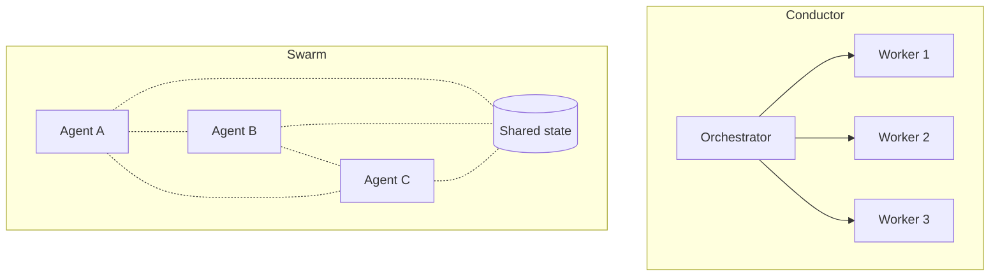

# [AEE-607] 代理群集

## 背景脈絡

「代理群集（agent swarm）」這個名詞在 2024 至 2026 年之間迅速擴散到整個代理工具市場，但這個標籤在不同講者口中涵蓋的架構差異極大。有些講者用它泛指任何多代理系統；有些是指 OpenAI 的 Swarm 框架（現已停止維護）或其後繼者 Agents SDK；有些指的是包著現代開發者體驗外衣的中央協調工作池；少數指的是真正沒有單一權威的去中心化協調。讀者在框架的行銷材料中看到這個詞時，沒有可靠的方式判斷現場到底指的是哪一種。

現有的 600 系列留下了這塊空白。[AEE-601](601) 涵蓋三種基礎拓撲（supervisor/worker、pipeline、peer-to-peer），但其中的 peer-to-peer 遠比當前「群集」所指的範圍更窄。[AEE-605](605) 涵蓋編排模式──map-reduce、fan-out、review loop、hierarchical──全都是指揮者（conductor）風格。目前沒有任何一篇文章處理去中心化協調，也沒有觸及 2026 年逐漸成形的指揮者與群集架構分水嶺。

本文解碼「群集」這個詞實際涵蓋的內容、確立指揮者與群集的分水嶺，並以 2026 年的框架全景作為佐證。關於「是否需要多代理」的前置問題，見 [AEE-600](600)。關於三種基礎拓撲，見 [AEE-601](601)。

## 設計思考

2026 年的架構框架把多代理系統放在單一軸線上：*指揮者（conductor）* 風格（中心化；一個編排者指揮工作者）與 *群集（swarm）* 風格（去中心化；代理透過共享狀態或局部互動協調）。這是架構上的分水嶺而非連續的光譜──系統要麼有指定的編排者，要麼沒有。實際系統通常座落於軸線的中段，形成混合架構，但「某個系統落在哪一端」這個問題是具體且可回答的。

群集這個名詞在最理想的用法下指稱一組系統層級的屬性：去中心化、透過冗餘達成的容錯、動態組成、水平擴展、代理自主性。這些屬性都是 *系統* 的性質，不是任何個別代理的性質。一個孤立運作的代理無法成為群集；群集存在於代理整體的集體行為之中。

誠實的揭露：大多數標榜「群集」的框架實際上是帶著額外功能的指揮者，並非真正的群集。它們的架構圖裡某處會有一個 queen、一個 lead、一個 router、一個 orchestrator──某個元件決定其他元件做什麼。這個標籤喚起的生物學類比（螞蟻、蜜蜂、蜂群）是理想願景而非已實現事實。LLM 代理的個體能力與全域狀態存取都太強，無法像螞蟻那樣行動。這個標籤具有喚起想像的價值，但讀者必須驗證它在任何特定框架中的實際指涉。

實務上這個標籤涵蓋三種不同的架構──本文在深度解析第 2 節逐一拆解。採用代理群集帶來一組小而確定的硬性約束：

- 工程師在選擇框架前 MUST 區分指揮者風格與群集風格的多代理架構。協調成本、失效面、可除錯性有顯著差異。
- 當底層架構實際上是指揮者時，SHOULD 避免使用「群集」框架──這會向審閱者、新進成員，以及六個月後的自己錯誤呈現系統的失效特性。
- 群集架構 SHOULD 只在以下情況下選用：透過冗餘達成的容錯是硬性需求、任務工作天然是鬆耦合的平行結構、或水平擴展是主要成長槓桿。
- 採用「群集」框架的團隊 MUST 在投入前先驗證它實際屬於哪一種類型。

## 深度解析

### 1. 指揮者 vs 群集：架構的分水嶺

指揮者架構有一個指定的編排者，負責接收任務、分解任務、將工作派遣給專職工作者、並彙整結果。編排者對系統的認識是全域的：它知道工作者是誰、每個人正在做什麼、最終輸出應該長什麼樣子。群集架構沒有這樣的單一權威。代理依據局部狀態、共享工件或同儕訊息行動，整體系統的行為從大量並行的局部決策中浮現。

| 面向 | 指揮者 | 群集 |
|---|---|---|
| 控制 | 中心化；一個編排者指揮工作者 | 去中心化；沒有單一權威 |
| 擴展 | 垂直──編排者變得更大、更聰明 | 水平──增加更多代理 |
| 失效面 | 編排者是單點故障 | 優雅降級；個別代理失敗可接受 |
| 協調成本 | O(N)（編排者知道 N 個工作者） | 最差 O(N^2)（任何代理都可能與其他代理對話） |
| 可除錯性 | 高──從編排者追蹤決策 | 低──浮現式行為、分散式追蹤 |
| 適用於 | 順序邏輯、可稽核的決策鏈、緊密協調 | 平行鬆耦合工作、容錯、水平擴展 |

大多數實際系統是混合的。純粹的群集在生產環境中罕見；純粹的指揮者則很常見。問題不是系統落入哪個方框，而是它在軸線上的哪個位置。600 系列目前把指揮者那一端覆蓋得很完整──[AEE-601](601) 談拓撲、[AEE-605](605) 談編排模式、[AEE-606](606) 談多代理失效模式。本文補上群集那一端的空白。

### 2. 2026 年「群集」實際涵蓋的範圍──三種類型

「群集」在當前用法中涵蓋三種不同的架構。讀者在框架行銷中看到這個標籤時，需要知道現場提供的是哪一種──失效模式、可除錯性特徵、適用情境都有明顯差別。

**A 類──集中式多代理（搭配人體工學工具）**

- *內容：*一個指揮者模式，包上 LLM 原生的開發者體驗──生命週期 hook、持久化身份檔案、MCP 工具整合、Docker 隔離的 worker、記憶體或學習迴圈。仍有一個中央權威；「群集」標籤傳達的是開發者工具的成熟度，而非架構上的去中心化。
- *核心原語：*lead 或 queen 協調者、worker pool、生命週期 hook、持久化代理身份檔案。
- *代表性框架：*[desplega-ai/agent-swarm](https://github.com/desplega-ai/agent-swarm) 使用 lead agent 分解任務並委派給 Docker 隔離的 worker agent，搭配持久化身份檔案（SOUL.md、IDENTITY.md、TOOLS.md、CLAUDE.md）以及 OpenAI embedding 支援的記憶。[Ruflo](https://github.com/ruvnet/ruflo)（前稱 claude-flow）採 queen/worker 模型、100+ 專職代理、SONA 自我學習、以及 RuVector DB。
- *如何判別：*在架構文件中尋找 queen、lead、router、orchestrator 這類字眼。如果有一個元件在指揮其他元件，無論行銷怎麼稱呼它，該框架都屬於 A 類。
- *適用情境：*目標是便捷的多代理工具配合現代化開發者體驗，且單一權威的失效模式可以接受。

**B 類──基於交接（handoff）的動態路由**

- *內容：*當前運行的代理透過回傳另一個代理的參照來決定下一個執行者。沒有外部 dispatcher；協調內嵌於代理邏輯本身。任一時刻只有一個代理在執行，所以這並非真正並行或去中心化，但控制流是動態的而非中央規劃的。
- *核心原語：*Agent、handoff（回傳 Agent 的函式）。
- *代表性框架：*[OpenAI Swarm](https://github.com/openai/swarm)（2024 年 10 月）引入這個模式。它現已停止維護並明確被取代──該 repo 的 README 自身寫道「Swarm is now replaced by the OpenAI Agents SDK, which is a production-ready evolution of Swarm.」[OpenAI Agents SDK](https://openai.github.io/openai-agents-python/) 是正式版的演化，也是新專案的當前選擇。
- *如何判別：*尋找 `handoff` 作為原語、以及外部編排者迴圈的缺席。控制流由每個代理的回傳值驅動。
- *適用情境：*流程是對話式或順序式、由代理驅動路由，且沒有全域編排者做派遣決策。適合客戶服務的分流情境──分流代理交接給領域專家，專家也可以交還。

**C 類──真正去中心化／浮現式協調**

- *內容：*沒有單一協調者。代理依據局部狀態與共享工件行動。系統行為從大量並行的局部決策中浮現。透過冗餘達成的容錯是免費附贈的；可除錯性則非常低。
- *核心原語：*共享黑板或訊息匯流排、局部決策策略、同儕發現。
- *代表性框架：*[kyegomez/swarms](https://github.com/kyegomez/swarms) 提供的某些模式（MixtureOfAgents、ForestSwarm）接近這個類型──代理並行產出，彙整者再綜合合併結果。真正去中心化的生產系統仍然罕見；大多數標榜「群集」的框架經檢視後其實屬於 A 類。
- *如何判別：*架構中沒有指定的協調者。代理對共享介面（黑板、事件匯流排）作出反應，而非被派遣。
- *適用情境：*透過冗餘達成的容錯是硬性需求，而任務分解產出鬆耦合的平行工作。接受可除錯性成本作為這筆交易的一部分。

### 3. 框架全景

2026 年的框架全景──這些框架要麼自我標榜「群集」，要麼經常被人稱為群集。每一列顯示該框架實際實作的類型，對照其當前文件而非行銷說詞。

| 框架 | 類型 | 原語 | 特色 |
|---|---|---|---|
| [kyegomez/swarms](https://github.com/kyegomez/swarms) | A + C | Agent、Swarm、SwarmRouter；10+ 編排模式 | "Enterprise-Grade Production-Ready"；LLM 供應商無關；HierarchicalSwarm、HeavySwarm、ForestSwarm、MixtureOfAgents |
| [Ruflo（前稱 claude-flow）— ruvnet/ruflo](https://github.com/ruvnet/ruflo) | A | Queen + worker、Router、100+ 專職代理 | SONA 自我學習；313 個 MCP 工具；RuVector 向量 DB；Claude Code 原生 |
| [desplega-ai/agent-swarm](https://github.com/desplega-ai/agent-swarm) | A | Lead + worker、持久化身份檔案（SOUL/IDENTITY/TOOLS/CLAUDE）、6 個生命週期 hook | Docker 隔離 worker；透過 OpenAI embedding 達成記憶驅動的累積性知識 |
| [OpenAI Swarm（已停止維護）](https://github.com/openai/swarm) | B | Agent + handoff | 歷史；官方明確標示被 OpenAI Agents SDK 取代 |
| [OpenAI Agents SDK](https://openai.github.io/openai-agents-python/) | B | Agent + handoff + guardrail | OpenAI Swarm 的正式版演化 |
| [AutoGen (Microsoft)](https://microsoft.github.io/autogen/stable/) | A 或 B | AgentChat（對話式）、Core（事件驅動）、GroupChat | 依模式橫跨類型；四層架構（Studio/AgentChat/Core/Extensions） |
| [CrewAI](https://docs.crewai.com/) | A | Agents + Crews + Flows | 角色導向協調；flows 負責編排；生產導向定位 |
| [LangGraph](https://docs.langchain.com/oss/python/langgraph/overview) | A 或 C | Nodes + edges + state（StateGraph） | 圖拓撲顯式表達；類型取決於圖上是否有 supervisor 節點 |

AutoGen 與 LangGraph 橫跨類型是因為它們的原語不固定拓撲──同一個框架可以拼出指揮者系統，也可以拼出近似群集的系統，端看開發者如何連接代理。這種模糊性本身就是一個訊號：「群集」用在這些框架時是一個情境相依的標籤，而非架構上的保證。表中所有框架都是 LLM 時代（2023 年以後）的產物，多數在本文發佈時問世不到 18 個月。具體的框架會在名稱、維護狀態或語意上更迭；三類型解碼則比表格裡的任何一列都來得耐久。

### 4. 群集何時是正確答案

**選擇群集的情境：**

- 透過冗餘達成的容錯是硬性需求（無法接受單點故障）。
- 工作天然是鬆耦合的平行結構──獨立的子任務之間不依賴彼此的中間狀態。
- 水平擴展是主要成長槓桿（吞吐量隨代理數量成長）。
- 決策鏈不需要透過中央權威的稽核軌跡。

**選擇指揮者的情境：**

- 決策鏈必須可稽核（合規、安全關鍵、事後檢討）。
- 任務結構是順序性的，或有緊密的同步需求。
- 團隊需要可預測的除錯體驗──浮現式行為是成本，不是特性。
- 正確性比吞吐量更重要。

**選擇混合式的情境：**

- 任務分解為多個大型且彼此獨立的領域。在上層放指揮者；在各領域內部使用群集，讓冗餘與並行發揮價值。
- 這在實務上是最常見的答案。純粹的單一端系統極為罕見。

關於混合式系統頂層用到的階層式委派模式，見 [AEE-605](605)。本文涵蓋混合式系統中的群集那一半。

## 最佳實踐

1. **在採用「群集」框架前先驗證它的類型。**讀架構文件，不要讀行銷內容。如果架構中有 queen、lead、router 或 orchestrator，該框架就是穿著群集外衣的指揮者。它仍可能是正確工具，但你應該知道自己買的是什麼。

2. **對實際上是指揮者的系統拒絕「群集」標籤。**一個帶有持久化記憶的 supervisor 就是一個指揮者。把它稱為群集會向審閱者、新進成員，以及六個月後的自己錯誤呈現它的失效面與協調成本。

3. **把可除錯性當作群集架構的第一級成本。**去中心化協調的除錯成本高昂。在宣告一個系統是群集架構之前，先為分散式追蹤、每個代理的稽核日誌、重放工具編列預算。

4. **偏好混合式勝過純群集。**大多數生產工作有些部分需要可稽核的決策鏈（由指揮者處理），也有些部分受益於水平平行冗餘（由領域內的群集處理）。不要把整個系統硬塞進單一模式。

5. **預期框架全景會持續變動。**本文提到的特定框架多半會在 18 個月內改變名稱、維護狀態或語意──Ruflo 一年前還叫 claude-flow；OpenAI Swarm 在發佈六個月內就被 Agents SDK 取代。架構類型比任何具體工具都耐久。

6. **不要把生物學的群集隱喻帶入工程決策。**螞蟻與蜜蜂是簡單的個體代理；LLM 代理恰恰相反。把群集系統評估為並行的分散式系統，不要當成生物群落。

## 視覺

指揮者與群集的一眼對照，以及三類型解碼作為可略讀的參考。

指揮者那一側有單一權威派遣工作。群集那一側由同儕透過共享狀態互動，沒有中央 dispatcher。

**三類型解碼：**

| 類型 | 特徵 | 代表 |
|---|---|---|
| A 類──集中式搭配人體工學 | 有 queen/lead/orchestrator；在指揮者外包一層 LLM 原生工具 | desplega-ai/agent-swarm、Ruflo |
| B 類──基於交接的動態路由 | Agent 回傳另一個 Agent；沒有外部 dispatcher | OpenAI Agents SDK（OpenAI Swarm 的繼任者） |
| C 類──真正去中心化 | 沒有協調者；代理共用狀態或訊息匯流排 | kyegomez/swarms（MixtureOfAgents、ForestSwarm）；生產環境中罕見 |

## 相關 AEE

- [AEE-600](600) — 何時協作多個代理 — 類別總覽；多代理是否必要的前置問題
- [AEE-601](601) — 代理角色與拓撲 — 三種基礎拓撲；本文把 peer-to-peer 延伸到現代群集範疇
- [AEE-605](605) — 協作編排模式 — 全為指揮者風格；本文是去中心化的補集
- [AEE-606](606) — 多代理失敗模式 — 一般失效模式；群集特有的失效模式於最佳實踐列出
- [AEE-100](../Foundations%20and%20Mental%20Models/100) — 什麼是代理 — 基礎定義；代理群集仍是一個由代理組成的系統

## 參考資料

**框架全景**

- [kyegomez/swarms](https://github.com/kyegomez/swarms) — 企業定位的多模式框架；Agent 與 Swarm 原語搭配 10+ 編排模式，包含 HierarchicalSwarm、HeavySwarm、ForestSwarm、MixtureOfAgents。LLM 供應商無關。
- [Ruflo（前稱 claude-flow）— ruvnet/ruflo](https://github.com/ruvnet/ruflo) — queen/worker 群集，搭配 SONA 自我學習、100+ 專職代理、313 個 MCP 工具、以及 RuVector 向量資料庫；Claude Code 原生。
- [desplega-ai/agent-swarm](https://github.com/desplega-ai/agent-swarm) — lead/worker 協調搭配 Docker 隔離的 worker、持久化身份檔案（SOUL.md、IDENTITY.md、TOOLS.md、CLAUDE.md）、六個生命週期 hook、以及 OpenAI embedding 支援的記憶。
- [OpenAI Swarm（已停止維護）](https://github.com/openai/swarm) — 2024 年 10 月問世的原始 handoff 框架；官方明確標示被 OpenAI Agents SDK 取代。
- [OpenAI Agents SDK](https://openai.github.io/openai-agents-python/) — OpenAI Swarm 的正式版演化；原語 Agent、Handoff、Guardrail。
- [AutoGen — Microsoft](https://microsoft.github.io/autogen/stable/) — 四層框架（Studio、AgentChat、Core、Extensions），支援對話式與事件驅動的多代理系統。
- [CrewAI](https://docs.crewai.com/) — 角色導向的 crew 協調，原語為 Agents、Crews、Flows；生產定位，內建 guardrails、記憶、知識、可觀測性。
- [LangGraph](https://docs.langchain.com/oss/python/langgraph/overview) — 圖式編排框架，原語為 Nodes、Edges、State、StateGraph；拓撲顯式表達。

**概念框架**

- [Conductor vs. Swarm: Multi-Agent AI Architecture Guide — Agix Technologies](https://agixtech.com/conductor-vs-swarm-multi-agent-ai-orchestration/) — 本文所依循的指揮者與群集分水嶺的產業框架。

## 更新記錄

- 2026-04-19 — 初始草稿
