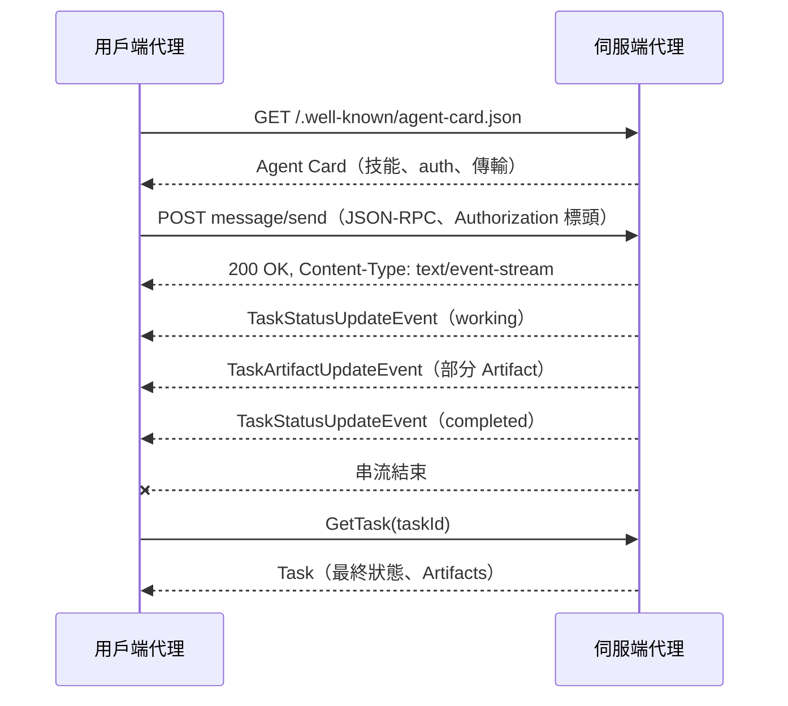

# [AEE-608] A2A：Agent2Agent 協定

## 背景脈絡

Agent2Agent 協定 (A2A) 是一個用於獨立 AI 代理之間通訊與互通的開放協定。Google 於 2025 年 4 月 9 日推出此協定，讓建構於不同框架、由不同廠商打造的代理能在不共享內部狀態的情況下協作，安全地交換資訊並跨企業平台與應用協調行動。

2025 年 6 月 23 日，Google 將 A2A 捐贈給 Linux Foundation，把規格、SDK 與工具鏈轉移到一個廠商中立的基金會。創始成員包括 AWS、Cisco、Google、Microsoft、Salesforce、SAP 與 ServiceNow，捐贈的明確目標是在擴大貢獻來源的同時讓協定保持廠商中立。專案目前位於 `a2aproject` GitHub 組織之下，文件託管於 `a2a-protocol.org`。

A2A 規格在 2026 年抵達 1.0.0 版本，先後經歷 0.1.0、0.2.6 與 0.3.0 等里程碑。0.3 版（2025 年 8 月 1 日）引入 gRPC 支援與簽署過的 Agent Card，標示著規格從推出版本的擾動轉向穩定的企業級介面。v1.0 推出時間還近，SDK 行為與合作夥伴部署仍有差異。實作者應將規格視為事實基準，並針對目標版本確認 SDK 的功能支援。

A2A 與 Model Context Protocol (MCP) 並列共存。MCP 鎖定代理與工具整合的邊界；A2A 鎖定代理與代理協作的邊界。典型部署同時使用兩者：代理透過 A2A 呼叫對端，並透過 MCP 觸及自身的工具與資源。

## 設計思考

A2A 由一項架構選擇所形塑：對端對彼此保持不透明。一個說 A2A 的代理透過自己的 Agent Card（代理卡片）對外宣告能力，並在線上交換 Task（任務）、Message（訊息）與 Artifact（產出）。它不會暴露自己的提示、記憶或私有的工具清單。規格作者指出，把對端代理包裝成工具會將其能力壓平為一個函式簽章，喪失對話、多輪互動與有狀態行為，而這些正是讓對端代理值得對話的核心。

另一項選擇是與 MCP 互補。協定文件把兩者並列：A2A 處理代理間的協作；MCP 處理每個代理內部的工具表面。這樣的分離讓團隊在採用 A2A 時無需改寫工具整合，也讓 MCP 伺服端能專注於自身的合約。

代價是介面頻寬。對端不透明意味著呼叫方代理只看得到 Agent Card 所宣告的內容與 Task 表面所回傳的內容。工程師獲得隔離與可替換性，捨棄了微管理對端推理的能力。規格以 Task 生命週期狀態、串流更新與結構化 Artifact 來補償，使可觀測性來自協定封包，而不必窺視對端內部。

- 工程師 MUST 將 A2A 對端視為透過 Agent Card、Task、Message 與 Artifact 互動的不透明服務，因為協定明確不暴露對端的內部狀態。
- 採用 A2A 的團隊 SHOULD 在代理內部以 MCP 處理工具整合，並僅在代理間邊界使用 A2A，符合規格定義的互補角色。
- 實作者 MAY 將 A2A 疊加於現有代理框架之上而不暴露框架特定概念，因為線上協定在設計上即為框架中立。
- 工程師 SHOULD 避免在對端價值在於多輪或有狀態行為時，將對端代理化約為單一工具呼叫，因為設計理據已點明此模式根本上具有侷限性。

## 深度解析

**核心基本元素。** A2A 定義五項基本元素。Agent Card 是伺服端發布的探索文件，用以宣告自己。Task 是具有唯一 ID 與既定生命週期的有狀態工作單位。Message 是用戶端與伺服端之間的一輪通訊。Artifact 是伺服端產出的輸出。Part（內容單元）是 Message 與 Artifact 內部使用的內容容器，承載文字、檔案參照（URL 或內嵌位元組）或結構化資料。這五者一同組成協定中所有的互動。

**Task 生命週期。** Task 會經歷被中斷的狀態，例如 `input-required` 與 `auth-required`，伺服端在這些狀態下等待用戶端提供更多資訊或憑證。它最終會解析為四種終止狀態之一：`completed`、`canceled`、`rejected` 或 `failed`。當 Task 抵達終止或中斷狀態時，伺服端會關閉任何開啟中的串流，由用戶端明確擷取後續狀態。規格 proto 檔案另外定義了進行中 Task 在完成或暫停前會經過的中介狀態（例如 `submitted` 與 `working`）。

**探索。** 代理在已知 URI `/.well-known/agent-card.json` 發布 JSON Agent Card，因此已知代理網域的用戶端可直接擷取其能力。對於無法以網域直接定址的代理，用戶端可透過策劃過的註冊表，或透過部署時提供的直接設定來定位。Agent Card 攜帶代理的名稱、描述、支援的技能、支援的傳輸方式，以及伺服端期待的驗證機制。

**安全與驗證。** A2A 將身分委派給標準 HTTP 標頭，並在 Agent Card 內宣告支援的驗證機制。這些機制與 OpenAPI 的 security schemes 對應，包含 API key、HTTP auth、OAuth2、OpenID Connect 與 mutual TLS。協定載荷本身不攜帶使用者或用戶端身分；憑證以標準 HTTP 標頭傳輸，由伺服端在傳輸層強制執行。這讓 A2A 的身分模型與企業其餘 HTTP 服務並列，避免引入平行的身分層。

## 線格式與訊息封包

A2A 1.0 定義了一份規範性的 Protocol Buffers 資料模型，以及三種具體繫結：JSON-RPC 2.0、gRPC 與 HTTP+JSON/REST。JSON-RPC 2.0 是部署最廣泛的繫結，也是新整合的首選。gRPC 適合已標準化於 Protobuf 並希望雙向串流的服務。HTTP+JSON/REST 適合偏好純 REST 工具鏈的用戶端。共享的 Protobuf 模型代表伺服端可以暴露多種繫結而不必重新定義資料形狀，用戶端也可以切換繫結而不必更動其對 Task、Message、Artifact 的概念模型。

對於長時間執行的任務，伺服端會以 Server-Sent Events (SSE) 增量串流。HTTP 回應攜帶 `Content-Type: text/event-stream`，每個事件的 `data` 欄位包含一個 JSON-RPC 2.0 回應物件，通常是 `SendStreamingMessageResponse`。該回應物件包裹一個 `Task`、一個 `TaskStatusUpdateEvent` 或一個 `TaskArtifactUpdateEvent`。串流會持續開啟，直到 Task 抵達終止或中斷狀態時由伺服端關閉。SSE 讓線格式與 A2A 其餘部分保持一致：串流是同一份 JSON-RPC 封包的增量交付，避免了另一條獨立通道搭配獨立綱要。

`Part` 是在 Message 與 Artifact 內部流動的內容單位。它是一個有判別欄位的容器，承載三種變體之一：文字、檔案（內嵌位元組或 URL）或任意的結構化 JSON 資料。結構化資料變體讓 A2A 能在對話文字與檔案附件旁邊攜帶具型別的載荷（例如：解析過的發票、工具結果或結構化計畫）。部分 SDK 透過 `TextPart`、`FilePart`、`DataPart` 等類別名稱對外暴露此能力。這些名稱屬於 SDK 端的便利封裝。線格式本身在單一 `Part` 型別上使用欄位判別子，因此使用不同 SDK 類別名稱的兩個實作只要發出相同的 `Part` 形狀，仍然能互通。

## 最佳實踐

1. **生產環境使用 HTTPS 搭配 TLS 1.2 或更高版本。** 生產的 A2A 部署必須跑在 HTTPS 之上，憑證以標準 HTTP 標頭攜帶（例如 bearer token 用 `Authorization`）。規格將 HTTPS 列為要求，因為協定把身分委派給傳輸層。
2. **在 Agent Card 中明確宣告驗證機制。** 用戶端閱讀 Agent Card 來得知該採用哪個機制（API key、HTTP auth、OAuth2、OpenID Connect 或 mutual TLS）。讓 auth 宣告含糊不清會迫使用戶端猜測，並破壞規格採用的 OpenAPI 風格安全模型。
3. **依技術堆疊選擇線繫結。** v1.0 在共享的 Protobuf 模型上支援 JSON-RPC 2.0、gRPC 與 HTTP+JSON/REST。JSON-RPC 2.0 是首選繫結；gRPC 適合 Protobuf 原生的服務；REST 適合已標準化於 HTTP+JSON 工具鏈的團隊。
4. **長時間執行的任務優先使用 SSE 串流。** 當 Task 耗時數秒以上，透過 SSE 串流 `Task`、`TaskStatusUpdateEvent` 與 `TaskArtifactUpdateEvent`，讓用戶端即時看到進度，而無需阻塞於單一回應。
5. **離線用戶端使用推播通知。** 當用戶端無法維持開啟的 SSE 連線（行動裝置、批次工作或無狀態 worker），透過 `CreateTaskPushNotificationConfig` 提供帶有 webhook URL 與驗證憑證的 `PushNotificationConfig`。用戶端在每次通知後透過 `GetTask` 擷取完整的 Task 狀態。
6. **在 1.0 穩定化期間鎖定特定規格版本。** v1.0 推出時間還近，SDK 功能對等性仍有差異。將伺服端與用戶端實作鎖定到相同的規格版本，並在依賴某項功能（gRPC 支援、簽署過的 Agent Card、推播通知）之前確認其支援狀況。
7. **以官方 SDK 作為起點。** 參考實作位於 `a2aproject` GitHub 組織之下。Python SDK 以 `a2a-sdk` 發布於 PyPI，JavaScript SDK 以 `@a2a-js/sdk` 發布於 npm。從這些實作起步可降低自行除錯協定瑕疵的表面積。

## 視覺



## 範例

一份最小的 Agent Card，提供於 `https://agents.example.com/.well-known/agent-card.json`：

```json
{
  "name": "Invoice Reconciler",
  "description": "Reconciles supplier invoices against purchase orders.",
  "url": "https://agents.example.com",
  "version": "1.0.0",
  "transports": ["jsonrpc", "grpc"],
  "securitySchemes": {
    "bearerAuth": {
      "type": "http",
      "scheme": "bearer"
    }
  },
  "security": [{ "bearerAuth": [] }],
  "skills": [
    {
      "id": "reconcile",
      "name": "Reconcile invoice",
      "description": "Match an invoice Part against PO records and return a structured report."
    }
  ]
}
```

這份卡片宣告了已知 URI、支援的傳輸方式、bearer-token 安全機制，以及一項技能。用戶端擷取此文件後挑選一個傳輸方式，並送出一個 `message/send` 請求，其 `Message` 將一張發票以 `Part`（文字、檔案或結構化資料）的形式攜帶至 `reconcile` 技能。

## 相關 AEE

- [AEE-602](602) — Agent Communication：A2A 是 602 概念性交接模型在代理間線上協定層次的具體實現。
- [AEE-609](609) — ACP：在 session 與串流上採取不同設計選擇的對等協定。
- [AEE-610](610) — AG-UI：代理對前端的軸線，與 A2A 的代理對代理軸線互補。
- [AEE-600](600) — When to Coordinate Agents：A2A 僅在多代理架構確有必要時才適用。

## 參考資料

- [What is A2A?](https://a2a-protocol.org/latest/topics/what-is-a2a/) — A2A Project, A2A Protocol Documentation (2026)
- [Key Concepts](https://a2a-protocol.org/latest/topics/key-concepts/) — A2A Project, A2A Protocol Documentation (2026)
- [Life of a Task](https://a2a-protocol.org/latest/topics/life-of-a-task/) — A2A Project, A2A Protocol Documentation (2026)
- [Agent Discovery](https://a2a-protocol.org/latest/topics/agent-discovery/) — A2A Project, A2A Protocol Documentation (2026)
- [Streaming and Asynchronous Operations](https://a2a-protocol.org/latest/topics/streaming-and-async/) — A2A Project, A2A Protocol Documentation (2026)
- [A2A and MCP](https://a2a-protocol.org/latest/topics/a2a-and-mcp/) — A2A Project, A2A Protocol Documentation (2026)
- [Enterprise-Ready Features](https://a2a-protocol.org/latest/topics/enterprise-ready/) — A2A Project, A2A Protocol Documentation (2026)
- [Agent2Agent (A2A) Protocol Specification v1.0.0](https://a2a-protocol.org/latest/specification/) — A2A Project, A2A Protocol Documentation (2026)
- [Announcing the Agent2Agent Protocol (A2A)](https://developers.googleblog.com/en/a2a-a-new-era-of-agent-interoperability/) — Surapaneni, Jha, Vakoc, Segal, Google Developers Blog (April 9, 2025)
- [Google Cloud donates A2A to Linux Foundation](https://developers.googleblog.com/en/google-cloud-donates-a2a-to-linux-foundation/) — Surapaneni, Segal, Vakoc, Google Developers Blog (June 23, 2025)
- [Linux Foundation Launches the Agent2Agent Protocol Project](https://www.linuxfoundation.org/press/linux-foundation-launches-the-agent2agent-protocol-project-to-enable-secure-intelligent-communication-between-ai-agents) — Linux Foundation, Linux Foundation Press Release (June 23, 2025)
- [Agent2Agent protocol (A2A) is getting an upgrade](https://cloud.google.com/blog/products/ai-machine-learning/agent2agent-protocol-is-getting-an-upgrade) — Surapaneni, Stephens, Google Cloud Blog (August 1, 2025)
- [Agent2Agent (A2A) Protocol Repository](https://github.com/a2aproject/A2A) — A2A Project, GitHub (2026)
- [Official Python SDK for the Agent2Agent (A2A) Protocol](https://github.com/a2aproject/a2a-python) — A2A Project, GitHub (2026)
- [Official JavaScript SDK for the Agent2Agent (A2A) Protocol](https://github.com/a2aproject/a2a-js) — A2A Project, GitHub (2026)

## 更新記錄

- 2026-04-28 — 初版草稿
