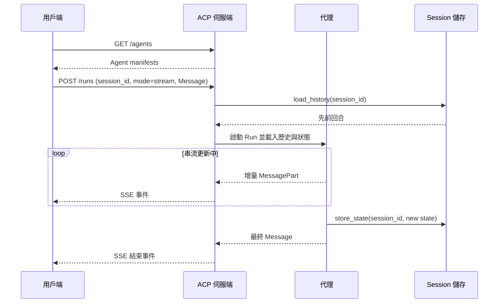

# [AEE-609] ACP：Agent Communication Protocol

## 背景脈絡

2025 年 8 月 29 日，Linux Foundation 宣布 Agent Communication Protocol (ACP) 將與 Google 的 A2A 協定在 LF AI & Data 旗下整合。ACP 團隊正逐步收束 ACP 的主動開發工作，並將其技術與專業直接貢獻到 A2A，同時為既有使用者公布遷移路徑。Kate Blair 在 IBM 領導 ACP 後加入 A2A 技術指導委員會，與來自 Google、Microsoft、AWS、Cisco、Salesforce、ServiceNow、SAP 的代表共事。本文存在的目的，是傳授 ACP 在被吸納前所做出的獨特設計選擇，因為這些選擇正被帶入 A2A 的路線圖中，而不再以獨立標準形式維護。

ACP 由 IBM Research 於 2025 年 3 月推出，並在 Andrew Ng 主辦的 AI Dev 25 大會上展示。當時擔任 IBM Research 產品孵化總監的 Kate Blair 直白地闡述目標：「Our goal is to build the HTTP of agent communication.」（建立代理通訊的 HTTP）。ACP 是支援 IBM BeeAI 多代理平台的通訊層。在同一個 2025 年 3 月的時間點，IBM 將 BeeAI（連同 ACP）貢獻給 Linux Foundation，使治理權落於中立、開放的基金會，而不依附於單一供應商。

從推出到 8 月合併期間，ACP 推出了一組精簡而具方向性的設計決策：以純 HTTP 端點為基礎的 REST 原生傳輸層、由具 MIME 類型的有序 MessagePart（訊息片段）構成的 Message（訊息）格式、作為一等公民的持久化 Session（會話）抽象、用於 human-in-the-loop 暫停的 Await（暫停等待）原語，以及同時支援線上（對運行中伺服器）與離線（透過分發包內嵌宣告書）的探索語意。其中數項概念現正透過 TSC 討論被吸納進 A2A。

本文其餘部分的定位：ACP 是一個現已合併的協定，其架構教訓仍具教學價值。對於 2026 年的新建系統，務實建議是 A2A。對於已運行 ACP 部署代理的團隊，BeeAI 提供橋接到 A2A 的轉接器。

## 設計思考

ACP 的第一個刻意選擇是 REST 原生。協定以純 HTTP 端點對外提供發送、接收與路由代理訊息的能力，而不將一切包裝在 JSON-RPC 中。其後果是：任何 HTTP 用戶端都能驅動 ACP 代理。`curl`、Postman、瀏覽器或泛用 HTTP 函式庫都足以端到端檢視或調用代理。SDK 為了人因工學而提供，但並非必需。這降低了工具、除錯，以及從已熟練使用 HTTP 的非代理系統進行橋接的門檻。

第二個選擇是每個 Message 在結構上即為多模態。Message 是 MessagePart 的有序序列，每個片段攜帶 MIME `content_type`，並具備內聯 `content` 或 `content_url`。文字、JSON、圖片、音訊、二進位 blob 共享同一個外層信封。這將內容協商下推至穩定且廣為理解的機制（MIME），而避免將其編碼為各協定自有的慣例。

第三個選擇是 Session 作為一等狀態。ACP 定義了 Session 抽象，以 session 識別碼將多個 Run（執行單元）串接起來，並提供 `load_history()`、`load_state()` 與 `store_state()`，讓代理能在多回合間攜帶對話歷史與結構化狀態。Run 是執行單位；Session 是記憶單位。結合 Await 原語（讓代理可暫停以向用戶端請求輸入並稍後恢復），ACP 將長時運行、可中斷、有狀態的互動視為基線預期，而不作為附加功能。

這些選擇對工程師與運維人員具有直接含意：

- 工程師 MUST 將 ACP Message 視為具 MIME 類型的有序片段；倚賴任一單一文字欄位作為標準負載會默默截斷多模態內容。
- 團隊 MUST NOT 在 2026 年的新建系統中選用 ACP；該協定正被吸納進 A2A，其主動開發已收束。
- 已運行 ACP 部署代理的團隊 SHOULD 規劃透過 BeeAI 的 `A2AServer` 與 `A2AAgent` 轉接器遷移至 A2A，而避免在 ACP 特有介面上進一步投入。
- 實作者 MAY 在過渡期間繼續以純 HTTP 用戶端消費 ACP 端點，因為 REST 介面在沒有專用函式庫的情況下仍可被驅動。
- 實作者 SHOULD 在對話狀態必須跨 Run 持久化時明確使用 ACP Session，而避免在應用層重新實作記憶機制。

## 深度解析

**核心原語。** ACP 定義五個主要物件與一個控制原語。Agent Manifest（代理宣告書）描述代理的能力與調用方式。Run 是單一代理執行，搭配特定輸入，支援同步或串流輸出，並發出中間與最終結果。Message 是結構化、多模態的通訊單位。MessagePart 是 Message 內的個別內容單位（文字、圖片、JSON 等）。Session 透過 session 識別碼跨多個 Run 維持狀態與對話歷史。控制原語是 Await：代理可暫停一個 Run 以向用戶端索取額外資訊，並在用戶端回應後恢復，這即是 ACP 對 human-in-the-loop 互動的建模方式。

**REST 介面。** 線上介面範圍精簡。`GET /agents` 列出可探索的代理並回傳其宣告書。`POST /runs` 以輸入 Message 和 `mode` 參數建立 Run。`GET /runs/{run_id}` 在用戶端選擇非同步執行時用來輪詢狀態或取得結果。同一個 `POST /runs` 負載透過設定 `"mode": "sync"`、`"mode": "async"` 或 `"mode": "stream"` 涵蓋三種執行模式，因此用戶端可在單次調用中選擇合適的互動風格，而無需切換端點。

**Message 結構。** 每個 Message 指定一個 `role` 來標識發送者。有效形式為 `user`（來自人類使用者的訊息）、`agent`（泛用代理輸出），以及 `agent/{name}`（歸屬於特定具名代理的輸出）。此 role 分類學對應 chat-completion 慣例，同時支援單一 Session 內多代理歸屬。內容一律置於 MessagePart 中。每個片段宣告其 MIME `content_type`（例如 `text/plain`、`image/png`、`application/json`），並提供 `content`（內聯）或 `content_url`（外部參照）。片段之間保留次序，因此一個 Message 可以確定地交錯陳述文字與結構化資料。

**線上與離線探索。** 當 ACP 伺服器運行時，用戶端透過呼叫 `/agents` 並讀取回傳的宣告書來探索代理。探索亦支援離線：代理可將其宣告書內嵌至分發包中，使宣告書在代理處於 scale-to-zero 狀態、為分發而封裝，或處於斷線環境時仍可讀取。同一份 manifest 格式涵蓋兩條路徑，使探索故事在代理目前是否提供流量、或尚未啟動的情況下都保持一致。

## 會話與串流語意

Session 模型是 ACP 最具特色的貢獻。ACP SDK 為每個 Session 維護一份描述符，並將其內容存放於資源伺服器，因此只要在多個 Run 間一致地使用相同的 session 識別碼，代理便能存取 Session 內互動的完整歷史。在一個 Run 內，代理呼叫 `load_history()` 取回先前回合，`load_state()` 讀取結構化狀態，`store_state()` 將修改後的狀態寫回。其結果是一個將對話記憶視為一等公民的協定，由執行階段擁有，Session 為持久化單位，Run 為執行單位。

此模型與 A2A 以任務為中心的模型形成對照。A2A 中每個 Task 是持久化邊界，較長的對話則透過串接多個 Task 來組合。兩種模型都各有適用場景。ACP 為持續性、助理式互動最佳化，狀態自然會超越任一單一 Run 的生命；A2A 則為具明確契約範圍的離散工作項最佳化。隨著 2025 年 8 月的合併，ACP 的 session 語意正被貢獻進 A2A 的 TSC 討論，因此務實預期是 A2A 將隨時間吸納其中至少部分有狀態 session 概念，而不會將 session 視為超出範疇。

串流與執行模式彈性置於同一個端點。ACP 支援同步呼叫（阻塞至完成）、非同步呼叫（立刻回傳 `run_id` 供稍後對 `GET /runs/{run_id}` 輪詢），以及串流呼叫（隨 Run 進展發出增量更新）。此協定被描述為「async-first, sync supported」，串流是被明示為一等的能力。用戶端透過在 `POST /runs` 主體中設定 `mode` 欄位逐次選擇模式，而無需切換端點、負載結構或傳輸層。串流由 Server-Sent Events (SSE) 載送。

## 最佳實踐

1. **2026 年新建系統採用 A2A。** 在 2025 年 8 月 29 日合併公告後，ACP 的主動開發已收束，BeeAI 團隊正將 ACP 技術直接貢獻進 A2A。新系統 SHOULD 從一開始即以 A2A 為目標，避免建立在已棄用路徑上。Linux Foundation 已為既有 ACP 團隊公布遷移路徑與文件。

2. **採用 BeeAI 遷移轉接器以實現 ACP-to-A2A 互通。** 以 BeeAI 框架建構的代理可透過 `A2AServer` 轉接器成為 A2A 相容，而外部 A2A 代理可透過 `A2AAgent` 整合進 BeeAI 應用。目前運行 ACP 的團隊 SHOULD 在過渡期間以這些轉接器作為橋接層，而避免維護平行的 ACP 與 A2A 程式碼路徑。

3. **將 ACP 與 MCP 視為互補層次。** ACP 將自身定位為與 Anthropic 的 MCP 互補。IBM 採用的框架是「MCP connects agents to their tools and knowledge」（MCP 連接代理至其工具與知識），而「ACP connects agents to agents」（ACP 連接代理至代理）。架構決策 SHOULD 將兩者視為代理堆疊中的不同層次。同樣的邏輯延伸至作為後繼者的 A2A。

4. **若你發行可分發代理，請同時為線上與離線探索而建構。** ACP 支援將 manifest 內嵌至分發包，使代理在目前未提供流量時仍保持可探索。發行代理（跨 scale-to-zero 環境、封裝安裝程式或斷線站點）的團隊 SHOULD 將 manifest 隨代理一同發行，以便消費者無需運行中伺服器即可檢視能力。

5. **當對話狀態必須跨 Run 持久化時，明確使用 Session。** ACP 的 Session 抽象配合 `load_history()`、`load_state()`、`store_state()` 是支援跨 Run 記憶的官方路徑。團隊 SHOULD 直接使用它，而避免在應用層重新實作記憶機制，因為協定層級的抽象與用戶端及伺服器端的資源管理皆有整合。

6. **依每次呼叫挑選合適模式，而避免使用預設值。** `POST /runs` 主體可宣告 `mode: sync`、`async` 或 `stream`。長時運行工作應採用 `async` 或 `stream`；短時呼叫且用戶端確實需要阻塞時可採用 `sync`。團隊 SHOULD 依實際工作負載逐次挑選模式，因為同一端點涵蓋三者。

7. **僅在參考 SDK 真正帶來價值之處使用之。** `i-am-bee/acp` 儲存庫提供 Python SDK（含伺服端、用戶端與模型定義）以及 TypeScript SDK（含用戶端與模型定義）。由於 ACP 為 REST 原生，純 HTTP 用戶端可端到端運作。團隊 MAY 為人因工學使用 SDK，但 SHOULD NOT 將其視為硬性相依，特別是考量該協定即將被吸納進 A2A。

## 視覺



## 範例

下方片段展示一個 `POST /runs` 主體，同時運用 ACP 的數項特色：session 識別碼、串流模式，以及一個將 `text/plain` MessagePart 與 `application/json` MessagePart 混合的 Message。

```json
POST /runs
Content-Type: application/json

{
  "agent": "research-assistant",
  "session_id": "sess_8f3a1c2b",
  "mode": "stream",
  "input": {
    "role": "user",
    "parts": [
      {
        "content_type": "text/plain",
        "content": "Summarize the attached release notes and flag any breaking changes."
      },
      {
        "content_type": "application/json",
        "content": "{\"version\":\"2.3.0\",\"changes\":[{\"type\":\"breaking\",\"area\":\"auth\"},{\"type\":\"feature\",\"area\":\"sessions\"}]}"
      }
    ]
  }
}
```

該請求在 session `sess_8f3a1c2b` 內建立一個 Run，伺服器因此可呼叫 `load_history()` 與 `load_state()`，使代理在啟動前看見先前回合。Message 攜帶一對有序 MessagePart：一段自然語言指令，以及一份結構化 JSON 負載，每個片段標記其專屬的 MIME `content_type`。由於 `mode` 為 `stream`，伺服器在代理發出增量 MessagePart 並透過 `store_state()` 寫回狀態的過程中，回傳 Server-Sent Events，最終事件之前完成狀態寫入。

## 相關 AEE

- [AEE-608](608) — A2A：A2A 是已吸納 ACP 貢獻並隸屬於 LF AI & Data 的協定。
- [AEE-602](602) — Agent Communication：ACP 的 session 模型是 AEE-602 中所討論之有狀態交接選項的一種具體實現。
- [AEE-610](610) — AG-UI：涵蓋代理對前端通訊的正交軸向。
- [AEE-600](600) — When to Coordinate Agents：探討是否需要多代理協定的上游框架。

## 參考資料

- [Welcome — Agent Communication Protocol](https://agentcommunicationprotocol.dev/introduction/welcome) — ACP Project, agentcommunicationprotocol.dev (2025)
- [Message Structure](https://agentcommunicationprotocol.dev/core-concepts/message-structure) — ACP Project, agentcommunicationprotocol.dev (2025)
- [Stateful Agents (Sessions)](https://agentcommunicationprotocol.dev/core-concepts/stateful-agents) — ACP Project, agentcommunicationprotocol.dev (2025)
- [Discover & Run Agent](https://agentcommunicationprotocol.dev/how-to/discover-and-run-agent) — ACP Project, agentcommunicationprotocol.dev (2025)
- [ACP repository README](https://github.com/i-am-bee/acp) — i-am-bee, GitHub (2025)
- [ACP README (main branch)](https://github.com/i-am-bee/ACP/blob/main/README.md) — i-am-bee, GitHub (2025)
- [ACP Joins Forces with A2A Under the Linux Foundation](https://github.com/orgs/i-am-bee/discussions/5) — i-am-bee, GitHub Discussions (2025)
- [An open-source protocol for AI agents to interact](https://research.ibm.com/blog/agent-communication-protocol-ai) — Kim Martineau, IBM Research blog (2025)
- [Agent Communication Protocol (ACP) project page](https://research.ibm.com/projects/agent-communication-protocol) — IBM Research (2025)
- [Introducing multiagent BeeAI](https://research.ibm.com/blog/multiagent-bee-ai) — IBM Research blog (2025)
- [ACP Joins Forces with A2A](https://lfaidata.foundation/communityblog/2025/08/29/acp-joins-forces-with-a2a-under-the-linux-foundations-lf-ai-data/) — LF AI & Data community blog (2025)

## 更新記錄

- 2026-04-28 — 初版草稿。反映 2025-08-29 公告之 ACP 併入 A2A 事件。
