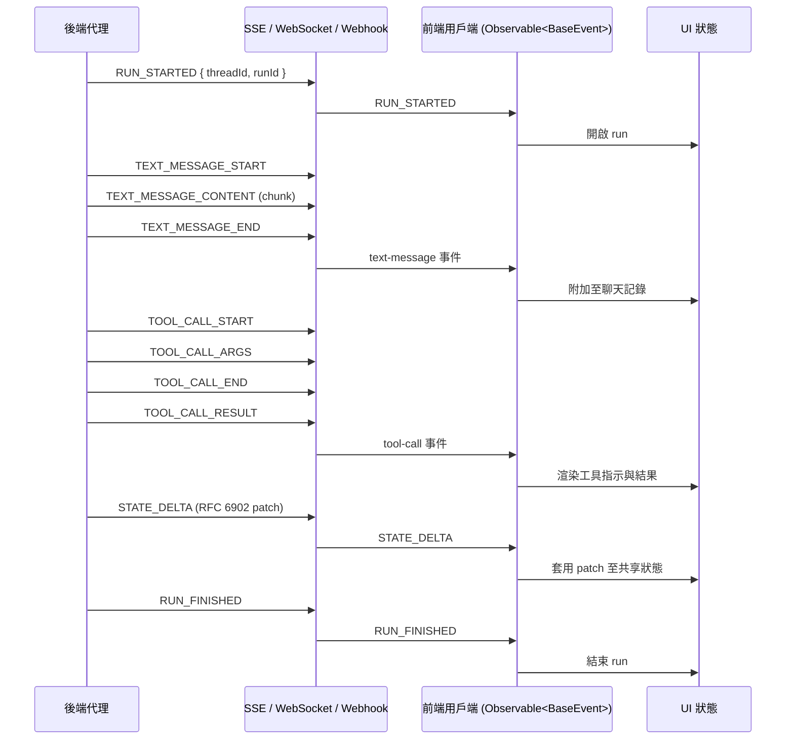

# [AEE-610] AG-UI：Agent-User Interaction Protocol

## 背景脈絡

AG-UI 是 agent-to-user-interface 軸線，與 A2A（agent-to-agent）和 MCP（agent-to-tool）並列為第三個正交的協定平面。MCP 標準化代理如何接觸工具，A2A 標準化代理如何接觸其他代理，AG-UI 則標準化代理執行中的活動如何抵達面向人類的應用程式，包括聊天面板、儀表板、IDE 側邊欄，以及周邊 UI 介面，使其能即時呈現代理正在做什麼。

該協定於 2025 年 5 月 12 日由 CopilotKit 發布，他們將其描述為「一個開放、輕量、基於事件的協定，標準化代理如何連接到面向用戶的應用程式」。參考實作以開源形式於 MIT 授權下發布在 `github.com/ag-ui-protocol/ag-ui`，文件位於 `docs.ag-ui.com`。

AG-UI 有時會與 A2UI 混淆，後者是由 Google 提出的另一份規範。CopilotKit 已發布比較頁面闡明兩者關係：A2UI 是描述要渲染什麼的宣告式生成式 UI 規範，AG-UI 則是雙向執行期連線，在代理與前端之間串流事件。兩個層次互補，AG-UI 可作為其事件介面的一部分傳輸 A2UI 載荷，但兩個協定本身彼此獨立。

在治理方面，AG-UI 可以描述為廠商主導但開放。它由 CopilotKit 團隊與主要代理框架合作開發，撰寫本文時並無正式基金會管理該規範。這與 MCP 在基金會成立前的階段相似：採用開放授權與開放儲存庫，由發起組織及其框架夥伴掌握方向。

## 設計思考

AG-UI 將代理執行視為一連串型別化事件的串流，而無需採用請求-回應交換模式。`Run`（執行單元）是執行的單位；當其進行中時，代理會發出一系列事件，描述它正在做什麼、正在生成什麼，以及其狀態如何變化。前端訂閱該串流，並將事件投射到 UI 狀態中，包括文字氣泡、工具執行指示器、共享狀態元件等。

該協定與傳輸層無關。規範並未強制規定事件如何抵達用戶端，並明確支援 Server-Sent Events (SSE)、WebSocket、webhook 與其他遞送機制。這刻意將事件詞彙與線上機制解耦，使同一事件串流能透過任一適合部署的傳輸方式傳遞。

第二個刻意的選擇是建構在標準 HTTP 之上。標準 HTTP 能穿越既有基礎設施（防火牆、代理伺服器、CDN）而無需特別處理，這降低了將代理 UI 整合到既有 web 技術堆疊的成本。對於效能關鍵路徑，AG-UI 也提供可選的二進位序列化器作為預設文字編碼之外的替代方案。

- 工程師 MUST 將 `Run`（`threadId` + `runId`）視為代理執行的單位，並在每個 run 的兩端以 `RUN_STARTED` 與終止性的 `RUN_FINISHED` 或 `RUN_ERROR` 進行包夾（Claim 7、Claim 14）。
- 前端 SHOULD 以 `Observable<BaseEvent>` 訂閱事件串流，並依事件家族將傳入事件投射到 UI 狀態（Claim 14）。
- 後端代理 SHOULD 對於增量狀態更新發出 `STATE_DELTA`，並在同步邊界發出 `STATE_SNAPSHOT`（Claim 8）。
- 後端代理 MAY 在預設文字編碼對使用情境過慢時採用可選的二進位序列化器（Claim 5）。
- 實作 MAY 依部署限制選擇任何受支援的傳輸方式，包括 SSE、WebSocket、webhook 或其他機制（Claim 4）。

## 深度解析

**事件型別與家族。** AG-UI 定義了一組小而標準化的事件型別，組織為以下家族：lifecycle、text-message、tool-call、state 與 reasoning。參考列舉目前約有兩打事件；標準線上格式採用 SCREAMING_SNAKE_CASE 值，例如 `RUN_STARTED`、`TEXT_MESSAGE_CONTENT`、`TOOL_CALL_ARGS` 與 `STATE_DELTA`（Claim 6）。該集合持續演進，因此實作應釘選到特定規範版本，而無需記憶事件數量。

**Run 生命週期。** 生命週期事件包夾每一次代理執行。`RUN_STARTED` 開啟一個 run；`RUN_FINISHED` 將其完整關閉；`RUN_ERROR` 在失敗時關閉。在該包夾內部，中間事件會串流訊息內容、工具呼叫與狀態變化，例如 `TEXT_MESSAGE_CONTENT` 與 `TOOL_CALL_START` 在 run 期間承載活動（Claim 7）。這種包夾形狀為前端提供了確定性的邊界，可圍繞其啟動與停止 UI 狀態機。

**能力介面。** AG-UI 文件記載的能力涵蓋互動式代理 UI 的完整範圍：串流聊天、生成式 UI（靜態與宣告式）、共享狀態、思考步驟、前端工具呼叫、後端工具渲染、人類介入中斷、子代理與組合、代理操控、工具輸出串流，以及自訂事件（Claim 13）。能力清單在規劃整合時是一份實用的選單；並非每個 UI 都需要全部能力，且事件家族可直接對應到這些能力。

**Run 身分。** 每次代理執行由 `threadId` 加上 `runId` 識別。`threadId` 代表 run 所屬的對話執行緒；`runId` 代表該執行緒中此次特定的執行（Claim 14）。此詞彙與 A2A 的 `Task` 身分及 ACP 的 `Run` 身分相對應；三個協定使用三個名稱來指稱代理執行的單位，而 AG-UI 在面向用戶的軸線上承載相同的概念。

## 前端事件介面

AG-UI 面向前端的介面由三個機制協同運作而成：狀態同步、工具呼叫串流，以及訂閱模型。

狀態同步使用兩個事件。`STATE_SNAPSHOT` 承載某一時間點的完整狀態表示，用於邊界同步：run 開始、重新連線，或任何前端需與後端達到已知一致的時刻。`STATE_DELTA` 承載增量狀態變化，以 RFC 6902 的 JSON Patch 形式表達，使前端能將小而有序的差異套用到本地代理狀態副本，而無需重新渲染整個世界（Claim 8）。此分工使穩態流量保持輕量，同時保留明確的重新同步路徑。

工具呼叫以三元組形式串流，而無需以單一完成事件呈現。`TOOL_CALL_START` 宣告代理即將呼叫工具；`TOOL_CALL_ARGS` 在參數構造過程中將其串流出來；`TOOL_CALL_END` 標示呼叫完成；`TOOL_CALL_RESULT` 承載結果（Claim 9）。三元組形狀使前端能渲染即時的「代理正在呼叫工具 X」指示器，並逐步顯示參數，並在結果抵達的當下更新該指示器。

訂閱模型將代理執行視為以 `threadId` 與 `runId` 為鍵的 `Observable<BaseEvent>`。型別為 `RunAgent = () => Observable<BaseEvent>` 的前端用戶端使 React、Angular 或其他反應式 UI 框架能依 run 附加訂閱者，並在 run 終止時取消訂閱（Claim 14）。前端的工作成為一個小而重複的模式：接收下一個事件、依其型別分派，並更新對應的 UI 狀態切片，例如 `TEXT_MESSAGE_*` 對應聊天記錄、`TOOL_CALL_*` 對應工具指示器、`STATE_*` 對應共享狀態元件等。

## 最佳實踐

1. **工程師 SHOULD 在交付即時渲染代理活動的前端時採用 AG-UI。** 若無共享協定，每個 UI 都必須為各個代理後端重新發明轉接器與邊緣案例處理；AG-UI 的存在就是為了消除這種自製 WebSocket 與文字解析的成本（Claim 15、Claim 1）。

2. **團隊 SHOULD 為其代理框架選擇官方轉接器，並避免自行打造客製化橋接。** AG-UI 為 LangGraph、CrewAI、Mastra、Pydantic AI、AG2、LlamaIndex、Agno、Microsoft Agent Framework、Google ADK、AWS Strands Agents 與 AWS Bedrock AgentCore 提供第一方轉接器（Claim 10）。

3. **後端代理 SHOULD 使用 `STATE_DELTA` 處理增量更新，並使用 `STATE_SNAPSHOT` 進行邊界同步。** 將快照保留給 run 起始、重新連線與明確的重新同步點，可使穩態流量保持小巧，同時保留確定性的復原路徑（Claim 8）。

4. **後端代理 MUST 將工具呼叫以 `TOOL_CALL_START` / `TOOL_CALL_ARGS` / `TOOL_CALL_END` / `TOOL_CALL_RESULT` 三元組形式串流，而無需採用單一完成事件。** 這正是讓前端能呈現即時工具執行 UI 的關鍵（Claim 9）。

5. **工程師 MUST 在討論該協定時將 AG-UI 與 A2UI 區分清楚。** AG-UI 是執行期事件串流協定；A2UI 是 Google 的宣告式生成式 UI 規範。它們是互補的層次，可一同傳輸，且不應混為一談（Claim 12）。

6. **實作 SHOULD 將事件型別數量視為持續演進。** 釘選至 `EventType` 的特定規範版本，並避免記憶固定數量，因為該列舉隨時間擴增，例如已加入 reasoning 等家族（Research Notes）。

7. **工程師 SHOULD 採用已發布的參考 SDK。** TypeScript 以 `@ag-ui/core` 與 `@ag-ui/client` 形式發布於 npm；Python 以 `ag_ui` 命名空間下的 `ag_ui.core` 與 `ag_ui.encoder` 發布（Claim 11）。

## 視覺



## 範例

單一 Run 的 AG-UI 事件串流的代表性片段，透過 SSE 遞送時，可能呈現以下 JSON 載荷序列（Claim 6、Claim 7、Claim 8、Claim 14）：

```json
{
  "type": "RUN_STARTED",
  "threadId": "thread_42",
  "runId": "run_2026_04_28_001"
}
```

```json
{
  "type": "TEXT_MESSAGE_CONTENT",
  "threadId": "thread_42",
  "runId": "run_2026_04_28_001",
  "messageId": "msg_1",
  "delta": "Looking up the latest invoice for you..."
}
```

```json
{
  "type": "STATE_DELTA",
  "threadId": "thread_42",
  "runId": "run_2026_04_28_001",
  "patch": [
    { "op": "replace", "path": "/currentInvoice/status", "value": "loading" }
  ]
}
```

```json
{
  "type": "RUN_FINISHED",
  "threadId": "thread_42",
  "runId": "run_2026_04_28_001"
}
```

前端訂閱者依 `type` 分派處理，將 `STATE_DELTA` 中的 JSON Patch 套用到本地代理狀態副本，並在 `RUN_FINISHED` 時關閉 run UI。

## 相關 AEE

- [AEE-608](608) — A2A：agent-to-agent 軸線；AG-UI 的 `Run` 與 A2A 的 `Task` 同樣作為代理執行的命名單位。
- [AEE-609](609) — ACP：AG-UI 的 `Run` 也與 ACP 的 `Run` 對應；ACP 與 A2A 涵蓋 agent-to-agent 軸線，AG-UI 則涵蓋正交的 agent-to-user 軸線。
- [AEE-602](602) — Agent Communication：代理通訊模式的總覽文章。
- [AEE-600](600) — When to Coordinate Agents：在多種協調協定之間進行選擇的上游框架。

## 參考資料

- [AG-UI Overview](https://docs.ag-ui.com/) — AG-UI Project (2026)
- [Introduction](https://docs.ag-ui.com/introduction) — AG-UI Project (2026)
- [Core Concepts: Architecture](https://docs.ag-ui.com/concepts/architecture) — AG-UI Project (2026)
- [JS SDK: Events](https://docs.ag-ui.com/sdk/js/core/events) — AG-UI Project (2026)
- [Quickstart: Build a Server](https://docs.ag-ui.com/quickstart/build) — AG-UI Project (2026)
- [Quickstart: Clients](https://docs.ag-ui.com/quickstart/clients) — AG-UI Project (2026)
- [AG-UI reference implementation](https://github.com/ag-ui-protocol/ag-ui) — ag-ui-protocol (2026)
- [AG-UI Protocol landing page](https://www.copilotkit.ai/ag-ui) — CopilotKit (2026)
- [AG-UI and A2UI: Understanding the Differences](https://www.copilotkit.ai/ag-ui-and-a2ui) — CopilotKit (2025)
- [Introducing AG-UI: The Protocol Where Agents Meet Users](https://www.copilotkit.ai/blog/introducing-ag-ui-the-protocol-where-agents-meet-users) — Nathan Tarbert, CopilotKit (2025-05-12)
- [Master the 17 AG-UI Event Types](https://www.copilotkit.ai/blog/master-the-17-ag-ui-event-types-for-building-agents-the-right-way) — CopilotKit Blog (2026)

## 更新記錄

- 2026-04-28 — 初版草稿
