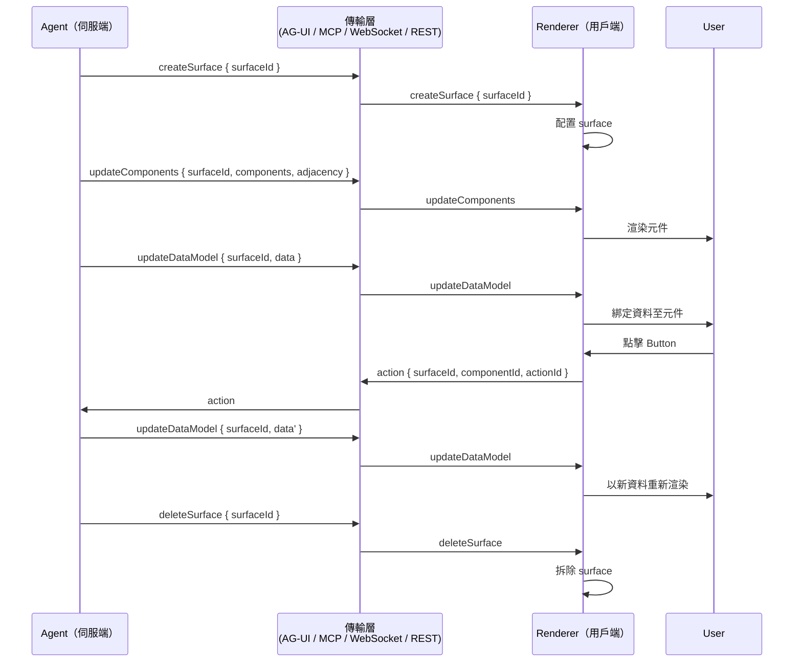

# [AEE-611] A2UI：代理生成式 UI 宣告式協定

## 背景脈絡

A2UI（代理對使用者介面）位於代理協定堆疊中代理對 UI 的酬載層。它描述代理希望使用者看到並互動的內容，編碼為代理（伺服端）與 renderer（用戶端）之間的 JSON 訊息合約。這使其與本類別中數個已涵蓋的協定相鄰，並位於它們的下游：AG-UI（AEE-610）是承載任意代理對 UI 流量的執行期事件串流傳輸層；A2A（AEE-608）是代理對代理的線上協定；ACP（AEE-609）是現已合併的代理間協定，其設計教訓值得保留。A2UI 是這樣一層協定：給定上述任一傳輸，這裡是要渲染的 UI。

Google 於 2025-12-15 將 A2UI 作為開源專案發布，將其定位為早期階段格式以及一組社群可協作的參考實作（Claim 1）。儲存庫以 Apache 2.0 授權發佈於 `github.com/google/A2UI`，其範圍同時涵蓋線上格式與一組起始 renderer（Claim 2）。另有一個獨立的社群專案 `a2a-community/a2a-ui` 用於管理 A2A 代理；該專案無關。引用 A2UI 作為協定時應指向 `google` 組織。

該專案處於 Public Preview。v0.8 標示為當前穩定規格，v0.9 於 2026-04-17 發布為新的規範版本，且規格樹中已存在 `v0_10` 目錄（Claim 16）。v0.9 同時是一次重新命名：v0.8 的數個訊息類型為了清晰度與更易於 LLM 產出而被重新命名（Claim 12）。本文全文採用 v0.9 詞彙，並在 v0.8 名稱仍重要時加以標示。

本文後續章節涵蓋 A2UI 是什麼、其背後的設計選擇、訊息類型與參考 renderer、surface 與元件模型，以及該協定如何與 AEE-610 的 AG-UI 相關——這也是大多數工程師在實務上首次接觸 A2UI 之處。

## 設計思考

A2UI 是一種宣告式資料格式，協定文件明確說明：「A2UI 是宣告式資料格式，並非可執行程式碼」（Claim 3）。代理發出元件與資料的結構化描述；用戶端將這些描述映射到其所實作的原生 widget。沒有 JavaScript、沒有遠端函式參照、沒有 DOM patch，也沒有用戶端必須信任的可執行酬載。此屬性結合稍後描述的 catalog 模型，賦予 A2UI 在代理驅動 UI 上可行的安全立場。

該協定也將 UI 結構與 UI 實作分離。代理傳送元件樹的描述加上關聯的 data model，用戶端則擁有這些如何映射到原生 widget 的權責（Claim 4）。一個代理能驅動 Flutter 應用、Lit web component、Angular 頁面與 React UI 而無需改變其發出內容，因為每個 renderer 負責將元件描述翻譯為平台原生 widget。

A2UI 與傳輸無關。v0.9 規格說明該協定「定義伺服端（Agent）與用戶端（Renderer）之間的 JSON 訊息結構與語意合約，但不指定特定傳輸層」（Claim 5）。v0.9 公告以具體用語闡明同一觀點——「A2UI over MCP、Websockets、REST、AG UI、A2A，或任何你想要的傳輸」——並補充「任何已支援 AG-UI 的代理皆能在 day zero 驅動 A2UI v0.9。無需自訂整合」（Claim 6）。這是 A2UI 與 AEE-610 關係最清晰的表述：AG-UI 是 A2UI 所搭乘的傳輸之一，兩個協定設計上即可組合。

- 工程師 MUST 將 A2UI 訊息視為不受信任的宣告式資料，並將元件限制於用戶端控制的 catalog（Claim 3）。
- 前端 SHOULD 實作將 A2UI 元件描述映射至平台原生 widget 的 renderer，而無需執行代理提供的程式碼（Claim 4）。
- 後端代理 MAY 透過任何傳輸發出 A2UI——MCP、WebSockets、REST、AG-UI 或 A2A——因為協定不綁定遞送通道（Claim 5、Claim 6）。
- 整合者 SHOULD 為新工作鎖定 v0.9 訊息名稱，僅在需要與較舊 renderer 相容時才文件化 v0.8 名稱（Claim 12）。

## 深度解析

**伺服端對用戶端的訊息。** A2UI v0.9 定義了從代理至 renderer 的四個串流訊息（Claim 10）。`createSurface` 通知用戶端建立新的 surface 並開始渲染。`updateComponents` 提供一份要新增或更新到特定 surface 內的 UI 元件清單。`updateDataModel` 傳送或更新填充這些元件的資料。`deleteSurface` 指示用戶端從 UI 移除某個 surface 及其所有關聯元件與資料。這四個訊息共同涵蓋完整生命週期：建立、內容、資料綁定與拆除。

**用戶端對伺服端的訊息。** 協定的用戶端側很窄。僅有兩種訊息類型回流至代理（Claim 11）：`action`，當使用者與已定義 `action` 的元件互動時發送（例如按下 `Button`）；以及 `error`，用於回報用戶端故障。沒有 DOM 事件流的洪水，也沒有隱含的遙測通道。若代理想得知互動，catalog 必須在相關元件上定義 `action`，而用戶端會以 `action` 訊息回應。

**v0.8 至 v0.9 重新命名歷史。** v0.9 是針對 v0.8 詞彙的明確重新命名（Claim 12）。`beginRendering` 由 `createSurface` 取代。`surfaceUpdate` 變為 `updateComponents`。`dataModelUpdate` 變為 `updateDataModel`。演進指南也以判別欄位將訊息形態扁平化——使用 `component: "Text"` 而無需動態鍵——因為如指南所述，「這種帶判別欄位（`component: \"Text\"`）的『扁平』結構，比動態鍵更易於 LLM 持續一致地產生」。v0.9 名稱中的動詞與訊息實際所為更為對應，扁平形態也與語言模型發出 JSON 的方式更為對應。

**參考 renderer。** A2UI 提供 Lit/web-core、Flutter（GenUI SDK）、Angular 與 React 的官方 renderer，React renderer 隨 v0.9 發布同時上線：「我們也已上線官方 React renderer，並對所有 A2UI 支援的 renderer（Flutter、Lit、Angular 與 React）進行版本提升」（Claim 13）。Flutter 的 GenUI SDK 採用 A2UI 作為其串流 UI 協定，因此 Flutter 應用能連線到 A2UI 伺服器並原生渲染代理生成的介面（Claim 14）。撰寫本文時 Flutter 的 `genui` 套件處於 alpha。

**採用情況。** 採用範圍已涵蓋 Google 內部產品——Opal、Gemini Enterprise、Flutter GenUI、ADK Web——以及外部整合者，包括 CopilotKit/AG-UI、AG2 的 `A2UIAgent`、Vercel 的 json-render，以及 Oracle 的 Agent Spec（Claim 15）。對 AEE-610 讀者而言，CopilotKit/AG-UI 整合最具相關性：它在生產環境中確認 AG-UI 代理能驅動 A2UI surface。

## 表面與元件模型

Surface（表面）是 A2UI 渲染進入的畫布，其生命週期受到管控。v0.9 規格說明「surface 必須在任何 `updateComponents` 或 `updateDataModel` 訊息能夠送達之前先被建立」（Claim 7）。因此 `createSurface` 不僅是提示；它是先決條件。後續的 `updateComponents` 與 `updateDataModel` 訊息以 surface ID 參照，用戶端有權丟棄目標為其未持有 surface 的訊息。`deleteSurface` 是對應的拆除——它將 surface 連同其所有關聯元件與資料一同移除。

元件以扁平清單形式傳送，其親子關係由相鄰清單中的 ID 參照重建（Claim 8）。此扁平清單加相鄰清單的設計同時做兩件事。首先，它讓 LLM 能逐增量串流元件，因為每個元件皆自包含且可由 ID 定址，且相鄰清單可在新元件抵達時加以修補。其次，搭配 v0.9 的扁平判別欄位形態（Claim 12），它將 `component:` 保留為固定字串欄位而無需動態鍵——讓模型在長生成過程中更易持續一致地發出。此結構是著眼於模型表達人因的序列化選擇。

代理可請求的 widget 集合受到用戶端提供的 Catalog（型錄）所限定，其中 `basic_catalog.json` 為參考基線（Claim 9）。catalog 定義哪些元件存在、可接受哪些屬性，以及可發出哪些 action。代理從 catalog 中挑選；它無法在線上引入新元件類型。這是設計思考中安全立場轉化為操作規則之處：代理以宣告式形式聲明意圖，用戶端則藉由控制 catalog 來控制渲染表面。出貨最小 catalog 的 renderer 提供較小的攻擊面；出貨寬鬆 catalog 的 renderer 則接受較大的攻擊面。catalog 即是政策邊界。

## 最佳實踐

1. **新整合鎖定 v0.9（而不採用 v0.8）。** v0.9 重新命名了數個 v0.8 訊息類型，並採用更易於 LLM 發出的扁平判別形態（Claim 12）。該專案也在持續迭代，v0.10 已存在於規格樹中（Claim 16），因此較新版本更貼近後續方向。將 v0.8 名稱保留供與較舊 renderer 相容之用。

2. **使用對應平台的官方 renderer。** A2UI 提供 Lit/web-core、Flutter、Angular 與 React 的官方 renderer（Claim 13）。Flutter 的 GenUI SDK 尤其與 A2UI 整合作為其串流 UI 協定（Claim 14）。注意 Flutter 的 `genui` 套件處於 alpha 並可能變動；將其作為起始路徑時應將此納入考量。

3. **將 A2UI 視為酬載而無需作為傳輸。** A2UI 定義代理與 renderer 之間的 JSON 訊息結構，並不指定遞送通道（Claim 5）。依執行期挑選傳輸——MCP、WebSockets、REST、AG-UI 或 A2A——並讓 A2UI 在其上承載（Claim 6）。

4. **出貨即時代理 UI 時將 A2UI 與 AG-UI 配對。** v0.9 公告說明「任何已支援 AG-UI 的代理皆能在 day zero 驅動 A2UI v0.9。無需自訂整合」（Claim 6）。若你的堆疊已涵蓋 AEE-610 中的 AG-UI，A2UI 即以酬載格式接入同一事件串流，並繼承 AG-UI 的傳輸管線。

5. **鎖緊 catalog。** 該協定的安全立場假設代理發出宣告式資料且受限於用戶端預先核可的 catalog 中元件（Claim 3、Claim 9）。出貨涵蓋你使用情境的最小 catalog，將其中新增項目視為與安全相關的變更加以審查，並將 `basic_catalog.json` 視為待強化的起點而無需原樣出貨。

6. **預期訊息類型會變動。** v0.9 重新命名了 v0.8 訊息，且 v0.10 已存在於規格樹中（Claim 12、Claim 16）。建立將訊息名稱集中於一處的轉接器，使未來的重新命名成為單檔變更。若你的整合仰賴穩定的線上形態，請訂閱規格儲存庫。

7. **引用正確的儲存庫。** A2UI 位於 `github.com/google/A2UI`。位於 `a2a-community/a2a-ui` 的社群專案無關，且其用途為 A2A 代理管理。參考資料、README 與上手文件 MUST 加以區分，避免將整合者送往錯誤專案。

## 視覺



## 範例

典型的 surface 生命週期：代理建立一個 surface，傳送兩個元件加上相鄰清單，將資料綁定至其上，並在使用者互動時收到 `action`。下方欄位名稱遵循 v0.9 訊息參考（Claim 7、Claim 8、Claim 9、Claim 10、Claim 11）。個別元件內的具體屬性名稱依用戶端發布的 catalog 而定。

```json
// 1. createSurface — 代理開啟一個 surface 進行渲染
{
  "type": "createSurface",
  "surfaceId": "order-confirm-1"
}
```

```json
// 2. updateComponents — 元件的扁平清單加上以 ID 參照重建樹的相鄰清單
{
  "type": "updateComponents",
  "surfaceId": "order-confirm-1",
  "components": [
    { "id": "root",     "component": "Column" },
    { "id": "headline", "component": "Text",   "props": { "text": "{{ title }}" } },
    { "id": "confirm",  "component": "Button", "props": { "label": "Confirm" }, "action": "confirm-order" }
  ],
  "adjacency": {
    "root": ["headline", "confirm"]
  }
}
```

```json
// 3. updateDataModel — 填充元件參照的綁定
{
  "type": "updateDataModel",
  "surfaceId": "order-confirm-1",
  "data": {
    "title": "Confirm your order"
  }
}
```

```json
// 4. action — 用戶端對伺服端，當使用者按下 Confirm 時觸發
{
  "type": "action",
  "surfaceId": "order-confirm-1",
  "componentId": "confirm",
  "actionId": "confirm-order"
}
```

收到 `action` 之後，代理通常會傳送另一個 `updateDataModel`（或為新檢視傳送一個新的 `updateComponents`），並在流程結束時最終傳送 `deleteSurface`。本範例中的 `Column`、`Text` 與 `Button` 類型來自用戶端發布的 catalog 條目；請求 catalog 中不存在元件的代理已脫離合約。

## 相關 AEE

- [AEE-610](610) — AG-UI：AG-UI 是傳輸層的事件串流；A2UI 是 AG-UI 可承載的酬載格式之一。Google 的 v0.9 公告將 AG-UI 代理定位為可隨插即用的 A2UI 驅動者。
- [AEE-608](608) — A2A：A2A 是代理對代理的線上協定；A2UI 描述 A2A 代理渲染給使用者的 UI。
- [AEE-609](609) — ACP：來自現已合併之代理間協定的設計教訓。
- [AEE-602](602) — Agent Communication：代理通訊模式的總覽文章。
- [AEE-600](600) — When to Coordinate Agents：上游框架。

## 參考資料

- [Introducing A2UI: an Open Project for Agent-driven Interfaces](https://developers.googleblog.com/introducing-a2ui-an-open-project-for-agent-driven-interfaces/) — Google A2UI Team, Google Developers Blog (2025)
- [A2UI v0.9: Generative UI for Agents](https://developers.googleblog.com/a2ui-v0-9-generative-ui/) — Google A2UI Team, Google Developers Blog (2026)
- [A2UI repository (README)](https://github.com/google/A2UI) — Google, GitHub (2026)
- [A2UI Documentation Home](https://a2ui.org/) — A2UI Project, a2ui.org (2026)
- [A2UI (Agent to UI) Protocol v0.9](https://a2ui.org/specification/v0.9-a2ui/) — A2UI Project, a2ui.org (2026)
- [Evolution Guide v0.8 to v0.9](https://a2ui.org/specification/v0.9-evolution-guide/) — A2UI Project, a2ui.org (2026)
- [Message Reference](https://a2ui.org/reference/messages/) — A2UI Project, a2ui.org (2026)
- [Quickstart](https://a2ui.org/quickstart/) — A2UI Project, a2ui.org (2026)
- [A2UI in the World (Adopters)](https://a2ui.org/ecosystem/a2ui-in-the-world/) — A2UI Project, a2ui.org (2026)
- [What is A2UI?](https://a2ui.org/introduction/what-is-a2ui/) — A2UI Project, a2ui.org (2026)
- [Get started with GenUI SDK for Flutter](https://docs.flutter.dev/ai/genui/get-started) — Flutter Team, docs.flutter.dev (2026)

## 更新記錄

- 2026-04-28 — 初版草稿。反映 A2UI v0.9（2026-04-17 發布）。
