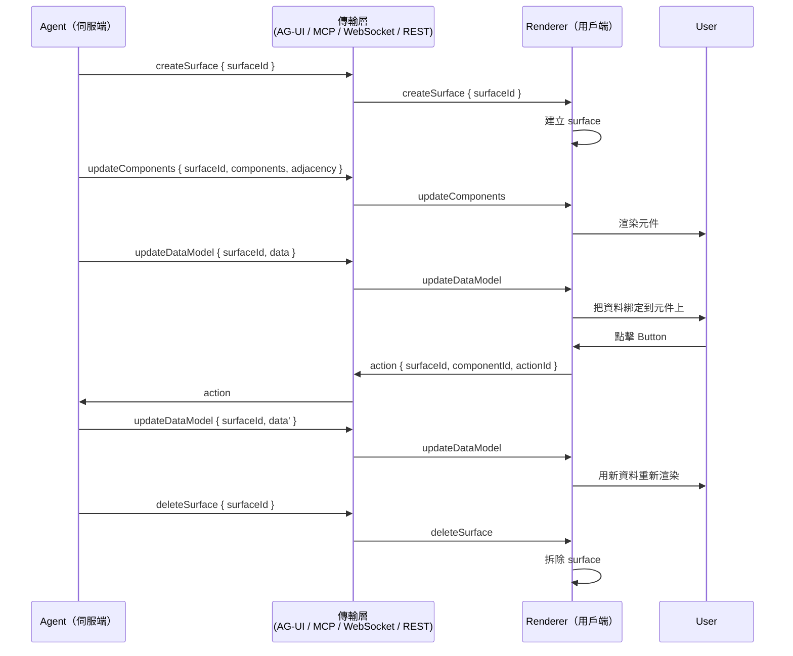

# [AEE-611] A2UI：代理生成式 UI 宣告式協定

## 背景脈絡

A2UI（Agent-to-UI）位於代理協定堆疊的酬載層，規範代理如何向使用者介面描述「要顯示什麼」。代理（伺服端）以 JSON 訊息為合約，傳出元件樹與資料模型；renderer（用戶端）負責把訊息映射為平台原生的 widget。所有酬載都是宣告式資料，沒有可執行程式碼。

本類別已涵蓋的另外三個協定都在這個堆疊上：AG-UI（AEE-610）是執行期的事件串流傳輸層，承載任意代理對 UI 的流量；A2A（AEE-608）是代理對代理的傳輸協定；ACP（AEE-609）是現已合併、設計教訓值得保留的代理間協定。簡單地說，這三個協定負責「訊息怎麼送」；A2UI 負責「送到之後，畫面該長什麼樣」。

Google 在 2025-12-15 把 A2UI 作為開源專案釋出，定位為早期階段格式，以及一套讓社群協作的參考實作（Claim 1）。儲存庫位於 `github.com/google/A2UI`，採 Apache 2.0 授權，內容同時涵蓋傳輸格式與一組起始 renderer（Claim 2）。另一個名稱類似的社群專案 `a2a-community/a2a-ui` 與本文無關，那是用於管理 A2A 代理的獨立專案；引用 A2UI 作為協定時，應指向 `google` 組織下的儲存庫。

專案目前處於 Public Preview。v0.8 標示為當前穩定規格，v0.9 在 2026-04-17 發布為新的規範版本，規格目錄裡也已經出現 `v0_10`（Claim 16）。v0.9 同時是一次改名版：為了讓訊息名稱更清楚、也讓 LLM 更容易輸出，數個 v0.8 的訊息類型被重新命名（Claim 12）。本文以 v0.9 詞彙為主，在 v0.8 名稱仍會影響相容性的地方一併標注。

本文接下來會涵蓋 A2UI 的設計選擇、伺服端與用戶端的訊息類型、surface 與元件模型，以及它如何與 AEE-610 的 AG-UI 組合 —— 這是大多數工程師在實務上第一次碰到 A2UI 的地方。

## 設計思考

A2UI 有三個彼此互相強化的核心設計選擇。三者加上 catalog 模型，構成它的安全立場。

**宣告式資料，而非可執行程式碼。** 規格文件明說：「A2UI 是宣告式資料格式，並非可執行程式碼」（Claim 3）。代理發出的是元件與資料的結構化描述；用戶端把這些描述映射到自己實作的原生 widget。整個過程沒有 JavaScript、沒有遠端函式參照、沒有 DOM patch，也沒有任何用戶端必須執行的酬載。這個性質加上稍後談的 catalog 模型，是 A2UI 安全立場的基礎。

**UI 結構與 UI 實作分離。** 代理只負責產出元件樹的描述以及對應的 data model；用戶端決定這些描述要怎麼映射成原生 widget（Claim 4）。同一個代理因此可以同時驅動 Flutter 應用、Lit web component、Angular 頁面與 React UI，而它送出去的內容完全不變 —— 因為翻譯成平台原生 widget 是各自 renderer 的責任。

**與傳輸無關。** v0.9 規格寫得很清楚：協定「定義伺服端（Agent）與用戶端（Renderer）之間的 JSON 訊息結構與語意合約，但不指定特定傳輸層」（Claim 5）。候選傳輸包括 [MCP](../Tool Use and Execution/407)、Websockets、REST、AG-UI 與 A2A。v0.9 的官方公告把這點講得更具體 ── 「A2UI over MCP、Websockets、REST、AG UI、A2A，或任何你想要的傳輸」── 並補一句「任何已支援 AG-UI 的代理，從第 0 天起就能驅動 A2UI v0.9，不需要任何客製整合」（Claim 6）。這也是 A2UI 與 AEE-610 關係最清楚的說法：AG-UI 是 A2UI 可以搭乘的傳輸之一，兩者設計上就是可以組合的。

把三點放在一起：代理只發描述、不發程式碼；用戶端對渲染擁有完全主導權；協定不綁定通道。安全護欄則由 catalog 提供，這部分留到「Surface 與元件模型」一節展開。

- 工程師 MUST 把 A2UI 訊息當作不受信任的宣告式資料看待，並把元件限制在用戶端控制的 catalog 之內（Claim 3）。
- 前端 SHOULD 實作 renderer，由 renderer 把 A2UI 元件描述映射成平台原生 widget；不要執行代理送來的程式碼（Claim 4）。
- 後端代理 MAY 透過任何傳輸發出 A2UI ── MCP、WebSockets、REST、AG-UI 或 A2A ── 因為協定不綁定遞送通道（Claim 5、Claim 6）。
- 整合者 SHOULD 為新工作鎖定 v0.9 的訊息名稱，只在需要與舊版 renderer 相容時才另外記載 v0.8 名稱（Claim 12）。

## 深度解析

**伺服端送往用戶端的訊息。** v0.9 定義了從代理到 renderer 的四個串流訊息（Claim 10）。`createSurface` 通知用戶端建立一個新的 surface、開始渲染。`updateComponents` 帶一份 UI 元件清單，要新增或更新到指定的 surface 上。`updateDataModel` 送出或更新填充這些元件用的資料。`deleteSurface` 指示用戶端把某個 surface 連同它的所有元件與資料一併移除。這四個訊息共同涵蓋一個 surface 的完整生命週期：建立、內容、資料綁定、拆除。

**用戶端送往伺服端的訊息。** 從用戶端回流到代理的訊息只有兩種（Claim 11）：`action`，在使用者與已定義 `action` 的元件互動時發送（例如按下 `Button`）；以及 `error`，用來回報用戶端故障。沒有 DOM 事件全量回灌，也沒有隱含的遙測通道。代理想接收某個互動，前提是 catalog 在相關元件上定義了 `action`，用戶端才會用 `action` 訊息回應。

**v0.8 → v0.9 的改名與扁平化。** v0.9 對 v0.8 的訊息詞彙做了一次明確的改名（Claim 12）：`beginRendering` 變成 `createSurface`、`surfaceUpdate` 變成 `updateComponents`、`dataModelUpdate` 變成 `updateDataModel`。演進指南同時把訊息結構扁平化，改用判別欄位 ── 寫成 `component: "Text"` 這種固定欄位，而不是動態鍵 ── 因為指南自己也說：「這種帶判別欄位（`component: "Text"`）的『扁平』結構，比動態鍵更容易讓 LLM 持續一致地產生。」改名後，v0.9 訊息名稱裡的動詞跟訊息實際做的事更貼近；扁平結構也更貼近語言模型輸出 JSON 的方式。

**參考 renderer。** A2UI 提供 Lit/web-core、Flutter（GenUI SDK）、Angular、React 四個官方 renderer。React renderer 隨 v0.9 發布同步推出：「我們也發布了官方的 React renderer，並對所有 A2UI 支援的 renderer（Flutter、Lit、Angular、React）做了版本更新」（Claim 13）。Flutter 的 GenUI SDK 把 A2UI 當作它的串流 UI 協定，因此一個 Flutter 應用程式可以連到 A2UI 伺服器，原生渲染代理產生的介面（Claim 14）。撰寫本文時 Flutter 的 `genui` 套件還處於 alpha。

**採用情況。** A2UI 的採用範圍已經跨進 Google 內部產品（Opal、Gemini Enterprise、Flutter GenUI、ADK Web），以及外部整合方，包括 CopilotKit/AG-UI、AG2 的 `A2UIAgent`、Vercel 的 json-render、Oracle 的 Agent Spec（Claim 15）。對 AEE-610 讀者來說，最值得注意的是 CopilotKit/AG-UI 這條：它已經在生產環境驗證 AG-UI 代理可以驅動 A2UI surface。

## Surface 與元件模型

Surface 是 A2UI 渲染進去的畫布，它的生命週期受到嚴格規範。v0.9 規格寫得很明白：「surface 必須先建立，任何 `updateComponents` 或 `updateDataModel` 訊息才能送過去」（Claim 7）。所以 `createSurface` 不只是提示，而是先決條件。後續的 `updateComponents` 與 `updateDataModel` 都用 surface ID 參照；用戶端可以直接丟棄那些指向自己沒有的 surface 的訊息。`deleteSurface` 則是對應的拆除動作 —— 把 surface 連同它所有的元件與資料一起移除。

元件以扁平清單的形式傳送；元件之間的親子關係由一份鄰接表（adjacency list）裡的 ID 參照來重建（Claim 8）。扁平清單加鄰接表這個設計同時做了兩件事。第一，它讓 LLM 可以逐筆串流元件 —— 每個元件都是自足的、可以用 ID 找到，鄰接表也能在新元件抵達時持續補上。第二，搭配 v0.9 的扁平判別欄位結構（Claim 12），它讓 `component:` 保持是一個固定欄位的字串值，而不是動態鍵，模型在長段生成中比較容易持續輸出一致的格式。整個結構說穿了就是為了配合模型輸出 JSON 的習慣而做的序列化設計。

代理可以請求哪些 widget，由用戶端提供的 catalog 決定，`basic_catalog.json` 是參考用的基準（Claim 9）。catalog 定義了：哪些元件存在、可以接受哪些屬性、可以發出哪些 action。代理只能從 catalog 裡挑；它沒辦法臨時引入新的元件類型。「設計思考」裡講的安全立場，到這裡就具體變成一條操作規則：代理用宣告式描述自己的意圖，用戶端則透過控制 catalog 掌控整個渲染面。附帶最小 catalog 的 renderer 攻擊面就小；附帶寬鬆 catalog 的 renderer 攻擊面就大。catalog 就是政策邊界。

## 代理端整合

代理端的工作是把訊息發給 renderer。`google/A2UI` 儲存庫為此提供了三層官方工具；建議使用的整合模式記在 Agent SDK Guide 裡。

**用 `SendA2uiToClientToolset` 走 tool calling。** 建議的整合模式是 LLM function calling。SDK 提供一組 toolset，其中的 `send_a2ui_json_to_client` 由 LLM 直接呼叫，把 UI 更新推給用戶端（Claim 17）。代理程式碼本身不去組 A2UI JSON：LLM 自己決定要渲染哪一份 UI、發出工具呼叫；SDK 接到呼叫以後，再把它翻譯成合法的 A2UI 訊息送出去。這個模式記載於 `agent_sdks/agent_sdk_guide.md` 第 9 節，Python ADK 的實作放在 `a2ui.adk.send_a2ui_to_client_toolset`。

**配合文字界定符的串流解析模式。** 第二種模式跟前者互補，處理 tool calling 不可用、或代理只輸出文字補全的情境。LLM 把 A2UI JSON 用 `<a2ui-json>` 之類的界定符包起來，夾在它一般的文字串流裡；SDK 的 `A2uiStreamParser` 一塊一塊地消化串流，每讀到一則完整的訊息就吐出一份 A2UI Parts（Claim 18）。整個通訊就是一條逐筆解析的 JSON 物件串流；conformance suite 規範各語言實作在 chunk 緩衝、token 截斷這類邊緣情境下的行為要一致（Claim 24）。

**沒有官方 SDK 的語言可直接發 JSON。** A2UI 目前提供兩個官方 agent SDK：Python 是參考實作，發布於 PyPI 上的 `a2ui-agent-sdk`，相依於 `a2a-sdk`、`google-adk`、`google-genai`、`jsonschema`（Claim 19）；另一個是 Kotlin。兩者都受 `agent_sdks/conformance/` 下的語言中立 conformance suite 規範（Claim 20）。SDK Guide 第 10 節描述如何把 SDK port 到其他語言，舉例提到 C++ 與 Java，但 repo 目前並未提供這兩個語言的實作。v0.9 也沒有 TypeScript 或 JavaScript 的 agent SDK；想用這些語言寫代理，就直接發 A2UI JSON。規格在 `specification/v0_9/json/` 下提供 JSON Schema（draft 2020-12），涵蓋訊息、capabilities、資料模型、basic catalog；任何代理在送出之前都可以拿這些 schema 做靜態驗證（Claim 21）。

**Session 起始的 catalog 協商。** Catalog 的選擇是執行期協商出來的。用戶端透過傳輸層的 metadata 或初始化酬載 ── A2A metadata、Agent Cards、MCP initialization、AG-UI 事件 ── 送出 `a2uiClientCapabilities.supportedCatalogIds`（一份 catalog URI 清單），可選地附上 `inlineCatalogs`；代理就只能在這些 catalog 範圍內挑元件（Claim 22）。這個機制取代了早期一些文章常隱含的「雙方在編譯期就把 catalog 講好」那種模型。

**參考代理。** `samples/agent/adk/` 下有八個可以直接跑的 Python 代理，把整套模式從頭到尾示範了一遍：`restaurant_finder`、`orchestrator`、`personalized_learning`、`rizzcharts`、`gemini_enterprise`、`custom-components-example`、`mcp-apps-in-a2ui-sample`、`mcp_app_proxy`（Claim 23）。它們都是 Google ADK 專案的形式。想入門的話，最簡單的路徑是把 `restaurant_finder` 跟 Agent SDK Guide 一起讀。

## 視覺


```mermaid
sequenceDiagram
    participant Agent as Agent（伺服端）
    participant Transport as 傳輸層<br/>(AG-UI / MCP / WebSocket / REST)
    participant Renderer as Renderer（用戶端）
    participant User

    Agent->>Transport: createSurface { surfaceId }
    Transport->>Renderer: createSurface { surfaceId }
    Renderer->>Renderer: 建立 surface

    Agent->>Transport: updateComponents { surfaceId, components, adjacency }
    Transport->>Renderer: updateComponents
    Renderer->>User: 渲染元件

    Agent->>Transport: updateDataModel { surfaceId, data }
    Transport->>Renderer: updateDataModel
    Renderer->>User: 把資料綁定到元件上

    User->>Renderer: 點擊 Button
    Renderer->>Transport: action { surfaceId, componentId, actionId }
    Transport->>Agent: action

    Agent->>Transport: updateDataModel { surfaceId, data' }
    Transport->>Renderer: updateDataModel
    Renderer->>User: 用新資料重新渲染

    Agent->>Transport: deleteSurface { surfaceId }
    Transport->>Renderer: deleteSurface
    Renderer->>Renderer: 拆除 surface
```

## 範例

典型的 surface 生命週期：代理建立一個 surface、送出兩個元件加上鄰接表、把資料綁上去，然後在使用者互動時收到 `action`。底下的欄位名稱依照 v0.9 訊息參考（Claim 7、Claim 8、Claim 9、Claim 10、Claim 11）；每個元件內部的具體屬性名稱要看用戶端發布的 catalog。

```json
// 1. createSurface — 代理開一個 surface 用來渲染
{
  "type": "createSurface",
  "surfaceId": "order-confirm-1"
}
```

```json
// 2. updateComponents — 元件的扁平清單，加上用 ID 參照把樹重建出來的鄰接表
{
  "type": "updateComponents",
  "surfaceId": "order-confirm-1",
  "components": [
    { "id": "root",     "component": "Column" },
    { "id": "headline", "component": "Text",   "props": { "text": "{{ title }}" } },
    { "id": "confirm",  "component": "Button", "props": { "label": "Confirm" }, "action": "confirm-order" }
  ],
  "adjacency": {
    "root": ["headline", "confirm"]
  }
}
```

```json
// 3. updateDataModel — 填入元件參照的綁定資料
{
  "type": "updateDataModel",
  "surfaceId": "order-confirm-1",
  "data": {
    "title": "Confirm your order"
  }
}
```

```json
// 4. action — 從用戶端送回伺服端，使用者按下 Confirm 時觸發
{
  "type": "action",
  "surfaceId": "order-confirm-1",
  "componentId": "confirm",
  "actionId": "confirm-order"
}
```

收到 `action` 之後，代理通常會再送一個 `updateDataModel`（如果要切到新的視圖，就改送一個新的 `updateComponents`）；等整個流程結束，再送一個 `deleteSurface`。本範例裡的 `Column`、`Text`、`Button` 都是用戶端發布的 catalog 條目；如果代理請求的元件不在 catalog 裡，就已經脫離合約。

## 相關 AEE

- [AEE-610](610) — AG-UI：AG-UI 是傳輸層的事件串流；A2UI 則是 AG-UI 可以承載的酬載格式之一。Google 的 v0.9 公告把已經會說 AG-UI 的代理當成隨插即用的 A2UI 驅動端。
- [AEE-608](608) — A2A：A2A 是代理對代理的傳輸協定；A2UI 描述的是 A2A 代理要渲染給使用者看的 UI。
- [AEE-609](609) — ACP：已經合併的代理間協定，留下的設計教訓值得保留。
- [AEE-602](602) — Agent Communication：代理通訊模式的總覽文章。
- [AEE-600](600) — When to Coordinate Agents：更上游的設計框架，講何時該讓代理協同。

## 參考資料

- [Introducing A2UI: an Open Project for Agent-driven Interfaces](https://developers.googleblog.com/introducing-a2ui-an-open-project-for-agent-driven-interfaces/) — Google A2UI Team, Google Developers Blog (2025)
- [A2UI v0.9: Generative UI for Agents](https://developers.googleblog.com/a2ui-v0-9-generative-ui/) — Google A2UI Team, Google Developers Blog (2026)
- [A2UI repository (README)](https://github.com/google/A2UI) — Google, GitHub (2026)
- [A2UI Documentation Home](https://a2ui.org/) — A2UI Project, a2ui.org (2026)
- [A2UI (Agent to UI) Protocol v0.9](https://a2ui.org/specification/v0.9-a2ui/) — A2UI Project, a2ui.org (2026)
- [Evolution Guide v0.8 to v0.9](https://a2ui.org/specification/v0.9-evolution-guide/) — A2UI Project, a2ui.org (2026)
- [Message Reference](https://a2ui.org/reference/messages/) — A2UI Project, a2ui.org (2026)
- [Quickstart](https://a2ui.org/quickstart/) — A2UI Project, a2ui.org (2026)
- [A2UI in the World (Adopters)](https://a2ui.org/ecosystem/a2ui-in-the-world/) — A2UI Project, a2ui.org (2026)
- [What is A2UI?](https://a2ui.org/introduction/what-is-a2ui/) — A2UI Project, a2ui.org (2026)
- [Get started with GenUI SDK for Flutter](https://docs.flutter.dev/ai/genui/get-started) — Flutter Team, docs.flutter.dev (2026)
- [A2UI Agent SDKs (root)](https://github.com/google/A2UI/tree/main/agent_sdks) — Google, GitHub (2026)
- [A2UI Agent SDK Guide](https://github.com/google/A2UI/blob/main/agent_sdks/agent_sdk_guide.md) — Google, GitHub (2026)
- [A2UI Python Agent Development Guide](https://github.com/google/A2UI/blob/main/agent_sdks/python/agent_development.md) — Google, GitHub (2026)
- [A2UI v0.9 JSON Schema Files](https://github.com/google/A2UI/tree/main/specification/v0_9/json) — Google, GitHub (2026)
- [A2UI Reference Agents (ADK)](https://github.com/google/A2UI/tree/main/samples/agent/adk) — Google, GitHub (2026)

## 更新記錄

- 2026-04-28 — 初版草稿。反映 A2UI v0.9（2026-04-17 發布）。
- 2026-04-28 — 新增「代理端整合」章節，說明 SDK + tool calling、串流解析器、JSON Schema、catalog 協商與參考代理；同步更新 EN 版本與 BP 5。
- 2026-05-11 — 中文版整篇重寫以改善可讀性。訂正 agent SDK 語言數量為 Python 與 Kotlin 兩個（原文件誤記為「五個 slot」）。移除「最佳實踐」段：協定仍處於 Public Preview，v0.8 才剛被改名、v0.10 已在規格目錄裡，尚未穩定到能稱為「實踐」；該段原本帶的訊息已散落在「設計思考」「Surface 與元件模型」「代理端整合」三節中由 spec 直接支持，不需另立 BP。EN 版與研究筆記 Claim 20 同步修正。
