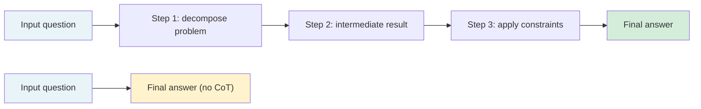

# [AEE-302] 思維鏈提示

## 情境

思維鏈提示（chain-of-thought prompting，CoT）指示模型在給出最終答案之前，先產生中間推理步驟（intermediate reasoning steps）。對於需要多步驟推理的任務——算術、邏輯推演、多重限制條件規劃——CoT 能穩定提升效能，但它並非萬用的改善手段。應用於不需要推理鏈的任務時，它只會增加延遲與 token 成本，而無助於品質。工程師若不加區別地套用 CoT，優化的是推理的外觀，而非實際的任務品質。

## 設計思維

核心主張：思維鏈提示透過擴展生成過程中可用的模式空間，來提升模型在推理任務上的表現——但它並非普遍有效的改善手段。對不需要多步驟推理的任務套用 CoT，只會增加延遲與成本，而沒有品質收益。

**CoT 為何有效：**

LLM 逐 token 生成輸出。當模型在給出答案之前先產生推理鏈，這些中間 token 會成為影響最終答案 token 的額外上下文。更重要的是，推理形式的 token 序列會啟動與正確推理範例相關的訓練模式——當模型已生成推理文字時，更多此類模式會在統計上變得可及。AEE-110 深入說明了這個機制；其實際結論是：在答案之前先產生推理鏈，是一種擴展上下文、浮現更多相關訓練訊號的方式。

**零樣本 CoT（zero-shot CoT）：**

Kojima 等人（2022）證明，在提示詞後附加「Let's think step by step」，會讓指令微調模型生成推理鏈，並在不提供任何範例的情況下大幅提升推理任務的準確率。在 MultiArith 上，零樣本 CoT 將準確率從 17.7% 提升至 78.7%；在 GSM8K 上，從 10.4% 提升至 40.7%。這之所以有效，是因為指令微調模型已學會將逐步推理的語言與系統性解題方式相關聯。常見的零樣本觸發語：「Let's think step by step」、「Think carefully before answering」、「Work through this systematically」。

**少樣本 CoT（few-shot CoT）：**

Wei 等人（2022）引入了少樣本 CoT：在提示詞中提供推理鏈的範例。每個範例展示完整的推理過程，而非只有答案。少樣本 CoT 在複雜推理任務上通常優於零樣本 CoT，因為範例限定了模型產生推理的風格與深度。Wei 等人證明，少樣本 CoT 在 GSM8K 上達到當時的最佳水準，超越了使用驗證器微調的 GPT-3。範例品質比數量更重要：一個結構良好的推理鏈，勝過三個結構鬆散的範例。

**CoT 有幫助的情境：**

- 多步驟算術與代數
- 有多個前提的邏輯推演
- 多重限制條件規劃（排程、資源配置）
- 程式除錯（逐步追蹤執行流程）
- 正確答案需要整合上下文多個部分資訊的任務

**CoT 無幫助（甚至有害）的情境：**

- 單步驟事實查詢：「法國的首都是哪裡？」需要的是檢索，而非推理。CoT 只會增加 token，不會提升準確率。
- 短上下文的單步驟分類：當決策直截了當時，模型不需要推理步驟。
- 模型規模（model scale）已足以飽和問題的任務：對於模型原本就能正確處理的任務，加上 CoT 可能產生冗長的推理，偶爾反而誤導模型。
- 小型模型：Wei 等人發現，CoT 僅在足夠的模型規模下才能提升效能。對於規模遠低於目前 API 服務模型的極小型模型，CoT 可能降低效能而非提升。

**RFC 2119：**

- CoT MUST NOT（絕不能）被無差別地套用於系統中的所有任務。工程師 SHOULD（應該）在部署前，針對每種任務類型分別評估有無 CoT 的差異。
- 零樣本 CoT（「Let's think step by step」）SHOULD（應該）作為推理任務的預設起點。當零樣本 CoT 產生不一致的推理品質時，SHOULD（應該）改用少樣本 CoT。
- 使用 CoT 的系統 MUST（必須）在成本與效能模型中，將 token 消耗增加與延遲上升納入考量。

## 深度探討

### 模型規模的依賴性

Wei 等人（2022）指出，CoT 的效益在模型規模達到一定閾值後才能穩定出現。低於該閾值時，加入推理鏈指令不會帶來改善，有時反而會降低效能。直觀理解：生成看似合理的推理鏈，本身就需要模型已具備推理能力。被要求逐步推理的小型模型，可能生成局部看似合理但整體錯誤的推理文字，最終得出一個有著自信口吻根據的錯誤答案。

對於透過 API 存取的當前前沿模型（GPT-4o、Claude、Gemini Pro），規模閾值在實務上不成問題。對於較小的微調模型或量化本地模型，在假設 CoT 有效之前，應分別進行基準測試。

### 少樣本 CoT：範例品質

在少樣本 CoT 中，範例呈現的不只是輸入輸出配對，而是完整的推理鏈：問題如何被拆解、中間結果如何計算、限制條件如何逐步套用。模型學習複製這種推理風格。

範例品質準則：
- 涵蓋生產環境預期的完整難度範圍——不只是簡單範例
- 在每個步驟明確展示推理，而非只有最終計算結果
- 在符號與風格上保持內部一致性
- 至少包含一個處理生產環境中出現的邊界情況或限制條件的範例

### 實作範例

**任務：** 將客戶支援請求分類為緊急（需在 1 小時內回應）或標準（24 小時回應）。

**未使用 CoT：**

```
System: Classify customer support requests as URGENT or STANDARD.
User: My account has been charged twice for the same order.
```

模型可能正確分類為 URGENT，但不穩定——當模型只對「account」做表面模式匹配而非推理緊急程度時，某些重複扣款請求會被歸為 STANDARD。

**使用零樣本 CoT：**

```
System: Classify customer support requests as URGENT or STANDARD.
Think through your reasoning before giving the classification.
User: My account has been charged twice for the same order.
```

模型輸出：
```
Thinking: This customer has been double-charged, which means money has already
been taken from their account. Financial errors affecting current account balances
need immediate attention to prevent further harm. Classification: URGENT.
```

推理步驟迫使模型評估財務影響，而非對表面特徵做模式匹配，使邊界情況的分類更加一致。

## 視覺化



有 CoT（上方路徑）：中間 token 擴展模式空間，浮現更多相關訓練訊號。無 CoT（下方路徑）：單步驟生成；對簡單任務正確，對複雜任務效能下降。

## 最佳實踐

1. **先對推理任務使用零樣本 CoT 並量測準確率，再考慮加入少樣本範例。** 零樣本 CoT（「Let's think step by step」）比維護少樣本範例集更省成本，對於範圍明確的推理任務通常已足夠。只有在零樣本 CoT 產生不一致的推理品質時，才加入少樣本範例。

2. **在部署 CoT 之前，對任務樣本執行 A/B 基準測試。** 在具代表性的生產輸入樣本上，同時量測有無 CoT 的準確率、延遲與推論成本（inference cost）。對於不需要推理的任務，A/B 結果將顯示準確率沒有改善——此時應從提示詞中移除 CoT。

3. **預算 CoT 的 token 成本。** 推理鏈依任務複雜度會增加每次請求約 100–500 個 token。對於高流量任務，這會成倍放大推論成本。計算每次請求的 token 增量，並判斷準確率的提升是否值得這筆成本。

## 相關 AEE

- [AEE-301](301) — 提示結構基礎（提示詞結構與元件配置）
- [AEE-110](../Foundations and Mental Models/110) — LLM 的限制與失效模式（推理限制與 CoT 作為緩解手段）
- [AEE-303](303) — 少樣本提示
- [AEE-305](305) — 自我一致性與集成

## 參考資料

- [Chain-of-Thought Prompting Elicits Reasoning in Large Language Models (Wei et al., arXiv 2201.11903)](https://arxiv.org/abs/2201.11903)
- [Large Language Models are Zero-Shot Reasoners (Kojima et al., arXiv 2205.11916)](https://arxiv.org/abs/2205.11916)

## 更新記錄

- 2026-04-14 -- 初稿
