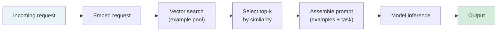

# [AEE-303] 少樣本提示

## 情境

少樣本提示 (few-shot prompting) 在實際任務輸入之前，向模型提供若干輸入-輸出範例。模型利用這些範例推斷任務模式，並將其套用至新的輸入——這個過程稱為上下文學習 (in-context learning)。Brown et al. (2020) 在規模化層面確立了這項能力：提供少量範例即可顯著提升模型在各類任務上的表現，且無需對模型進行任何權重更新。

這項技術看似簡單——貼入幾個範例即可——但範例品質、多樣性與排列順序都會對輸出品質產生顯著影響。工程師若將少樣本提示視為「隨便給幾個範例」而不進行刻意篩選，往往會得到在開發輸入上運作正常、在正式環境中卻頻繁失敗的提示。

## 設計思維

核心主張：少樣本提示是一種上下文學習機制，而非迴避撰寫指令的捷徑。範例品質、範例多樣性 (example diversity) 與選擇方式，對輸出品質的影響都遠大於範例數量。

**上下文學習的本質：**

上下文學習並非微調 (fine-tuning)。模型的權重不會改變。改變的是模型訓練分佈中哪些模式被最強烈地激活。提供特定任務格式的範例，會使模型生成符合該格式的輸出——這並非因為模型從這些範例中學習，而是因為這些範例與訓練資料中關聯該格式的部分相似。這意味著模型可以泛化該模式，但僅限於其現有能力範圍之內：上下文學習無法教導模型它所不知道的事實，也無法賦予其本不具備的能力。

**範例中真正重要的因素：**

Min et al. (2022) 發現了一個反直覺的結果：對許多分類任務而言，範例標籤的正確性遠不如範例的格式一致性重要。一組輸入與輸出格式保持一致的範例——即使標籤是隨機指定的——往往能產生與標籤正確的範例相近的表現。這表明上下文學習主要激活的是任務格式，而非從特定的輸入-輸出對應關係中學習。實務意涵：格式一致性是關鍵承載因素；當任務需要理解具體的語義區別時，內容品質才最為重要。

**範例品質：**

優質範例應具備：清晰完整且能代表正式環境輸入的輸入；正確且格式精確的輸出；輸入與輸出之間的對應關係無歧義。嘈雜範例——輸入與輸出之間的關係不明確——會透過激活相互衝突的格式模式來降低表現。

**範例多樣性 (example diversity)：**

範例必須涵蓋模型在正式環境中會遇到的輸入分佈。三個相似的範例只能教模型一種模式；三個涵蓋不同邊緣情況的多樣化範例，則能教模型該模式的邊界。對於分類任務：應包含決策邊界附近的範例，而非僅有明確無疑的案例。對於生成任務：應包含不同輸入長度與複雜程度的範例。

**範例數量：**

對大多數任務而言，範例超過 8 到 10 個後，收益通常會遞減。三到五個精心挑選、多樣化的範例，往往優於二十個隨意選取的範例。在收益遞減點之後繼續增加範例，只會消耗上下文預算而不改善品質。

**順序敏感性 (order sensitivity)：**

模型對範例出現的順序敏感。較後的範例對輸出的影響更強——模型的注意力會賦予近期上下文更高的權重。若最相關的範例恰好排在最後，其表現將優於排在最前的相同範例集。因應策略：跨多次執行隨機化順序以平均位置效應；將最具代表性的範例放在最後；在確定固定順序之前測試不同排列的變體。

**靜態選擇 (static selection) 與動態選擇 (dynamic selection)：**

當正式環境的輸入分佈狹窄且已充分了解時，靜態範例集是合適的做法。動態選擇——在推理時從較大的範例池中擷取語義上最相似的前 k 個範例——在輸入分佈多變時更為穩健。動態選擇需要向量儲存庫並增加擷取延遲，但對於多變的輸入，能產生更佳的範例-任務匹配效果。

**RFC 2119：**

- 少樣本範例集在部署前 MUST (必須) 進行順序敏感性測試。重新排列範例並測量輸出品質是否改變；若有變化，須固定排列順序或採用隨機化策略。
- 當正式環境請求的輸入分佈差異顯著，且有較大的範例池可用時，SHOULD (應該) 使用動態範例選擇。
- 範例集 MUST (必須) 涵蓋預期輸入分佈中的邊緣情況，而不能僅包含典型案例。

## 深度探討

### 靜態選擇與動態選擇的決策

靜態選擇適用於以下情況：
- 任務的輸入分佈狹窄且穩定（例如：從已知類別集合中分類支援票據）
- 候選範例少於 50 個
- 請求路徑無法增加擷取延遲

動態選擇適用於以下情況：
- 輸入在不同使用者或情境之間差異顯著
- 擁有大型的高品質範例池（50 個以上）
- 可接受的擷取延遲預算（向量搜尋 (vector search) 通常為 50 至 150 毫秒）

對於動態選擇，擷取模型的選擇至關重要：通用嵌入模型對於特定領域任務，可能無法產生良好的語義相似度。當通用相似度分數表現不佳時，應考慮使用領域適應嵌入模型。

### 實作範例

**任務：** 將客戶支援信件分類為三個類別之一：BILLING（帳單）、TECHNICAL（技術）、GENERAL（一般）。

**弱靜態範例集（範例相似、涵蓋不足）：**

```
Input: I was charged twice.
Output: BILLING

Input: My invoice shows the wrong amount.
Output: BILLING

Input: I want to cancel my subscription.
Output: BILLING
```

問題：三個範例全都與帳單相關。模型從未見過 TECHNICAL 或 GENERAL 的範例。模糊的帳單相關輸入將被誤分類為 BILLING。

**強靜態範例集（多樣化、涵蓋邊界情況）：**

```
Input: I was charged twice this month.
Output: BILLING

Input: The app crashes every time I open a project.
Output: TECHNICAL

Input: I'd like to update my mailing address.
Output: GENERAL

Input: My payment failed but my account shows a charge.
Output: BILLING

Input: The API returns a 500 error when I call /export.
Output: TECHNICAL
```

此範例集現已涵蓋全部三個類別，並包含一個邊界案例（付款失敗但帳戶顯示扣款，需要區分帳單錯誤與付款失敗）。

## 視覺化



動態少樣本選擇流程：將輸入請求嵌入向量後，從範例池中擷取語義上最相似的前 k 個範例，再將這些範例與任務組合成提示，最後送入模型推理。

## 最佳實踐

1. **在為部署選擇範例之前，先建立範例池。** 收集 20 至 50 個涵蓋完整預期輸入分佈的標記範例，再從中挑選最佳的 3 至 7 個作為靜態集。不要專門為提示撰寫範例——這樣產生的範例是依據你對任務的心理模型校準的，而非實際的正式環境分佈。

2. **在確定固定的範例排列順序之前，先測試順序敏感性。** 以三種隨機排列執行相同的提示，並測量輸出品質的差異。若品質在各排列之間保持穩定，則順序並非關鍵因素。若差異顯著，則使用品質最高的配置固定順序，並記錄原因。

3. **優先選擇多樣化的範例，而非相似的範例。** 在新增範例時，思考：這個範例涵蓋了現有範例尚未涵蓋的哪部分輸入分佈？若答案是「沒有任何新內容」，則該範例僅增加上下文預算成本而不提升涵蓋範圍。

## 相關 AEE

- [AEE-301](301) — Prompt Structure Fundamentals（範例作為結構組成元素）
- [AEE-302](302) — Chain-of-Thought Prompting（少樣本 CoT）
- [AEE-202](../Model and Context Layer/202) — Context Window Architecture（範例集的上下文預算）

## 參考資料

- [Language Models are Few-Shot Learners (Brown et al., arXiv 2005.14165)](https://arxiv.org/abs/2005.14165)
- [Rethinking the Role of Demonstrations: What Makes In-Context Learning Work? (Min et al., arXiv 2202.12837)](https://arxiv.org/abs/2202.12837)

## 更新記錄

- 2026-04-14 -- 初稿
