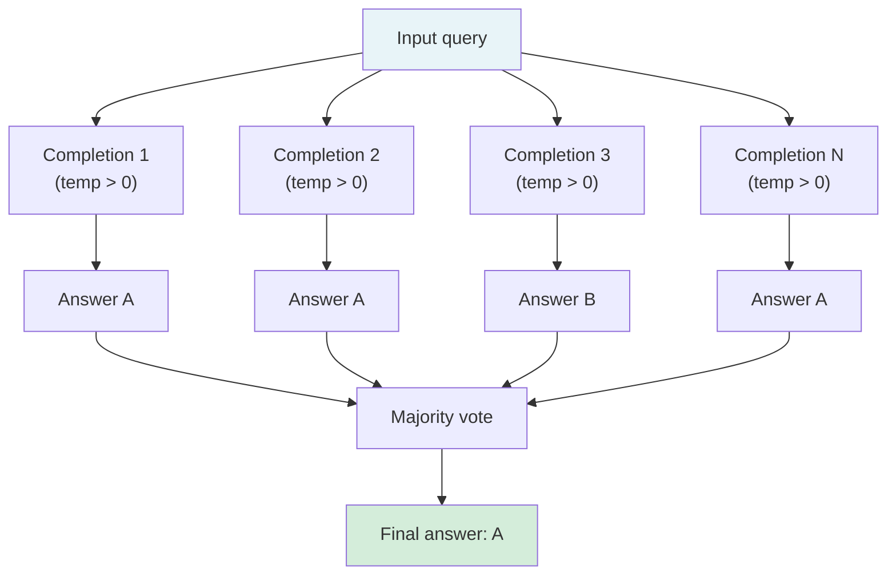

# [AEE-305] 自洽性與集成方法

## 情境

單次模型補全本身具有固有的變異性。對大多數任務而言，這種變異性是可接受的——大多數情況下答案是正確的，偶爾出錯的代價也不高。但對於高風險決策，單次錯誤代價高昂，此時變異性就無法接受。自洽性 (self-consistency) 與集成方法 (ensembling) 是以額外的推論成本換取更低輸出變異性的技術：生成多個補全結果、彙整後回傳，而非直接回傳任何單一補全。

這些技術並非免費。生成 N 個補全結果的費用是推論預算 (inference budget) 的 N 倍。使用這些技術是明確的工程取捨：可靠性的提升是否值得這個成本倍數？

## 設計思維

核心主張：自洽性與集成方法以推論成本換取可靠性——適合用於單次模型補全具有不可接受變異性的高風險決策，不適合用於對延遲或成本敏感的工作負載。

**自洽性：**

Wang et al.（2022）針對思維鏈提示法引入了自洽性：以非零採樣溫度 (sampling temperature) 取樣多個補全結果，讓每個補全各自完成一條 CoT 推理鏈，再對最終答案進行多數投票 (majority voting)。直覺上：如果多條獨立推理路徑收斂到同一答案，該答案比任何單條路徑所得的答案更可能正確。Wang et al. 在標準 CoT 基準上展示了顯著的準確率提升：GSM8K +17.9%、SVAMP +11.0%、AQuA +12.2%。

自洽性需要非零溫度，以確保 N 個補全實際上走的是不同推理路徑。在溫度為 0 時，所有補全結果相同，多數投票毫無益處。

**多數投票機制：**

對於類別型任務（分類、是非題、多選題）：計算每個答案的出現次數，選出最高頻的那個。平手處理：選擇在推理鏈中出現最多次的答案；若仍平手，則回傳推理最詳細的那次補全所給出的答案。

對於生成型任務（摘要、開放式問答）：逐字比對的投票沒有意義。可用的方案：使用評分提示對補全結果排名（「哪個回答最能回答這個問題？」）、將語意相似的補全聚類後在群集上投票，或選出與其他所有補全最相似的那個。

**最優 N 選擇（Best-of-N）：**

最優 N 選擇 (best-of-N) 生成 N 個補全結果，並以評分函數（而非多數投票）選出最佳者。評分函數可以是：獎勵模型、自我評估提示（「從 1 到 10 評估這個回應的正確性與完整性」）、啟發式規則（最長的完整答案、第一個能解析為合法 JSON 的答案），或以上的組合。Best-of-N 適用於多數投票無意義的開放式生成任務，但需要 N 次推論加上一次評分步驟。

**跨提示集成：**

不以同一提示執行 N 次，而是以 N 種不同措辭的提示執行後再彙整。這能降低對提示措辭的敏感度——這是與隨機採樣變異性不同的失敗模式。當擔心特定措辭會觸發有偏差的回應模式時，此方法特別有用。

**成本模型：**

自洽性使用 N 個補全時，補全部分的費用為推論預算的 N 倍。若單次補全費用為 $0.01，則 N=5 的自洽性每次請求費用為 $0.05。部署前請計算：任務量、每次補全的費用，以及在選定 N 值下每個任務的費用。判斷可靠性的提升是否符合此任務品質標準所需的成本倍數。

自洽性的準確率提升會隨 N 增加而呈現報酬遞減。大部分的收益在適中的 N 值時已可獲得，繼續增加 N 帶來的邊際增益越來越小。在驗證集上選擇能滿足任務可靠性需求的最小 N。

**RFC 2119：**

- 未經明確延遲預算分析，自洽性 MUST NOT（不得）應用於延遲關鍵路徑。每增加一個補全就會增加與單次補全回應時間成比例的延遲（不過並行分發可緩解此問題——參見最佳實踐）。
- 在生產環境部署集成方法前，工程師 MUST（必須）計算成本倍數（N × 每次補全費用）。
- 自洽性 SHOULD（應）只在非零溫度下使用。溫度為 0 時，所有補全結果相同，投票毫無益處。

## 深度探討

### 自洽性最有效的場景

自洽性最有效的情況：
1. 任務需要多步驟推理（算術、邏輯），且任何單條推理鏈都可能在某個步驟出錯
2. 答案空間是離散且有限的（分類、是非題、多選題）
3. 單次補全的準確率高於隨機水準——若單次補全準確率接近隨機，自洽性無法可靠地還原正確答案

自洽性效益最低的情況：
1. 單次補全已達近天花板的準確率（可靠性邊際增益極小）
2. 任務需要長篇生成，彙整成本高昂或定義不清
3. 延遲是首要限制

### 實際範例

**任務：** 判斷合約條款是否對買方造成責任風險（YES/NO）。高風險二元決策。

**單次補全（標準 CoT）：**
```
Clause: "The vendor shall not be liable for any indirect, consequential, 
or punitive damages arising from service interruptions."

Reasoning: This clause limits the vendor's liability. The vendor is 
protected from consequential damages. Classification: NO (the vendor 
is not exposed to liability).
```

這是錯誤的：限制「供應商」責任的條款，意味著「買方」承擔了這項風險。推理錯誤——將「供應商無責任」混淆為「無責任風險」——導致了錯誤分類。

**自洽性（N=5，溫度 0.7）：**
- 補全 1：YES — 供應商免責 = 買方承擔損失
- 補全 2：YES — 服務中斷後果無法追索
- 補全 3：NO — 供應商責任有上限（與基準相同的錯誤）
- 補全 4：YES — 後果損害排除條款將負擔轉移給買方
- 補全 5：YES — 標準免責條款，買方無救濟途徑

多數投票結果：YES（4/5）。儘管有一個補全犯了與單次補全基準相同的推理錯誤，正確答案仍然勝出。

## 視覺化



每個補全透過獨立的推理鏈產生一個答案。對 N 個答案進行多數投票，可得到比任何單一補全更可靠的結果。

## 最佳實踐

1. **在選擇 N 之前先定義品質標準。** 從 N=3 開始，在驗證集上測量通過率。只有在通過率低於要求門檻時才增加 N。不要在未測量必要性的情況下就預設較大的 N。

2. **二元或類別決策使用自洽性，生成型輸出使用 best-of-N。** 對類別型輸出進行多數投票簡單易實作。對於開放式生成，評分函數需要更多基礎設施——評估可靠性增益是否值得工程成本。

3. **並行執行補全以降低延遲影響。** N 個非零溫度的補全可以同時向 API 發出請求，再彙整結果。實際延遲約等於單次補全的延遲加上彙整開銷，而非 N × 延遲。這使自洽性在原本會因串行推論而受阻的即時系統中也可行。

## 相關 AEE

- [AEE-302](302) — 思維鏈提示法（CoT 作為底層技術）
- [AEE-206](../Model and Context Layer/206) — 生產環境中的模型選擇（成本建模）
- [AEE-306](306) — 提示健壯性測試（跨提示集成作為健壯性技術）

## 參考資料

- [Self-Consistency Improves Chain of Thought Reasoning in Language Models (Wang et al., arXiv 2203.11171)](https://arxiv.org/abs/2203.11171)

## 更新記錄

- 2026-04-14 -- 初稿
