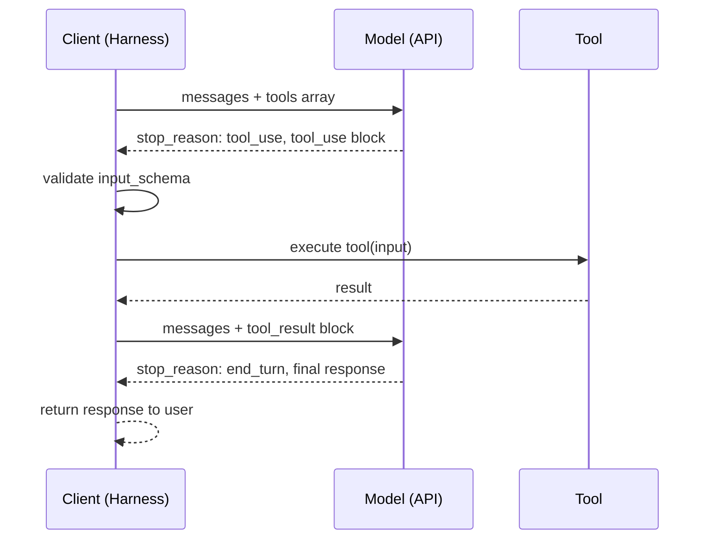

# [AEE-401] 函式呼叫

## 情境

函式呼叫 (function calling) 是一種協定，讓模型能夠代為請求執行外部功能。模型本身不會執行程式碼、呼叫 API 或查詢資料庫——它只會發出一個結構化的請求，描述應該呼叫什麼以及傳入哪些引數。執行框架 (harness)（即圍繞模型的應用程式碼）負責執行工具並回傳結果。模型隨後在取得結果的情境下繼續生成回應。

理解這種分工——模型作為請求方，執行框架作為執行方——的工程師，比將函式呼叫視為黑盒子的工程師，能夠建構出更可靠的工具使用代理。協定本身並不複雜；失敗的根源在於誤解各方的職責。

## 設計思維

核心論點：函式呼叫是一種協定，而非單純的功能。模型不會執行工具——它發出結構化請求；執行框架負責執行並回傳結果。理解這種分工的工程師，比把函式呼叫當作魔法的工程師，能夠建構出更可靠的工具使用代理。

**協定的四個步驟：**

1. **工具定義 (tool definition)** — 客戶端在 API 請求中傳送 `tools` 陣列。每個項目定義了一個模型可以呼叫的工具：名稱、說明，以及輸入結構描述 (input schema)（JSON Schema）。
2. **模型回應含工具呼叫 (tool use/tool call)** — 模型決定呼叫工具，並回傳帶有 `stop_reason: "tool_use"` 的回應，以及含有工具名稱和解析後輸入引數的 `tool_use` 內容區塊。
3. **執行框架執行** — 執行框架偵測到 `stop_reason: "tool_use"`，從內容區塊中提取工具名稱和輸入，執行對應的函式，並擷取結果。
4. **注入工具結果 (tool result)** — 執行框架將原始助理回應附加到訊息陣列，然後新增一則包含 `tool_result` 內容區塊的 `user` 訊息，其中包含 tool_use_id 和執行結果。接著再次呼叫模型，並提供這份擴展後的情境。

**模型的職責 vs. 執行框架的職責：**

| 職責 | 負責方 |
|---|---|
| 決定是否呼叫工具 | 模型 |
| 選擇呼叫哪個工具 | 模型 |
| 決定輸入引數 | 模型 |
| 執行工具 | 執行框架 |
| 執行前驗證參數 | 執行框架 |
| 格式化結果 | 執行框架 |
| 將結果注入對話 | 執行框架 |

模型無法直接存取執行環境。在看到結果之前，它無法得知執行框架是否驗證了其參數，或工具是否執行成功。這正是執行框架端的驗證是 MUST（必須）而非 SHOULD（應該）的原因。

**並行工具呼叫 (parallel tool calls)：**

當模型判斷多個工具可以獨立執行時，可能在單一回應中發出多個 `tool_use` 區塊。執行框架可以並行執行這些工具。每個工具各自產生一個 `tool_result` 區塊，全部收納在同一則 user turn 訊息中回傳。

- 執行框架 MUST（必須）在執行前，依據工具的 input_schema 驗證工具呼叫的參數。將未驗證的模型輸出傳送至外部系統，是安全性與可靠性的失敗。
- 工具結果 MUST（必須）以結構化的 `tool_result` 訊息形式，在 user turn 中回傳給模型。以純文字形式在 user turn 中注入結果，會繞過協定並產生不可預期的行為。
- 當 `stop_reason` 為 `"tool_use"` 時，執行框架 MUST NOT（絕對不能）向使用者生成最終回應。模型正處於對話中途，等待工具結果。
- 在建構 tool_result 訊息時，工具名稱和 tool_use_id 值 MUST（必須）完整保留。ID 不符會導致模型無法追蹤哪個結果對應哪個呼叫。

## 深入探討

### 工具定義格式

Anthropic API 的工具定義格式：

```json
{
  "name": "search_web",
  "description": "Search the web for current information on a topic. Use this tool when the user asks about recent events, facts that may have changed, or information outside your training data. Do NOT use for general knowledge questions the model can answer directly.",
  "input_schema": {
    "type": "object",
    "properties": {
      "query": {
        "type": "string",
        "description": "The search query. Be specific — use key terms rather than full sentences. Maximum 200 characters."
      },
      "num_results": {
        "type": "integer",
        "description": "Number of results to return. Defaults to 5 if not specified. Maximum 10."
      }
    },
    "required": ["query"]
  }
}
```

關鍵元素：
- `name`：機器可讀的識別符，用於 tool_use 區塊。必須符合 `^[a-zA-Z0-9_-]{1,64}$` 的規則。
- `description`：模型用來判斷是否呼叫此工具的自然語言說明。詳見 AEE-402 的結構描述設計指南。
- `input_schema`：定義工具參數的 JSON Schema 物件。根層級的 `type` 必須為 `"object"`。

`tools` 陣列與 `messages` 和 `model` 一同傳入 API 請求。

### 工具呼叫回應

當模型決定呼叫 `search_web` 時，其回應如下：

```json
{
  "id": "msg_01XFDUDYJgAACTU3VRZXEDsQ",
  "type": "message",
  "role": "assistant",
  "content": [
    {
      "type": "text",
      "text": "Let me search for the latest information on that."
    },
    {
      "type": "tool_use",
      "id": "toolu_01T1x1fJ34qAmk2tzvAqyFsR",
      "name": "search_web",
      "input": {
        "query": "TypeScript 5.4 release notes",
        "num_results": 5
      }
    }
  ],
  "stop_reason": "tool_use",
  "usage": { "input_tokens": 245, "output_tokens": 68 }
}
```

執行框架偵測到 `stop_reason: "tool_use"`，提取 `tool_use` 區塊，並呼叫對應的函式。

### 注入工具結果

執行工具後，執行框架建構下一次 API 呼叫。原始助理訊息附加至 `messages`，接著加入一則包含結果的新 user 訊息：

```json
{
  "messages": [
    { "role": "user", "content": "What's new in TypeScript 5.4?" },
    {
      "role": "assistant",
      "content": [
        { "type": "text", "text": "Let me search for the latest information on that." },
        {
          "type": "tool_use",
          "id": "toolu_01T1x1fJ34qAmk2tzvAqyFsR",
          "name": "search_web",
          "input": { "query": "TypeScript 5.4 release notes", "num_results": 5 }
        }
      ]
    },
    {
      "role": "user",
      "content": [
        {
          "type": "tool_result",
          "tool_use_id": "toolu_01T1x1fJ34qAmk2tzvAqyFsR",
          "content": "TypeScript 5.4 introduces the NoInfer utility type, preserves narrowing in closures, and adds support for require() calls in --moduleResolution bundler mode."
        }
      ]
    }
  ]
}
```

模型隨後以 `stop_reason: "end_turn"` 生成最終回應。

### 停止原因 (stop reason)

| `stop_reason` | 含義 | 執行框架動作 |
|---|---|---|
| `"end_turn"` | 模型完成生成 | 將回應回傳給使用者 |
| `"tool_use"` | 模型正在請求工具呼叫 | 執行工具、注入結果、再次呼叫模型 |
| `"max_tokens"` | 生成途中達到 token 上限 | 處理截斷 |
| `"stop_sequence"` | 觸發已設定的停止序列 | 將回應回傳給使用者 |

### 並行工具呼叫

若模型在單一回應中發出兩個 `tool_use` 區塊，兩個結果必須在同一則 user turn 訊息中回傳：

```json
{
  "role": "user",
  "content": [
    {
      "type": "tool_result",
      "tool_use_id": "toolu_01ABC",
      "content": "Result from first tool"
    },
    {
      "type": "tool_result",
      "tool_use_id": "toolu_01DEF",
      "content": "Result from second tool"
    }
  ]
}
```

執行框架可以並行執行這些工具（例如使用 `asyncio.gather`）。每個 `tool_result` 必須與其 `tool_use_id` 精確對應。

### 錯誤結果

若工具執行失敗，回傳帶有 `is_error: true` 的 `tool_result`：

```json
{
  "type": "tool_result",
  "tool_use_id": "toolu_01T1x1fJ34qAmk2tzvAqyFsR",
  "is_error": true,
  "content": "Search failed: rate limit exceeded. Retry after 30 seconds."
}
```

模型隨後可以決定是否重試、採用不同方法，或向使用者回報失敗。

## 視覺化



## 最佳實踐

1. **在加入工具結果前，先附加完整的助理訊息。** tool_result 訊息前必須有包含 tool_use 區塊的助理訊息。從情境中移除助理訊息會破壞對話結構，導致模型產生不可預測的行為。

2. **用迴圈而非條件分支處理 `stop_reason: "tool_use"`。** 模型可能在多個回合中依序呼叫多個工具。正確的模式是使用 while 迴圈，持續呼叫模型直到 `stop_reason` 變為 `"end_turn"`，而非用 if-else 只處理一次工具呼叫。

3. **以工具結果回傳錯誤，而非拋出例外。** 若工具執行失敗，回傳帶有 `is_error: true` 及失敗說明的 `tool_result`。拋出例外會跳過結果注入步驟，使模型停在對話中途，無法繼續。不要回傳空的 `content` 欄位或虛假的成功訊息——模型無法區分沉默與成功，可能會幻想出一個結果。

## 相關 AEE

- [AEE-400](400) — 工具使用與執行（類別概覽）
- [AEE-402](402) — 工具結構描述設計（如何撰寫讓模型正確呼叫的工具定義）
- [AEE-405](405) — 工具選擇（模型如何在多個工具中做選擇）

## 參考資料

- [Tool Use Overview (Anthropic)](https://docs.anthropic.com/en/docs/tool-use)
- [Build with Claude: Tool Use (Anthropic)](https://docs.anthropic.com/en/docs/build-with-claude/tool-use)

## 更新記錄

- 2026-04-14 -- 初稿
