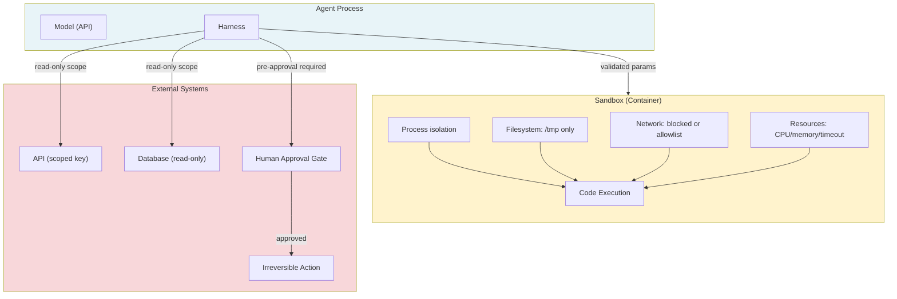

# [AEE-406] 沙箱隔離與執行安全

## 情境

每一個具有副作用的工具——寫入資料、呼叫外部 API、執行程式碼、與 UI 互動——都必須被視為爆炸半徑 (blast radius) 問題。工具的爆炸半徑，是指當代理行為異常時可能造成的最大損害：選錯了動作、誤解了參數、遭到提示詞注入攻擊，或是代理循環本身有錯誤。

沙箱隔離 (sandboxing) 並非單一技術，而是多層次隔離原語的集合。其目標是讓錯誤行為變得有界且可觀測，而非讓錯誤變得不可能發生。一個只能造成有限損害的代理可以被部署、監控並加以修正；一個爆炸半徑無界的代理，無論提示詞寫得多麼謹慎，都無法安全部署。

## 設計思維

核心主張：每一個具有副作用的工具都必須被視為爆炸半徑問題。問題不在於是否需要沙箱隔離，而在於最小權限集合為何，以及如何強制執行。

**爆炸半徑的定義：**

爆炸半徑是代理行為異常時可能造成的最大損害。它取決於：
1. 有哪些工具可用
2. 這些工具擁有哪些權限
3. 不可逆操作 (irreversible action) 是否需要人工確認

一個只有唯讀資料庫存取權限、僅限單一資料表、且無網路存取的代理，即使行為異常，其爆炸半徑也很小。而一個擁有資料庫寫入權限、完整網路存取，且能發送電子郵件的代理，其爆炸半徑則相當大——單一錯誤的工具呼叫就可能刪除記錄、洩漏資料或觸發對外通訊。

**最小權限原則 (principle of least privilege) 應用於工具：**

每個工具應僅攜帶執行其功能所需的最小權限：
- 唯讀搜尋工具不應擁有其所搜尋索引的寫入權限
- 只需讀取行事曆事件的工具不應擁有刪除事件的權限
- 需要執行 Python 的程式碼執行沙箱，除非任務有此需求，否則不應有對外網路存取
- 讀取使用者個人資料的 API 工具應使用唯讀 API 金鑰，而非管理員金鑰

**隔離層：**

有效的沙箱隔離應在多個層次上施加隔離。各層彼此獨立；某層失效時，其他層仍可攔截：

1. **進程隔離 (process isolation)**：工具在與主應用程式獨立的進程或容器中執行。主進程的記憶體、憑證及環境變數均不可存取。
2. **檔案系統隔離 (filesystem isolation)**：工具的檔案系統存取範圍限制於指定路徑。它無法讀取主機檔案系統、存取設定檔或讀取憑證。
3. **網路隔離 (network isolation)**：對外網路存取預設封鎖。需要網路存取的工具僅被授予特定允許清單的存取，而非無限制的網際網路。
4. **資源限制 (resource limits)**：CPU 時間、記憶體與執行逾時均有上限。失控的迴圈或記憶體密集操作無法耗盡主機資源。

**人機協作閘道 (human-in-the-loop gate)：**

並非所有爆炸半徑都能透過技術隔離來縮減。有些操作本質上屬於高風險，因為它們不可逆或對外部有重大影響：
- 資料刪除
- 金融交易
- 對外通訊（電子郵件、貼文、表單提交）
- 正式環境設定變更

對於這些操作，適當的控制機制不是隔離，而是人工審核閘道。代理在執行前暫停，呈現即將執行的動作，並等待明確的確認。

**RFC 2119：**

- 擁有外部系統寫入權限的代理，MUST（必須）在執行前以完整參數記錄每次工具呼叫。
- 不可逆操作（資料刪除、金融交易、對外通訊），MUST（必須）要求明確的人工審核，除非範圍已被明確預先授權。
- 工具 MUST（必須）遵循最小權限原則：每個工具僅攜帶執行其功能所需的權限。
- 程式碼執行與瀏覽器操作的沙箱 MUST（必須）強制執行進程隔離、檔案系統隔離與資源限制。缺少上述任何一項屬性的沙箱不能稱為沙箱。

## 深入探討

### 隔離層參考

| 層次 | 隔離內容 | 強制執行方式 |
|---|---|---|
| Process | Memory, credentials, env vars | Docker/container, separate OS process |
| Filesystem | Host files, config, secrets | Read-only root mount, tmpfs for writes |
| Network | Outbound connections, exfiltration | Network namespace, egress allowlist |
| Resource | CPU, memory, execution time | cgroup limits (`--memory`, `--cpu-quota`), timeout |

將四層隔離全部套用至程式碼執行沙箱：

```bash
docker run \
  --rm \
  --network=none \
  --memory=256m \
  --cpus=0.5 \
  --read-only \
  --tmpfs /tmp:size=64m \
  --security-opt=no-new-privileges \
  python:3.11-slim \
  python -c "YOUR_CODE_HERE"
```

### API 工具權限

對於呼叫外部 API 的工具：
- 僅需讀取資料的工具應使用唯讀 API 金鑰
- 每個工具使用獨立的 API 金鑰——輪換或撤銷一把金鑰不影響其他工具
- 開發環境使用測試/沙箱環境；正式環境的 API 金鑰絕不用於開發設定
- 對於 OAuth 範疇 API（Google、Microsoft），僅申請工具所需的特定範疇——日曆讀取工具使用 `calendar.readonly`，而非 `calendar`（完整讀寫）

### 稽核日誌 (audit logging)

每次工具呼叫都應產生一筆日誌記錄。最低必要欄位：

```json
{
  "timestamp": "2026-04-14T12:34:56.789Z",
  "tool_name": "delete_document",
  "parameters": { "document_id": "doc_abc123" },
  "model_turn_id": "msg_01XFD",
  "result": "success",
  "user_id": "user_456",
  "session_id": "session_789"
}
```

不可逆操作的稽核日誌應在執行前寫入，而非執行後。若操作中途失敗，仍能留有以該參數嘗試執行的記錄。

### 人機協作閘道的實作

對於需要人工審核的操作，以工具為基礎的實作方式：

```python
tools = [
    {
        "name": "request_delete_approval",
        "description": "Request human approval before deleting a document. ALWAYS use this tool before delete_document. Never call delete_document without prior approval from this tool.",
        "input_schema": {
            "type": "object",
            "properties": {
                "document_id": {
                    "type": "string",
                    "description": "ID of the document to be deleted."
                },
                "reason": {
                    "type": "string",
                    "description": "Why this document should be deleted."
                }
            },
            "required": ["document_id", "reason"]
        }
    },
    {
        "name": "delete_document",
        "description": "Permanently delete a document. ONLY call after receiving an approval_id from request_delete_approval. Do NOT call without prior approval.",
        "input_schema": {
            "type": "object",
            "properties": {
                "document_id": {
                    "type": "string",
                    "description": "ID of the document to delete."
                },
                "approval_id": {
                    "type": "string",
                    "description": "Approval ID returned by request_delete_approval. Required."
                }
            },
            "required": ["document_id", "approval_id"]
        }
    }
]
```

`approval_id` 參數在結構描述層級強制執行閘道——模型若未提供只能從審核流程取得的 ID，就無法呼叫 `delete_document`。

## 視覺化



## 最佳實踐

1. **在撰寫提示詞之前先定義爆炸半徑。** 在撰寫任何代理提示詞之前，先列出每個工具、它能做什麼，以及行為異常時會發生什麼。這份攻擊面分析將驅動沙箱設定與人機協作閘道的決策。爆炸半徑較大的工具需要更嚴格的隔離。

2. **將權限提升視為破壞性變更。** 為原本只有讀取權限的工具新增寫入權限，或為沙箱擴展網路存取，都會改變代理的爆炸半徑。應套用與正式環境程式碼變更相同的審查流程。

3. **不可逆操作先記錄再執行。** 對於任何無法撤銷的工具呼叫，應在派送操作之前寫入稽核日誌。執行前記錄能確保即使操作中途失敗，嘗試記錄仍然存在。

## 相關 AEE

- [AEE-403](403) — 程式碼執行（程式碼執行工具的沙箱設定）
- [AEE-404](404) — 瀏覽器與電腦操作（電腦使用代理的 VM 隔離）
- [AEE-401](401) — 函式呼叫（沙箱隔離所包裝的工具呼叫協定）
- [AEE-204](../Model and Context Layer/204) — 系統提示詞工程（提示詞層級的提示詞注入風險，有別於執行層級的隔離）

## 參考資料

- [OWASP Top 10 for LLM Applications](https://owasp.org/www-project-top-10-for-large-language-model-applications/)
- [Computer Use Safety (Anthropic)](https://docs.anthropic.com/en/docs/build-with-claude/computer-use)
- [E2B Documentation](https://e2b.dev/docs)

## 更新記錄

- 2026-04-14 -- 初稿
