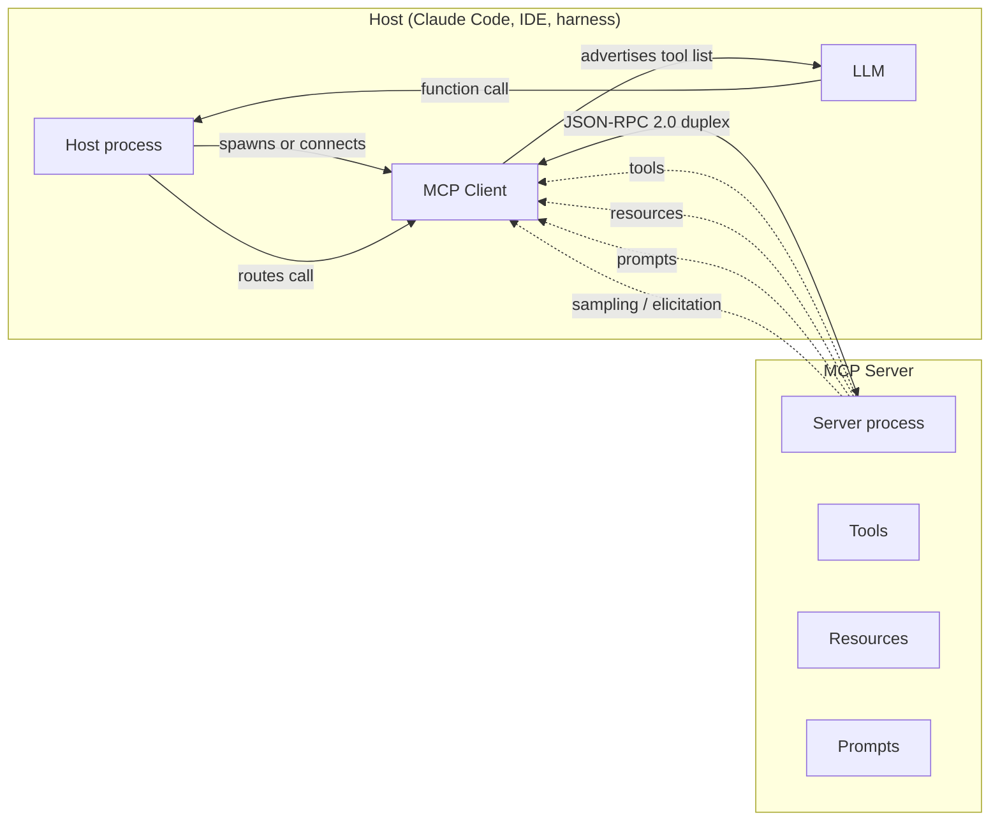

# [AEE-407] 模型情境協定（Model Context Protocol）

## 背景脈絡

模型情境協定（Model Context Protocol，下稱 MCP）是一份開放協定，標準化主機程序如何將語言模型連接到外部工具、資源與提示詞。主機（Claude Code、Claude Desktop 與 Cursor 是常見例子，SDK harness 也算）以 JSON-RPC 2.0 透過雙向通道與一個或多個 MCP 伺服器通訊；伺服器各自宣告能力，模型在輪次中可呼叫這些能力。`modelcontextprotocol.io` 的介紹頁將 MCP 描述為「一份連接 AI 應用程式與外部系統的開源標準」，並使用 USB-C 比喻：一個接頭，多個周邊。

MCP 位於代理協定堆疊的 agent-to-tool 平面，與 A2A（[AEE-608](../Multi-Agent and Orchestration/608)）和 ACP（[AEE-609](../Multi-Agent and Orchestration/609)）所涵蓋的 agent-to-agent 軸線正交，亦與 AG-UI（[AEE-610](../Multi-Agent and Orchestration/610)）和 A2UI（[AEE-611](../Multi-Agent and Orchestration/611)）所涵蓋的 agent-to-UI 軸線正交。語料庫中 [AEE-3](../AEE Overall/3) 的框架將 MCP 列為代理工程的 Level 5。本文補上該框架背後的協定細節：通訊協定本身、四種基元、何時值得採用 MCP，以及如何部署。

撰寫本文時，目前的規範修訂版為 `2025-11-25`，由 MCP 工作小組維護於 [`modelcontextprotocol.io/specification/2025-11-25`](https://modelcontextprotocol.io/specification/2025-11-25)。協定持續演進；依規範開發的讀者，採用版本綁定細節之前應先釘住特定修訂版。

## 設計思考

MCP 將三個角色分開：主機、用戶端與伺服器。主機是使用者執行的應用程式（代理 harness、IDE 外掛、聊天用戶端）。主機內部為每個已連接的伺服器各自承載一個 MCP 用戶端；每個用戶端持有對應伺服器的 JSON-RPC 連線。伺服器是對主機公開能力的程序。三角結構的存在，是為了讓單一主機能扇出至多個伺服器，伺服器之間以及伺服器與主機內部之間都不需互相耦合。

能力探索是這套協定的中央機制。連線開啟時，主機的用戶端詢問伺服器提供哪些工具、資源與提示詞；伺服器回覆一份具型別的目錄。主機接著將適當的子集向模型宣告，視當前輪次而定。模型看到每個工具的 JSON-Schema 描述，並依照該 schema 發出函式呼叫。主機透過 JSON-RPC 將呼叫路由回提供該工具的伺服器，等待回應，然後把結果回傳給模型。工具表面與工具執行因此解耦：模型挑選、主機路由、伺服器執行。

通訊格式為 JSON-RPC 2.0，且通道刻意採用雙向設計。單向的請求／回應通道無法支援由伺服器發起的呼叫，而 MCP 有兩種這類呼叫：sampling（伺服器請主機代為執行一次 LLM completion）與 elicitation（伺服器在工具呼叫進行中向使用者提問）。兩者都需要伺服器主動向上推送訊息，無法依賴用戶端的輪詢。具狀態的連線與雙向通道是這兩種基元的前提。

與函式呼叫（[AEE-401](401)）的關係屬於組合層次。函式呼叫是模型發出的訊息，一個帶參數呼叫工具的結構化請求。MCP 是主機如何取得這些工具定義、並將呼叫路由回提供工具的伺服器的機制。模型的函式呼叫信封包覆一個來自 MCP 的工具，主機在每一輪兩端之間進行轉譯。

## 深度解析

### 四種基元

MCP 公開四個基元家族。

**Tools** 是模型可呼叫的函式，採 JSON-Schema 參數。伺服器以名稱、描述與輸入 schema 宣告一個工具；主機向模型宣告該工具，模型以符合 schema 的參數呼叫它。Tools 是目前實務上 MCP 的主力用途，schema 規範與 [AEE-402](402) 涵蓋的函式呼叫 schema 規範相同：名稱明確、參數範圍縮小、描述精煉。

**Resources** 是主機可附掛的唯讀資料，模型可參考之，例如檔案內容、查詢結果、文件片段，有時甚至整份資料集。伺服器以 URI 公開資源，主機可列出與讀取。資源依約為唯讀，且其定址獨立於模型逐輪的呼叫流程之外。主機可在對話開始時就把資源附上，模型不需透過工具呼叫即可參照。

**Prompts** 是伺服器提供的提示詞範本，由使用者或主機選用。一個伺服器可能發布「summarize codebase」提示詞或某個領域專屬的鋪陳提示詞；主機在 UI 中陳列這些範本，使用者可挑一個作為起點。Prompts 讓伺服器作者把可重用的提示詞模式與其驅動的工具、資源一併出貨。

**Sampling 與 elicitation** 是向上的基元。Sampling 讓伺服器請主機代為執行一次 LLM completion，適用於工具行為依賴某個次決策、而伺服器希望交給主機的模型來判斷的情況。Elicitation 讓伺服器在工具呼叫進行中暫停，透過主機 UI 向使用者提出釐清問題。兩者皆依賴雙向通道與具狀態連線，目前皆為進階功能；許多伺服器並未支援。需要完整機制的讀者請查閱規範。

### 部署簡介

協定支援兩種傳輸層。stdio 把伺服器當成主機的子進程執行：主機呼叫 `child_process.spawn`（或對應語言中的等價方式），把 stdin 與 stdout 接到 JSON-RPC 通道，並保留 stderr 給日誌。Streamable HTTP 把伺服器當成長期執行的程序，主機以 URL 連接；主機開啟 HTTP 連線、以 POST 完成 JSON-RPC 握手，並可選擇升級為 SSE 以串流伺服器至用戶端的訊息。

stdio 的最小 `.mcp.json` 設定如下：

```json
{
  "mcpServers": {
    "my-server": {
      "command": "node",
      "args": ["server.js"]
    }
  }
}
```

Streamable HTTP 的最小設定：

```json
{
  "mcpServers": {
    "my-server": {
      "type": "http",
      "url": "https://my-mcp.example.com/mcp"
    }
  }
}
```

預設選 stdio。stdio 承襲使用者身分、留在本機、無對外網路面。HTTP 換取跨機器可達性與生命週期獨立，代價是 auth 與運維面。[AEE-408](408) 涵蓋完整取捨：auth 階層、延遲與成本、有狀態與無狀態連線、故障模式，以及單一伺服器程序同時支援兩種傳輸層的混合模式。

## 最佳實踐

MCP 在以下情況才值得採用：工具表面在多個 session 之間重複使用；結果以結構化形式供下游工具呼叫消化；需要 sampling 或 elicitation；同一表面在多個代理之間共享。對於一次性、低重用、低結構的能力，當情境預算主導設計時，包一個 CLI 的 Bash 工具就夠用。

Bassim Eledath 在 [Levels of Agentic Engineering](https://www.bassimeledath.com/blog/levels-of-agentic-engineering) 中提出代幣經濟的論點：「每個 token 都需要為它在 prompt 中的位置而戰」。龐大的 MCP 工具表面會把 schema 注入模型；無論工具是否被呼叫，模型每一輪都得帶著它們。一個目標明確的 CLI 命令只把實際輸出寫進情境。對於低重用、低結構的工作，這份額外負擔就是真正的預算消耗。

Mario Zechner 的 [MCP vs CLI](https://mariozechner.at/posts/2025-08-15-mcp-vs-cli/) 基準測試讓畫面變得更複雜。在同一份底層能力之下，分別以 MCP 伺服器與 CLI 兩種形式公開、跑同一份基準任務：兩者皆達成 100% 成功率；MCP 版本快了 23%，便宜 2.5%。Zechner 落腳的觀點與設計品質有關：「MCP vs CLI 真的是打成平手」，前提是兩者設計都做好。良好的 MCP 工具設計（schema 明確、回傳結構化、範圍合理）能透過減少命令偵測往返，吸收掉每輪 schema 額外負擔的多數成本。

代幣經濟是決策的一個輸入，與重用、結構、向上基元、多代理共享並列。能力屬於一次性、且模型可直接讀取輸出時，採用 CLI。當其他輸入確實在發揮作用時，採用 MCP。

- 工程師 SHOULD 在工具表面跨 session 重用、結果餵給下游工具呼叫、需要 sampling 或 elicitation、或多代理共享同一表面時，優先選擇 MCP。
- 工程師 SHOULD 在能力一次性、低結構、且情境預算主導設計時，優先選擇 Bash 包裝的 CLI。
- 伺服器 MUST 透過能力探索宣告工具，避免依賴主機之外的協調機制。
- 主機 MUST 把 MCP 伺服器視為不受信任的工具描述提供者，並在 harness 邊界驗證輸入與輸出。

## 視覺



## 範例

### 帶單一工具的 stdio 伺服器

最小 `.mcp.json`：

```json
{
  "mcpServers": {
    "weather": {
      "command": "node",
      "args": ["./servers/weather.js"]
    }
  }
}
```

主機啟動時，以 `node ./servers/weather.js` 生成子進程，在 stdin 與 stdout 上完成 JSON-RPC `initialize` 握手，並列出伺服器的工具。伺服器回應一個工具 `get_current_weather`，接受 `location` 字串。執行該工具的一個輪次：

```text
user> what's the weather in Taipei?
model -> tool_use { name: "get_current_weather", input: { location: "Taipei" } }
host -> server (JSON-RPC): tools/call { name, arguments }
server -> host: { content: [{ type: "text", text: "Taipei: 28C, partly cloudy" }] }
model -> "It is 28C and partly cloudy in Taipei."
```

主機掌握生命週期：主機退出時，子進程收到 SIGTERM。其餘運維細節（PATH 解析、stderr 規範、無自動重連）參見 [AEE-408](408)。

### 同一伺服器以 HTTP 提供

能力表面不變。設定僅在傳輸層區塊不同：

```json
{
  "mcpServers": {
    "weather": {
      "type": "http",
      "url": "https://weather.example.com/mcp"
    }
  }
}
```

這時伺服器是位於 `weather.example.com/mcp` 的長駐程序；主機在 session 開始時開啟 HTTP 連線，跑同一份 `initialize` 握手，並以 POST 呼叫 `tools/call`。從模型角度看，輪次形狀完全相同。運維上會出現的差異（auth 標頭、session 識別碼、延遲與成本特性、stdio 不會浮現的故障模式）在 [AEE-408](408) 詳述。

## 相關 AEE

- [AEE-401](401) — Function Calling：MCP 路由的工具呼叫信封
- [AEE-402](402) — Tool Schema Design：套用於 MCP 工具的 schema 規範
- [AEE-405](405) — Tool Selection：模型如何在已宣告的工具之間挑選
- [AEE-408](408) — Local vs Remote MCP Deployment：傳輸、auth、延遲、成本、故障模式
- [AEE-608](../Multi-Agent and Orchestration/608) — A2A: The Agent2Agent Protocol
- [AEE-609](../Multi-Agent and Orchestration/609) — ACP: The Agent Communication Protocol
- [AEE-610](../Multi-Agent and Orchestration/610) — AG-UI: The Agent-User Interaction Protocol
- [AEE-611](../Multi-Agent and Orchestration/611) — A2UI: Declarative Generative UI Protocol for Agents
- [AEE-3](../AEE Overall/3) — Agentic Engineering Levels（Level 5 框架）

## 參考資料

- [MCP Specification 2025-11-25](https://modelcontextprotocol.io/specification/2025-11-25) — Model Context Protocol 工作小組
- [MCP Introduction](https://modelcontextprotocol.io/introduction) — modelcontextprotocol.io
- [Levels of Agentic Engineering](https://www.bassimeledath.com/blog/levels-of-agentic-engineering) — Bassim Eledath
- [MCP vs CLI](https://mariozechner.at/posts/2025-08-15-mcp-vs-cli/) — Mario Zechner

## Changelog

- 2026-05-06 -- Initial draft
