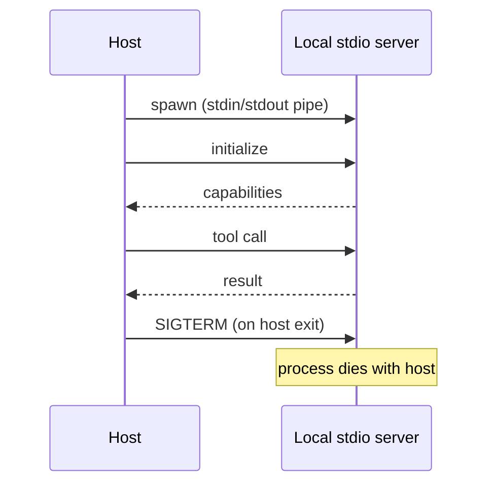
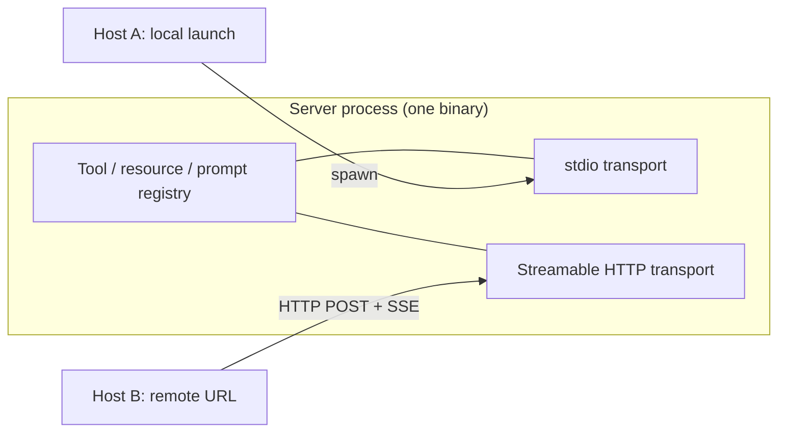

# [AEE-408] 本地與遠端 MCP 部署（Local vs Remote MCP Deployment）

## 情境

[AEE-407](407) 介紹了 Model Context Protocol 與其基元；本文承接其後，探討伺服器要在哪裡執行，以及如何選擇。

協定規範定義了兩種標準傳輸層：stdio（主機把伺服器當成子進程啟動）與 Streamable HTTP（伺服器以獨立程序執行，主機透過 URL 連線）。兩種傳輸層對外暴露的 tools、resources、prompts 與向上基元在 AEE-407 都已介紹過，完全相同。差異屬於運維層次：生命週期、可達範圍、認證面、延遲、成本與故障模式都會改變，模型看到的能力面則不變。本文涵蓋兩種傳輸層、協定離開本機後會出現的五個認證層級、驅動部署決策的延遲與成本特性，以及讓單一伺服器程序同時服務兩種傳輸層的混合模式。

本文一律引用 [2025-11-25 規範修訂版](https://modelcontextprotocol.io/specification/2025-11-25)。若某個版本綁定的細節與 2025-06-18 舊版有差異，會單獨點出，以便處理舊版伺服器的相容性。

## 設計思維

生命週期的差異承載了整個取捨。stdio 把伺服器的存活綁在主機程序上，主機生成伺服器、把 stdin 與 stdout 當成 JSON-RPC 通道、退出時送出 `SIGTERM`。HTTP 則讓兩端獨立：伺服器先行執行，主機在 session 開始時建立 HTTP 連線，主機退出後伺服器照樣存在。認證、延遲、跨主機共享、狀態保留，全都由這個結構性差異衍生。

決策捷徑大致涵蓋多數情境，依序問：

1. 伺服器是否需要無法在遠端複現的本地資源（本地檔案系統、本機安裝的 CLI、使用者的 git repo、IDE 狀態）？是的話，以 stdio 在本機執行。
2. 狀態是否需要跨主機 session 保留、需要多裝置存取、或需要多代理共享？是的話，以 Streamable HTTP 遠端執行。
3. 否則維持本地，直到問題 1 或 2 改變。

走向遠端是單向的運維棘輪：一旦認證、託管、可用性都變成現實課題，要回頭就得回退一次部署。走向本地反過來則容易：改一改 `.mcp.json`，重新啟動伺服器即可。本地是個人 MCP 工作的便宜預設值；遠端在問題 1 或 2 成立時才值得採用。

## 深入探討

### stdio 傳輸

主機啟動時，先從專案（與全域）設定位置讀取 `.mcp.json`，找到該項目的 `command` 欄位，呼叫 `child_process.spawn`（或對應語言的等價方式）以子進程啟動伺服器。主機把子進程的 `stdin` 與 `stdout` 接到 JSON-RPC 訊息通道，`stderr` 留給日誌。接著主機送出 `initialize` 握手，協商協定版本、交換能力清單，伺服器註冊它的 tools、resources 與 prompts。

生命週期跟主機綁在一起。主機退出時，子進程收到 `SIGTERM`。一個主機 session 對應一個伺服器程序：在同一個專案以兩個終端機開啟 Claude Code，會生成兩個伺服器程序，彼此不共享狀態。

stdio 有三種特有故障模式：

- **stdout 被汙染。** stdout 上任何不是 JSON-RPC 訊框的東西都會破壞主機的解析器。一律寫到 `stderr`；stdio MCP 伺服器絕對不要 `console.log`。2025-11-25 規範補充說明：用戶端 **MAY** 擷取、轉發或忽略 stderr，並 **SHOULD NOT** 把 stderr 輸出當成錯誤判斷依據。
- **主機端不會自動重連。** Claude Code（此處作為主機範例）在子進程崩潰後不會自動重連 stdio 伺服器，使用者要透過 `/mcp` 指令手動重新掛載。其他主機行為各異。規範本身把重連交給主機實作決定。
- **cwd 與 PATH 解析。** `args` 中的相對路徑以主機的工作目錄為基準，與從 shell 啟動的 session 可能不同。`command: "node"` 需要 `node` 出現在主機的 `PATH` 裡，這也未必跟使用者互動式 shell 的 `PATH` 一致。改用絕對路徑或包裝腳本可以躲開這類 bug。

兩個最小設定範本：

```json
{
  "mcpServers": {
    "my-server": {
      "command": "node",
      "args": ["server.js"]
    }
  }
}
```

```json
{
  "mcpServers": {
    "my-server": {
      "command": "uvx",
      "args": ["my-package"],
      "env": {
        "API_KEY": "sk-...",
        "LOG_LEVEL": "debug"
      }
    }
  }
}
```

### Streamable HTTP 傳輸

主機啟動時，讀 `.mcp.json`，看到 `type: "http"` 加 `url` 後就跳過程序生成；伺服器必須事先就在執行。主機開啟 HTTP 連線，把 `initialize` 以 HTTP POST 送出，收到伺服器回傳的能力清單。後續用戶端到伺服器的訊息都是 POST；伺服器以 `Content-Type: application/json` 回傳單一 JSON 回應，或以 `Content-Type: text/event-stream` 升級為 SSE 串流，承載多筆伺服器訊息。用戶端也可以另外發 HTTP GET，建立一條獨立的 SSE 通道，用來收伺服器主動發起的訊息；伺服器若不提供，可以回 HTTP 405。

生命週期相互獨立。伺服器活得比主機久，且只要伺服器自己處理 session 多工，一個伺服器就能同時服務多個主機 session。

Session 分兩種。**Stateless** 伺服器每次 HTTP 請求都新建一個伺服器實例、處理完就拆掉；當工具不累積每 session 狀態、後端狀態存在外部儲存、且不需要伺服器主動發起的通知時，這種做法夠用。**Stateful** 伺服器在 `InitializeResult` 上回傳 `MCP-Session-Id` 標頭，用戶端必須在後續每個請求把它帶回去。伺服器隨時可以對某個 session ID 回 HTTP 404 來終止 session（用戶端隨後重新 initialize）；用戶端也可以送一個帶該標頭的 HTTP DELETE 主動結束 session。Stateful session 是以下功能的前提：串流工具結果、sampling、elicitation、伺服器端的每 session 快取，以及網路斷線後以 `Last-Event-ID` 續傳。

標頭大小寫在版本之間有變動。2025-06-18 的傳輸層頁面用 `Mcp-Session-Id`（混合大小寫）；2025-11-25 改為 `MCP-Session-Id`（MCP 全大寫）。要跟舊版伺服器互通的用戶端可能得在線上同時接受兩種大小寫。

2025-11-25 還新增了一套 2025-06-18 沒有的長連線 SSE close-and-poll 模式。伺服器開啟 SSE 串流後，**SHOULD** 立刻送出一筆 primer 事件，事件 ID 一併帶上、`data` 欄位留空，讓用戶端先取得續傳用的標記；接著 **MAY** 在不終止 SSE stream 本身的情況下關掉這條連線。關閉前，伺服器 **SHOULD** 送出帶等待秒數的 `retry` 欄位，用戶端 **MUST** 等到該秒數才重新連線。重連本身走的是標準 SSE 續傳機制：對同一個端點發 HTTP GET，並在請求中帶上 `Last-Event-ID` 標頭，伺服器據此從最後一筆已送達的事件接著補。兩段機制各司其職，合起來才能在網路斷線後優雅重連，也讓位於閒置連線殺手（負載平衡器、無伺服器平台）後方的伺服器，可以主動斷掉 TCP 連線，又不逼用戶端放棄整條 stream。

`MCP-Protocol-Version` 標頭在 initialize 之後的每個 HTTP 請求都必填（例如 `MCP-Protocol-Version: 2025-11-25`）。沒收到該標頭的伺服器 **SHOULD** 為了向後相容預設成 `2025-03-26`；收到無效或不支援的版本值則 **MUST** 回 HTTP 400 Bad Request。`.mcp.json` 接受 `type: "sse"` 對應舊版 2024-11-05 的 HTTP+SSE 傳輸，`type: "http"` 對應目前的 Streamable HTTP；新伺服器都用 `"http"`。

### HTTP 故障模式

HTTP 傳輸層有四種特有的故障模式。具體數字與細節在後面的「延遲、成本與可靠性」與「認證層級」兩節，這裡是給已經知道問題出在 HTTP 端的讀者用的索引。

- **網路抖動／重連風暴。** HTTP 與 SSE 用戶端（以 Claude Code 為主機範例）會以指數退避重試最多五次。伺服器要能優雅處理重連：以事件 ID 為鍵重播緩衝事件，或接受其間有缺漏。串流續傳時，用戶端在新的 HTTP GET 上帶 `Last-Event-ID` 標頭。
- **無伺服器的牆上時間與 CPU 上限。** AWS Lambda 每次叫用最多 15 分鐘牆上時間，長連線 SSE 會撞到這個上限。Cloudflare Workers 對 HTTP 觸發的請求不限牆上時間，但會限制 CPU 時間。
- **冷啟動。** 無伺服器首請求延遲依 runtime 與平台而異。Cloudflare Workers 冷啟動低於 5ms；AWS Lambda 跑 Node.js 通常落在數百毫秒。偶發呼叫可以接受；對話頻繁的流程則會明顯察覺。
- **DNS 重綁。** 詳見後面「認證層級」一節：伺服器 **MUST** 驗證 `Origin` 標頭，本機限定的 HTTP 伺服器 **SHOULD** 綁定 `127.0.0.1`。

### 認證層級

本地 stdio 有隱含認證：主機以你的身分執行，伺服器以你的身分執行，這條 pipe 上沒有別人。Streamable HTTP 把協定暴露在你機器之外的網路，威脅模型隨之擴大：任何拿到 URL 的人都可以呼叫工具（伴隨副作用，包括寫入資料、打付費 API）、讀資源、收伺服器主動發起的通知。

五個層級，依摩擦力與威脅模型契合度排序：

1. **`headers` 中的 Bearer token。** 在 `.mcp.json` 與伺服器端的驗證邏輯各放一份長期靜態密鑰；SDK 直接支援。任一邊外洩就是徹底外洩，除非輪換金鑰；個人在 tunnel 或可信網路內使用尚可。
2. **能力 token（capability tokens）。** 在 session 開始時發放、有效期短、範圍受限。實作較繁，外洩後爆炸半徑較小。
3. **平台 OAuth。** Cloudflare Access、Tailscale、Auth0 等服務把身分驗證外包給供應商。團隊使用適合；個人使用太重。
4. **mTLS。** 安全性強，用戶端體驗痛苦。留給法規合規場景。
5. **IP allowlist。** 只在用戶端從固定靜態 IP 連入時可行；家用或行動網路很少符合。

2025-11-25 規範也在傳輸層硬性加上一道 DNS 重綁防禦。HTTP MCP 伺服器 **MUST** 驗證進站連線的 `Origin` 標頭；若 `Origin` 存在但無效，伺服器 **MUST** 回 HTTP 403 Forbidden。只在本機提供服務的 HTTP 伺服器 **SHOULD** 綁定 `127.0.0.1` 而非 `0.0.0.0`，並 **SHOULD** 加上適當的認證。少了這些防護，攻擊者可以透過 DNS 重綁，從遠端網站操控你本機的 MCP 伺服器。更廣的威脅模型（Confused Deputy、Token Passthrough、Session Hijacking、Local MCP Server Compromise）整理在規範的[安全最佳實踐](https://modelcontextprotocol.io/specification/2025-11-25/basic/security_best_practices)頁；該頁也指出 MCP 伺服器 **MUST NOT** 用 session 來做認證。沙箱相關討論承接 [AEE-406](406)。

### 延遲、成本與可靠性

延遲跟著傳輸層走。stdio 走 OS pipe，JSON-RPC 在微秒級別來回，由模型自身回應時間主導整體感受。Streamable HTTP 每個請求都付一趟網路 round trip：美國用戶連美國邊緣的 Cloudflare Workers 通常落在數十毫秒，工作站走 `cloudflared` tunnel 約 50-150ms 並會週期性重連，跨區域裸 VPS 落在 100-300ms。多輪呼叫的拇指法則：每呼叫 30ms，session 內 50 次就是 1.5 秒純粹的傳輸層額外負擔；對話頻繁的伺服器在意這個，每 session 只呼叫一兩次的工具則會被噪音蓋掉。

成本（驗證日期 2026-05-06；定價會漂移，實際使用前請再確認具體數字）：

- **Cloudflare Workers Paid：** 每月 $5 美元固定費，含 1,000 萬次請求、3,000 萬 CPU-ms；超量收費為每百萬請求 $0.30、每百萬 CPU-ms $0.02。`fetch()` 等待時間不算入 CPU 時間，且只要用戶端維持連線，HTTP 觸發的 Workers 沒有持續時間硬限制。
- **Workers Paid 上的 Durable Objects：** 每月含 100 萬請求與 40 萬 GB-秒；超量收費為每百萬請求 $0.15、每百萬 GB-秒 $12.50。WebSocket Hibernation 在連線閒置時不收持續時間費用；若沒走 Hibernation API 而直接 `accept()`，整段連線都會收持續時間費用。
- **AWS Lambda：** 每次叫用最多 900 秒（15 分鐘）牆上時間硬限制，記憶體 128 MB 至 10,240 MB，預設區域並發 1,000。Node.js Lambda 的冷啟動通常落在數百毫秒，較新的 runtime 變體尾延遲較低；具體數字請以你目前的 runtime 與區域 benchmark 為準。
- **自架在工作站或單板電腦：** 只付電費。

可靠性的分流邏輯類似。stdio 伺服器在 Claude Code 不會自動重連（屬主機端行為，其他主機各異）；崩潰後要手動重新掛載。Claude Code 的 HTTP 與 SSE 用戶端會以指數退避重試最多五次，從一秒開始倍增。長連線 SSE 跑在 AWS Lambda 上會撞到 15 分鐘牆上時間上限；同一條長連線 SSE 跑在 Cloudflare Workers 上，在 Durable Objects WebSocket Hibernation 模式下不收持續時間費用，且 Workers 對 HTTP 觸發請求沒有牆上時間上限。前面提到的 2025-11-25 close-and-poll 模式，正是規範認可的處理方式：當平台的閒置連線殺手介入時，伺服器可以斷掉 TCP 連線而不丟失整條 stream。

## 最佳實踐

混合模式是本文最有用的架構手法。許多 MCP 伺服器實作把兩種傳輸層放在同一個程序裡：一份 tools／resources／handlers 註冊表，啟動 `node server.js` 時掛 stdio，啟動 `node server.js --http 8787` 時掛 Streamable HTTP。MCP SDK 同時提供兩種傳輸層，加掛是疊加式的改動，不需要重寫架構。本地與遠端因此變成部署層的開關，同一份程式碼、測試、工具兩種情境都能涵蓋。

幾個耐看的預設值：

- 整體預設 stdio。當決策捷徑的問題 1 或問題 2 真的成立時，再升級到 HTTP。
- 走遠端時預設 stateless HTTP。需要串流結果、sampling、elicitation、每 session 快取或 `Last-Event-ID` 續傳等功能時，再升級到 stateful。
- 個人用、放在 tunnel 後的遠端使用，預設 bearer token。多人需要存取時升級到平台 OAuth；唯有合規場景才升級到 mTLS。
- 伺服器 MUST 驗證 `Origin`，本機限定的 HTTP 監聽器 SHOULD 綁定 `127.0.0.1`。
- stdio 伺服器 MUST 只寫日誌到 stderr，且 MUST NOT 把非協定位元寫進 stdout。

## 視覺化

第一張圖呈現 stdio 與主機綁定的生命週期：伺服器在主機生成它的時候誕生，主機退出時死亡。



第二張圖呈現混合模式：同一份 handlers 透過兩種傳輸層對外。



## 範例

### 基本 stdio

```json
{
  "mcpServers": {
    "my-server": {
      "command": "node",
      "args": ["server.js"]
    }
  }
}
```

### 帶環境變數的 stdio

```json
{
  "mcpServers": {
    "my-server": {
      "command": "uvx",
      "args": ["my-package"],
      "env": {
        "API_KEY": "sk-...",
        "LOG_LEVEL": "debug"
      }
    }
  }
}
```

### 無認證 HTTP（只有 tunnel 或 VPN 後方才安全）

```json
{
  "mcpServers": {
    "my-server": {
      "type": "http",
      "url": "https://abc.trycloudflare.com/mcp"
    }
  }
}
```

只有當 URL 來自可信網路（個人專用的 `cloudflared` tunnel、Tailscale 子網、本機限定的監聽器）時才適用。直接放在開放網際網路且無認證，任何拿到 URL 的人都能呼叫工具、讀資源。

### 帶 bearer token 的 HTTP

```json
{
  "mcpServers": {
    "my-server": {
      "type": "http",
      "url": "https://my-mcp.example.com/mcp",
      "headers": {
        "Authorization": "Bearer ${MCP_TOKEN}"
      }
    }
  }
}
```

`${MCP_TOKEN}` 替換的行為依主機而定；Claude Code 會替換 shell 環境變數，其他主機可能要求字面 token。`.mcp.json` 不要進 git，或改由密鑰管理服務提供。

### 舊版 SSE（`type: "sse"`）

```json
{
  "mcpServers": {
    "old-server": {
      "type": "sse",
      "url": "https://legacy.example.com/sse"
    }
  }
}
```

`"sse"` 只用於依協定版本 `2024-11-05` 撰寫的伺服器。新伺服器一律用 `"http"`。

### 範例 — Claude Code 專屬：以腳本動態產生認證標頭

```json
{
  "mcpServers": {
    "internal-api": {
      "type": "http",
      "url": "https://mcp.internal.example.com",
      "headersHelper": "/opt/bin/get-mcp-auth-headers.sh"
    }
  }
}
```

`headersHelper` 是 Claude Code 專屬的設定欄位。Claude Code 在每次連線前執行該腳本，把 stdout 視為一份 JSON 標頭物件附加到請求。對於企業流程簽發的短期 token 適用；其他主機處理動態認證的方式不同，甚至不支援。

### 範例 — Claude Code 專屬：OAuth（伺服器強制 RFC 9728 / RFC 8414）

```json
{
  "mcpServers": {
    "slack": {
      "type": "http",
      "url": "https://mcp.slack.com/mcp",
      "oauth": {
        "scopes": "channels:read chat:write"
      }
    }
  }
}
```

`oauth` 區塊也是 Claude Code 專屬。Claude Code 在首次連線時跑完 OAuth 流程、快取憑證並在需要時刷新；該物件還接受 `clientId`、`callbackPort`、`authServerMetadataUrl` 等欄位以支援非預設流程。當伺服器發布 RFC 9728 受保護資源中繼資料與 RFC 8414 授權伺服器中繼資料時，這個區塊適用。

## 相關 AEE

- [AEE-407](407) — 模型情境協定（必要先備）
- [AEE-405](405) — 工具選擇
- [AEE-406](406) — 沙箱與執行安全性（認證與 DNS 重綁警示連結到此）

## 參考資料

- [MCP Specification 2025-11-25](https://modelcontextprotocol.io/specification/2025-11-25) — Model Context Protocol 工作小組
- [Transports（2025-11-25）](https://modelcontextprotocol.io/specification/2025-11-25/basic/transports) — stdio 與 Streamable HTTP、session management、close-and-poll、protocol version header
- [Security Best Practices（2025-11-25）](https://modelcontextprotocol.io/specification/2025-11-25/basic/security_best_practices) — Confused Deputy、Token Passthrough、SSRF、Session Hijacking、Local MCP Server Compromise、Scope Minimization
- [Claude Code MCP 文件](https://code.claude.com/docs/en/mcp) — 主機端設定形式（作為主機範例引用）
- [Cloudflare Workers limits](https://developers.cloudflare.com/workers/platform/limits/)
- [Cloudflare Workers pricing](https://developers.cloudflare.com/workers/platform/pricing/)
- [Cloudflare Durable Objects pricing](https://developers.cloudflare.com/durable-objects/platform/pricing/)
- [AWS Lambda quotas](https://docs.aws.amazon.com/lambda/latest/dg/gettingstarted-limits.html)

定價與版本綁定的細節會隨時間漂移；採用具體數字之前請先確認當下版本。

## 更新記錄

- 2026-05-06 -- Initial draft
